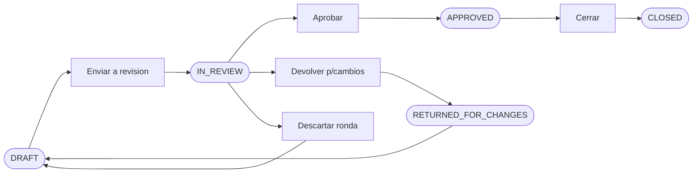
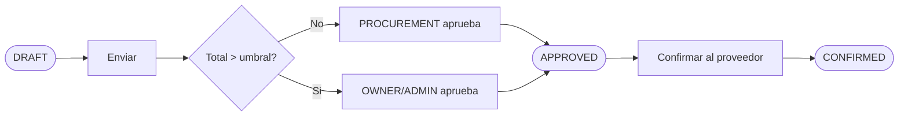
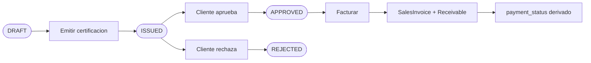
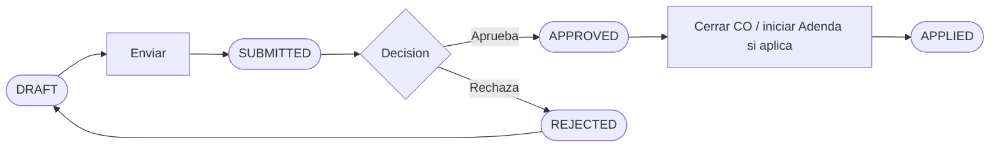
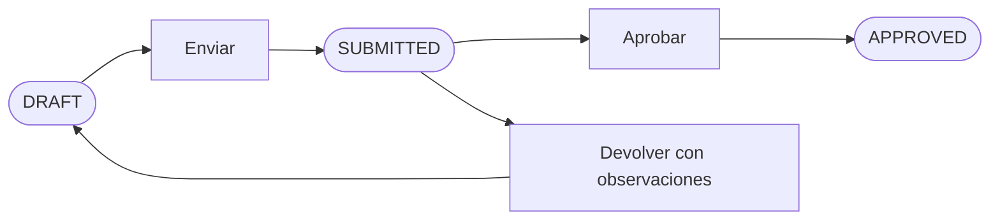
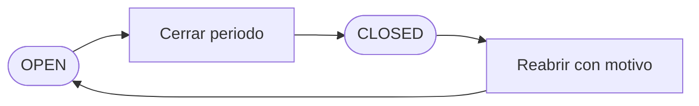
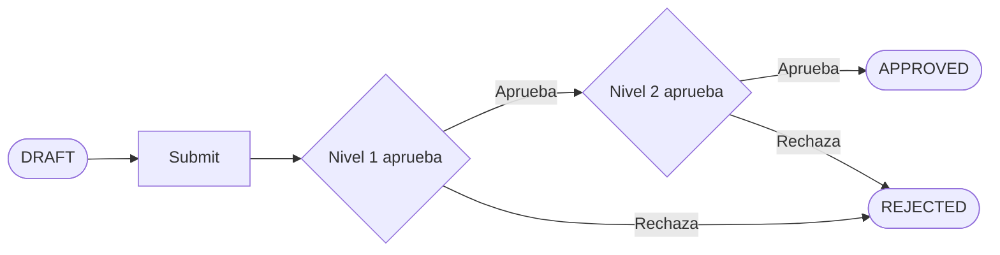

# Approval Workflows — Bloqer 2.0

> Procesos formales de **aprobación** entre roles. Decisión lockeada [D-012]: simplicidad por sobre flexibilidad. En Fase 1 hay aprobaciones simples; aprobaciones multinivel configurables son **Fase 2** ([Q-017]).

---

## 1. Filosofía de aprobaciones

- **Simple por defecto**: la mayoría de comprobantes los aprueba directamente quien tiene rol con `APPROVE`.
- **4 ojos opcional**: para OCs sobre cierto monto se puede exigir aprobación adicional.
- **Multinivel configurable**: en Fase 2.
- **Trazabilidad obligatoria**: toda aprobación queda registrada con quién, cuándo, qué cambió.

---

## 2. Workflows de Fase 1

Los siguientes flujos se aplican desde el primer día.

---

### 2.1 Aprobación de Presupuesto

**Quién aprueba:** OWNER o ADMIN (o PROJECT_MANAGER del proyecto si Admin habilita).  
**Quién envía a revisión:** quien tenga `EDIT` en Budgets.  
**Trazabilidad:** evento `budget.approved` con autor y timestamp; **`budget.returned_for_changes`** al pasar a `RETURNED_FOR_CHANGES` ([D-030]).  
**Implicancias:**
- `IN_REVIEW` **no** es aprobado; **prohibidos** cambios estructurales; corrección de números/estructura vía **`RETURNED_FOR_CHANGES`** (o `DRAFT` si se descarta la ronda) y nuevo envío a revisión ([BR-BUD-007], [D-030]).
- `APPROVED` habilita emisión de certificaciones y **bloquea** estructura económica; **sí** permite metadata no económica ([BR-BUD-006]).
- `CLOSED` es base contractual/comercial; sin mutación directa del vendido; cambios contractuales vía **Adenda** + budget hijo ([BR-BUD-002], [D-005]).
- **Change Order** no sustituye Adenda si cambia precio vendido / alcance contractual / WBS contractual cerrada ([BR-CO-003]).

---

### 2.2 Aprobación de OC con umbral

**Reglas:**
- Umbral monto se configura por empresa (parámetro tenant). Si no se configura, no hay 4 ojos.
- En obra pública, los umbrales típicamente son más estrictos. Configurable.
- Una vez `APPROVED`, la confirmación al proveedor (`CONFIRMED`) registra compromiso.

**Quién:**
- Crea / submit: PROCUREMENT, PM, ADMIN.
- Aprueba (sin umbral): PROCUREMENT, ADMIN, OWNER.
- Aprueba (con umbral superado): solo ADMIN o OWNER.

**Pendiente:** [Q-017] confirma si el umbral existe en Fase 1 o queda Fase 2.

---

### 2.3 Aprobación de Certificación

**Reglas:**
- "Cliente aprueba" / "rechaza" en Fase 1 es una **acción interna** (PM o ADMIN registra respuesta). En Fase 2/3 puede integrarse portal de cliente.
- Sin aprobación de cliente (`APPROVED`), no se factura según política vigente.
- **Facturar** crea **`SalesInvoice`** y AR; **no** existe estado `INVOICED` en `Certification.status`. El cobro actualiza **`payment_status`** ([BR-CERT-PAYMENT-001]).
- Anular después de aprobar requiere motivo.

**Quién emite:** PM o ADMIN.  
**Quién marca aprobada:** PM, FINANCE, ADMIN, OWNER.  
**Quién factura:** FINANCE, ADMIN, OWNER.

---

### 2.4 Aprobación de Change Order

**Quién aprueba:** OWNER, ADMIN, PM (configurable).  
**Implicancias:**
- **`APPLIED`** documenta el cierre operativo del pedido de cambio; **no** reemplaza **Adenda** si el impacto es sobre **precio vendido, alcance contractual o WBS contractual** cerrada ([BR-CO-003]).
- Ese impacto contractual pasa por **Addendum + Budget complementario** ([BR-CO-002], [D-005]).
- Decisión y vínculo CO → Adenda (cuando corresponde) quedan auditados.

---

### 2.5 Aprobación de Factura de Compra

**Quién aprueba para pago:** FINANCE, ADMIN, OWNER. PROCUREMENT puede `EDIT` pero no aprobar para pago.  
**Reglas:**
- `ISSUED` ya genera `Payable` (la deuda existe).
- `APPROVED` solo significa "OK pagar cuando podamos" — desbloquea pago.
- Pueden coincidir si la política del tenant es directa.

---

### 2.6 Aprobación de Pago

**Por defecto:** quien tiene `APPROVE` en Pagos puede confirmar el pago directamente. No hay 4 ojos en Fase 1.

**Excepción configurable (Fase 2):** umbrales monto que exigen aprobación adicional.

**Quién:** FINANCE, ADMIN, OWNER.

---

### 2.7 Aprobación de Cobranza

Idéntico al pago: quien tiene `APPROVE` en Cobranzas confirma la cobranza directamente.

**Quién:** FINANCE, ADMIN, OWNER.

---

### 2.8 Aprobación de Parte Diario (Libro de Obra)

**Quién:** PM o ADMIN. Inspector externo en Fase 2/3 ([Q-005]).

---

### 2.9 Cierre de Periodo

**Quién cierra/reabre:** ADMIN, OWNER **únicamente** ([BR-PER-001]).  
**Reglas:**
- Cerrar bloquea creación / edición / anulación de movimientos en el rango.
- Reapertura requiere motivo escrito.
- Toda acción queda en `AuditLog`.

---

## 3. Workflows de Fase 2 (multinivel)

Cuando se habiliten en Fase 2, los workflows multinivel se modelan así:

**Componentes:**
- Configuración por tenant: qué entidad, qué condiciones (monto, tipo), cuántos niveles, quiénes aprueban.
- Cada nivel registra aprobador, comentario, timestamp.
- Notificaciones a aprobadores pendientes.
- Posibilidad de delegación temporal (cuando un aprobador está ausente).

**Cuándo aparece:** Fase 2.

---

## 4. Reglas comunes a todas las aprobaciones

### 4.1 Trazabilidad

- Cada aprobación registra: actor (`user_id`), timestamp, decisión (aprobar/rechazar), comentario opcional.
- Se almacena en `AuditLog`.

### 4.2 Self-approval

- Por defecto, **permitido**: quien crea puede aprobar si tiene rol con `APPROVE`.
- Configurable a "no permitir self-approval" por tenant en Fase 2.

### 4.3 Notificación

- Cuando algo se envía a aprobación, se notifica a los aprobadores potenciales.
- Cuando se aprueba, se notifica al creador.

### 4.4 Tiempo de aprobación

- En Fase 1 no hay SLA de aprobación.
- En Fase 2 puede configurarse SLA con escalamiento.

### 4.5 Aprobación atómica

- La aprobación dispara los efectos del cambio de estado (eventos, derivaciones) **dentro de una transacción**.

### 4.6 Anulación de aprobación

- Una vez aprobado y el documento avanzó al siguiente estado, **no se "des-aprueba"**: se anula el documento.

---

## 5. Mapa de aprobadores por entidad (Fase 1)

| Entidad | Acción de aprobar | Roles permitidos | Excepciones |
|---|---|---|---|
| Budget | aprobar borrador | OWNER, ADMIN | (PM si Admin habilita) |
| Budget | cerrar aprobado | OWNER, ADMIN | — |
| PurchaseOrder | aprobar | PROCUREMENT, ADMIN, OWNER | si supera umbral → solo ADMIN/OWNER |
| PurchaseOrder | confirmar al proveedor | PROCUREMENT, ADMIN, OWNER | — |
| Receipt | confirmar | PROCUREMENT, WAREHOUSE, ADMIN, OWNER | — |
| PurchaseInvoice | aprobar para pago | FINANCE, ADMIN, OWNER | — |
| Payment | confirmar | FINANCE, ADMIN, OWNER | — |
| Collection | confirmar | FINANCE, SALES, ADMIN, OWNER | — |
| Certification | emitir | PM, ADMIN, OWNER | — |
| Certification | registrar aprobación/rechazo cliente | PM, ADMIN, OWNER | — |
| Certification | acción “facturar” (emite `SalesInvoice` vinculada; no cambia `Certification.status` a estado facturado) | FINANCE, ADMIN, OWNER | — |
| SalesInvoice | emitir | SALES, FINANCE, ADMIN, OWNER | — |
| Contract | activar | ADMIN, OWNER | — |
| Addendum | activar | ADMIN, OWNER | — |
| ChangeOrder | aprobar | PM, ADMIN, OWNER | configurable |
| Subcontract | activar | ADMIN, OWNER | — |
| SubcontractCertification | aprobar | PM, ADMIN, OWNER | — |
| JobsiteLogEntry | aprobar | PM, ADMIN, OWNER | — |
| Period | cerrar/reabrir | ADMIN, OWNER **solo** | — |
| AccountMovement | confirmar | FINANCE, ADMIN, OWNER | — |
| AccountMovement | conciliar | FINANCE, ADMIN, OWNER | — |
| InternalTransfer | confirmar | FINANCE, ADMIN, OWNER | — |

---

## 6. Casos borde

### 6.1 Aprobador ausente

Si un aprobador único está fuera, en Fase 1 otro rol con permiso `APPROVE` debe hacerlo. En Fase 2 hay delegación temporal configurable.

### 6.2 Aprobador es también creador

Permitido por defecto en Fase 1. En Fase 2 puede deshabilitarse por tenant.

### 6.3 Documento en aprobación cuando se modifica algo upstream

Ej: una OC en aprobación cuando el proyecto pasa a `CANCELLED`.

- **Regla:** la aprobación pendiente queda pendiente. Al intentar aprobar, falla por inconsistencia (proyecto cancelado).
- **UX:** la lista de pendientes filtra los inválidos.

### 6.4 Anulación retroactiva

Si se anula un documento aprobado, los efectos derivados se revierten (Receivable/Payable se anulan en cascada).

### 6.5 Aprobación masiva

Solo en Fase 2. En Fase 1 se aprueba uno por uno.

---

## 7. Cómo agregar un nuevo workflow

1. Identificar entidad y transición que requiere aprobación.
2. Confirmar con Owner si es Fase 1 (simple) o Fase 2 (multinivel).
3. Agregar máquina de estado en [`STATE_MACHINES.md`](./STATE_MACHINES.md) si introduce estado nuevo.
4. Agregar evento en [`EVENTS_AND_AUTOMATIONS.md`](./EVENTS_AND_AUTOMATIONS.md).
5. Agregar regla en [`BUSINESS_RULES.md`](./BUSINESS_RULES.md) si tiene efecto cross-módulo.
6. Documentar acá quién aprueba.
7. Confirmar permisos en [`PERMISSIONS_MATRIX.md`](../00-product/PERMISSIONS_MATRIX.md).
