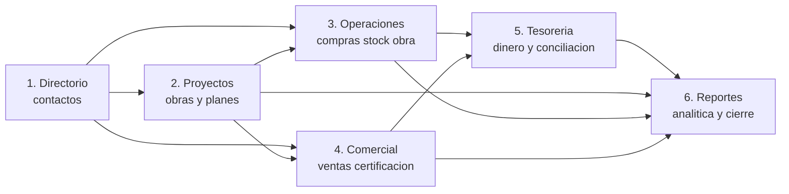
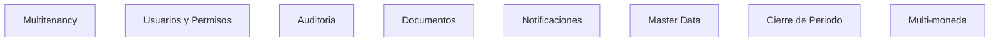
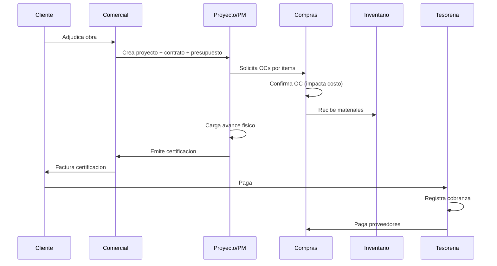
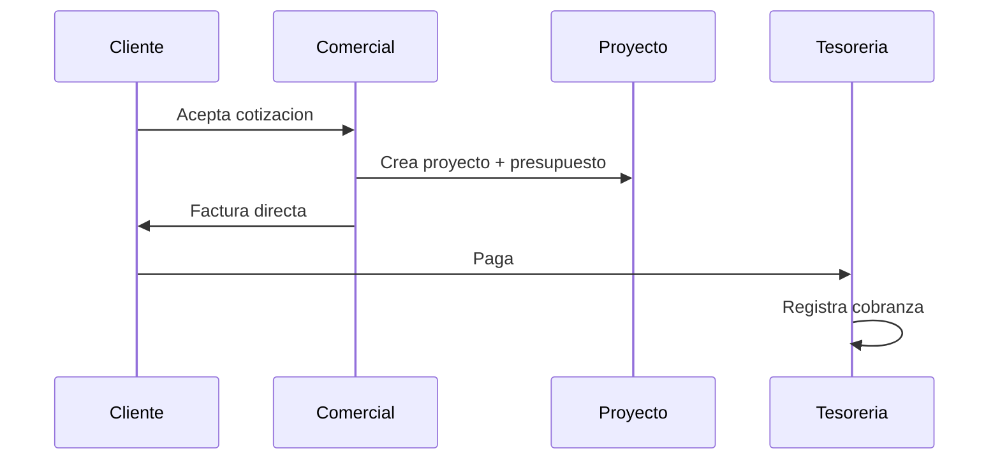
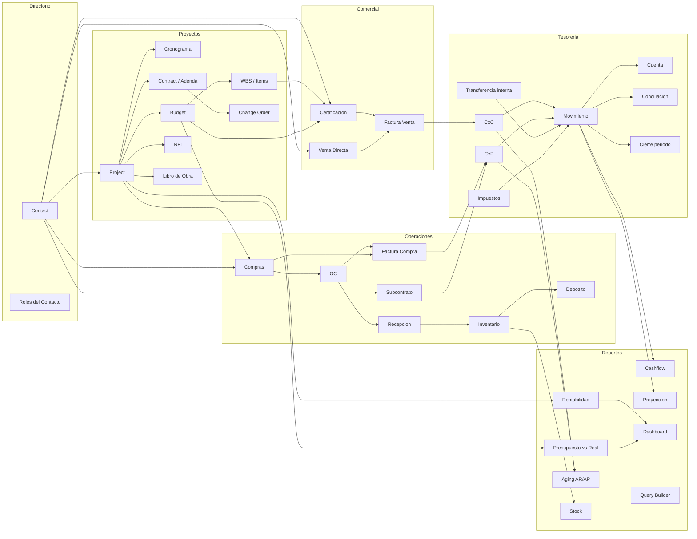

# Domain Overview — Bloqer 2.0

> Vista de pájaro del dominio funcional. Cómo se relacionan los **grandes bloques** del sistema sin entrar al detalle de cada módulo.

---

## 1. Los seis bloques del dominio

Bloqer 2.0 tiene **seis bloques funcionales** que se conectan formando el ciclo operativo y financiero de una constructora:

### 1.1 Directorio
Contiene a **todos los actores externos**: clientes, proveedores, subcontratistas, empleados, otros. Un mismo contacto puede tener varios roles. Es la **raíz de partes** del sistema.

### 1.2 Proyectos
**El centro operativo**. Toda obra es un proyecto. Tiene presupuestos, cronograma, contratos, certificaciones, RFIs, change orders, libro de obra. Es donde se imputan costos e ingresos.

### 1.3 Operaciones
Lo que se **compra y se mueve** físicamente para ejecutar la obra: compras (con o sin OC), recepciones, facturas de compra, subcontratos, inventario, depósitos, libro de obra.

### 1.4 Comercial
Lo que se **factura al cliente**: certificaciones, ventas directas, contratos con cliente, change orders. Genera Cuentas por Cobrar.

### 1.5 Tesorería
**El dinero**: cuentas bancarias y caja, movimientos, transferencias internas, AR, AP, cobranzas, pagos, conciliación, cashflow real, proyección de caja, impuestos. Modelo híbrido de 4 vistas sobre un único motor de movimientos.

### 1.6 Reportes
**La salida analítica**: rentabilidad, presupuesto vs real, avance vs costo, AR/AP aging, cashflow, dashboards, query builder, exportación.

---

## 2. Bloques transversales (cruzan a todos los demás)

Estos bloques **no son módulos** en el sentido funcional clásico — son capas que afectan a **todos** los demás módulos:

- **Multitenancy** — garantiza aislamiento de datos por empresa.
- **Usuarios y Permisos** — controla acceso a cada acción.
- **Auditoría** — registra toda acción crítica.
- **Documentos** — adjuntos vinculables a cualquier entidad.
- **Notificaciones** — alertas y mensajes.
- **Master Data** — catálogos parametrizables (unidades, monedas, rubros, tipos de movimiento, etc.).
- **Cierre de Periodo** — bloqueo temporal de movimientos.
- **Multi-moneda** — toda operación con dinero respeta moneda + FX + ARS.

---

## 3. Flujo end-to-end típico (obra pública con certificación)

---

## 4. Flujo end-to-end típico (obra privada chica con venta directa)

> Nota: este flujo **no** pasa por certificación. AR nace directamente de la factura de venta. Ver [D-018].

---

## 5. Cómo entran y salen los datos

### Entradas humanas

- Configuración inicial: catálogos, cuentas, depósitos, usuarios.
- Carga de contactos (directorio).
- Carga de proyecto + presupuesto + contrato.
- Carga de avance físico, partes diarios, RFIs.
- Carga de OCs, recepciones, facturas, pagos.
- Carga de movimientos de tesorería.
- Carga manual de AR/AP que no nacen de un flujo.

### Entradas automáticas (eventos del sistema)

- Confirmar OC → genera compromiso y, según D-006, impacta costo.
- Emitir certificación → genera AR pendiente.
- Registrar pago → reduce saldo de AP.
- Cerrar periodo → bloquea edición de movimientos en ese periodo.

### Salidas

- Comprobantes (OCs, certificados, facturas, recibos, órdenes de pago) en PDF.
- Reportes operativos y financieros en XLSX/PDF.
- Dashboards en pantalla.
- Eventos para integraciones futuras (AFIP, bancos, BI).

---

## 6. Convenciones globales del dominio

### 6.1 Nada es huérfano

Toda entidad operativa **pertenece a un tenant**. Toda transacción de costo/ingreso **se imputa a un proyecto** salvo que sea explícitamente "general de empresa".

### 6.2 Estados explícitos

Cada entidad importante tiene **máquina de estados** documentada. Ver [`STATE_MACHINES.md`](./STATE_MACHINES.md).

### 6.3 Trazabilidad bidireccional

Una factura sabe su OC. Una OC sabe sus recepciones. Una recepción sabe su movimiento de stock. Y al revés: desde el movimiento de stock se llega a la OC.

### 6.4 Auditoría inherente

Cada creación, edición, anulación, aprobación queda auditada con quién, cuándo, qué cambió.

### 6.5 Inmutabilidad de comprobantes emitidos

OCs, certificados, facturas, recibos: emitidos no se editan. Se anulan y se emite uno nuevo. Ver [D-025].

---

## 7. Mapa funcional completo (referencia)

---

## 8. Cómo se vinculan los conceptos al modelo de datos

> Esta es la **vista funcional** del dominio. La vista de modelo de datos está en [`ENTITY_RELATIONSHIPS.md`](./ENTITY_RELATIONSHIPS.md).

Ver también [`CORE_ENTITIES.md`](./CORE_ENTITIES.md) para el catálogo de entidades.

---

## 9. Qué NO está en el dominio

- **Sueldos / RRHH formal** (Bloqer registra MO como costo, no procesa nóminas).
- **CAD / BIM**.
- **Plan de cuentas contable formal** (Bloqer alimenta al contador externo, no reemplaza al estudio contable).
- **CRM con embudo de venta** (gestionamos contactos pero no oportunidades).
- **Marketplace abierto** a terceros vendiendo.

Ver [`PRODUCT_SCOPE.md`](../00-product/PRODUCT_SCOPE.md) §6.
