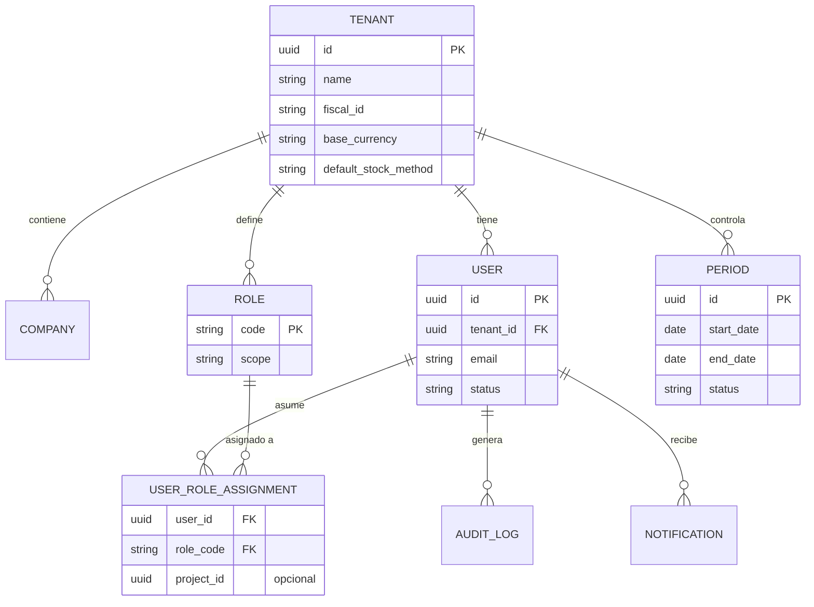
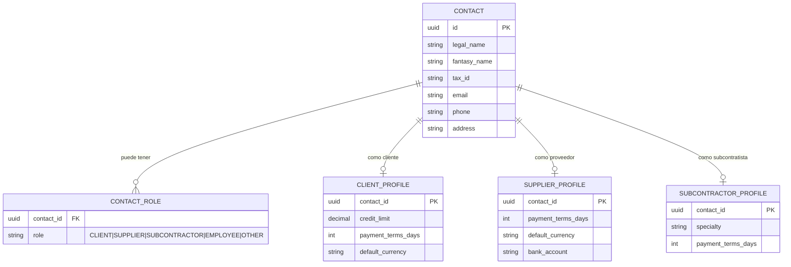
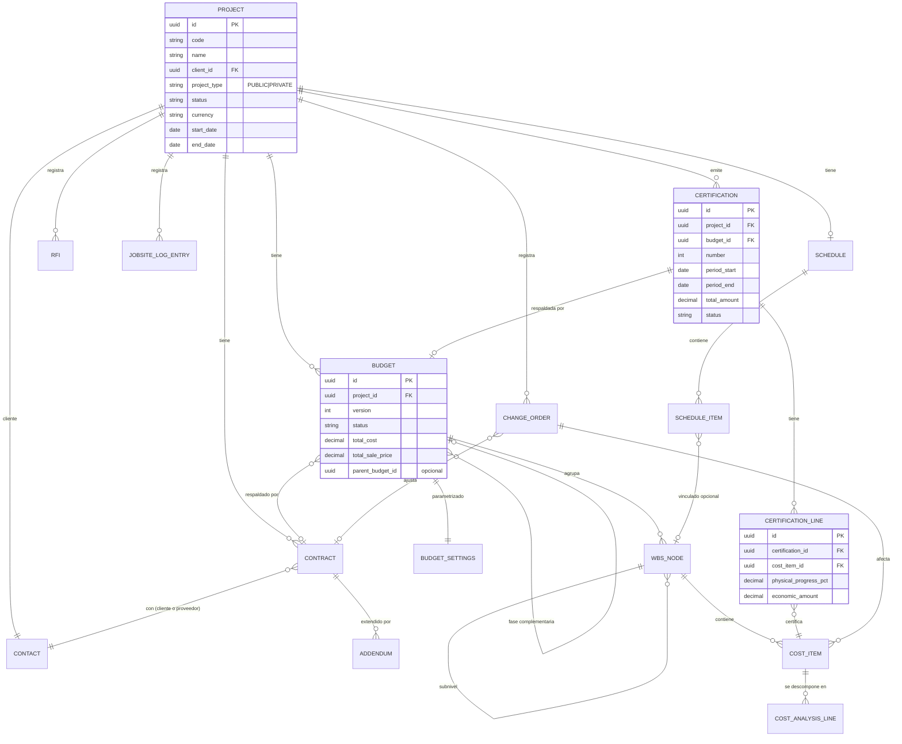
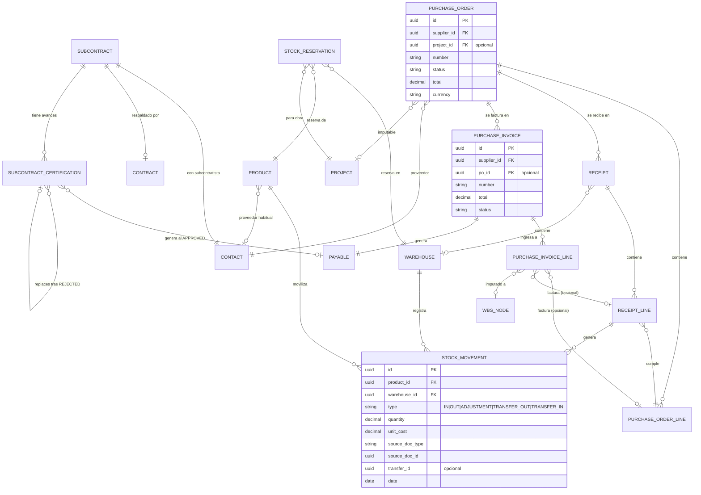
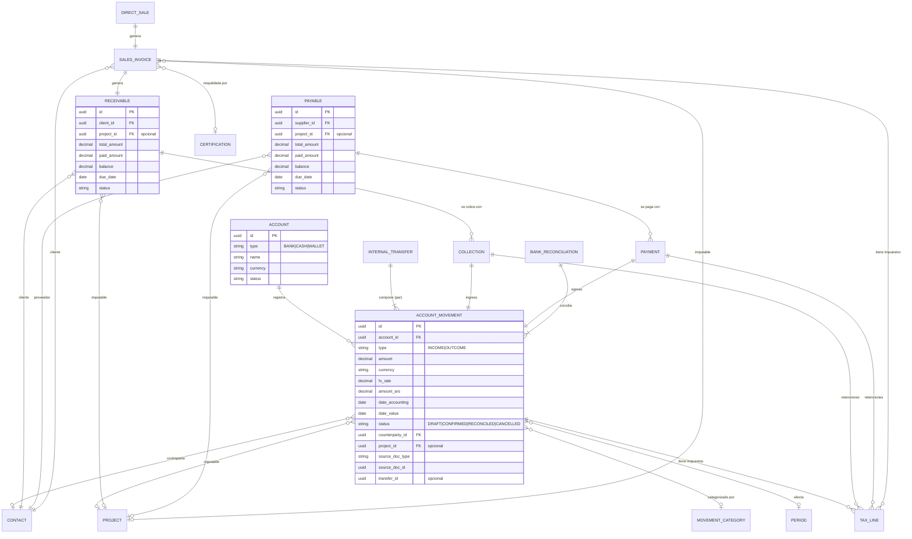
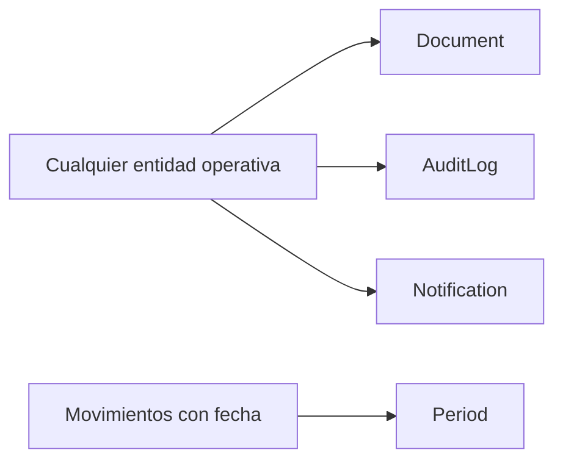

# Entity Relationships — Bloqer 2.0

> ERD **funcional** del dominio. Muestra **cómo se vinculan** las entidades. No es schema técnico.  
> El catálogo conceptual de entidades está en [`CORE_ENTITIES.md`](./CORE_ENTITIES.md).

---

## 1. ERD por bloques (5 diagramas)

Para que el ERD sea legible, lo dividimos en 5 vistas funcionales. Cada entidad lleva su `tenant_id` (omitido visualmente).

---

## 2. Bloque A — Multitenancy, usuarios, roles, auditoría

---

## 3. Bloque B — Directorio (contactos y roles)

---

## 4. Bloque C — Proyectos, contratos, presupuestos, certificaciones

---

## 5. Bloque D — Compras, recepciones, facturas, subcontratos, inventario

---

## 6. Bloque E — Tesorería, AR, AP, impuestos, ventas

---

## 7. Vínculos transversales (todo lo de arriba se cruza con esto)

- Toda entidad puede tener **adjuntos** (Document) por relación polimórfica (`entity_type` + `entity_id`).
- Toda creación/edición/anulación crítica genera un `AuditLog`.
- Eventos de negocio generan `Notification` para roles afectados.
- Movimientos con fecha contable validan contra `Period` (no se puede tocar periodo cerrado).

---

## 8. Cardinalidades clave a tener presentes

| Origen | Destino | Cardinalidad | Notas |
|---|---|---|---|
| Tenant | cualquier entidad | 1:N | aislamiento total |
| Contact | ContactRole | 1:N | un contacto N roles |
| Contact | Project (cliente) | 1:N | un cliente N obras |
| Project | Budget | 1:N | versión activa + adendas/fases |
| Budget | WbsNode | 1:N | jerárquico |
| WbsNode | CostItem | 1:N | hojas |
| Project | Certification | 1:N | múltiples certificaciones |
| Certification | CertificationLine | 1:N | una por ítem |
| PurchaseOrder | Receipt | 1:N | recepciones parciales |
| PurchaseOrder | PurchaseInvoice | 1:N | múltiples facturas posibles |
| PurchaseInvoice | PurchaseInvoiceLine | 1:N | imputaciones |
| PurchaseInvoice | Payable | 1:1 | una factura = una CxP |
| SalesInvoice | Receivable | 1:1 | una factura = una CxC |
| Receivable | Collection | 1:N | parciales (D-010) |
| Payable | Payment | 1:N | parciales (D-010) |
| InternalTransfer | AccountMovement | 1:2 | par origen+destino (D-023) |
| Account | AccountMovement | 1:N | extracto |
| Warehouse | StockMovement | 1:N | inventario por depósito |
| Product | StockMovement | 1:N | movimientos por producto |
| BankReconciliation | AccountMovement | 1:N | conciliados |

---

## 9. Reglas de integridad funcional

### Integridad multi-tenant

- **R-INT-001**: ninguna FK puede apuntar a una entidad de otro tenant.
- **R-INT-002**: el `tenant_id` se hereda automáticamente del padre cuando se crea una entidad hija.

### Integridad de comprobantes

- **R-INT-003**: una `Certification` solo puede emitirse si el `Budget` referenciado está `APPROVED` o `CLOSED`.
- **R-INT-004**: una `PurchaseInvoice` con `po_id` debe tener líneas que correspondan a líneas del PO referenciado (validación blanda en Fase 1).
- **R-INT-005**: un `Receipt` solo puede confirmarse si la `PurchaseOrder` está `CONFIRMED`.
- **R-INT-006**: un `Payment` no puede aplicarse a una `Payable` de otro `Tenant` o de otro `Contact` distinto al supplier del payment.

### Integridad de tesorería

- **R-INT-007**: una `InternalTransfer` debe generar **exactamente 2** `AccountMovement` con el mismo `transfer_id` (uno OUTCOME en origen, uno INCOME en destino).
- **R-INT-008**: un `AccountMovement` con `status = RECONCILED` no se puede modificar.
- **R-INT-009**: ningún `AccountMovement` con `date_accounting` dentro de un `Period` cerrado puede crearse, editarse o anularse. Se requiere reapertura.

### Integridad de presupuestos

- **R-INT-010**: un `Budget` con status `CLOSED` no admite edición de `WbsNode`, `CostItem` ni `CostAnalysisLine`. Solo a través de adendas.
- **R-INT-011**: `parent_budget_id` siempre apunta a un Budget del **mismo proyecto**.

### Integridad de inventario

- **R-INT-012**: el saldo de stock por (producto, depósito) nunca puede ser negativo en estado confirmado (excepción: ajustes manuales con motivo).
- **R-INT-013**: una `TRANSFER` genera **exactamente 2** `StockMovement` con el mismo `transfer_id`.

### Integridad de certificación

- **R-INT-014**: la suma de `physical_progress_pct` acumulada por `CostItem` no puede exceder 100% sin que el proyecto sea de tipo `PRIVATE` con nota aclaratoria (D-004).
- **R-INT-015**: la suma de `economic_amount` acumulada por `CostItem` no puede exceder el total presupuestado del item, salvo el mismo caso de D-004.

### Integridad de adendas y documentos de obra

- **R-INT-016**: un `Addendum` solo dispara efectos sobre **base contractual/comercial** (p. ej. aplicación de `Budget` complementario) cuando `status = SIGNED` ([BR-ADD-001]).
- **R-INT-017**: la anulación de un `StockMovement` `CONFIRMED` cumple [BR-INV-007] (compensación o procedimiento explícito); no se borra el registro sin trazabilidad.

### Integridad de certificaciones de subcontrato

- **R-INT-018**: `replaces_certification_id` (o equivalente) solo referencia un `SubcontractCertification` **`REJECTED`** del **mismo** `subcontract_id`; el sucesor no reabre el rechazado ([BR-SUB-005]).

---

## 10. Polimorfismos del modelo

Algunas relaciones son **polimorfas** (apuntan a varios tipos de entidad). Esto se documenta así:

| Entidad polimorfa | Tipos posibles de destino |
|---|---|
| `Document.entity` | Project, Contract, Certification, PurchaseOrder, PurchaseInvoice, SalesInvoice, JobsiteLogEntry, Rfi, ChangeOrder, Subcontract |
| `AccountMovement.source_doc` | Collection, Payment, InternalTransfer, manual |
| `Receivable.source_doc` | SalesInvoice, manual |
| `Payable.source_doc` | PurchaseInvoice, SubcontractCertification, manual |
| `TaxLine.parent_doc` | SalesInvoice, PurchaseInvoice, Payment, Collection, Certification |
| `AuditLog.entity` | cualquier entidad operativa |

Implementación física: pareja `entity_type` + `entity_id` (no enforce a nivel FK clásica).

---

## 11. Lo que el ERD NO muestra (intencionalmente)

- **Soft-delete** de cada entidad: implícito por convención.
- **Auditoría técnica** (`created_at`, `updated_at`, `created_by`, `updated_by`): asumida en toda entidad.
- **Cachés de saldo** (ej. `Account.balance_cached`): se asumen pero su definición técnica viene en la fase de modelo de datos.
- **Índices, constraints físicas**: técnicos, no funcionales.

---

## 12. Próximos pasos del modelo

Cuando se pase a la fase de modelo de datos técnico:

1. Decidir motor de DB y estilo (relacional puro, multi-tenant strategy: schema por tenant, columna por tenant, etc.).
2. Definir convenciones físicas (snake_case, plurales, soft-delete, timestamps).
3. Resolver polimorfismos físicamente (tabla pivote vs tipo+id).
4. Definir generadores de número (numeración de comprobantes — Q-002).
5. Caches y materialized views para reportes.
6. Estrategia de migrations.
