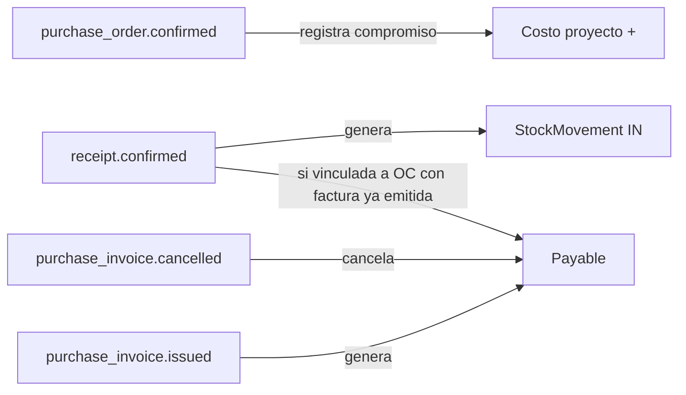
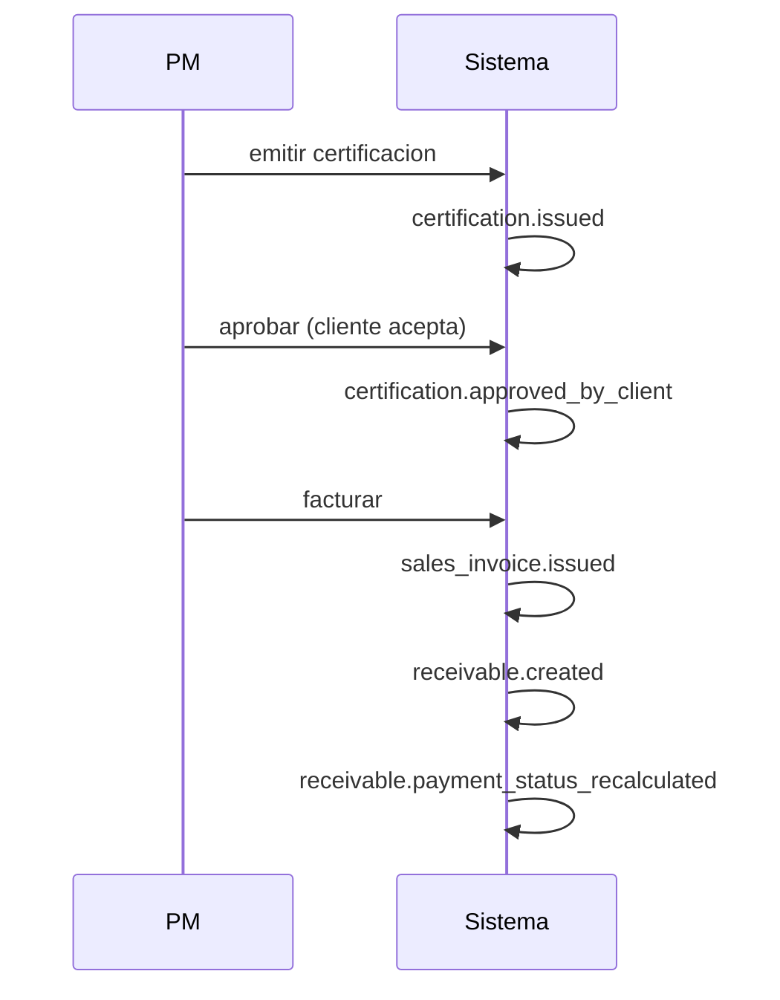

# Events and Automations — Bloqer 2.0

> Catálogo de **eventos del dominio** y las **automatizaciones** que se disparan ante ellos. La forma técnica del bus de eventos se decide en la fase técnica; este documento describe el contrato funcional.

---

## 1. Convenciones

- **Nombre del evento**: `entity.action` en pasado: `budget.approved`, `certification.issued`, `payment.cancelled`.
- **Payload**: incluye `tenant_id`, `entity_id`, `actor_user_id`, `timestamp`, y datos relevantes al evento.
- **Idempotencia**: cada evento se identifica con un `event_id` único; los consumidores deben tolerar reprocesos.
- **Atomicidad**: el evento se publica **dentro** de la transacción que cambió el estado. Si la transacción aborta, el evento no se emite.

---

## 2. Eventos por entidad

### 2.1 Project

| Evento | Cuándo se emite | Payload clave |
|---|---|---|
| `project.created` | nuevo proyecto creado | id, code, client_id, project_type |
| `project.activated` | DRAFT → ACTIVE | id, activated_at |
| `project.put_on_hold` | ACTIVE → ON_HOLD | id, reason |
| `project.resumed` | ON_HOLD → ACTIVE | id |
| `project.completed` | ACTIVE → COMPLETED | id, completed_at |
| `project.cancelled` | * → CANCELLED | id, reason, previous_status |
| `project.reactivated` | CANCELLED → DRAFT \| ACTIVE \| ON_HOLD | id, reason, restored_status |

### 2.2 Budget

| Evento | Cuándo |
|---|---|
| `budget.created` | nuevo budget |
| `budget.submitted_for_review` | `DRAFT` → `IN_REVIEW` o `RETURNED_FOR_CHANGES` → `IN_REVIEW` |
| `budget.returned_for_changes` | `IN_REVIEW` → `RETURNED_FOR_CHANGES` |
| `budget.approved` | `IN_REVIEW` → `APPROVED` |
| `budget.closed` | `APPROVED` → `CLOSED` |
| `budget.superseded` | reemplazado por nueva versión |
| `budget.cancelled` | * → `CANCELLED` |
| `budget.addendum_added` | nueva adenda creada bajo este budget |

### 2.3 Contract

| Evento | Cuándo |
|---|---|
| `contract.created` | nuevo contrato |
| `contract.activated` | DRAFT → ACTIVE |
| `contract.expired` | ACTIVE → EXPIRED |
| `contract.cancelled` | * → CANCELLED |
| `contract.addendum_added` | nueva adenda registrada (contenedor; ver eventos granulares de Addendum) |

### 2.3b Addendum

| Evento | Cuándo |
|---|---|
| `addendum.submitted_for_review` | `DRAFT` → `IN_REVIEW` |
| `addendum.approved` | `IN_REVIEW` → `APPROVED` |
| `addendum.returned_to_draft` | `IN_REVIEW` → `DRAFT` |
| `addendum.signed` | `APPROVED` → `SIGNED` |
| `addendum.cancelled` | → `CANCELLED` (desde estados permitidos) |

### 2.4 Certification

| Evento | Cuándo |
|---|---|
| `certification.created` | nueva certificación en DRAFT |
| `certification.issued` | DRAFT → ISSUED |
| `certification.approved_by_client` | ISSUED → APPROVED |
| `certification.rejected_by_client` | ISSUED → REJECTED |
| `certification.cancelled` | * → CANCELLED (desde estados permitidos en [`STATE_MACHINES.md`](./STATE_MACHINES.md)) |
| `certification.over_budget_warning` | sobrecertificación en obra privada |

La **facturación** no emite transición de `Certification.status` ([BR-CERT-007]): al **`sales_invoice.issued`** (con `certification_id`) se crea/actualiza AR y se dispara **recálculo** del derivado `payment_status` (vía `receivable.payment_status_recalculated` o proceso equivalente). Idem cobranzas/anulaciones: ver **`collection.confirmed`** consolidado en §3.3.

### 2.5 SalesInvoice

| Evento | Cuándo |
|---|---|
| `sales_invoice.issued` | emitida |
| `sales_invoice.paid` | totalmente cobrada |
| `sales_invoice.overdue` | vencida |
| `sales_invoice.cancelled` | anulada |

### 2.6 PurchaseOrder

| Evento | Cuándo |
|---|---|
| `purchase_order.submitted` | DRAFT → SUBMITTED (o auto-APPROVED en el mismo acto) |
| `purchase_order.approved` | SUBMITTED → APPROVED |
| `purchase_order.returned_for_changes` | SUBMITTED → DRAFT (rechazo / devolución con motivo, [BR-PUR-016], [D-050]) |
| `purchase_order.confirmed` | APPROVED → CONFIRMED (compromiso de costo) |
| `purchase_order.received_partial` | CONFIRMED → PARTIALLY_RECEIVED |
| `purchase_order.received_full` | * → RECEIVED |
| `purchase_order.closed_partial` | cierre de saldo no recibido ([BR-PUR-013]) |
| `purchase_order.cancelled` | * → CANCELLED |

### 2.6b PurchaseRequest / ProcurementQuote

| Evento | Cuándo |
|---|---|
| `purchase_request.created` | alta borrador |
| `purchase_request.submitted` | DRAFT → SUBMITTED (snapshot presupuesto) |
| `purchase_request.cancelled` | → CANCELLED |
| `procurement_quote.received` | cotización cargada |
| `procurement_quote.selected` | cotización elegida; genera OC DRAFT |

### 2.7 Receipt

| Evento | Cuándo |
|---|---|
| `receipt.confirmed` | recepción confirmada (genera StockMovements) |
| `receipt.cancelled` | recepción anulada; revierte stock según [BR-INV-007] (compensación / procedimiento explícito) |

### 2.8 PurchaseInvoice

| Evento | Cuándo |
|---|---|
| `purchase_invoice.registered` | factura cargada en DRAFT |
| `purchase_invoice.issued` | DRAFT → ISSUED |
| `purchase_invoice.approved` | ISSUED → APPROVED |
| `purchase_invoice.paid` | totalmente pagada |
| `purchase_invoice.overdue` | vencida |
| `purchase_invoice.cancelled` | anulada |

### 2.9 Receivable / Payable

| Evento | Cuándo |
|---|---|
| `receivable.created` | nueva CxC |
| `receivable.partial_payment` | cobranza parcial recibida |
| `receivable.fully_paid` | balance llega a 0 |
| `receivable.overdue_detected` | AR vencida con saldo > 0 (job/regla); **no** muta `Certification.status` — ver §3.3b |
| `receivable.payment_status_recalculated` | tras cambios en AR/cobranzas que afectan certificaciones vinculadas; **solo** derivados / vistas |
| `receivable.cancelled` | anulada |
| `payable.created` | nueva CxP |
| `payable.partial_payment` | pago parcial aplicado |
| `payable.fully_paid` | balance llega a 0 |
| `payable.overdue` | vencida sin saldar |
| `payable.cancelled` | anulada |

### 2.10 AccountMovement

| Evento | Cuándo |
|---|---|
| `account_movement.confirmed` | DRAFT → CONFIRMED (afecta saldo) |
| `account_movement.reconciled` | CONFIRMED → RECONCILED |
| `account_movement.unreconciled` | RECONCILED → CONFIRMED |
| `account_movement.cancelled` | anulado |

### 2.11 InternalTransfer

| Evento | Cuándo |
|---|---|
| `internal_transfer.created` | par de movimientos generados |
| `internal_transfer.cancelled` | par anulado |

### 2.12 Payment / Collection

| Evento | Cuándo |
|---|---|
| `payment.confirmed` | pago confirmado, aplicado a Payables |
| `payment.cancelled` | pago anulado, restaura saldos |
| `collection.confirmed` | cobranza confirmada — **todos los efectos** listados en §3.3 (única definición canónica) |
| `collection.cancelled` | cobranza anulada, restaura saldos |

### 2.13 StockMovement

| Evento | Cuándo |
|---|---|
| `stock_movement.confirmed` | movimiento aplicado al stock |
| `stock_movement.cancelled` | movimiento revertido |
| `stock_reservation.created` | nueva reserva `ACTIVE` |
| `stock_reservation.partially_released` | `ACTIVE` / `PARTIALLY_RELEASED` → liberación parcial |
| `stock_reservation.released` | reserva liberada por completo |
| `stock_reservation.consumed` | reserva aplicada a consumo (`CONSUMED` + vínculo movimiento) |
| `stock_reservation.cancelled` | reserva anulada |
| `stock_low_threshold` | stock bajo umbral configurado (Fase 2) |

### 2.14 ChangeOrder / Rfi / JobsiteLog

| Evento | Cuándo |
|---|---|
| `change_order.submitted` | enviado para aprobación |
| `change_order.approved` | aprobado |
| `change_order.rejected` | rechazado |
| `change_order.applied` | aplicado al WBS / Budget |
| `rfi.created` | RFI nuevo en `DRAFT` |
| `rfi.submitted` | `DRAFT` → `SUBMITTED` |
| `rfi.answered` | `SUBMITTED` → `ANSWERED` |
| `rfi.closed` | → `CLOSED` |
| `rfi.cancelled` | → `CANCELLED` |
| `rfi.overdue` | alerta / bandera; **no** cambia `status` ([BR-RFI-002]) |
| `jobsite_log.submitted` | parte enviado |
| `jobsite_log.approved` | parte aprobado |

### 2.14b SubcontractCertification

| Evento | Cuándo |
|---|---|
| `subcontract_certification.submitted` | `DRAFT` → `SUBMITTED` |
| `subcontract_certification.approved` | `SUBMITTED` → `APPROVED` (**genera** `Payable` — [BR-SUB-003]); recalcula `settlement_status` |
| `subcontract_certification.rejected` | `SUBMITTED` → `REJECTED` |
| `subcontract_certification.cancelled` | → `CANCELLED` |

### 2.14c Document / DocumentVersion

| Evento | Cuándo |
|---|---|
| `document.archived` / `document.reactivated` / `document.deleted` | transiciones de `Document.status` |
| `document_version.published` | `DRAFT` → `ACTIVE` |
| `document_version.superseded` | `ACTIVE` → `SUPERSEDED` |
| `document_version.archived` | versión archivada |
| `document_version.discarded` | borrador descartado |

### 2.14d ScheduleItem

| Evento | Cuándo |
|---|---|
| `schedule_item.started` | `PLANNED` → `IN_PROGRESS` |
| `schedule_item.completed` | → `COMPLETED` |
| `schedule_item.blocked` | → `BLOCKED` |
| `schedule_item.unblocked` | `BLOCKED` → `IN_PROGRESS` |
| `schedule_item.cancelled` | → `CANCELLED` |

### 2.14e BankReconciliation ([D-032])

| Evento | Cuándo |
|---|---|
| `bank_reconciliation.started` | `DRAFT` → `IN_PROGRESS` |
| `bank_reconciliation.closed` | → `CLOSED` |
| `bank_reconciliation.cancelled` | → `CANCELLED` |

### 2.15 Period

| Evento | Cuándo |
|---|---|
| `period.closed` | periodo cerrado por Admin |
| `period.reopened` | periodo reabierto |

### 2.16 User / Permissions

| Evento | Cuándo |
|---|---|
| `user.invited` | invitación enviada |
| `user.activated` | cuenta activada |
| `user.suspended` | suspendido |
| `user.role_assigned` | rol asignado |
| `user.role_revoked` | rol removido |

---

## 3. Automatizaciones (qué reacciona ante qué evento)

### 3.1 Compras → Costo y Stock

| Evento disparador | Reacción automática |
|---|---|
| `purchase_order.confirmed` | imputa **comprometido** al proyecto / WBS de la OC. |
| `receipt.confirmed` | genera `StockMovement IN` por cada línea con producto y depósito. |
| `purchase_invoice.issued` (sin OC) | imputa **comprometido** al proyecto / WBS de la factura, genera `Payable`. |
| `purchase_invoice.issued` (con OC) | genera `Payable`. **No** duplica compromiso (ya estaba en la OC). |
| `purchase_invoice.cancelled` | anula `Payable` asociada y revierte compromiso si correspondía. |
| `receipt.cancelled` | revierte `StockMovement` asociados. |

### 3.2 Comercial → AR y derivados de certificación

| Evento | Reacción |
|---|---|
| `sales_invoice.issued` | genera `Receivable`; si lleva `certification_id`, emite **`receivable.payment_status_recalculated`** (o recálculo interno equivalente) para actualizar **`Certification.payment_status`** ([BR-CERT-PAYMENT-001]). **No** muta `Certification.status` ([BR-CERT-007]). |
| `sales_invoice.cancelled` | anula `Receivable` (cascada); **`receivable.payment_status_recalculated`** en certificaciones vinculadas si aplica. |

### 3.3 Tesorería → AR/AP (incluye **`collection.confirmed`** canónico; [D-029])

| Evento | Reacción |
|---|---|
| `payment.confirmed` | reduce `paid_amount` de cada Payable referenciada; recalcula `balance` y `status` de AP. Genera **`AccountMovement` `OUTCOME`** `CONFIRMED` cuando corresponde. Si el `Payable` nace de **`SubcontractCertification`**, recalcula **`settlement_status`** derivado. Actualiza **cashflow real** (caja). Puede notificar según umbral. |
| **`collection.confirmed`** | **Efectos únicos (lista cerrada; [D-029]):** (1) aplica cobranza a una o más **`Receivable`** (`applies_to`); (2) incrementa `paid_amount` / recalcula `balance` y `status` de cada AR afectada; (3) genera **`AccountMovement` `INCOME`** asociado a la cobranza; (4) emite **`receivable.payment_status_recalculated`** para cada **`Certification`** alcanzada vía facturas vinculadas — actualiza **`payment_status` derivado**; **no** cambia `Certification.status`; (5) actualiza **cashflow real** (caja); (6) puede disparar **notificaciones**. |
| `payment.cancelled` | revierte saldos de Payables y movimientos; recalcula AP. |
| `collection.cancelled` | revierte saldos de Receivables y `AccountMovement`; **`receivable.payment_status_recalculated`** en certificaciones afectadas. |
| `internal_transfer.created` | genera **par** de `AccountMovement` (OUT origen + IN destino) con `transfer_id` compartido. |
| `internal_transfer.cancelled` | anula par de `AccountMovement`. |

### 3.3b Vencimiento AR → certificación (solo derivados; [D-031])

| Evento | Reacción |
|---|---|
| **`receivable.overdue_detected`** | marca materialización / bandera de AR vencida (saldo > 0); emite **`receivable.payment_status_recalculated`** si el vencimiento afecta el indicador **`OVERDUE`** de certificaciones vinculadas; **no** muta `Certification.status`; puede notificar. |
| **`receivable.payment_status_recalculated`** | coherencia de vistas derivadas, reportes o materializaciones; **no** es transición de lifecycle documental. |

### 3.4 Periodo → bloqueos

| Evento | Reacción |
|---|---|
| `period.closed` | cualquier intento de crear/editar/anular `AccountMovement` con `date_accounting` en el rango falla con error explícito. |
| `period.reopened` | se levanta el bloqueo, queda registrado en auditoría. |

### 3.5 Inventario → reservas y alertas

| Evento | Reacción |
|---|---|
| `stock_movement.confirmed` (tipo OUT) | descuenta del stock disponible y transiciona reservas ligadas (`CONSUMED` / liberación) según reglas ([BR-INV-008]). |
| `stock_reservation.*` | ver [`STATE_MACHINES.md`](./STATE_MACHINES.md) §25; `ACTIVE` / `PARTIALLY_RELEASED` / `RELEASED` / `CONSUMED` / `CANCELLED` ajustan **disponible** sin **real** hasta consumo. |
| `stock_movement.confirmed` (tipo IN/TRANSFER_IN) | incrementa stock disponible. Recalcula costo según método (FIFO o promedio). |
| `stock_low_threshold` (Fase 2) | genera notificación al WAREHOUSE / PROCUREMENT. |

### 3.6 Certificación → alertas

| Evento | Reacción |
|---|---|
| `certification.over_budget_warning` | genera notificación a OWNER / ADMIN / PM y exige nota aclaratoria (obra privada). |
| sobrecertificación en obra pública | **bloqueo**: la transición a `ISSUED` falla. |

### 3.7 Cambios de presupuesto

| Evento | Reacción |
|---|---|
| `change_order.applied` | **no** muta solo el `CLOSED` ni la base vendida; si el cambio es contractual/económico sobre lo vendido → flujo **Adenda + Budget complementario** ([BR-CO-002], [BR-CO-003]). |
| `addendum.signed` | **Solo** con adenda `SIGNED` se aplican efectos contractuales/comerciales (p. ej. `Budget` complementario) — [BR-ADD-001]. |
| `budget.approved` | habilita emisión de certificaciones; estructura económica bloqueada salvo proceso formal ([BR-BUD-006]). |
| `budget.closed` | base contractual; bloqueo total de cómputo vendido sin adenda ([BR-BUD-002]). |

### 3.8 Aprobaciones y compras

| Evento | Reacción |
|---|---|
| `purchase_request.submitted` | notifica a Compras / aprobadores OC (in-app + email, [BR-PUR-015], [D-050]). |
| `purchase_order.submitted` | si requiere alto nivel (umbral o `EXTRA_APPROVAL`), notifica a OWNER/ADMIN; si auto-aprueba, emite también `purchase_order.approved`. |
| `purchase_order.approved` | habilita confirmación al proveedor; notifica al solicitante. |
| `purchase_order.returned_for_changes` | notifica al creador/solicitante con el motivo; documento vuelve a editable. |
| `purchase_order.confirmed` | imputa **comprometido**; completa SC vinculada si aplica; notifica al solicitante. |
| Job `procurement_approval_sla_reminder` | recordatorio por antigüedad de SC sin cotizar / OC en `SUBMITTED`; escalamiento OWNER/ADMIN ([D-050]). |

### 3.9 Vencimientos (jobs programados)

Estas no son reacciones a eventos sino **jobs periódicos** del sistema:

| Job | Frecuencia | Acción |
|---|---|---|
| `recompute_overdue_receivables` | diaria | marca AR como `OVERDUE` si vencidas y saldo > 0; emite **`receivable.overdue_detected`** (y encadena `receivable.payment_status_recalculated` si aplica). |
| `recompute_overdue_payables` | diaria | idem para AP. |
| `recompute_overdue_rfis` | diaria | idem para RFIs con `due_date` vencida. |
| `compute_cashflow_projection` | diaria / on-demand | recalcula proyección de caja. |
| `low_stock_alert` (Fase 2) | configurable | dispara `stock_low_threshold`. |
| `notification_digest_daily` (Fase 2) | diaria | resumen diario por email. |

---

## 4. Notificaciones derivadas

Cada evento puede generar una **Notification** para roles específicos. Tabla resumida:

| Evento | Roles notificados |
|---|---|
| `certification.issued` | OWNER, ADMIN, FINANCE, PM del proyecto |
| `certification.approved_by_client` | OWNER, ADMIN, FINANCE, PM |
| `certification.rejected_by_client` | OWNER, ADMIN, FINANCE, PM |
| `certification.over_budget_warning` | OWNER, ADMIN, PM |
| `purchase_request.submitted` | PROCUREMENT, APPROVE PURCHASE_ORDERS (fallback OWNER/ADMIN) |
| `purchase_order.submitted` (pendiente aprobación) | aprobadores estándar o OWNER/ADMIN si alto nivel |
| `purchase_order.approved` | solicitante / creador |
| `purchase_order.returned_for_changes` | solicitante / creador |
| `purchase_order.confirmed` | solicitante / creador; WAREHOUSE si hay bienes a recibir |
| `purchase_order.submitted` (sobre umbral) | OWNER, ADMIN |
| `receivable.overdue_detected` | OWNER, ADMIN, FINANCE |
| `payable.overdue` | OWNER, ADMIN, FINANCE, PROCUREMENT |
| `rfi.overdue` | PM, ADMIN |
| `period.closed` | OWNER, ADMIN, FINANCE |
| `stock_low_threshold` (Fase 2) | WAREHOUSE, PROCUREMENT |
| `payment.confirmed` | FINANCE; OWNER si > umbral |

Detalles configurables por usuario en módulo [`02-modules/NOTIFICATIONS.md`](../02-modules/NOTIFICATIONS.md) (Fase B).

---

## 5. Relación entre eventos

Algunos eventos disparan otros en cascada. Ejemplo: emisión de certificación con facturación inmediata:

Toda esta cadena ocurre en transacciones atómicas o en transacciones encadenadas con compensación.

---

## 6. Reglas globales de eventos

- **R-EVT-001**: cada evento incluye `tenant_id`, `actor_user_id`, `timestamp`, `event_id` único.
- **R-EVT-002**: nunca se emite un evento si la transacción que lo origina hace rollback.
- **R-EVT-003**: los consumidores son idempotentes — reprocesar el mismo evento dos veces da el mismo resultado.
- **R-EVT-004**: los eventos quedan registrados (event store) para reconstruir histórico.
- **R-EVT-005**: las automatizaciones deben tener **timeout** y manejo de error con dead-letter / reintentos.

---

## 7. Lo que NO es un evento

- **Lecturas**: ver un proyecto, abrir un reporte, no genera eventos.
- **Drafts editados**: editar un Budget en `DRAFT` no emite eventos por cada edición; sí emite cuando se envía a revisión.
- **Cálculos derivados**: recalcular un saldo no es un evento; sí lo es la confirmación que lo hizo cambiar.

---

## 8. Próximos pasos (Fase técnica)

- Decidir bus de eventos (pgmq, Redis, RabbitMQ, Kafka, etc.).
- Decidir si hay outbox pattern para garantizar publicación.
- Definir esquema concreto del payload por evento.
- Definir reintentos y dead-letter.
- Definir si los eventos son consumidos sincrónicamente (in-process) o asincrónicamente (workers).
