# State Machines — Bloqer 2.0

> Cada **entidad importante** tiene una máquina de estados explícita.  
> Estados se nombran en `UPPER_SNAKE_CASE` en **inglés** (ver [`AGENTS.md`](../AGENTS.md) §8).  
> La transición se hace via **eventos** (acciones del usuario o del sistema).

---

## Canonical naming and language rules

- Los **nodos de estado** en los diagramas y las tablas de este archivo son **valores canónicos** (inglés) tal como deben persistirse en código y API.
- Las **etiquetas en español** sobre las flechas Mermaid (p. ej. *emitir*, *anular*, *aprobar*) describen la **acción de negocio / copy de UI**, no el literal del enum.
- **Tabla enum ↔ label (es-AR)** y principios completos: [`AGENTS.md`](../AGENTS.md#3-canonical-naming-and-language-rules) §3, [`GLOSSARY.md`](../00-product/GLOSSARY.md#canonical-naming-and-language-rules).

---

## 1. Convenciones

- **Estado inicial** se marca con `( )`.
- **Estado terminal** se marca con `[X]`.
- Las flechas indican **transiciones permitidas**. Cualquier transición no listada es **prohibida**.
- Acciones especiales: `cancel`, `reopen`, `archive` cuando aplican.

---

## 2. Project (Proyecto)

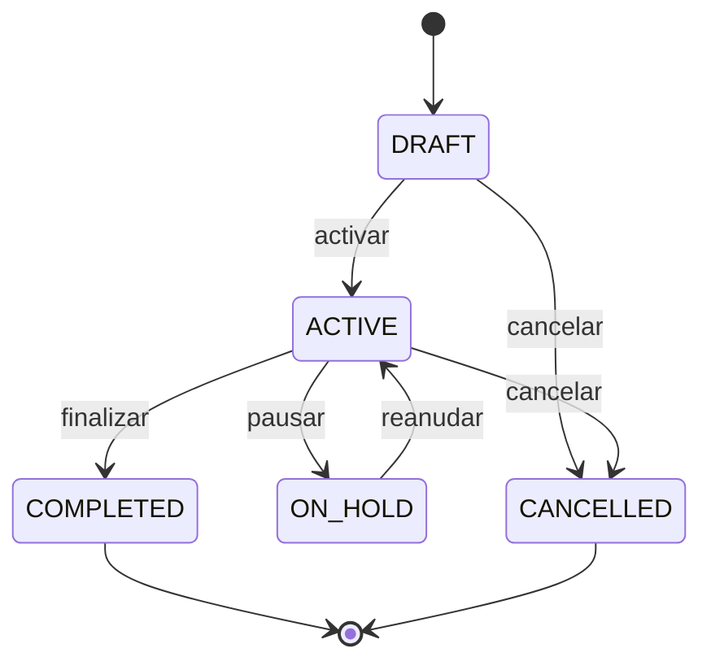
```mermaid
stateDiagram-v2
  [*] --> DRAFT
  DRAFT --> ACTIVE : activar
  DRAFT --> CANCELLED : cancelar
  ACTIVE --> ON_HOLD : pausar
  ON_HOLD --> ACTIVE : reanudar
  ACTIVE --> COMPLETED : finalizar
  ACTIVE --> CANCELLED : cancelar
  COMPLETED --> [*]
  CANCELLED --> [*]
```

### Reglas

- `DRAFT` no admite operaciones financieras.
- `ACTIVE` admite todas las operaciones.
- `ON_HOLD` permite ver pero no nuevos movimientos (configurable).
- `COMPLETED` solo lectura (no nuevas certificaciones, OCs, movimientos).
- `CANCELLED` solo lectura permanente.

---

## 3. Budget (Presupuesto)

### 3.1 `status` — ciclo de vida

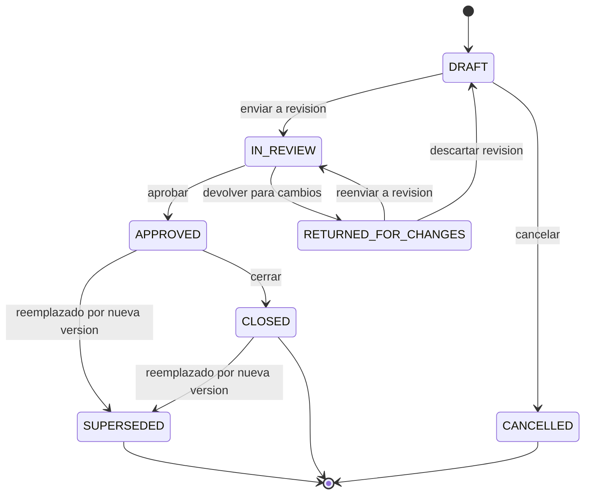
```mermaid
stateDiagram-v2
  [*] --> DRAFT
  DRAFT --> IN_REVIEW : enviar a revision
  IN_REVIEW --> APPROVED : aprobar
  IN_REVIEW --> RETURNED_FOR_CHANGES : devolver para cambios
  RETURNED_FOR_CHANGES --> IN_REVIEW : reenviar a revision
  RETURNED_FOR_CHANGES --> DRAFT : descartar revision
  APPROVED --> CLOSED : cerrar
  DRAFT --> CANCELLED : cancelar
  APPROVED --> SUPERSEDED : reemplazado por nueva version
  CLOSED --> SUPERSEDED : reemplazado por nueva version
  SUPERSEDED --> [*]
  CLOSED --> [*]
  CANCELLED --> [*]
```

### 3.2 Tabla — estado del presupuesto vs ediciones permitidas

| Estado | ¿Aprobado? | Edición económica / WBS / estructura vendida | Metadata / notas permitidas |
|---|---|---|---|
| `DRAFT` | No | **Sí**, completa | Sí |
| `IN_REVIEW` | **No** | **No** cambios estructurales (WBS, cantidades, PU, fórmulas, márgenes, impuestos, moneda, alcance vendido, condiciones contractuales, plazos de pago frente a cliente). Solo **comentarios de revisión**, **adjuntos de revisión** y metadata no económica si el workflow lo permite ([BR-BUD-007]) | Notas/comentarios revisión |
| `RETURNED_FOR_CHANGES` | No | **Sí** (el responsable corrige; luego debe **`IN_REVIEW`** de nuevo) | Sí |
| `APPROVED` | Sí (interno) | **No**: montos, WBS, cantidades, PU, fórmulas comerciales, margen, impuestos, estructura económica bloqueados ([BR-BUD-006]) | **Sí** según whitelist metadata ([BR-BUD-006]) |
| `CLOSED` | Sí (base contractual/comercial) | **No**; cambios vendidos solo **Adenda** + budget hijo ([BR-BUD-002], [D-005]) | **Solo** whitelist [BR-BUD-008]: `internal_notes`, `attachments`, `tags`, `display_order`, `non_contractual_reference_code`, `assigned_internal_responsible`. **Prohibido** todo lo usado por certificaciones, contratos, adendas, reportes o rentabilidad (WBS, cantidades, PU, costo, márgenes, impuestos, precio venta, moneda, alcance cliente, términos contractuales, plazos de pago, etc.) |

`SUPERSEDED` y `CANCELLED`: solo lectura salvo procesos excepcionales auditados.

### Reglas — resumen

- `DRAFT`: edición económica completa.
- `IN_REVIEW`: **no** aprobado; **sin** mutación estructural; solo revisión ([BR-BUD-007]).
- `RETURNED_FOR_CHANGES`: editable; reentrada a aprobación vía `IN_REVIEW` (`budget.returned_for_changes` / `budget.submitted_for_review`).
- `APPROVED`: bloqueo económico estructural; metadata según [BR-BUD-006].
- `CLOSED`: base contractual; solo metadata [BR-BUD-008] ([BR-BUD-002]).
- `SUPERSEDED`: histórico.
- `CANCELLED`: nunca vigente como aprobado.

**Change Order vs Adenda:** un **Change Order** aprobado **no** sustituye una **Adenda** cuando cambia precio vendido, alcance contractual o WBS contractual cerrada ([BR-CO-003]).

---

## 4. Contract (Contrato)

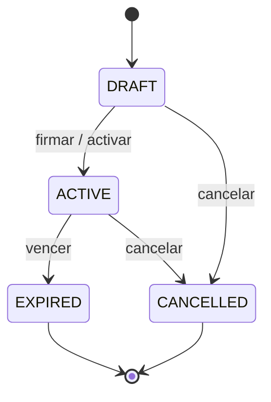
```mermaid
stateDiagram-v2
  [*] --> DRAFT
  DRAFT --> ACTIVE : firmar / activar
  ACTIVE --> EXPIRED : vencer
  ACTIVE --> CANCELLED : cancelar
  DRAFT --> CANCELLED : cancelar
  EXPIRED --> [*]
  CANCELLED --> [*]
```

### Reglas

- Adendas se crean con contrato en `ACTIVE`.
- `EXPIRED` ocurre por fecha `end_date`; sigue siendo consultable.
- Renovación = nuevo Contract referenciando el anterior.

### 4.2 Addendum (Adenda)

> Instrumento contractual/económico ligado a un `Contract`. Módulo: [`02-modules/CONTRACTS_AND_ADDENDUMS.md`](../02-modules/CONTRACTS_AND_ADDENDUMS.md).

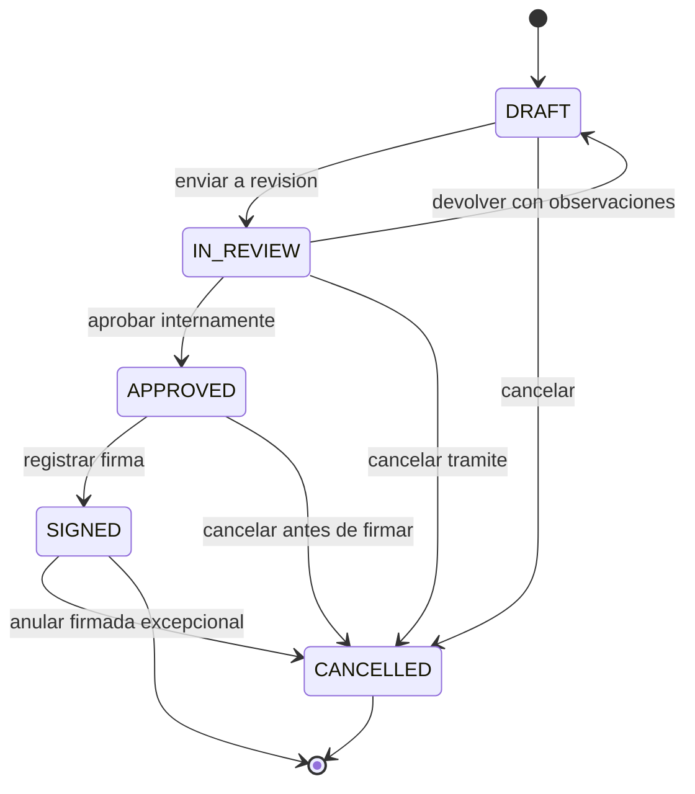
```mermaid
stateDiagram-v2
  [*] --> DRAFT
  DRAFT --> IN_REVIEW : enviar a revision
  DRAFT --> CANCELLED : cancelar
  IN_REVIEW --> APPROVED : aprobar internamente
  IN_REVIEW --> DRAFT : devolver con observaciones
  IN_REVIEW --> CANCELLED : cancelar tramite
  APPROVED --> SIGNED : registrar firma
  APPROVED --> CANCELLED : cancelar antes de firmar
  SIGNED --> CANCELLED : anular firmada excepcional
  SIGNED --> [*]
  CANCELLED --> [*]
```

#### Tabla — transiciones permitidas (Addendum)

| Desde | Hacia | Acción / notas |
|---|---|---|
| `DRAFT` | `IN_REVIEW` | Envío a revisión legal/comercial |
| `DRAFT` | `CANCELLED` | Descarte |
| `IN_REVIEW` | `APPROVED` | Aprobación interna |
| `IN_REVIEW` | `DRAFT` | Devolución con observaciones |
| `IN_REVIEW` | `CANCELLED` | Cancelación del trámite |
| `APPROVED` | `SIGNED` | Firma de partes registrada en sistema |
| `APPROVED` | `CANCELLED` | Antes de firmar |
| `SIGNED` | `CANCELLED` | Solo proceso excepcional auditado |

#### Eventos (Addendum)

| Evento | Transición típica |
|---|---|
| `addendum.submitted_for_review` | `DRAFT` → `IN_REVIEW` |
| `addendum.approved` | `IN_REVIEW` → `APPROVED` |
| `addendum.returned_to_draft` | `IN_REVIEW` → `DRAFT` |
| `addendum.signed` | `APPROVED` → `SIGNED` |
| `addendum.cancelled` | → `CANCELLED` (desde estados permitidos en tabla) |

#### Reglas críticas (Addendum)

- **Solo `SIGNED`** habilita impacto sobre **base contractual/comercial** (p. ej. creación/aplicación de `Budget` complementario, referencias de contrato vigente) ([BR-CO-003]).
- `APPROVED` sin `SIGNED` **no** altera la base cerrada ni reemplaza una adenda firmada en reporting legal.
- Un **Change Order aprobado** puede originar una adenda, pero **no** sustituye el flujo `SIGNED` para efectos contractuales.

---

## 5. Certification (Certificación)

### 5.1 `status` — ciclo de vida documental / operativo

Valores canónicos: `DRAFT`, `ISSUED`, `APPROVED`, `REJECTED`, `CANCELLED`.  
**No** incluye `INVOICED` ni `PAID` ([BR-CERT-007], [BR-CERT-PAYMENT-001]): la facturación y el cobro viven en `SalesInvoice`, `Receivable` y `Collection`. Saber si una certificación **fue facturada** = existe **`SalesInvoice` / `Receivable` vinculada** (p. ej. `certification_id`), **no** un estado `INVOICED` en `Certification.status`.

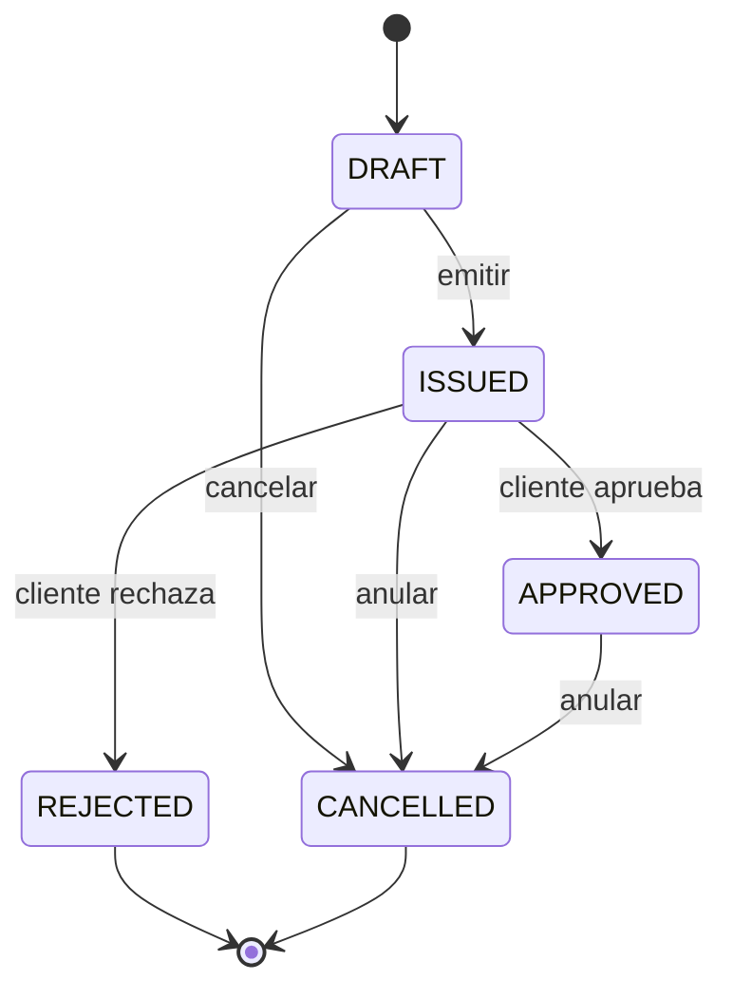
```mermaid
stateDiagram-v2
  [*] --> DRAFT
  DRAFT --> ISSUED : emitir
  DRAFT --> CANCELLED : cancelar
  ISSUED --> APPROVED : cliente aprueba
  ISSUED --> REJECTED : cliente rechaza
  ISSUED --> CANCELLED : anular
  APPROVED --> CANCELLED : anular
  REJECTED --> [*]
  CANCELLED --> [*]
```

### Reglas — `status`

- `DRAFT`: edición libre.
- `ISSUED`: bloquea edición ([BR-CERT-004]).
- `APPROVED`: cliente aceptó; habilita facturación **sin** cambiar este `status` al emitir factura.
- `REJECTED`: cliente rechazó; terminal (no se factura salvo nuevo ciclo de certificación).
- `CANCELLED`: anulación con motivo; ver impacto en facturas/AR ([BR-CERT-005]).

### 5.2 `payment_status` — derivado financiero (no ciclo de vida)

Atributo **derivado** (solo lectura en operación normal): `UNPAID` | `PARTIALLY_PAID` | `PAID` | `OVERDUE`.

- Se **calcula** a partir de las **`Receivable` activas** vinculadas a la certificación (típicamente vía `SalesInvoice.certification_id` y líneas de aplicación de **`Collection`**). **No** es una transición de `Certification.status` y **no** se fija manualmente salvo **ajuste financiero excepcional** auditado (misma categoría que correcciones de AR; no es flujo estándar).
- **Prioridad de lectura sugerida:** si alguna receivable vinculada está vencida con saldo > 0 → `OVERDUE` (aunque haya cobro parcial); si no, y saldo total > 0 con cobros aplicados → `PARTIALLY_PAID`; si todas las receivables vinculadas están saldadas → `PAID`; si no hay deuda registrada o saldo total pendiente sin cobros → `UNPAID`.
- Al **confirmar/anular cobranzas** o **emitir/anular facturas** que afecten AR, el sistema **recalcula** `payment_status` (eventos de AR/cobranza, no un evento de “pago de certificación” como cambio de estado).

`SubcontractCertification` usa **`settlement_status`** derivado (AP/pagos), no `payment_status` de cliente — ver §19.

---

## 6. SalesInvoice (Factura de venta)

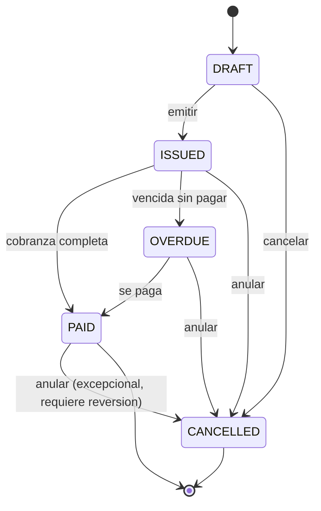
```mermaid
stateDiagram-v2
  [*] --> DRAFT
  DRAFT --> ISSUED : emitir
  DRAFT --> CANCELLED : cancelar
  ISSUED --> PAID : cobranza completa
  ISSUED --> OVERDUE : vencida sin pagar
  OVERDUE --> PAID : se paga
  ISSUED --> CANCELLED : anular
  OVERDUE --> CANCELLED : anular
  PAID --> CANCELLED : anular (excepcional, requiere reversion)
  PAID --> [*]
  CANCELLED --> [*]
```

### Reglas

- `OVERDUE` es **derivado** de `due_date` y saldo. Materialización opcional.
- `PAID` es derivado del saldo de la `Receivable` asociada.
- Anular una factura en `PAID` requiere revertir cobranzas previamente.

---

## 7. PurchaseOrder (Orden de compra)

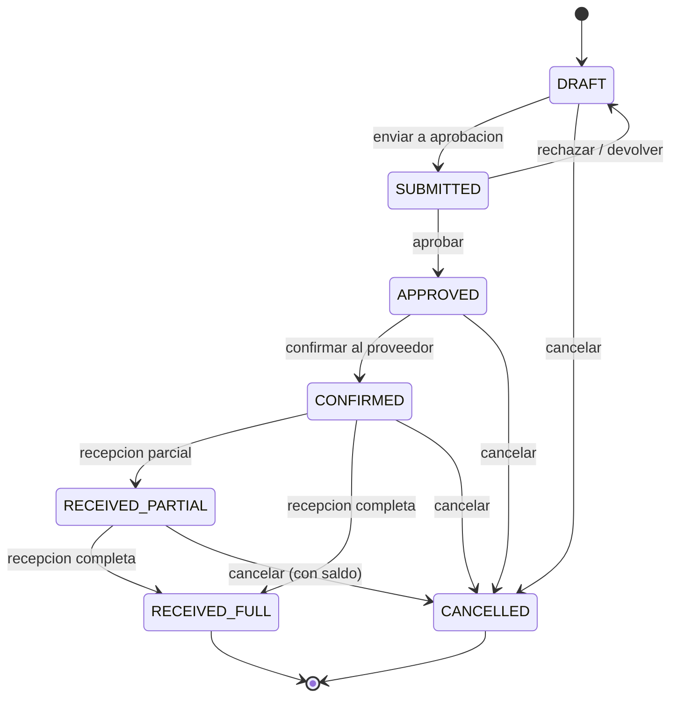
```mermaid
stateDiagram-v2
  [*] --> DRAFT
  DRAFT --> SUBMITTED : enviar a aprobacion
  DRAFT --> CANCELLED : cancelar
  SUBMITTED --> APPROVED : aprobar
  SUBMITTED --> DRAFT : rechazar / devolver
  APPROVED --> CONFIRMED : confirmar al proveedor
  APPROVED --> CANCELLED : cancelar
  CONFIRMED --> RECEIVED_PARTIAL : recepcion parcial
  CONFIRMED --> RECEIVED_FULL : recepcion completa
  CONFIRMED --> CANCELLED : cancelar
  RECEIVED_PARTIAL --> RECEIVED_FULL : recepcion completa
  RECEIVED_PARTIAL --> CANCELLED : cancelar (con saldo)
  RECEIVED_FULL --> [*]
  CANCELLED --> [*]
```

### Reglas

- `CONFIRMED` impacta costo en proyecto ([BR-PUR-001]).
- Recepciones avanzan el estado.
- Cancelación con recepción parcial requiere proceso especial.

---

## 8. Receipt (Recepción)

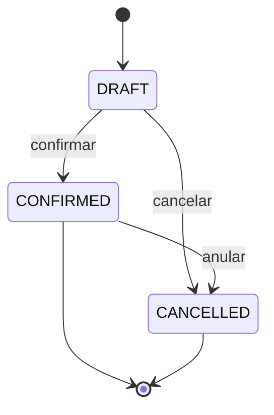
```mermaid
stateDiagram-v2
  [*] --> DRAFT
  DRAFT --> CONFIRMED : confirmar
  DRAFT --> CANCELLED : cancelar
  CONFIRMED --> CANCELLED : anular
  CONFIRMED --> [*]
  CANCELLED --> [*]
```

### Reglas

- `CONFIRMED` genera uno o más `StockMovement` ([BR-INV-005]); **por defecto** pasan a `CONFIRMED` en la **misma transacción** que la recepción. Si el tenant usa borradores de movimiento, quedan en `DRAFT` hasta confirmación explícita en depósito.
- Anular `CONFIRMED` sigue [BR-INV-007]: reversión por movimiento compensatorio o regla explícita — **no** borrado silencioso.

---

## 9. StockMovement (Movimiento de inventario)

> Módulo: [`02-modules/INVENTORY.md`](../02-modules/INVENTORY.md). El **tipo** de movimiento (`IN` / `OUT` / `ADJUSTMENT` / `TRANSFER_OUT` / `TRANSFER_IN`) es independiente del **`status`** de ciclo de vida.

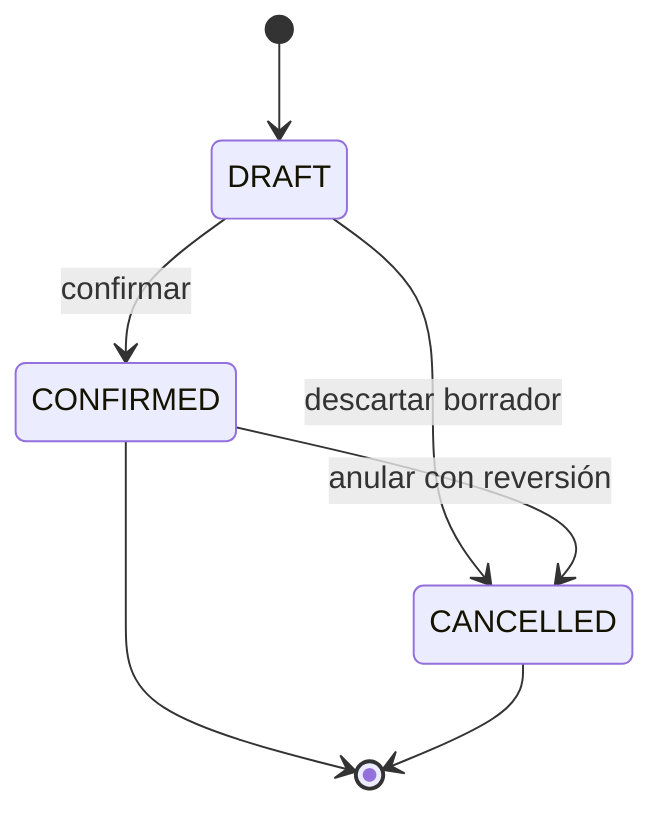
```mermaid
stateDiagram-v2
  [*] --> DRAFT
  DRAFT --> CONFIRMED : confirmar
  DRAFT --> CANCELLED : descartar borrador
  CONFIRMED --> CANCELLED : anular con reversión
  CONFIRMED --> [*]
  CANCELLED --> [*]
```

### Tabla — transiciones permitidas (StockMovement)

| Desde | Hacia | Acción |
|---|---|---|
| `DRAFT` | `CONFIRMED` | Confirmar — impacta stock ([BR-INV-002]) |
| `DRAFT` | `CANCELLED` | Descartar sin tocar saldos |
| `CONFIRMED` | `CANCELLED` | Anular con **movimiento compensatorio** vinculado o procedimiento explícito ([BR-INV-007]) |

### Eventos (StockMovement)

| Evento | Cuándo |
|---|---|
| `stock_movement.confirmed` | `DRAFT` → `CONFIRMED` |
| `stock_movement.cancelled` | A `CANCELLED` (borrador o cierre de anulación con reversión) |

### Reglas críticas (StockMovement)

- Solo **`CONFIRMED`** altera existencias y costo de stock.
- **Prohibido** eliminar físicamente un movimiento que llegó a `CONFIRMED` sin dejar trazabilidad de reversión.
- Reversión: **movimiento compensatorio** (cantidades opuestas) con referencia al original, u otra política tenant documentada — nunca “delete” silencioso ([BR-INV-007]).

---

## 10. PurchaseInvoice (Factura de compra)

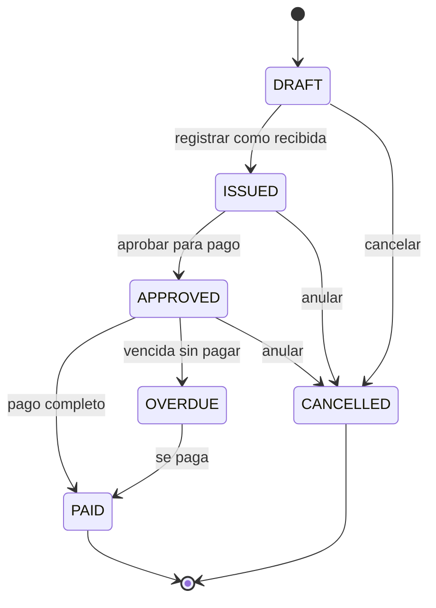
```mermaid
stateDiagram-v2
  [*] --> DRAFT
  DRAFT --> ISSUED : registrar como recibida
  DRAFT --> CANCELLED : cancelar
  ISSUED --> APPROVED : aprobar para pago
  ISSUED --> CANCELLED : anular
  APPROVED --> PAID : pago completo
  APPROVED --> OVERDUE : vencida sin pagar
  OVERDUE --> PAID : se paga
  APPROVED --> CANCELLED : anular
  PAID --> [*]
  CANCELLED --> [*]
```

### Reglas

- `ISSUED` significa que la factura del proveedor está cargada en el sistema.
- `APPROVED` significa que internamente se aprobó para pagar.
- `PAID` deriva del saldo de la `Payable` asociada.

---

## 11. Receivable (Cuenta por Cobrar)

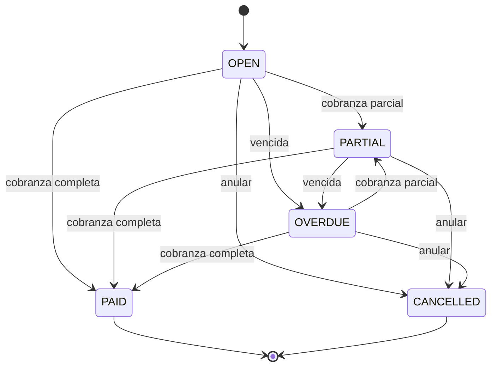
```mermaid
stateDiagram-v2
  [*] --> OPEN
  OPEN --> PARTIAL : cobranza parcial
  OPEN --> PAID : cobranza completa
  OPEN --> OVERDUE : vencida
  PARTIAL --> PAID : cobranza completa
  PARTIAL --> OVERDUE : vencida
  OVERDUE --> PARTIAL : cobranza parcial
  OVERDUE --> PAID : cobranza completa
  OPEN --> CANCELLED : anular
  PARTIAL --> CANCELLED : anular
  OVERDUE --> CANCELLED : anular
  PAID --> [*]
  CANCELLED --> [*]
```

### Reglas

- Estado se **deriva del saldo** ([BR-AR-002]).
- `PAID` cuando `paid_amount = total_amount`.
- `OVERDUE` cuando vencida y saldo > 0.
- `CANCELLED` requiere motivo.

---

## 12. Payable (Cuenta por Pagar)

> Idéntica máquina que Receivable, pero del lado de proveedor.

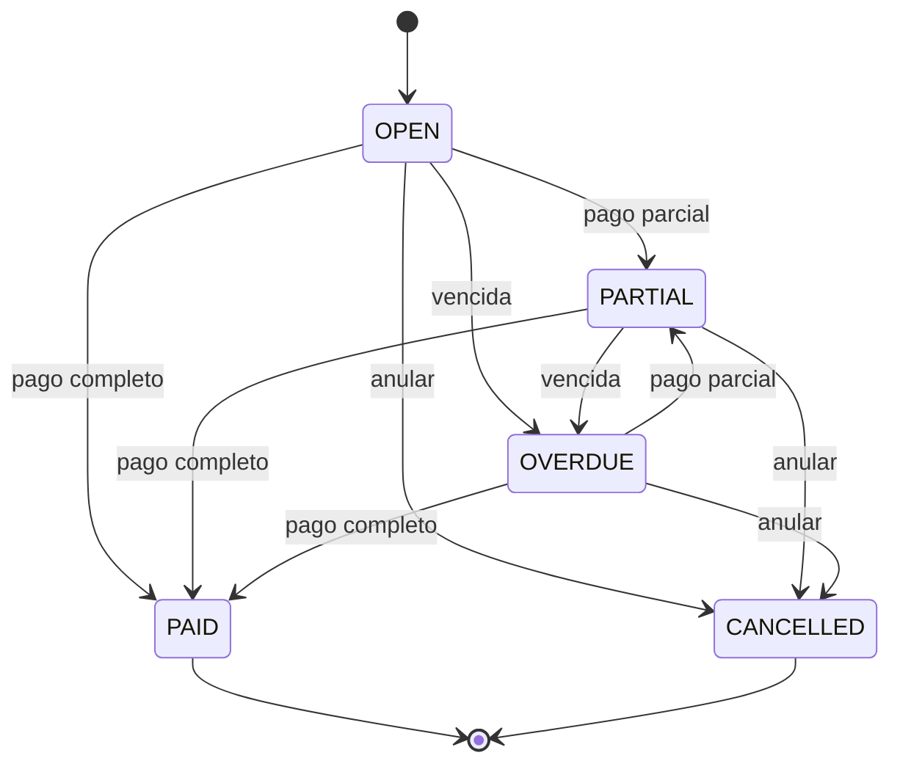
```mermaid
stateDiagram-v2
  [*] --> OPEN
  OPEN --> PARTIAL : pago parcial
  OPEN --> PAID : pago completo
  OPEN --> OVERDUE : vencida
  PARTIAL --> PAID : pago completo
  PARTIAL --> OVERDUE : vencida
  OVERDUE --> PARTIAL : pago parcial
  OVERDUE --> PAID : pago completo
  OPEN --> CANCELLED : anular
  PARTIAL --> CANCELLED : anular
  OVERDUE --> CANCELLED : anular
  PAID --> [*]
  CANCELLED --> [*]
```

---

## 13. AccountMovement (Movimiento de tesorería)

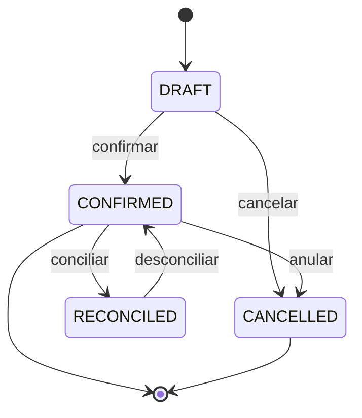
```mermaid
stateDiagram-v2
  [*] --> DRAFT
  DRAFT --> CONFIRMED : confirmar
  DRAFT --> CANCELLED : cancelar
  CONFIRMED --> RECONCILED : conciliar
  CONFIRMED --> CANCELLED : anular
  RECONCILED --> CONFIRMED : desconciliar
  CONFIRMED --> [*]
  CANCELLED --> [*]
```

### Reglas

- `DRAFT` no afecta saldos.
- `CONFIRMED` afecta saldos y reportes.
- `RECONCILED` significa cotejado con extracto bancario, no editable ([BR-TRZ-002]).
- Anular `CONFIRMED` revierte saldos y, si tiene `transfer_id`, también la contraparte.
- No se puede modificar/anular si `date_accounting` está en periodo cerrado ([BR-TRZ-003]).

---

## 14. Payment (Pago) y Collection (Cobranza)

> Pago y cobranza son entidades sintéticas que generan `AccountMovement`. Su máquina de estados sigue al `AccountMovement` asociado:

- `DRAFT` → `CONFIRMED` (genera AccountMovement, descuenta de Payables/Receivables) → `CANCELLED` (revierte).
- No hay estado `PARTIAL` propio del Payment/Collection — es la suma de Payments lo que deja la Payable parcial.

---

## 15. ChangeOrder (Orden de cambio)

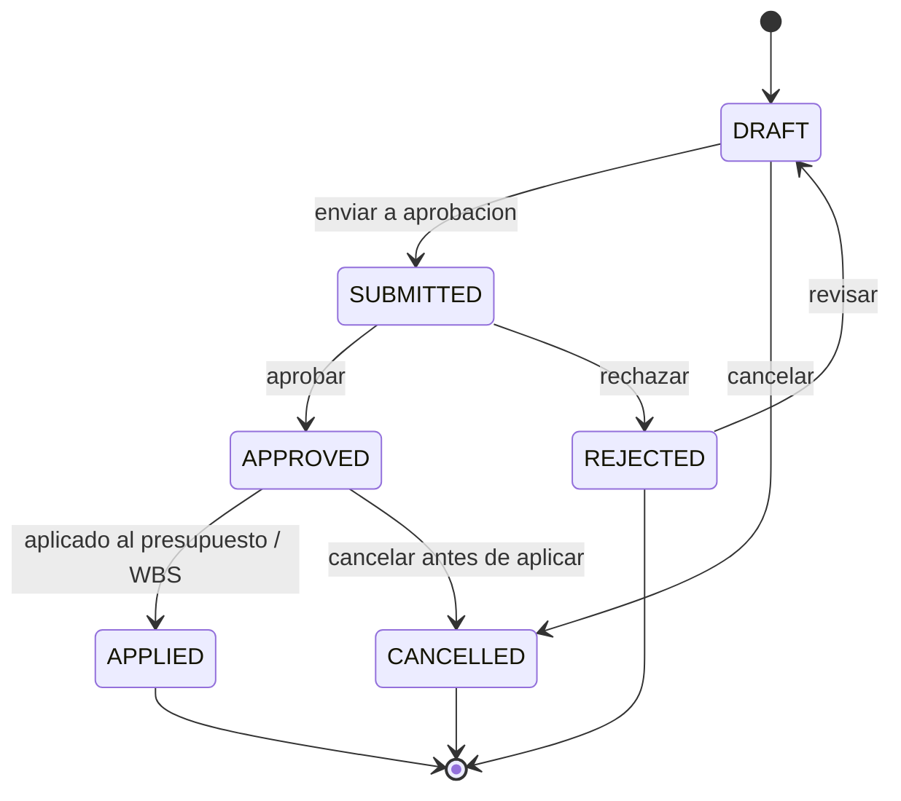
```mermaid
stateDiagram-v2
  [*] --> DRAFT
  DRAFT --> SUBMITTED : enviar a aprobacion
  DRAFT --> CANCELLED : cancelar
  SUBMITTED --> APPROVED : aprobar
  SUBMITTED --> REJECTED : rechazar
  REJECTED --> DRAFT : revisar
  APPROVED --> APPLIED : aplicado al presupuesto / WBS
  APPROVED --> CANCELLED : cancelar antes de aplicar
  APPLIED --> [*]
  REJECTED --> [*]
  CANCELLED --> [*]
```

### Reglas

- `APPLIED` significa que el cambio ya impactó WBS o presupuesto. Inmutable.
- Si requiere adenda, `APPROVED` dispara la creación de Adenda + nueva versión de Budget.

---

## 16. Rfi (Request for Information)

> Módulo: [`02-modules/RFIS.md`](../02-modules/RFIS.md).

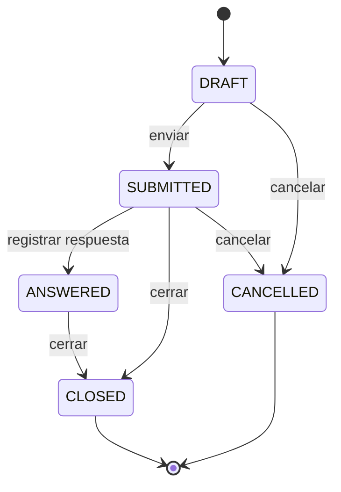
```mermaid
stateDiagram-v2
  [*] --> DRAFT
  DRAFT --> SUBMITTED : enviar
  DRAFT --> CANCELLED : cancelar
  SUBMITTED --> ANSWERED : registrar respuesta
  SUBMITTED --> CLOSED : cerrar
  SUBMITTED --> CANCELLED : cancelar
  ANSWERED --> CLOSED : cerrar
  CLOSED --> [*]
  CANCELLED --> [*]
```

### Tabla — transiciones permitidas (Rfi)

| Desde | Hacia | Notas |
|---|---|---|
| `DRAFT` | `SUBMITTED` | Consulta formalizada |
| `DRAFT` | `CANCELLED` | Descarte |
| `SUBMITTED` | `ANSWERED` | Respuesta registrada (`rfi.answered`) |
| `SUBMITTED` | `CLOSED` | Cierre **solo** con `closure_without_response_reason` obligatorio ([BR-RFI-001]) |
| `SUBMITTED` | `CANCELLED` | Anulación del trámite |
| `ANSWERED` | `CLOSED` | Cierre estándar (`rfi.closed`) |

### Eventos (Rfi)

| Evento | Transición |
|---|---|
| `rfi.created` | creación en `DRAFT` |
| `rfi.submitted` | `DRAFT` → `SUBMITTED` |
| `rfi.answered` | `SUBMITTED` → `ANSWERED` |
| `rfi.closed` | → `CLOSED` |
| `rfi.cancelled` | → `CANCELLED` |
| `rfi.overdue` | **no cambia `status`** — ver abajo |

### Reglas críticas (Rfi)

- **`is_overdue` (derivado):** si `status = SUBMITTED`, `due_date < hoy` y no está `CLOSED`/`CANCELLED`, el job `recompute_overdue_rfis` marca bandera / emite `rfi.overdue` ([BR-RFI-002]). **No** es un valor de `status`.
- Cierre con respuesta: transición típica `ANSWERED` → `CLOSED`.

---

## 17. JobsiteLogEntry (Parte diario)

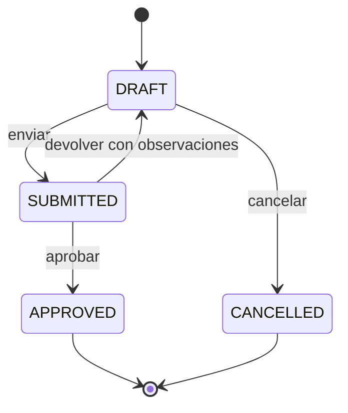
```mermaid
stateDiagram-v2
  [*] --> DRAFT
  DRAFT --> SUBMITTED : enviar
  SUBMITTED --> APPROVED : aprobar
  SUBMITTED --> DRAFT : devolver con observaciones
  DRAFT --> CANCELLED : cancelar
  APPROVED --> [*]
  CANCELLED --> [*]
```

### Reglas

- `APPROVED` por PM o Owner es el estado de cierre.
- Aprobación de inspector externo en Fase 2/3 ([Q-005]).

---

## 18. Subcontract (Subcontrato)

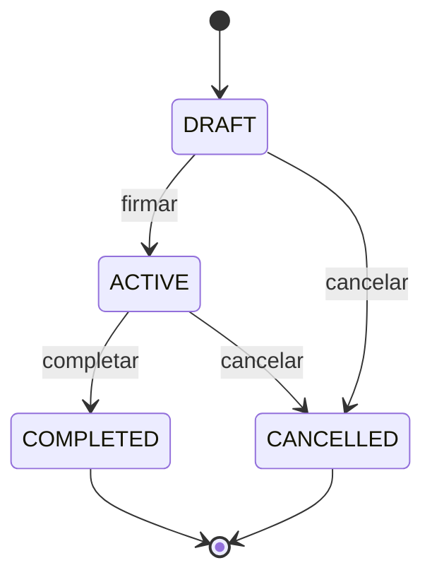
```mermaid
stateDiagram-v2
  [*] --> DRAFT
  DRAFT --> ACTIVE : firmar
  DRAFT --> CANCELLED : cancelar
  ACTIVE --> COMPLETED : completar
  ACTIVE --> CANCELLED : cancelar
  COMPLETED --> [*]
  CANCELLED --> [*]
```

### Reglas

- Solo `ACTIVE` permite registrar `SubcontractCertification` y `Payment`.

---

## 19. SubcontractCertification

> Módulo: [`02-modules/SUBCONTRACTS.md`](../02-modules/SUBCONTRACTS.md).

**`status`:** ciclo documental/operativo (**sin** `INVOICED` / `PAID`). **`settlement_status`** (no `payment_status`): liquidación respecto de **AP/pagos**, análogo en papel al `payment_status` de **certificación a cliente** pero con vocabulario distinto para evitar confusiones ([BR-SUB-004]).

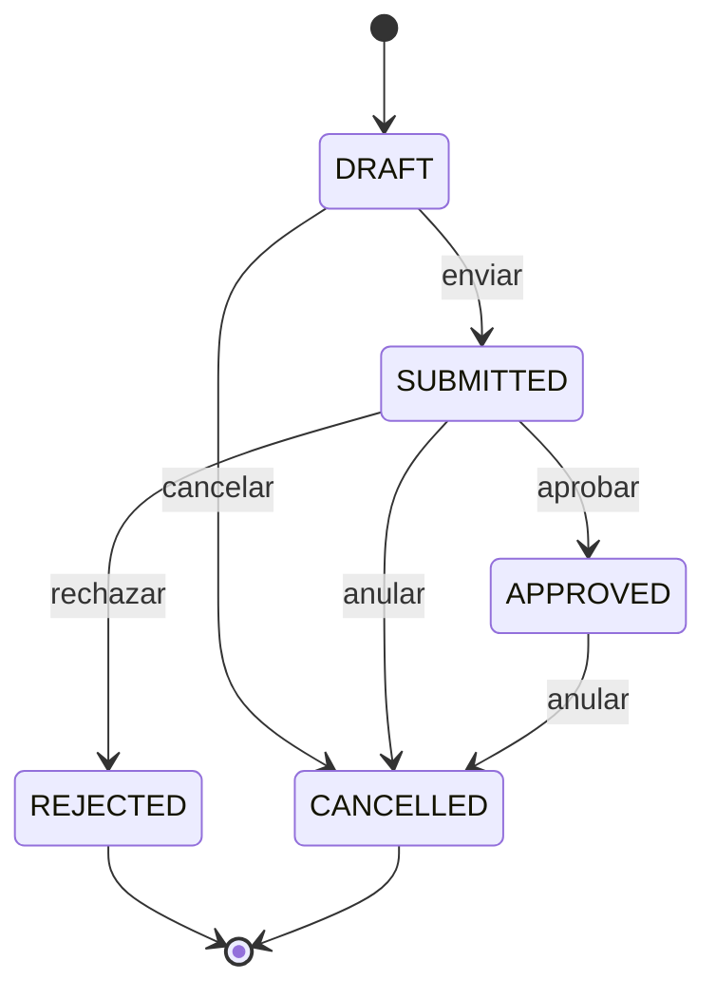
```mermaid
stateDiagram-v2
  [*] --> DRAFT
  DRAFT --> SUBMITTED : enviar
  DRAFT --> CANCELLED : cancelar
  SUBMITTED --> APPROVED : aprobar
  SUBMITTED --> REJECTED : rechazar
  SUBMITTED --> CANCELLED : anular
  APPROVED --> CANCELLED : anular
  REJECTED --> [*]
  CANCELLED --> [*]
```

### Tabla — transiciones permitidas (SubcontractCertification)

| Desde | Hacia | Notas |
|---|---|---|
| `DRAFT` | `SUBMITTED` | Listo para revisión/aprobación interna |
| `DRAFT` | `CANCELLED` | Descarte |
| `SUBMITTED` | `APPROVED` | Habilita reconocimiento de obligación según [BR-SUB-003] |
| `SUBMITTED` | `REJECTED` | **Terminal** para esta versión ([BR-SUB-005]): corrección = **nuevo** `SubcontractCertification` con `replaces_certification_id` → rechazado |
| `SUBMITTED` | `CANCELLED` | Anulación |
| `APPROVED` | `CANCELLED` | Anulación con impacto en `Payable` según reglas de anulación |

### Eventos (SubcontractCertification)

| Evento | Transición |
|---|---|
| `subcontract_certification.submitted` | `DRAFT` → `SUBMITTED` |
| `subcontract_certification.approved` | `SUBMITTED` → `APPROVED` |
| `subcontract_certification.rejected` | `SUBMITTED` → `REJECTED` |
| `subcontract_certification.cancelled` | → `CANCELLED` |

### 19.1 `settlement_status` — derivado (liquidación subcontrato)

Atributo **derivado** (solo lectura en flujo normal): `UNSETTLED` | `PARTIALLY_SETTLED` | `SETTLED` | `OVERDUE`.

- Se **calcula** desde **`Payable`** vinculadas al certificado y aplicaciones de **`Payment`** (misma separación documento vs finanzas que certificación cliente, [BR-SUB-004]).
- **No** es editable manualmente como ciclo principal.
- Prioridad sugerida (alineada a AR): saldo vencido en AP ligada → `OVERDUE`; pagos parciales → `PARTIALLY_SETTLED`; saldado → `SETTLED`; sin obligación registrada → `UNSETTLED`.

### Reglas críticas (SubcontractCertification)

- **Solo `APPROVED`** genera o incrementa **`Payable`** ([BR-SUB-003]). `SUBMITTED` **no** genera AP.
- **`REJECTED`:** no se reabre el mismo documento a `DRAFT`; la corrección es un **nuevo** certificado con vínculo al rechazado ([BR-SUB-005]).
- **`CANCELLED`:** si ya existía `Payable`, reversión por mecanismo **compensatorio** auditado (anulación NC / contrapartida), no borrado silencioso.
- Liquidación: solo vía AP/pagos; reflejada en **`settlement_status`**, no como `status`.

---

## 20. Period (Cierre de periodo)

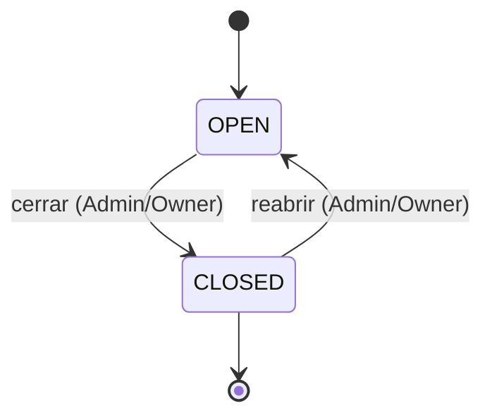
```mermaid
stateDiagram-v2
  [*] --> OPEN
  OPEN --> CLOSED : cerrar (Admin/Owner)
  CLOSED --> OPEN : reabrir (Admin/Owner)
  CLOSED --> [*]
```

### Reglas

- Solo Admin/Owner cambian de estado ([BR-PER-001]).
- Cerrar bloquea movimientos en el rango.
- Reabrir queda auditado con motivo.

---

## 21. User (Usuario)

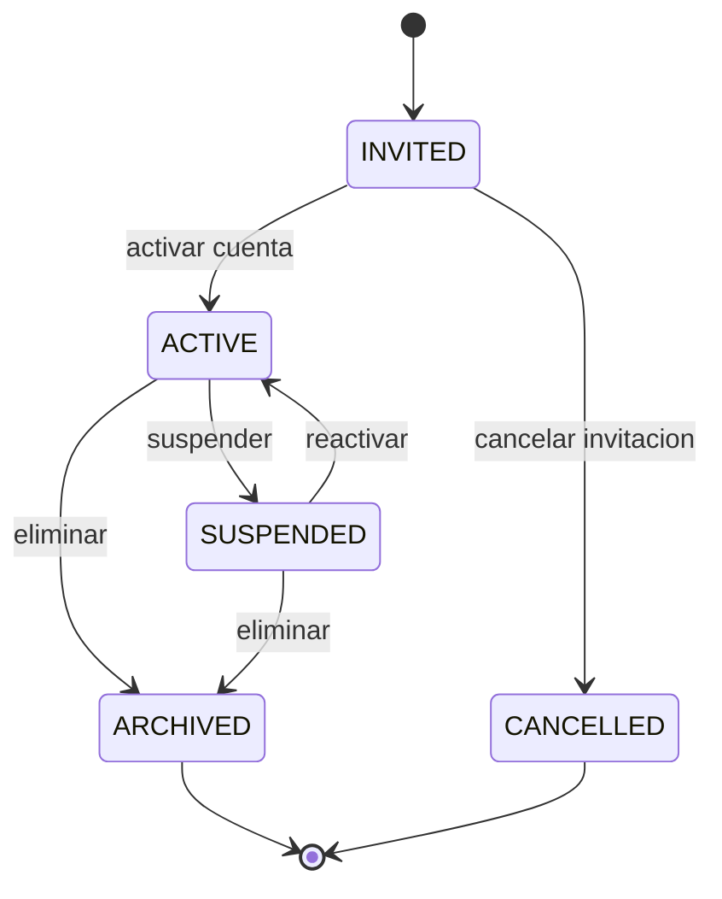
```mermaid
stateDiagram-v2
  [*] --> INVITED
  INVITED --> ACTIVE : activar cuenta
  INVITED --> CANCELLED : cancelar invitacion
  ACTIVE --> SUSPENDED : suspender
  SUSPENDED --> ACTIVE : reactivar
  ACTIVE --> ARCHIVED : eliminar
  SUSPENDED --> ARCHIVED : eliminar
  ARCHIVED --> [*]
  CANCELLED --> [*]
```

### Reglas

- `INVITED` no puede iniciar sesión hasta activar.
- `SUSPENDED` no puede operar pero queda histórico.
- `ARCHIVED` no se borra; se preserva para auditoría.

---

## 22. Contact (Contacto)

```mermaid
stateDiagram-v2
  [*] --> ACTIVE
  ACTIVE --> ARCHIVED : archivar
  ARCHIVED --> ACTIVE : reactivar
  ARCHIVED --> [*]
```

### Reglas

- `ARCHIVED` no aparece en selectores nuevos pero queda referenciable en histórico.

---

## 23. Account (Cuenta de tesorería)

```mermaid
stateDiagram-v2
  [*] --> ACTIVE
  ACTIVE --> INACTIVE : pausar
  INACTIVE --> ACTIVE : reactivar
  ACTIVE --> CLOSED : cerrar
  INACTIVE --> CLOSED : cerrar
  CLOSED --> [*]
```

### Reglas

- `INACTIVE` no permite nuevos movimientos pero queda en reportes.
- `CLOSED` requiere saldo cero.

---

## 24. BankReconciliation (Sesión de conciliación)

> Módulo: [`02-modules/BANK_RECONCILIATION.md`](../02-modules/BANK_RECONCILIATION.md). Agrupa el trabajo de emparejar extracto vs `AccountMovement` de una cuenta en un rango.

```mermaid
stateDiagram-v2
  [*] --> DRAFT
  DRAFT --> IN_PROGRESS : iniciar trabajo
  DRAFT --> CANCELLED : cancelar
  IN_PROGRESS --> CLOSED : cerrar sesion
  IN_PROGRESS --> CANCELLED : anular
  CLOSED --> CANCELLED : anular sesion cerrada excepcional
  CLOSED --> [*]
  CANCELLED --> [*]
```

### Tabla — transiciones (BankReconciliation)

| Desde | Hacia | Notas |
|---|---|---|
| `DRAFT` | `IN_PROGRESS` | Operador comienza a matchear |
| `DRAFT` | `CANCELLED` | Sin efecto contable |
| `IN_PROGRESS` | `CLOSED` | Cuadre aceptado; matches finales |
| `IN_PROGRESS` | `CANCELLED` | Abandono auditado |
| `CLOSED` | `CANCELLED` | Solo proceso excepcional |

### Eventos

| Evento | Transición |
|---|---|
| `bank_reconciliation.started` | `DRAFT` → `IN_PROGRESS` |
| `bank_reconciliation.closed` | → `CLOSED` |
| `bank_reconciliation.cancelled` | → `CANCELLED` |

### Reglas críticas

- En **`CLOSED`**, no se editan **matches** manuales sin **reapertura formal** o **nueva sesión** (política tenant); evita romper trazabilidad de `RECONCILED` ([BR-TRZ-002]).
- Los **`AccountMovement`** pasan a `RECONCILED` por el flujo de match, no por el estado `CLOSED` de la sesión solo.

---

## 25. StockReservation (Reserva de stock)

> Módulo: [`02-modules/INVENTORY.md`](../02-modules/INVENTORY.md). Reserva **disponible**, no **físico** ([BR-INV-006], [BR-INV-008]).

```mermaid
stateDiagram-v2
  [*] --> ACTIVE
  ACTIVE --> PARTIALLY_RELEASED : liberar parte
  ACTIVE --> RELEASED : liberar todo
  ACTIVE --> CONSUMED : consumir en movimiento
  ACTIVE --> CANCELLED : anular
  PARTIALLY_RELEASED --> RELEASED : liberar resto
  PARTIALLY_RELEASED --> CONSUMED : consumir resto
  PARTIALLY_RELEASED --> CANCELLED : anular
  RELEASED --> [*]
  CONSUMED --> [*]
  CANCELLED --> [*]
```

### Tabla — transiciones (StockReservation)

| Desde | Hacia | Notas |
|---|---|---|
| `ACTIVE` | `PARTIALLY_RELEASED` | Libera parte de la cantidad |
| `ACTIVE` | `RELEASED` | Libera toda la reserva sin consumo |
| `ACTIVE` | `CONSUMED` | Aplicada a egreso; debe **vincular** `StockMovement` ([BR-INV-008]) |
| `ACTIVE` | `CANCELLED` | Anulación |
| `PARTIALLY_RELEASED` | `RELEASED` / `CONSUMED` / `CANCELLED` | Según operación |

### Eventos

`stock_reservation.created`, `stock_reservation.partially_released`, `stock_reservation.released`, `stock_reservation.consumed`, `stock_reservation.cancelled`.

### Reglas críticas

- Stock reservado **no** cuenta como libre disponible.
- **`CONSUMED`** exige enlace al **`StockMovement`** que materializa el consumo.

---

## 26. Document y DocumentVersion

> Módulo: [`02-modules/DOCUMENTS.md`](../02-modules/DOCUMENTS.md). Un **Document** es el contenedor lógico; las **versiones** son entidades hijas cuando el tenant habilita versionado ([Q-008]).

### 26.1 `Document.status`

```mermaid
stateDiagram-v2
  [*] --> ACTIVE
  ACTIVE --> ARCHIVED : archivar
  ARCHIVED --> ACTIVE : reactivar
  ACTIVE --> DELETED : baja logica
  ARCHIVED --> DELETED : baja logica
  DELETED --> [*]
```

#### Tabla — Document

| Desde | Hacia | Evento |
|---|---|---|
| `ACTIVE` | `ARCHIVED` | `document.archived` |
| `ARCHIVED` | `ACTIVE` | `document.reactivated` |
| `ACTIVE` | `DELETED` | `document.deleted` (soft-delete) |
| `ARCHIVED` | `DELETED` | `document.deleted` |

#### Reglas críticas (Document)

- `DELETED` conserva trazabilidad; el binario puede mantenerse por retención legal.
- Comprobantes fiscales: preferir `ARCHIVED` antes que `DELETED`.

### 26.2 `DocumentVersion.status`

```mermaid
stateDiagram-v2
  [*] --> DRAFT
  DRAFT --> ACTIVE : publicar version
  DRAFT --> ARCHIVED : descartar borrador
  ACTIVE --> SUPERSEDED : nueva version pasa a activa
  ACTIVE --> ARCHIVED : archivar version
  SUPERSEDED --> ARCHIVED : archivar historico
  ARCHIVED --> [*]
```

#### Tabla — DocumentVersion

| Desde | Hacia | Evento |
|---|---|---|
| `DRAFT` | `ACTIVE` | `document_version.published` |
| `DRAFT` | `ARCHIVED` | `document_version.discarded` |
| `ACTIVE` | `SUPERSEDED` | `document_version.superseded` |
| `ACTIVE` | `ARCHIVED` | `document_version.archived` |
| `SUPERSEDED` | `ARCHIVED` | `document_version.archived` |

#### Reglas críticas (DocumentVersion)

- Una sola versión **`ACTIVE`** por documento cuando el versionado está activo.
- Sustitución publica la nueva como `ACTIVE` y marca la anterior `SUPERSEDED`.

---

## 27. Schedule y ScheduleItem

> Módulo: [`02-modules/PROJECT_SCHEDULING.md`](../02-modules/PROJECT_SCHEDULING.md). Por [BR-SCH-001] hay un **cronograma operativo** por proyecto; el contenedor **`Schedule`** no tiene máquina de estados separada en Fase 1 más allá de su existencia junto al proyecto. La **ejecución** se modela en **`ScheduleItem`**.

### 27.1 `ScheduleItem.status`

```mermaid
stateDiagram-v2
  [*] --> PLANNED
  PLANNED --> IN_PROGRESS : iniciar
  PLANNED --> BLOCKED : bloquear
  PLANNED --> CANCELLED : cancelar
  IN_PROGRESS --> COMPLETED : completar
  IN_PROGRESS --> BLOCKED : bloquear
  IN_PROGRESS --> CANCELLED : cancelar
  BLOCKED --> IN_PROGRESS : desbloquear
  BLOCKED --> CANCELLED : cancelar
  COMPLETED --> [*]
  CANCELLED --> [*]
```

#### Tabla — ScheduleItem

| Desde | Hacia | Evento |
|---|---|---|
| `PLANNED` | `IN_PROGRESS` | `schedule_item.started` |
| `PLANNED` | `BLOCKED` | `schedule_item.blocked` |
| `PLANNED` | `CANCELLED` | `schedule_item.cancelled` |
| `IN_PROGRESS` | `COMPLETED` | `schedule_item.completed` |
| `IN_PROGRESS` | `BLOCKED` | `schedule_item.blocked` |
| `IN_PROGRESS` | `CANCELLED` | `schedule_item.cancelled` |
| `BLOCKED` | `IN_PROGRESS` | `schedule_item.unblocked` |
| `BLOCKED` | `CANCELLED` | `schedule_item.cancelled` |

#### Reglas críticas (ScheduleItem)

- Ítems `CANCELLED` quedan en histórico; reportes de avance pueden excluirlos por defecto ([BR-SCH-002]).
- `BLOCKED` requiere **`block_reason`** no vacío ([BR-SCH-003]).

---

## 28. Tabla resumen — todas las máquinas

| Entidad | Estados |
|---|---|
| Project | DRAFT, ACTIVE, ON_HOLD, COMPLETED, CANCELLED |
| Budget | DRAFT, IN_REVIEW, RETURNED_FOR_CHANGES, APPROVED, CLOSED, SUPERSEDED, CANCELLED |
| Contract | DRAFT, ACTIVE, EXPIRED, CANCELLED |
| Addendum | DRAFT, IN_REVIEW, APPROVED, SIGNED, CANCELLED |
| Certification | DRAFT, ISSUED, APPROVED, REJECTED, CANCELLED (+ `payment_status` derivado) |
| SalesInvoice | DRAFT, ISSUED, PAID, OVERDUE, CANCELLED |
| PurchaseOrder | DRAFT, SUBMITTED, APPROVED, CONFIRMED, RECEIVED_PARTIAL, RECEIVED_FULL, CANCELLED |
| Receipt | DRAFT, CONFIRMED, CANCELLED |
| StockMovement | DRAFT, CONFIRMED, CANCELLED |
| PurchaseInvoice | DRAFT, ISSUED, APPROVED, PAID, OVERDUE, CANCELLED |
| Receivable | OPEN, PARTIAL, PAID, OVERDUE, CANCELLED |
| Payable | OPEN, PARTIAL, PAID, OVERDUE, CANCELLED |
| AccountMovement | DRAFT, CONFIRMED, RECONCILED, CANCELLED |
| ChangeOrder | DRAFT, SUBMITTED, APPROVED, REJECTED, APPLIED, CANCELLED |
| Rfi | DRAFT, SUBMITTED, ANSWERED, CLOSED, CANCELLED (+ `is_overdue` derivado) |
| JobsiteLogEntry | DRAFT, SUBMITTED, APPROVED, CANCELLED |
| Subcontract | DRAFT, ACTIVE, COMPLETED, CANCELLED |
| SubcontractCertification | DRAFT, SUBMITTED, APPROVED, REJECTED, CANCELLED (+ `settlement_status` derivado AP/pagos) |
| BankReconciliation | DRAFT, IN_PROGRESS, CLOSED, CANCELLED |
| StockReservation | ACTIVE, PARTIALLY_RELEASED, RELEASED, CONSUMED, CANCELLED |
| Period | OPEN, CLOSED |
| User | INVITED, ACTIVE, SUSPENDED, ARCHIVED, CANCELLED |
| Contact | ACTIVE, ARCHIVED |
| Account | ACTIVE, INACTIVE, CLOSED |
| Document | ACTIVE, ARCHIVED, DELETED |
| DocumentVersion | DRAFT, ACTIVE, SUPERSEDED, ARCHIVED |
| ScheduleItem | PLANNED, IN_PROGRESS, BLOCKED, COMPLETED, CANCELLED |

---

## 29. Reglas globales sobre máquinas de estado

- **R-SM-001**: ningún estado se "saltea" — toda transición debe estar listada explícitamente.
- **R-SM-002**: la transición a estado terminal (`CANCELLED`, `PAID`, `CLOSED`, `ARCHIVED`) requiere motivo en algunos casos.
- **R-SM-003**: la transición se ejecuta de forma atómica con la generación de eventos / cambios derivados.
- **R-SM-004**: ningún estado se reescribe a mano sin pasar por la transición correspondiente.
- **R-SM-005**: estados derivados (`OVERDUE`) se calculan, no se escriben (salvo materialización por performance).

---

## 30. Cómo agregar un estado

1. Justificar por qué los estados existentes no alcanzan.
2. Diagrama mermaid actualizado.
3. Listar todas las transiciones permitidas.
4. Documentar eventos que disparan la transición.
5. Documentar derivaciones (cómo afecta a otras entidades).
6. Actualizar [`EVENTS_AND_AUTOMATIONS.md`](./EVENTS_AND_AUTOMATIONS.md).
7. Anotar en `CHANGELOG` interno.
