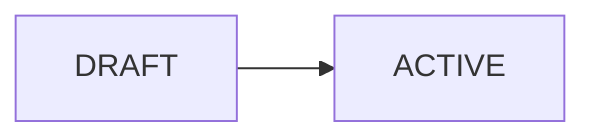

# Workflow: Crear proyecto

## 1. Objetivo
Dar de alta una obra con cliente, datos base y estado inicial.

## 2. Actor inicial
PM o ADMIN.

## 3. Precondiciones
- Existe **Contact** con rol CLIENT (o se crea en el flujo).
- Usuario con permiso EDIT en Proyectos.

## 4. Pasos
1. **Proyectos** → “Nuevo proyecto”.
2. Completar: código interno, nombre, cliente, ubicación, fechas, `project_type` PUBLIC/PRIVATE.
3. Guardar → estado `DRAFT`.
4. (Opcional) Adjuntar documentos iniciales ([`DOCUMENTS.md`](../02-modules/DOCUMENTS.md)).
5. **Activar** → estado `ACTIVE` (dispara `project.activated`).

## 5. Postcondiciones
- Proyecto listo para presupuesto y cronograma.

## 6. Eventos generados
- `project.created`, `project.activated`.

## 7. Caminos alternativos / errores
- Código duplicado → error validación.
- Cliente sin rol CLIENT → sistema asigna rol o bloquea según política.

## 8. Diagrama

## Referencias
- [`../02-modules/PROJECTS.md`](../02-modules/PROJECTS.md)
