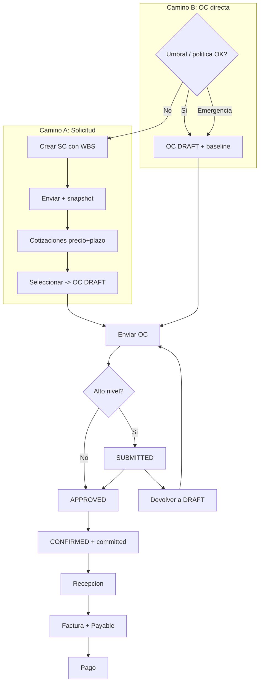

# Workflow: Registrar compra (solicitud, OC directa, recepción y factura)

> Procedimiento canónico alineado a [D-006], [D-020], [D-044], [D-050].  
> Detalle de módulos: [`PROCUREMENT.md`](../02-modules/PROCUREMENT.md), [`PURCHASE_REQUESTS.md`](../02-modules/PURCHASE_REQUESTS.md), [`PURCHASE_ORDERS_AND_RECEIPTS.md`](../02-modules/PURCHASE_ORDERS_AND_RECEIPTS.md).

## 1. Objetivo
Registrar una compra de proyecto con trazabilidad presupuesto ↔ compromiso ↔ recepción ↔ factura ↔ pago, sin doble conteo y con alertas que eviten atrasos.

## 2. Actor inicial
- **Camino A (solicitud):** PM / capataz.
- **Camino B (OC directa):** PROCUREMENT (o PM según permisos).
- Downstream: PROCUREMENT, WAREHOUSE, FINANCE, OWNER/ADMIN (aprobaciones).

## 3. Precondiciones
- Proyecto `ACTIVE`.
- Proveedor con rol SUPPLIER activo (para OC/cotización/factura).
- Presupuesto del proyecto en `APPROVED` o `CLOSED` con nodos WBS `ITEM` (incluye partida(s) de **gastos generales / indirectos de obra** si aplica).
- Periodo contable abierto para mutaciones con impacto ([BR-PUR-014]).
- Política de empresa cargada (`CompanyProcurementSettings`).

## 4. Pasos

### 4.1 Camino A — Con solicitud de compra (formal)

1. PM/capataz crea **PurchaseRequest** en borrador: cada línea con **WBS obligatorio**, cantidad, unidad, descripción ([BR-PUR-007]).
2. **Enviar SC** → snapshot de costo unitario presupuestario; notificación a Compras (in-app + email, [BR-PUR-015]).
3. Compras carga ≥ `minQuotesRequired` cotizaciones: precio por línea, **plazo de entrega**, vigencia (`validUntil`), adjuntos del proveedor ([BR-PUR-010], [D-050]).
4. **Comparar** cotizaciones (precio, plazo, ref. presupuesto / saldo de partida) y **seleccionar** una → genera **OC DRAFT** vinculada; SC → `QUOTE_SELECTED`.
5. Continuar en §4.3 (workflow de OC).

### 4.2 Camino B — OC directa (vía rápida)

1. Verificar política: `allowDirectPo` y monto estimado &lt; `purchaseRequestRequiredAboveArs` ([BR-PUR-008]). Si supera umbral → exigir Camino A, salvo **emergencia** (OWNER/ADMIN + `emergencyReason` + `allowEmergencyDirectPo`).
2. Crear **PurchaseOrder** borrador: proveedor, líneas con **WBS obligatorio**, precios.
3. Al crear/enviar, capturar **`budgetUnitCostSnapshot`** igual que en SC ([D-050], [BR-PUR-009]) y mostrar **costo referencial + saldo de partida** ([BR-PUR-011]).
4. Continuar en §4.3.

### 4.3 Workflow común de OC (enviar → aprobar/devolver → confirmar)

1. **Enviar** OC (`DRAFT` → `SUBMITTED` o auto-`APPROVED` si no hay alto nivel y el actor puede aprobar sin violar segregación).
2. Si requiere alto nivel (monto ≥ umbral o desvío `EXTRA_APPROVAL`): queda `SUBMITTED`; notifica aprobadores; solo OWNER/ADMIN aprueba.
3. Aprobador puede **aprobar** (`APPROVED`) o **rechazar/devolver a `DRAFT`** con motivo ([BR-PUR-016]); notifica al solicitante.
4. **Confirmar al proveedor** (`CONFIRMED`) → registra **comprometido** ([D-006], [BR-PUR-001]); si venía de SC, SC → `COMPLETED`.
5. **Aprobar ≠ listo:** sin confirmación no hay compromiso ni recepción/factura habilitada.

### 4.4 Recepción, factura y pago

1. WAREHOUSE/PROCUREMENT registra **Receipt**(s) parciales o totales sobre OC `CONFIRMED+` ([BR-PUR-004], [BR-PUR-005]).
2. Si hay saldo que no se recibirá: **cierre parcial** ([BR-PUR-013]), no anulación si ya hay recepciones/facturas.
3. FINANCE/PROCUREMENT registra **factura de proveedor** vinculada a OC (matching 3 vías vs OC y cantidades recibidas, [BR-PUR-012]).
4. Emitir factura → **Payable**; aprobar para pago; registrar **Payment** (ver [`PURCHASE_TO_PAY.md`](./PURCHASE_TO_PAY.md)).

### 4.5 Alternativa — Factura directa sin OC

1. Solo para montos bajo umbral o con rol AP aprobador / OWNER/ADMIN ([BR-APR-005], [D-006]).
2. Impacta costo al cargar/confirmar la factura (sin `committed_amount` de OC).
3. Si hay stock: definir recepción implícita o movimiento de inventario según política de inventario.

## 5. Postcondiciones
- Compromiso / devengado / pagado coherentes con [BR-COS-001]/[BR-COS-002].
- Cada línea de compra de proyecto imputada a WBS.
- Eventos y notificaciones emitidos; auditoría de aprobaciones/rechazos.

## 6. Eventos generados
- `purchase_request.submitted`, `procurement_quote.selected`
- `purchase_order.submitted` / `approved` / `returned_for_changes` / `confirmed` / `closed_partial` / `cancelled`
- `receipt.confirmed`, `purchase_invoice.issued`, `payment.confirmed`

## 7. Caminos alternativos / errores

| Situación | Tratamiento |
|---|---|
| OC directa sobre umbral sin SC | Bloqueo, salvo emergencia documentada ([BR-PUR-008]). |
| Desvío vs presupuesto | Justificación y/o aprobación alta ([BR-PUR-009]); alerta de saldo de partida ([BR-PUR-011]). |
| Aprobador rechaza | Vuelve a `DRAFT` con motivo; reenvío ([BR-PUR-016]). |
| Periodo cerrado | Bloqueo de confirmar OC / recepción / factura con impacto ([BR-PUR-014]). |
| Anular OC con recepciones/facturas | Bloqueado; usar cierre parcial o anular documentos hijos primero. |
| Self-approval del solicitante | Bloqueado salvo settings y sin alto nivel ([BR-APR-004]). |

## 8. Diagrama

## 9. Gaps de implementación (regla documentada; código pendiente)

Estas reglas **ya están definidas** en [D-050] y [BR-PUR-007]–[BR-PUR-016]. La implementación debe cerrarlas sin reinventar el procedimiento:

| Gap | Regla | Estado doc |
|---|---|---|
| WBS nullable en código/UI | [BR-PUR-007] hard-required | Documentado |
| OC directa sin `budgetUnitCostSnapshot` | mismo baseline que SC ([D-050], [BR-PUR-009]) | Documentado |
| Emergencia: motivo no cableado en create | [BR-PUR-008] + campo `emergencyReason` en alta OC | Documentado |
| Costo referencial / saldo de partida no visibles | [BR-PUR-011] | Documentado |
| Cotización sin plazo de entrega | lead time en quote ([D-050], [BR-PUR-010]) | Documentado |
| Sin rechazo formal de OC | [BR-PUR-016] + evento `returned_for_changes` | Documentado |
| Email automático + SLA | [BR-PUR-015], [D-050], Q-009 parcial | Documentado |
| Matching 3 vías / tolerancias factura | [BR-PUR-012] | Documentado |
| Cierre parcial formal | [BR-PUR-013] | Documentado |
| Guard de periodo cerrado en mutaciones compra | [BR-PUR-014] | Documentado |

## Referencias
- [`PROCUREMENT.md`](../02-modules/PROCUREMENT.md)
- [`APPROVAL_WORKFLOWS.md`](../01-domain/APPROVAL_WORKFLOWS.md) §2.2
- [`PURCHASE_TO_PAY.md`](./PURCHASE_TO_PAY.md)
