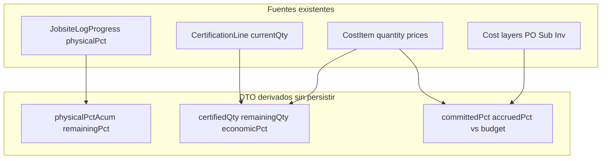

# Avance residual por EDT — plan de implementación

> Basado en revisión de `schema.prisma`, `PRISMA_ERD_AUDIT.md`, servicios de libro/certificación/cost-control y reglas BR-CERT-003 / Q-005b.
> **No edita** el plan de unidades/faltantes; es un track paralelo.

## Conclusión ERD / Prisma

**No hace falta migración.** El modelo ya soporta todo:

| Necesidad | Modelo / campo existente |
|---|---|
| % físico del día (incremental) | `JobsiteLogProgress.physicalPct` (nullable) |
| Qty operativa del día | `JobsiteLogProgress.quantityCompleted` |
| Techo qty partida | `CostItem.quantity` + `unit` |
| Certificado previo / período / acum | `CertificationLine`: `previousQty`, `currentQty`, `cumulativeQty`, `budgetQty` |
| Restante económico | Derivado: `budgetQty − cumulativeQty` (ya en serialize) |
| Físico ≠ económico | Schema comment + BR-CERT-003 |
| Libro ≠ certificación | Schema: qty del libro no afecta Certification |
| Capas de $ | Ya en `CostControlRow` (`committedCost`, `accruedCost`, `certifiedApproved`, `budgetTotalCost/Sale`) |
| Snapshot % libro | `getWbsIncrementalProgressSnapshot` |

Hijos sin `tenantId` propio: OK; filtrar por padre + tenant del padre.

**Decisión fija:** no persistir `%` en `WbsNode` / `CostItem`. Todo cálculo en service layer.

**Restricciones:**
- BR-CERT-003: físico y económico independientes (sugerir, no forzar).
- Q-005b: `%` libro = incremental; legacy puede sumar >100 → warning, sin scripts de migración.
- Validación 100% libro ya existe al submit; la UI debe anticiparla.

---

## Fase P0 — Carga residual (forms)

### P0.1 Libro de obra

**Service:** enriquecer snapshot WBS con:
- `approvedIncrementalPct`
- `remainingPct = max(0, 100 − approved)`
- `budgetQty`, `unit`, `approvedQty` (suma `quantityCompleted` APPROVED), `remainingQty`

**UI (`JobsiteLogForm`):**
- Al elegir WBS: precargar `% del día` = `remainingPct` (si > 0); hint `Ya X% · Restante Y%`.
- Label cantidad con unidad del CostItem.
- Hint client-side de tope; servidor sigue siendo autoridad.

**Tests:** remainingPct puro + guard 100% existente.

### P0.2 Certificación de cliente

**Service:** `listCertificationWbsHints(certificationId)` por ITEM del budget:
- `unit`, `budgetQty`, `previousQty` (misma regla ISSUED|APPROVED que `_computePreviousQty`), `remainingQty`, `unitSalePrice`
- hint opcional `jobsitePhysicalPct` (solo informativo)

**UI (`AddLineForm` / edit):** patrón de subcontratos — ppto / previo / restante; precargar `currentQty = remainingQty` (editable). `% físico` sugerible desde libro, **no** auto-igualar a qty económica.

### P0.3 Consumos (menor)

Unidad producto ya visible; WBS opcional solo como hint de partida (sin precargar qty).

---

## Fase P1 — Panel avance en drilldown EDT

Ampliar `WbsItemCostDetail` con `progressSummary` derivado:

- Físico: `physicalPctAcum`, `physicalQtyAcum`, `physicalRemainingPct`
- Económico: `certifiedQty`, `certifiedAmount`, `economicPctOfSale`, `remainingCertQty`
- Costo: `committedPctOfCost`, `accruedPctOfCost`, `expectedExposurePctOfCost` (capas D-021 ya calculadas)

**UI:** sección “Avance de la partida” (3 columnas) + links a Libro / Certificaciones / Materiales.

**Opcional misma fase:** columnas `% fís.`, `% econ.`, `% exposición` en tabla control-costos.

---

## Fase P2 — Reporte avance por EDT

Tabla/export por WBS con los mismos derivados P1. Curvas globales siguen en R-002 (`certification-evolution.service.ts`); no inventar fórmulas.

---

## Qué no hacer

- No columnas persistidas de `%` en WBS/CostItem.
- No scripts de normalización `physicalPct` legacy.
- No bloquear certificación al % del libro.
- No unificar qty económica con qty operativa.
- No cambiar state machines.

---

## Orden de PRs

1. Snapshot libro + UI restante/% + unidad.
2. Hints certificación + precarga remaining qty.
3. `progressSummary` + panel drilldown (+ columnas tabla si cabe).
4. Reporte/export P2.

## Archivos clave

- Referencia schema: `CertificationLine`, `JobsiteLogProgress`, `CostItem`
- `packages/services/src/jobsite-log/jobsite-log.service.ts`
- `apps/web/features/jobsite-log/components/jobsite-log-form.tsx`
- `packages/services/src/certification/certification-calc.service.ts` / line service
- `apps/web/features/certifications/components/certification-line-editor.tsx`
- `packages/services/src/cost-control/cost-control.service.ts`
- `apps/web/features/cost-control/components/wbs-item-drilldown.tsx`
