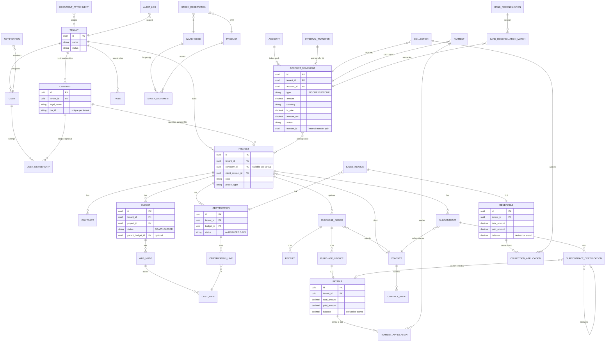

# Technical ERD — Bloqer 2.0 (PostgreSQL / Prisma)

> **Propuesta** de modelo físico de alto nivel. **No** es schema Prisma final.  
> Fuente funcional: [`../01-domain/ENTITY_RELATIONSHIPS.md`](../01-domain/ENTITY_RELATIONSHIPS.md), [`../01-domain/CORE_ENTITIES.md`](../01-domain/CORE_ENTITIES.md).

## Decisión

Representar el dominio como **modelo relacional multitenant** con **UUIDs**, **decimales para dinero**, **polimorfismos** como `(entity_type, entity_id)`, y **ledger** (`account_movement`) como núcleo de tesorería. El ERD técnico **respeta** modular monolith, service layer y aislamiento por `tenant_id` ([`ARCHITECTURE_OVERVIEW.md`](./ARCHITECTURE_OVERVIEW.md), [`MULTITENANCY_ARCHITECTURE.md`](./MULTITENANCY_ARCHITECTURE.md)).

## Diagrama ERD técnico (alto nivel)

> Convención: todas las entidades operativas llevan `tenant_id` salvo catálogos globales explícitos ([`TENANT_ISOLATION_MODEL.md`](./TENANT_ISOLATION_MODEL.md)). En el diagrama se omiten campos de auditoría y algunos atributos no estructurales.

### Notas sobre el diagrama

- **`user_membership` (Prisma `UserMembership`):** **una fila por `(user_id, tenant_id)`**; `company_id` opcional. Pertenencia simultánea del mismo usuario a **dos** `company` bajo el mismo tenant (**Q-001** variante 0B) **no** está modelada en Phase 1 — [D-036](../00-product/DECISION_LOG.md), [ADR-Phase1-06](./ARCHITECTURE_DECISION_RECORDS.md).
- **`COLLECTION_APPLICATION` / `PAYMENT_APPLICATION`**: tablas puente explícitas para **cobranzas/pagos parciales** ([D-010](../00-product/DECISION_LOG.md)); alternativa válida es modelo equivalente de líneas embebidas en `collection` / `payment` — decidir en Prisma sin cambiar reglas.
- **`Certification`**: **no** persiste `payment_status` como verdad maestra; si se materializa, es **derivado** de `Receivable` + aplicaciones ([D-026](../00-product/DECISION_LOG.md), [BR-CERT-PAYMENT-001](../01-domain/BUSINESS_RULES.md)).
- **`SubcontractCertification`**: **`settlement_status`** derivado de `Payable` + `Payment` ([D-027](../00-product/DECISION_LOG.md)).
- **Conciliación**: `BANK_RECONCILIATION_MATCH` es entidad técnica sugerida para no editar matches en sesión `CLOSED` sin reapertura ([D-032](../00-product/DECISION_LOG.md)).

## Entidades principales (lista técnica)

| Área | Entidades propuestas |
|---|---|
| Identity / tenancy | `tenant`, `company`, `user`, `user_membership`, `role`, `session` (si aplica Auth.js) |
| Directory | `contact`, `contact_role`, perfiles (`client_profile`, `supplier_profile`, `subcontractor_profile`) |
| Projects | `project`, `schedule`, `schedule_item` |
| Budgets | `budget`, `budget_settings`, `wbs_node`, `cost_item`, `cost_analysis_line` |
| Contracts | `contract`, `addendum`, `change_order` |
| Certifications | `certification`, `certification_line` |
| Procurement | `purchase_order`, `purchase_order_line`, `receipt`, `receipt_line`, `purchase_invoice`, `purchase_invoice_line` |
| Subcontracting | `subcontract`, `subcontract_certification`, `subcontract_certification_line` |
| Inventory | `warehouse`, `product`, `stock_movement`, `stock_reservation` |
| Treasury / AR / AP | `account`, `account_movement`, `internal_transfer`, `sales_invoice`, `receivable`, `collection`, `collection_application`, `payable`, `payment`, `payment_application`, `tax_line`, `movement_category`, `period`, `bank_reconciliation`, `bank_reconciliation_match` |
| Documents | `document_attachment` (metadata), blob en R2 |
| Notifications | `notification`, `notification_preference` (futuro) |
| Audit | `audit_log` |

## Relaciones críticas (integridad de negocio)

| Relación | Regla |
|---|---|
| `sales_invoice` → `receivable` | 1:1 por factura sistémica |
| `purchase_invoice` → `payable` | 1:1 típico |
| `subcontract_certification` → `payable` | Solo si `status = APPROVED` ([BR-SUB-003](../01-domain/BUSINESS_RULES.md)) |
| `internal_transfer` → `account_movement` | Exactamente **2** movimientos, mismo `transfer_id` ([R-INT-007](../01-domain/ENTITY_RELATIONSHIPS.md)) |
| `stock_transfer` | 2× `stock_movement` con `transfer_id` ([R-INT-013](../01-domain/ENTITY_RELATIONSHIPS.md)) |
| `budget` `CLOSED` | Sin mutación de WBS/cost items; solo whitelist metadata ([D-030](../00-product/DECISION_LOG.md)) |
| `period` cerrado | Bloqueo de mutación de movimientos en rango ([R-INT-009](../01-domain/ENTITY_RELATIONSHIPS.md)) |

## Entidades a revisar antes del Prisma final

1. **`company` vs `tenant`**: ver [`DATA_MODEL_OVERVIEW.md`](./DATA_MODEL_OVERVIEW.md) § Tenant / Company / Legal entity.  
2. **Puente cobranza/pago**: tablas `*_application` vs líneas JSON — impacto en reportes y constraints.  
3. **`balance` en AR/AP**: ¿solo derivado en query o columna mantenida por servicio? (consistencia vs simplicidad).  
4. **Polimorfismos**: lista cerrada de `entity_type` ([`../01-domain/ENTITY_RELATIONSHIPS.md`](../01-domain/ENTITY_RELATIONSHIPS.md) §10) — enum en app + check DB opcional.  
5. **`tax_line`**: normalización vs duplicación por documento; impacto en reportes fiscales Fase 1 manual.  
6. **`direct_sale`**: tabla explícita vs `sales_invoice` sin `certification_id` únicamente.  
7. **Numeración correlativa** ([Q-002](../00-product/OPEN_QUESTIONS.md)): tablas `number_sequence` o bloqueo por tenant+tipo.

## Qué NO hacer

- No modelar `INVOICED` en `certification.status`.  
- No usar `float`/`double` para importes.  
- No borrar físicamente `account_movement` / `stock_movement` confirmados sin compensación ([`LEDGER_TABLES_STRATEGY.md`](./LEDGER_TABLES_STRATEGY.md)).  
- No fijar aún **todos** los índices — ver [`INDEXING_STRATEGY.md`](./INDEXING_STRATEGY.md).

## Referencias

- [`DATA_MODEL_OVERVIEW.md`](./DATA_MODEL_OVERVIEW.md)
- [`DATABASE_CONVENTIONS.md`](./DATABASE_CONVENTIONS.md)
- [`REPORTING_DATA_MODEL.md`](./REPORTING_DATA_MODEL.md)
- Pendientes técnicos de cierre: [`PENDING_ARCHITECTURE_ITEMS.md`](./PENDING_ARCHITECTURE_ITEMS.md)
