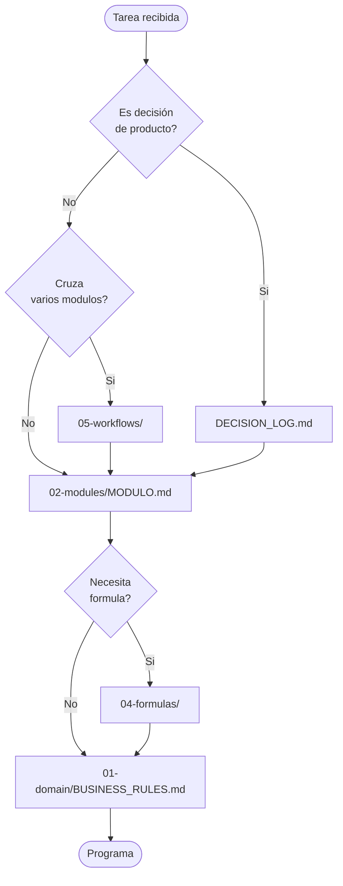

# AGENTS.md — Guía obligatoria para agentes IA

> Si sos Claude, Cursor, Copilot, o cualquier otro agente IA trabajando con Bloqer 2.0, **leé este archivo entero antes de generar código o tomar decisiones**.

---

## 1. Tu rol

Estás colaborando en la construcción de **Bloqer 2.0**, un ERP SaaS para empresas constructoras.

Tu trabajo es **traducir la especificación funcional** que vive en `/docs/bloqer2.0/` a **código correcto, simple y mantenible**.

No estás haciendo brainstorming. La mayoría de las decisiones de producto **ya están tomadas** y registradas en [`00-product/DECISION_LOG.md`](./00-product/DECISION_LOG.md). Tu trabajo es **respetarlas**, no rediscutirlas.

---

## 2. Reglas de oro (no negociables)

1. **Antes de programar, leé el módulo correspondiente** en `02-modules/<MODULE>.md`.
2. **Las fórmulas viven en `04-formulas/`**, no en módulos. Si necesitás una fórmula, citala desde ahí.
3. **No inventes campos, estados, ni reglas** que no estén documentados. Si faltan, agregalos a [`00-product/OPEN_QUESTIONS.md`](./00-product/OPEN_QUESTIONS.md) y pedí confirmación.
4. **Multitenancy es transversal y obligatorio**: toda entidad operativa pertenece a un `tenant_id`. Cualquier código que olvide el `tenant_id` está mal.
5. **El dinero nunca se guarda como `float`**. Siempre `decimal` con precisión definida en [`03-finance/MONEY_MODEL.md`](./03-finance/MONEY_MODEL.md).
6. **Toda entidad operativa tiene auditoría** (`created_at`, `updated_at`, `created_by`, `updated_by`, soft-delete cuando aplique). Ver [`02-modules/AUDIT_LOG.md`](./02-modules/AUDIT_LOG.md).
7. **Los estados de cada entidad con lifecycle son finitos y están en** [`01-domain/STATE_MACHINES.md`](./01-domain/STATE_MACHINES.md) (diagrama, tabla de transiciones, eventos y reglas por entidad; tabla maestra §28). Si modelás una entidad **nueva con estados**, **agregala primero** a `STATE_MACHINES.md` y enlazá el módulo; no agregues enums de `status` en código sin ese paso.
8. **Idioma y naming canónico:** ver §3 *Canonical naming and language rules* (obligatorio antes de definir enums o APIs).
9. **Si una decisión es ambigua, parás y preguntás.** No improvises arquitectura.

---

## 3. Canonical naming and language rules

> Regla transversal: **lo que va a código, base de datos, API, eventos y contratos técnicos usa inglés**; **lo que ve el usuario y la narrativa funcional de negocio usa español (Argentina)**.

### Principios

- **Código / modelo / persistencia / API**: entidades, tablas, columnas, **enums**, **estados**, **eventos de dominio**, endpoints, nombres de integración → **inglés** (`UPPER_SNAKE_CASE` para enums; eventos `entity.action` en pasado, en inglés).
- **Labels de UI**: textos visibles, botones, mensajes, títulos de pantalla → **español (es-AR)**.
- **Documentación funcional** (carpeta `docs/bloqer2.0/`, tono explicativo) → **español (es-AR)**.
- **Nombres técnicos citados en la doc funcional** (p. ej. `Budget`, `status = CLOSED`) → **inglés**, para alinear especificación ↔ implementación.
- **Traducción / i18n**: las **claves** (paths / message ids) → **inglés**; el **valor mostrado** → locale (es-AR por defecto).
- **Los nombres de estado en español** (“Borrador”, “Emitido”, “Anulado”) son **solo etiquetas de UI o glosa**; **nunca** son valores canónicos de enum en código, APIs ni migraciones.

### Tabla de referencia — enum canónico ↔ label UI (es-AR)

| Canonical enum | UI label (es-AR) |
|---|---|
| DRAFT | Borrador |
| IN_REVIEW | En revisión |
| APPROVED | Aprobado |
| CONFIRMED | Confirmado |
| ISSUED | Emitido |
| CLOSED | Cerrado |
| CANCELLED | Anulado / Cancelado |
| REJECTED | Rechazado |
| PAID | Pagado |
| PARTIALLY_PAID | Parcialmente pagado |
| UNPAID | Pendiente de pago |

**Notas de alineación con el dominio actual** (sin cambiar reglas de negocio):

- El **Budget** usa **`IN_REVIEW`** para envío a revisión interna.
- **`Receivable`** / **`Payable`** usan **`PARTIAL`** para saldo parcial; el label es-AR recomendado es **Parcialmente pagado** (equivalente práctico a `PARTIALLY_PAID` si se unificara el vocabulario).
- Estados adicionales por entidad: ver [`01-domain/STATE_MACHINES.md`](./01-domain/STATE_MACHINES.md) y la tabla extendida en [`00-product/GLOSSARY.md`](./00-product/GLOSSARY.md#canonical-naming-and-language-rules).

---

## 4. Cómo navegar la documentación

### Arquitectura técnica (implementación)

Cuando generes **código**, además de esta spec funcional, seguí [`08-architecture/README.md`](./08-architecture/README.md): modular monolith, **service layer obligatorio**, multitenancy, reporting reconciliable, y stack (Next.js, Prisma, Neon, etc.). Si proponés un cambio arquitectónico, documentalo como **ADR** en [`08-architecture/ARCHITECTURE_DECISION_RECORDS.md`](./08-architecture/ARCHITECTURE_DECISION_RECORDS.md).

**Flujo y límites con IA:** leé [`08-architecture/AI_DEVELOPMENT_WORKFLOW.md`](./08-architecture/AI_DEVELOPMENT_WORKFLOW.md) y [`08-architecture/AGENT_GUARDRAILS.md`](./08-architecture/AGENT_GUARDRAILS.md). Dudas técnicas abiertas de modelado/API: [`08-architecture/PENDING_ARCHITECTURE_ITEMS.md`](./08-architecture/PENDING_ARCHITECTURE_ITEMS.md).

**Orden de implementación:** [`08-architecture/IMPLEMENTATION_ROADMAP.md`](./08-architecture/IMPLEMENTATION_ROADMAP.md) y fases [`PHASE_0` … `PHASE_5`](./08-architecture/PHASE_0_PROJECT_SETUP.md) en `08-architecture/`.

### Mapa de prioridades de lectura



### Reglas de citación

Cuando expliques tu razonamiento al humano, **cita el documento** así:

> "Según [`02-modules/CERTIFICATIONS.md`](./02-modules/CERTIFICATIONS.md) §10.3, la sobrecertificación está bloqueada en obras públicas..."

Esto permite que el humano valide rápido sin releer todo.

---

<a id="plantilla-de-modulos"></a>

## 5. Plantilla de módulos (`02-modules/*.md`)

Cada módulo tiene **exactamente estas 19 secciones**, en este orden:

```
# <Nombre del Módulo>

## 1. Objetivo
## 2. Usuarios y roles que lo usan
## 3. Problema que resuelve
## 4. Datos que consume (inputs)
## 5. Datos que produce (outputs)
## 6. Entidades principales
## 7. Estados y transiciones
## 8. Acciones disponibles
## 9. Pantallas y vistas necesarias
## 10. Reglas de negocio
## 11. Validaciones
## 12. Fórmulas relacionadas
## 13. Casos borde
## 14. Reportes relacionados
## 15. Relación con otros módulos
## 16. Permisos
## 17. Eventos disparados / consumidos
## 18. Fase de implementación
## 19. Preguntas abiertas
```

Si una sección no aplica a un módulo concreto, dejá la sección con `_No aplica_` y una línea de justificación. **No la borres.**

---

## 6. Plantilla de fórmulas (`04-formulas/*.md`)

Cada fórmula se documenta así:

```markdown
### <Nombre de la fórmula>

**Propósito:** <una línea>

**Variables:**
- `<var_a>`: definición y tipo (decimal/entero/booleano)
- `<var_b>`: ...

**Expresión:**

```
resultado = <expresion matematica clara>
```

**Precisión decimal:** <ej. 2 decimales para ARS, 4 para tipos de cambio>

**Ejemplo numérico:**

| Variable | Valor |
|---|---|
| var_a | 1500.00 |
| var_b | 0.21 |
| **resultado** | **1815.00** |

**Casos borde:**
- Si `var_b == 0` → ...
- Si `var_a < 0` → ...

**Usado en:** [`02-modules/BUDGETS.md`](../02-modules/BUDGETS.md), ...
```

---

## 7. Plantilla de workflows (`05-workflows/*.md`)

```markdown
# Workflow: <Nombre>

## 1. Objetivo
## 2. Actor inicial
## 3. Precondiciones
## 4. Pasos (numerados, con módulo y acción)
## 5. Postcondiciones
## 6. Eventos generados
## 7. Caminos alternativos / errores
## 8. Diagrama (mermaid)
```

---

## 8. Convenciones de naming en código (cuando llegue el momento)

> Esto NO es decisión técnica de stack — es convención de nomenclatura para que la traducción doc → código sea predecible.

- **Entidades**: `PascalCase` en singular en inglés (`Project`, `Budget`, `CertificationItem`).
- **Tablas / colecciones**: `snake_case` en plural (`projects`, `budgets`, `certification_items`).
- **Campos**: `snake_case` (`created_at`, `tenant_id`, `total_amount`).
- **Estados**: `UPPER_SNAKE_CASE` (`DRAFT`, `APPROVED`, `CLOSED`).
- **Eventos**: `entity.action` en pasado (`budget.approved`, `certification.issued`).
- **IDs**: `<entity>_id` (`project_id`, `budget_id`).

---

## 9. Errores comunes que NO debés cometer

| Error | Consecuencia | Prevención |
|---|---|---|
| Asumir que un cliente es solo cliente | Pérdida de datos cuando el contacto también es proveedor | Usar siempre `Contact` con roles. Ver [`02-modules/DIRECTORY.md`](./02-modules/DIRECTORY.md) |
| Editar un presupuesto cerrado directamente | Pierde trazabilidad legal | Solo se modifica con adendas. Ver [`DECISION_LOG.md`](./00-product/DECISION_LOG.md#d-005) |
| Mezclar dinero en distintas monedas | Reportes inconsistentes | Toda operación tiene `currency` + `fx_rate` + `amount_ars`. Ver [`03-finance/MULTI_CURRENCY_RULES.md`](./03-finance/MULTI_CURRENCY_RULES.md) |
| Usar `float` para dinero | Errores de redondeo | Usar `decimal`. Ver [`03-finance/MONEY_MODEL.md`](./03-finance/MONEY_MODEL.md) |
| Permitir certificar más que el presupuesto en obra pública | Incumplimiento normativo | Ver regla `BR-CERT-002` en [`01-domain/BUSINESS_RULES.md`](./01-domain/BUSINESS_RULES.md) |
| Olvidar `tenant_id` en una query | Filtración entre empresas | Capa de acceso a datos siempre filtra por tenant |
| Borrar un movimiento de tesorería | Pierde auditoría | Anular con estado `CANCELLED` (UI: *Anulado* / *Cancelado*), nunca borrar |
| Confundir adenda con change order | Procesos legales distintos | Ver [`02-modules/CONTRACTS_AND_ADDENDUMS.md`](./02-modules/CONTRACTS_AND_ADDENDUMS.md) y [`02-modules/CHANGE_ORDERS.md`](./02-modules/CHANGE_ORDERS.md) |

---

## 10. Cómo escribir buenas decisiones de producto

Cuando un humano te pida "decidí vos", **antes de inventar**, hacé esto:

1. Buscá si la decisión ya está en `DECISION_LOG.md`.
2. Si no está, **proponé 2-3 alternativas** con trade-offs.
3. Pedí confirmación al humano.
4. Una vez confirmada, **agregala a `DECISION_LOG.md`** con ID nuevo (`D-NNN`).

Nunca tomes decisiones de producto unilaterales y las escondas en código.

---

## 11. Cómo extender esta documentación

- ¿Nuevo módulo? Agregá `02-modules/<NOMBRE>.md` con la plantilla del §5.
- ¿Nueva fórmula? Agregá a `04-formulas/<TEMA>.md` con plantilla del §6.
- ¿Nuevo workflow? Agregá a `05-workflows/<NOMBRE>.md` con plantilla del §7.
- **Siempre actualizá** [`README.md`](./README.md) §4 (índice) cuando agregues un archivo nuevo.

---

## 12. Si te bloqueás

Si llegaste acá y **algo no te cierra**, hacé esto en orden:

1. ¿La pregunta está en [`OPEN_QUESTIONS.md`](./00-product/OPEN_QUESTIONS.md)? → Pediselo al humano.
2. ¿Hay contradicción entre dos docs? → Marcá ambos con `## Hallazgo` y avisá.
3. ¿La decisión es 100% técnica (no producto)? → Aplicá [`07-non-functional/`](./07-non-functional/) si está; si no, decidí con criterio simple y explicá.
4. **Nunca silencies una ambigüedad.** Tu output debe ser explícito sobre qué supuestos asumiste.
