# Guía operativa — Bloqer v2

> **Audiencia:** dueños/directores, Project Managers, jefes de obra, capataces, compras, administración, finanzas, tesorería y contabilidad.
> **Alcance:** operación de punta a punta a **nivel empresa** y **nivel proyecto**, desde la configuración inicial hasta el control de costos, la facturación, la cobranza y el pago.
> **Base de evidencia:** rutas implementadas en `apps/web`, servicios en `packages/services`, enums en `packages/database/prisma/schema.prisma` y la spec funcional de `docs/bloqer2.0/`.
> **Regla de prevalencia:** cuando el texto de una pantalla o de la documentación difiere del comportamiento del código, esta guía describe **lo que hace el sistema hoy**.
> **Relación con otros documentos:** visión ejecutiva [`PANORAMA_GENERAL_BLOQER_V2.md`](./PANORAMA_GENERAL_BLOQER_V2.md); estado técnico A–G [`RELEVAMIENTO_TECNICO_FUNCIONAL_BLOQER_V2.md`](./RELEVAMIENTO_TECNICO_FUNCIONAL_BLOQER_V2.md); smoke por rol [`08-architecture/OPERATIONAL_SMOKE_CHECKLIST_BY_ROLE.md`](./08-architecture/OPERATIONAL_SMOKE_CHECKLIST_BY_ROLE.md).
> **Archivo canónico:** `GUIA_OPERATIVA_BLOQER_V2.md` (único).
> **Entregable DOCX:** `guides/Guía_Operativa_Bloqer_v2.docx`, regenerado con `cd docs/bloqer2.0/guides && node build_guide.js` desde **esta** MD.
> **Mantenimiento obligatorio:** todo cambio de UX, rutas, etiquetas, flujos financieros/contables, presupuesto/EDT, notificaciones o reglas visibles al usuario **debe actualizar esta guía en el mismo PR** (y regenerar el DOCX si se entrega a cliente). Ver [D-050](./00-product/DECISION_LOG.md)–[D-064](./00-product/DECISION_LOG.md) y `AGENT_GUARDRAILS.md`.
> **Capturas:** los bloques `📷 Captura sugerida` indican dónde insertar pantallazos reales. No inventar UI: fotografiar el producto actual.
> **Cómo usar los procedimientos:** en §§5–15 los pasos numerados usan **etiquetas exactas de la UI** (botones, menús, diálogos). Los enums en inglés (`APPROVED`, `CONFIRMED`, …) son el estado técnico; en pantalla suelen verse en español (Aprobado, Confirmada, …).

---

## 0. Cómo leer esta guía

Bloqer v2 trabaja en **dos niveles**:

- **Nivel empresa (corporativo):** datos maestros y funciones transversales a todas las obras (directorio, usuarios, tesorería, finanzas corporativas, contabilidad, inventario, configuración).
- **Nivel proyecto (obra):** el corazón operativo; casi toda la actividad económica cuelga de un proyecto.

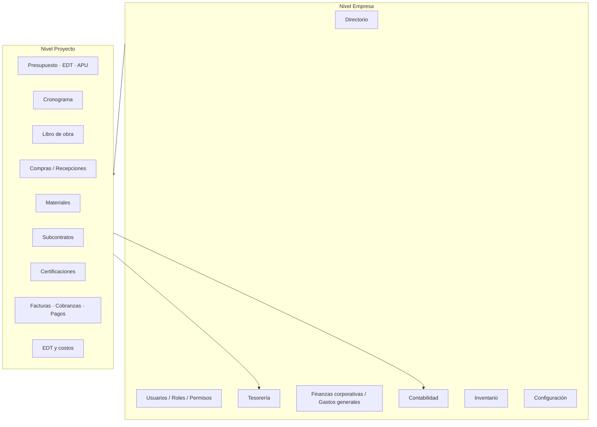
```mermaid
flowchart TB
  subgraph EMP["Nivel Empresa"]
    E1["Directorio"]
    E2["Usuarios / Roles / Permisos"]
    E3["Tesorería"]
    E4["Finanzas corporativas / Gastos generales"]
    E5["Contabilidad"]
    E6["Inventario"]
    E7["Configuración"]
  end
  subgraph PROJ["Nivel Proyecto"]
    R1["Presupuesto · EDT · APU"]
    R2["Cronograma"]
    R3["Libro de obra"]
    R4["Compras / Recepciones"]
    R5["Materiales"]
    R6["Subcontratos"]
    R7["Certificaciones"]
    R8["Facturas · Cobranzas · Pagos"]
    R9["EDT y costos"]
  end
  EMP --> PROJ
  PROJ --> E3
  PROJ --> E5
```

> Cada ítem de menú aparece **solo si** el usuario tiene el **permiso** correspondiente **y** el **módulo está habilitado** para la empresa.

### 0.1 Orden operativo recomendado (obra nueva)

Hacé esto **en orden** la primera vez; después cada módulo se usa en paralelo según el día a día.

| # | Qué | Dónde | Para qué |
|---|-----|-------|----------|
| 1 | Cliente, proveedores, subcontratistas **y empleados** en Directorio | `/directorio` | Sin **Cliente** no se crea la obra. Sin **Empleado** no se paga sueldo ni reintegro mapeado |
| 2 | Cuentas de tesorería (caja/banco) | `/tesoreria/cuentas` | Cobranzas y pagos |
| 3 | Contabilidad: **Aplicar plantilla AR** (si el plan está vacío) | `/contabilidad/cuentas` | Auto-borradores de asientos |
| 4 | Crear proyecto → **Activar obra** | `/proyectos/nuevo` | Estado `ACTIVE` |
| 5 | Presupuesto: EDT + APU → **Enviar a revisión** → **Aprobar** | Planificación → Presupuesto | Baseline + certificaciones |
| 6 | Cronograma: **Importar desde presupuesto** + fechas | Planificación → Cronograma | Plan temporal alineado a EDT |
| 7 | Operar: libro de obra, materiales, SC/OC, recepciones, consumos | Operación / Compras | Avance real + abastecimiento |
| 8 | Certificar → facturar → cobrar / pagar | Operación + Finanzas del proyecto | AR/AP |
| 9 | Revisar **EDT y costos** + asientos DRAFT → **Contabilizar** | Planificación + Contabilidad | Control y libros |
| 10 | Conciliar banco (extracto vs movimientos) | Tesorería → **Conciliación** | Cuadrar caja con banco |
| 11 | Cerrar el mes (cuando el mes quedó cerrado operativamente) | Contabilidad → **Cierres** | Bloqueo de tesorería + asientos |

### 0.2 Qué significa “afectaciones” en Bloqer

No hay un menú llamado **Afectaciones**. En obra, “afectar” = **imputar** una operación a una **partida EDT** y ver el impacto en las capas de costo / avance:

| Operación | Afecta (capa / dimensión) |
|-----------|---------------------------|
| Confirmar OC | **Comprometido** en EDT y costos |
| Emitir factura proveedor (con o sin OC) | **Devengado** (+ CxP; auto-DRAFT contable) |
| Pagar CxP | **Pagado** (+ caja; auto-DRAFT) |
| Aprobar libro de obra | **Avance real** del cronograma (+ consumo stock si aplica) |
| Emitir/aprobar certificación cliente | **Avance certificado** (+ base para factura) |
| Consumo de stock | Stock + (si hay partida EDT) imputación a partida |

La pantalla **EDT y costos** (`/control-costos`) es el tablero de esas afectaciones por partida.

### 0.3 Índice de capturas (dónde pegar pantallazos)

En el Markdown y en el DOCX, cada bloque con este formato es un **hueco para imagen real**:

```text
> **📷 Captura sugerida — <título>**
> Ruta: /ruta · Mostrar … · Tip: …
```

**Cómo completarlas**

1. Entrar al producto con datos demo (sin CUIT/emails reales de clientes).
2. Abrir la **ruta** indicada, dejar la UI en el estado que pide el tip.
3. Capturar desktop (salvo que el tip diga lo contrario); recortar chrome innecesario.
4. En el DOCX regenerado, **reemplazar la caja gris** “📷 CAPTURA SUGERIDA …” por la imagen (el generador no inserta archivos de foto solos: la caja marca el lugar).

**Prioridad alta (módulos nuevos / agosto 2026) — completar primero**

| # | Título del bloque | Sección | Ruta |
|---|-------------------|---------|------|
| P1 | Listado de conciliaciones | §4.2 | `/tesoreria/conciliacion` |
| P2 | Nueva conciliación (alta) | §4.2 | `/tesoreria/conciliacion/nueva` |
| P3 | Workspace de empareje (dos columnas) | §4.2 | `/tesoreria/conciliacion/[id]` |
| P4 | Importar CSV / OFX | §4.2 | detalle de sesión |
| P5 | Cerrar conciliación | §4.2 | diálogo en detalle |
| P6 | Detalle de cuenta + CTA Ajuste manual | §4.3 | `/tesoreria/cuentas/[id]` |
| P7 | Ajuste manual de cuenta | §4.3 | `/tesoreria/cuentas/[id]/ajuste` |
| P8 | Ledger con columna Estado | §4.0 | `/tesoreria/cuentas/[id]` (extracto) |
| P9 | Tesorería subnav (incl. Conciliación) | §4.0 | `/tesoreria` |
| P10 | Cierres de período (listado) | §15.3 | `/contabilidad/cierres` |
| P11 | Diálogo Cerrar período | §15.3 | `/contabilidad/cierres` |
| P12 | Diálogo Reabrir con motivo | §15.3 | `/contabilidad/cierres` |
| P13 | Contabilidad hub (subnav con Cierres) | §15 | `/contabilidad` |
| P14 | Invitar usuario | §2.1 | `/configuracion/equipo/invitar` |
| P15 | Aceptar invitación (sin token en URL) | §2.1 | `/invitaciones/aceptar` |

El resto de bloques `📷` del documento (login, presupuesto, OC, certificaciones, etc.) siguen vigentes; completarlos cuando armes el entregable completo al cliente.

### 0.4 Mapas de proceso (guía visual)

Dos familias, misma marca. En la app: **Ayuda** → **Mapas de proceso** (primero caminitos, después láminas). Clic en el mapa para verlo a pantalla completa (X o Escape para cerrar); el título de la card abre el procedimiento.

| Carpeta | Qué es |
|---------|--------|
| [`guides/assets/flujos/`](./guides/assets/flujos/) | Caminitos si/si no (cómo se mueve el documento) |
| [`guides/assets/laminas/`](./guides/assets/laminas/) | Láminas con roles y detalle (las primeras que armamos) |
| [`guides/assets/screenshots/`](./guides/assets/screenshots/) | Capturas de pantalla de la guía |

**Caminitos** (`flujos/`)

| Mapa | Archivo | Guía |
|------|---------|------|
| Pagar un sueldo | [`flujos/mapa-flujo-sueldo-si-no.png`](./guides/assets/flujos/mapa-flujo-sueldo-si-no.png) | §12.2.1 |
| Costo de empresa | [`flujos/mapa-flujo-gasto-empresa-si-no.png`](./guides/assets/flujos/mapa-flujo-gasto-empresa-si-no.png) | §12.2 · §14 |
| Compra | [`flujos/mapa-flujo-compras-si-no.png`](./guides/assets/flujos/mapa-flujo-compras-si-no.png) | §9 |
| Mano de obra y equipos | [`flujos/mapa-flujo-mano-obra-equipos-si-no.png`](./guides/assets/flujos/mapa-flujo-mano-obra-equipos-si-no.png) | §9.0.1 · §9.0.2 |
| Egresos de obra (comparación) | [`flujos/mapa-flujo-egresos-obra-comparacion.png`](./guides/assets/flujos/mapa-flujo-egresos-obra-comparacion.png) | §9.0 · §10 · §12.2 |
| Desvío de OC | [`flujos/mapa-flujo-desvio-oc-si-no.png`](./guides/assets/flujos/mapa-flujo-desvio-oc-si-no.png) | §9.2 |
| Costo de obra | [`flujos/mapa-flujo-costo-obra-si-no.png`](./guides/assets/flujos/mapa-flujo-costo-obra-si-no.png) | §12.2 |
| Subcontrato | [`flujos/mapa-flujo-subcontrato-si-no.png`](./guides/assets/flujos/mapa-flujo-subcontrato-si-no.png) | §10 |
| Certificar y cobrar | [`flujos/mapa-flujo-certificar-cobrar-si-no.png`](./guides/assets/flujos/mapa-flujo-certificar-cobrar-si-no.png) | §11 · §12.1 |

**Láminas** (`laminas/`)

| Mapa | Archivo | Guía |
|------|---------|------|
| Puesta en marcha | [`laminas/mapa-puesta-en-marcha.png`](./guides/assets/laminas/mapa-puesta-en-marcha.png) | §0.1 · §5 |
| Pagar desde la empresa | [`laminas/mapa-pago-corporativo.png`](./guides/assets/laminas/mapa-pago-corporativo.png) | §12.2 |
| Tesorería y conciliación | [`laminas/mapa-tesoreria-conciliacion.png`](./guides/assets/laminas/mapa-tesoreria-conciliacion.png) | §4.2 |
| Cerrar el mes | [`laminas/mapa-cerrar-el-mes.png`](./guides/assets/laminas/mapa-cerrar-el-mes.png) | §15.3 |
| Presupuesto y EDT | [`laminas/mapa-presupuesto-edt.png`](./guides/assets/laminas/mapa-presupuesto-edt.png) | §6 |
| Circuito de compra | [`laminas/mapa-circuito-compra-sc-oc.png`](./guides/assets/laminas/mapa-circuito-compra-sc-oc.png) | §9 |
| Subcontrato hasta el pago | [`laminas/mapa-subcontrato.png`](./guides/assets/laminas/mapa-subcontrato.png) | §10 |
| Certificar, facturar y cobrar | [`laminas/mapa-certificar-cobrar.png`](./guides/assets/laminas/mapa-certificar-cobrar.png) | §11 · §12.1 |
| Cargar EDT y APU | [`laminas/mapa-cargar-edt-apu.png`](./guides/assets/laminas/mapa-cargar-edt-apu.png) | §6.1 |
| Armar el cronograma | [`laminas/mapa-armar-cronograma.png`](./guides/assets/laminas/mapa-armar-cronograma.png) | §7 |

Las láminas de empresa y de presupuesto:

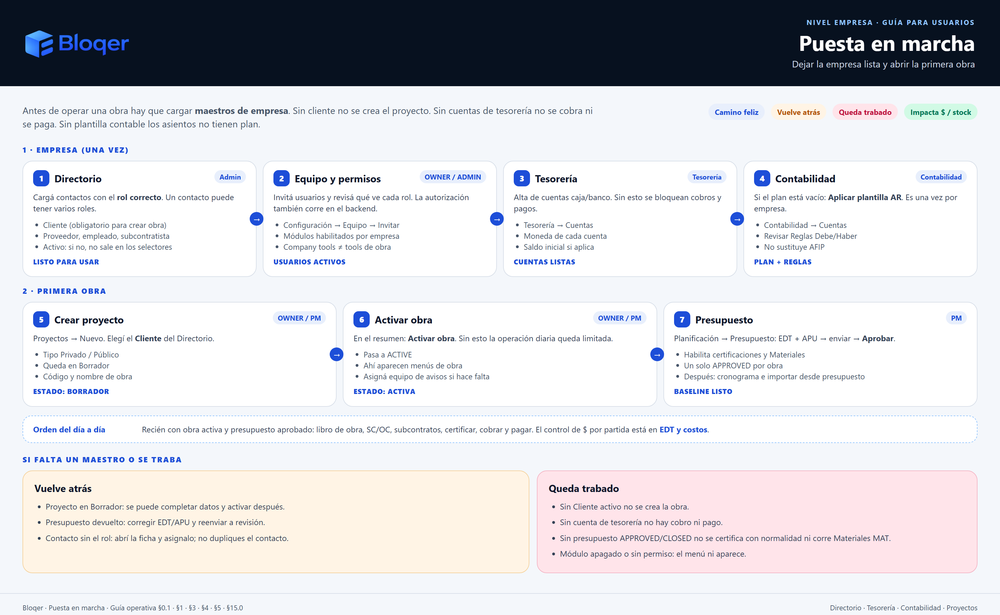

*Puesta en marcha (empresa + primera obra).*

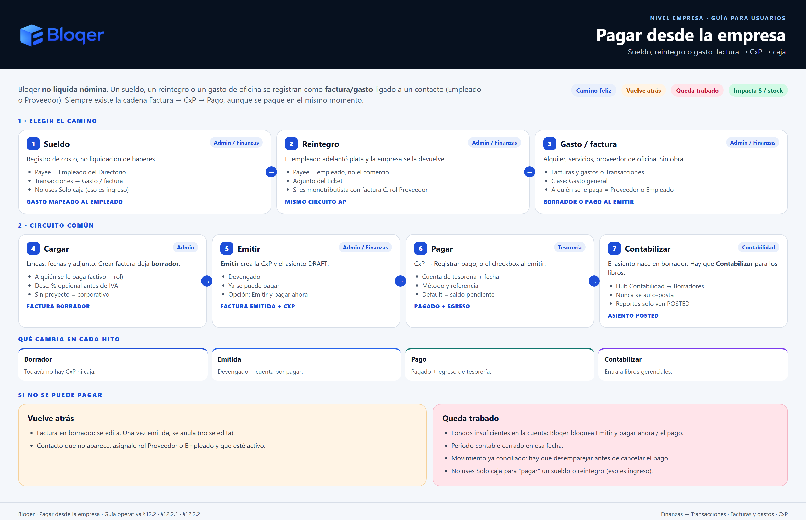

*Pagar desde la empresa.*

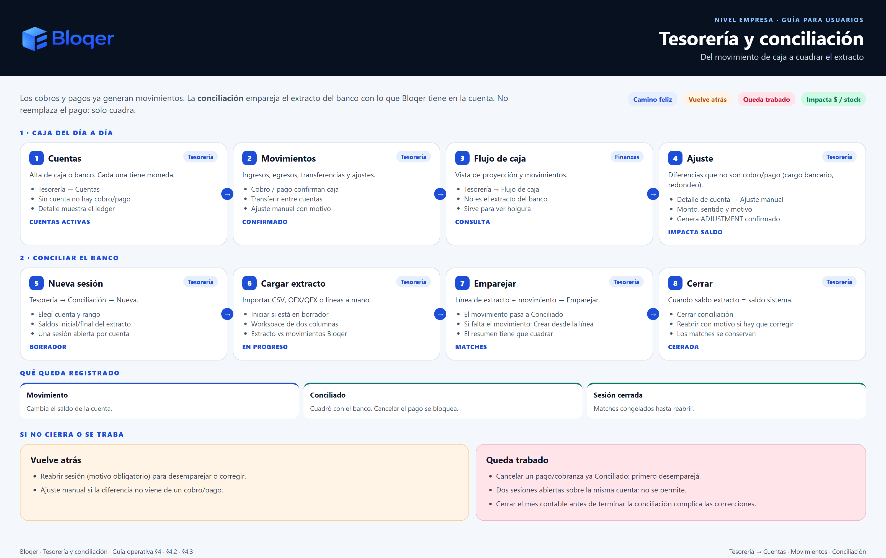

*Tesorería y conciliación.*

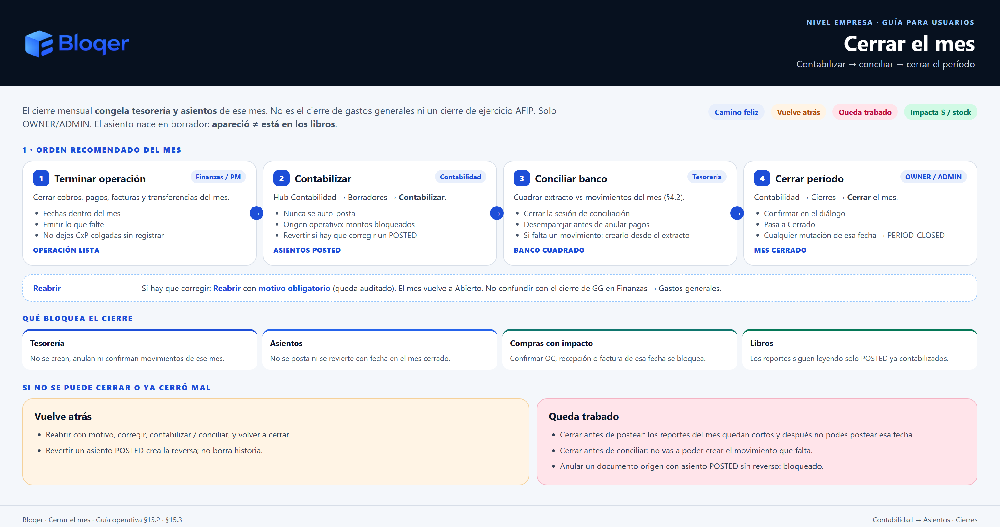

*Cerrar el mes.*

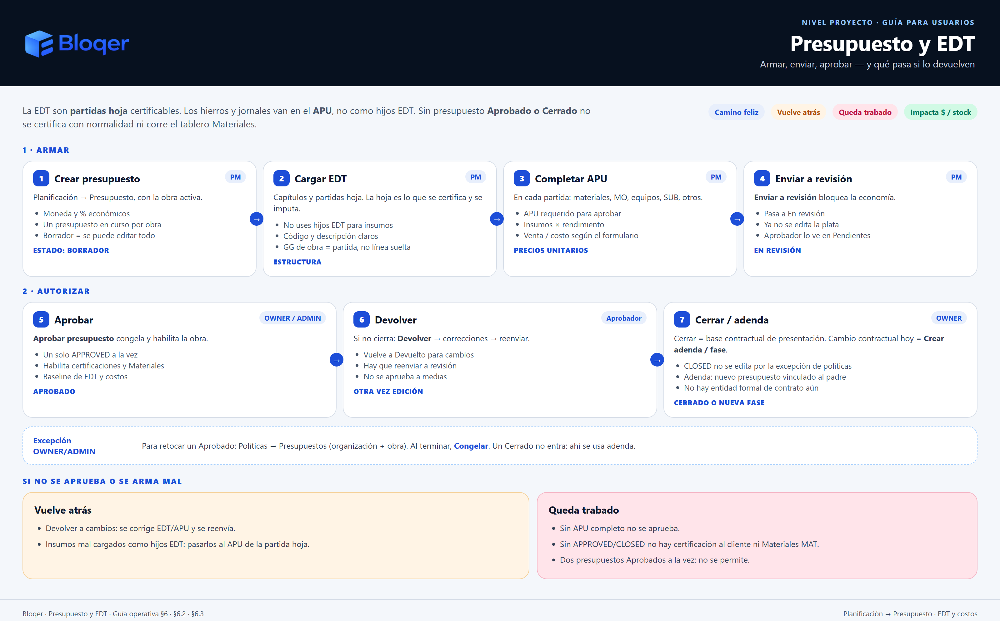

*Presupuesto y EDT.*

Caminitos y láminas de compras, subcontrato, certificar, EDT/APU y cronograma están en su sección.

---

## 1. Configuración inicial de la empresa (nivel empresa)

### 1.1 Ingreso y navegación

- Acceso en `/login` con **email y contraseña** (registro en `/registro` + verificación de email; recuperación en `/recuperar-contrasena`) o **Google**. No hay segundo factor (2FA) al momento de este relevamiento.
- El **menú lateral de empresa** agrupa: **General · Finanzas · Tesorería · Contabilidad · Configuración**.
- Al entrar a una obra, el menú lateral se reemplaza por el **menú del proyecto**.

<!-- capture:01 login-email-google -->
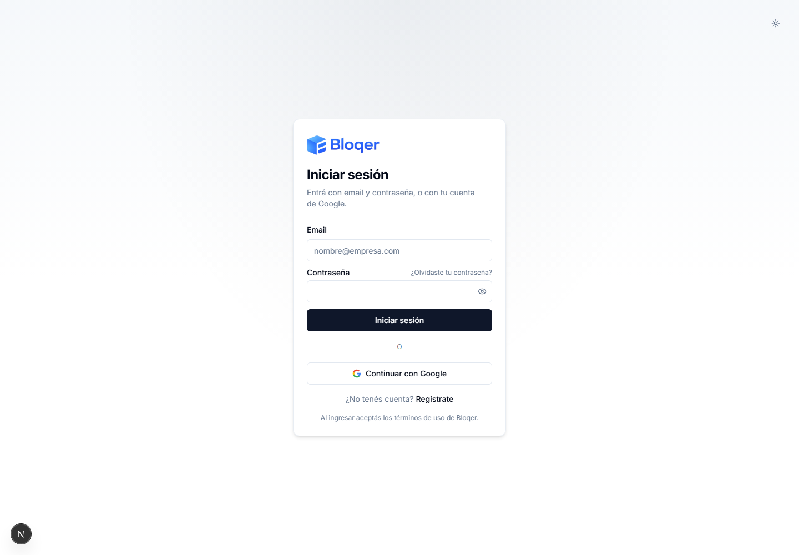

*Login (email + Google).*

<!-- capture:01 dashboard-menu-empresa -->
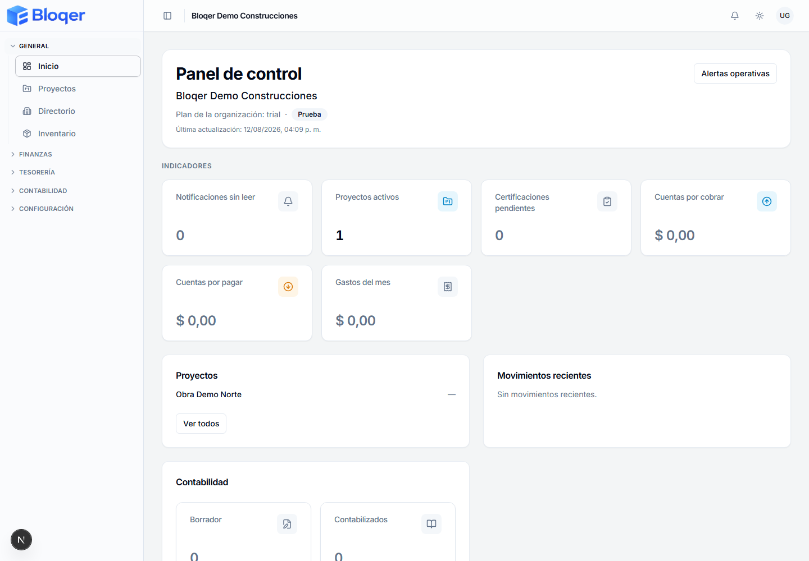

*Dashboard / menú empresa.*

### 1.2 Menú de empresa (rutas reales)

| Sección | Ítems (etiqueta → ruta) |
|---------|--------------------------|
| General | Inicio → `/dashboard` · **Pendientes** → `/pendientes` · Proyectos → `/proyectos` · **Reportes** → `/reportes` · Directorio → `/directorio` · Inventario → `/inventario` |
| Finanzas | Tablero → `/finanzas` · Transacciones → `/finanzas/transacciones` · Facturas y gastos → `/finanzas/facturas-proveedor` · Cuentas por cobrar → `/finanzas/cuentas-por-cobrar` · Cuentas por pagar → `/finanzas/cuentas-por-pagar` · Imputación GG → `/finanzas/gastos-generales` |
| Tesorería | Resumen → `/tesoreria` · Cuentas → `/tesoreria/cuentas` · Flujo de caja → `/tesoreria/flujo-caja` · **Conciliación** → `/tesoreria/conciliacion` |
| Contabilidad | Resumen → `/contabilidad` · **Plan de cuentas** → `/contabilidad/cuentas` · Asientos → `/contabilidad/asientos` · **Cierres** → `/contabilidad/cierres` · Reglas → `/contabilidad/reglas` |
| Configuración | General → `/configuracion` · Mi perfil → `/configuracion/perfil` · Equipo → `/configuracion/equipo` · Permisos → `/configuracion/permisos` · **Políticas** → `/configuracion/politicas` · Reportes programados → `/configuracion/reportes` · Registro → `/configuracion/registro` |

> **Contabilidad — libros:** Libro diario, Sumas y saldos, Situación y Resultados no están en el menú izquierdo: se llegan desde la **subnav** del hub (§15.1). En esa barra, Plan de cuentas aparece como **Cuentas**.

> **Visibilidad (D-056):** las secciones **Finanzas**, **Tesorería** y **Contabilidad** del menú de empresa solo aparecen para roles de **company finance**: `OWNER`, `ADMIN`, `FINANCE`, `TREASURER` y `VIEWER` (lectura). Roles operativos (`PROJECT_MANAGER`, `PROCUREMENT`, `SALES`, `PROJECT_FINANCE`, etc.) trabajan finanzas desde el **proyecto**, no desde el hub corporativo.

> **Pendientes (bandeja personal / portero, D-087 + D-094):** `/pendientes` lista cosas que **vos** todavía tenés que cerrar, filtradas por tu rol y por los módulos activos. Incluye **aprobaciones** (OC en Pend. aprobación, partes de libro de obra, certificaciones) y el **follow-through de compras** en etapas: Cotizar → **Aprobación** → Confirmar → Recibir → Facturar (SC enviada; OC a aprobar; OC aprobada a confirmar al proveedor = Comprometido; OC confirmada a recibir; OC recibida sin factura a registrar — o **Completar factura** si ya hay borrador). Los botones coinciden con la acción (`Cotizar` / `Elegir cotización` / `Aprobar` o **Aprobar y comprometer** si la política [D-107] aplica / `Confirmar al proveedor` / `Recibir` / `Registrar factura` o `Completar factura`). **Recibir** abre el formulario (`…/recepciones/nueva`). **Registrar factura** abre la OC con el panel de facturación destacado (`?siguiente=facturar`). **No** mezcla CxP ni “Listo para pagar” (eso va por la **campana**, §1.4). **No** es un listado único de la empresa: un OWNER ve más fuentes que un PM; Depósito ve recepciones; un VIEWER ve cero. El **globo rojo** en el ítem Pendientes del menú (y en mobile en la barra inferior) muestra ese recuento. En el menú de una obra, **Resumen → Pendientes** (`/proyectos/[id]/pendientes`) y su globo cuentan solo esa obra. El globo se refresca al entrar y cada 30 s con la pestaña visible. No confundir con la **campana** (§1.4): esa es el historial de avisos; Pendientes es la cola de acciones.
>
> Las **notificaciones** se abren desde la **campana del encabezado** (no tienen ítem propio en el menú lateral). Ver §1.4.
>
> La **Ayuda** (centro de procedimientos / FAQ, [D-090](./00-product/DECISION_LOG.md)) está fija en el **pie del menú lateral** (empresa y obra), en el ícono `?` del encabezado y en mobile bajo **Más**. Ruta: `/ayuda`.

### 1.3 Datos de la empresa

- **Ruta:** `/configuracion` (Configuración → **General**). OWNER/ADMIN pueden editar.
- **Nombre a mostrar**, **moneda base** y **zona horaria** (preferencias de visualización).
- **Logo de la empresa** (opcional, [D-071]): PNG/JPEG/WebP; preferible versión **horizontal**. Reemplaza el logo Bloqer en el menú lateral de la empresa/obra y aparece en encabezados PDF. Sin logo → Bloqer en UI y solo texto en PDF.
- **Zona horaria:** desplegable con ciudades + offset **GMT** (ej. `Buenos Aires (GMT-3)`). No hay que escribir el id IANA a mano. Argentina (Buenos Aires) es **GMT-3 todo el año** (sin horario de verano).
- Esa zona se usa en el **Registro de actividad** (tabla, detalle y exports CSV/PDF). En **reportes programados**, cada envío tiene su propia zona: la **próxima / última ejecución** se muestra en la zona del envío (no en UTC del servidor).
- Razón social / CUIT son de solo lectura acá (datos fiscales de la empresa principal).
- **Políticas:** `/configuracion/politicas` (Configuración → **Políticas** en sidebar y subnavegación): umbral de aprobación OC, SC requerida, min/max cotizaciones, OC directa, auto-aprobación, emergencia, % desvíos; bloque **Atajos operativos** (Un paso: autorizar y comprometer [D-105]/[D-106]; Al aprobar, confirmar [D-107]; Al recibir, crear borrador de factura [D-108]; apagados por defecto); y política excepcional de presupuestos aprobados (partidas + economía; apagada por defecto; solo OWNER/ADMIN).

<!-- capture:02 configuracion-zona-horaria -->
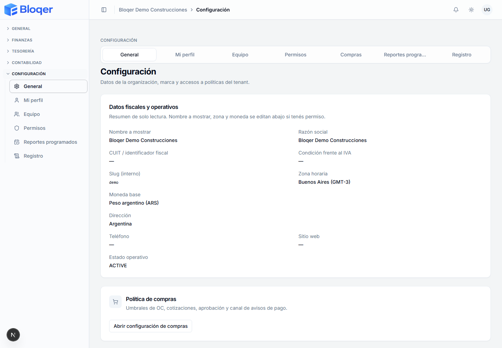

*Configuración + zona horaria.*

### 1.3a Registro de actividad

- **Ruta:** Configuración → **Registro** → `/configuracion/registro` (solo OWNER/ADMIN).
- Lista quién hizo qué, sobre qué entidad y cuándo.
- **Fechas y horas** en la zona de la empresa (§1.3), no en UTC del servidor ni en la zona del navegador. El detalle al hacer click debe coincidir con la columna Fecha.
- Exports CSV/PDF usan la misma zona (el encabezado CSV indica la zona, ej. `Fecha (Buenos Aires (GMT-3))`).

### 1.4 Notificaciones (campana, inbox, alertas y emails) — D-054 / D-091 / D-094

Las notificaciones **no** tienen ítem en el menú lateral: se usan desde la **campana del encabezado**.

**Reportes de la empresa ([D-098]):** menú General → **Reportes** → `/reportes`. Las cards están agrupadas en **Financieros** (rentabilidad multi-obra, aging CxC/CxP, flujo de caja, GG por proyecto) y **Operativos** (portafolio, compras multi-obra, inventario). Los reportes de una obra siguen en Planificación → Reportes dentro del proyecto.

| Superficie | Ruta / comportamiento |
|------------|------------------------|
| **Campana** | Dropdown con las **últimas 5** no archivadas; badge solo si hay no leídas; pie **Ver todas** → `/notificaciones`. Polling cada **30 s** (pestaña visible); al abrir el dropdown se refresca. |
| **Inbox** | `/notificaciones` — filtros Todas / No leídas / Leídas / Archivadas; **Marcar todas como leídas**; marcar como no leída; archivar. |
| **Alertas operativas** | `/notificaciones/alertas` — solo `OWNER`/`ADMIN`: AR vencida, AP vencida, stock negativo, certificaciones aprobadas sin factura, uploads pendientes, compras demoradas (SLA), OC entrega vencida, SC fecha requerida vencida, OC recibida sin factura + card **Última actividad**. Cron diario **12:00 UTC**, dedup 7 días por tipo/entidad/recipient. Cada alerta genera **campana + email** (best-effort) al destinatario resuelto por permiso; los emails se loguean como `OPERATIONAL_ALERT` y aparecen en `/notificaciones/emails?emailType=OPERATIONAL_ALERT`. |
| **Emails enviados** | `/notificaciones/emails` — historial (NOTIFICATION, OPERATIONAL_ALERT, REPORT_*). |

**Quién las recibe**

- Destinatarios primarios y/o por permiso del evento, con **CC siempre a OWNER/ADMIN** activos (salvo exclusiones del actor).
- **Excepción anti-ruido:** `CERTIFICATION_APPROVED` llega al creador ∪ OWNER/ADMIN (no se difunde a todo quien tenga VER certificaciones).
- **Libro de obra ([D-091]):** al **enviar** un parte → campana + email a OWNER/ADMIN y a miembros del **Equipo de obra** que puedan aprobar (PM); al **devolver** o **aprobar** → autor del parte ∪ OWNER/ADMIN. Ver §8.1.
- **Compras ([D-094]):** SC enviada → campana a quien **aprueba** SC/OC (no a todo el que puede cotizar: un PM la ve en **Pendientes** aunque no le llegue ese aviso). OC aprobada → origen + quien puede confirmar. OC confirmada → quien puede **recibir** con CTA **Registrar recepción** (abre el formulario); el origen solo informativo ve la ficha de la OC. CxP **Listo para pagar** sigue solo en campana (no en el globo de Pendientes).
- Cada usuario tiene su propia fila: marcar leída **no** afecta la copia de otro.
- Compras (SC/OC), CxP/CxC, libro de obra y reportes: el **asunto** lleva `[organización]` y el cuerpo identifica proyecto, contraparte y actor cuando aplica. Invitaciones al equipo muestran organización, quién invitó y roles. Útil si el mismo usuario es OWNER/ADMIN de más de un workspace.

> **Montos en notificaciones:** saldos y montos se muestran a **2 decimales** (D-053), igual que en el resto de la UI.

<!-- capture:04 campana-abierta -->
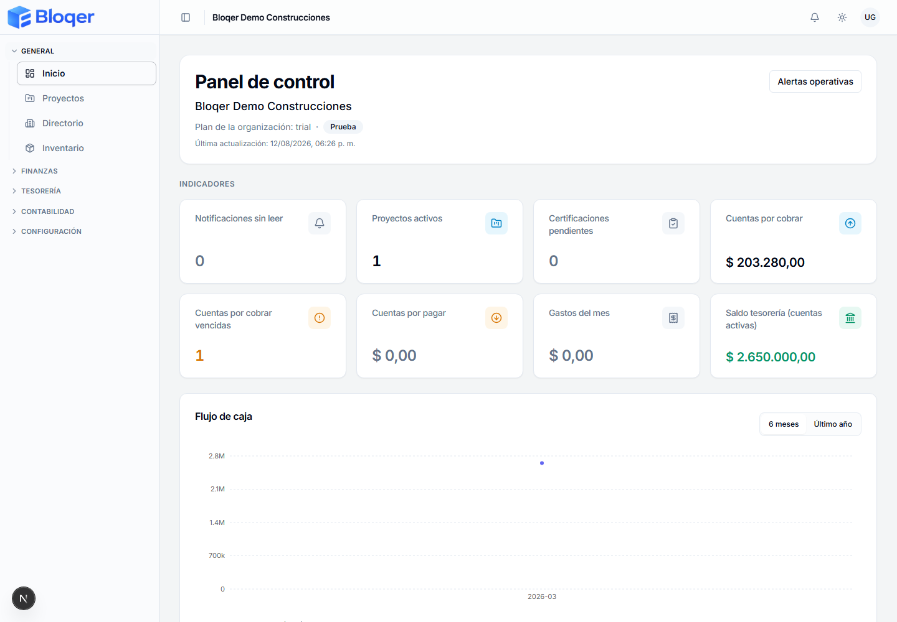

*Campana abierta.*

---

## 2. Usuarios, roles y permisos (nivel empresa)

### 2.1 Alta de usuarios

- **Ruta:** `/configuracion/equipo` → **Invitar** (`/configuracion/equipo/invitar`).
- El sistema envía un email con un enlace a **`/invitaciones/aceptar`**. El asunto va como `[organización] Invitación a Bloqer` y el cuerpo indica quién invitó y los roles. El token de invitación **no queda visible en la URL** de la pantalla de aceptación (se guarda en cookie httpOnly al hacer clic en el enlace); no hay que copiar/pegar tokens a mano.
- Si el invitado **aún no tiene cuenta**, primero se registra / inicia sesión; al volver a aceptar, la cookie sigue vigente hasta que acepte o expire.
- Tras aceptar, queda como miembro con uno o más roles, anclado a la empresa del tenant cuando hay una sola razón social (no hay que elegirla).
- Gestión de cada miembro: `/configuracion/equipo/[membershipId]`.
- **Tenant suspendido:** no se puede aceptar una invitación a una empresa inactiva; el mensaje lo indica en pantalla.

<!-- capture:05 invitar-usuario -->
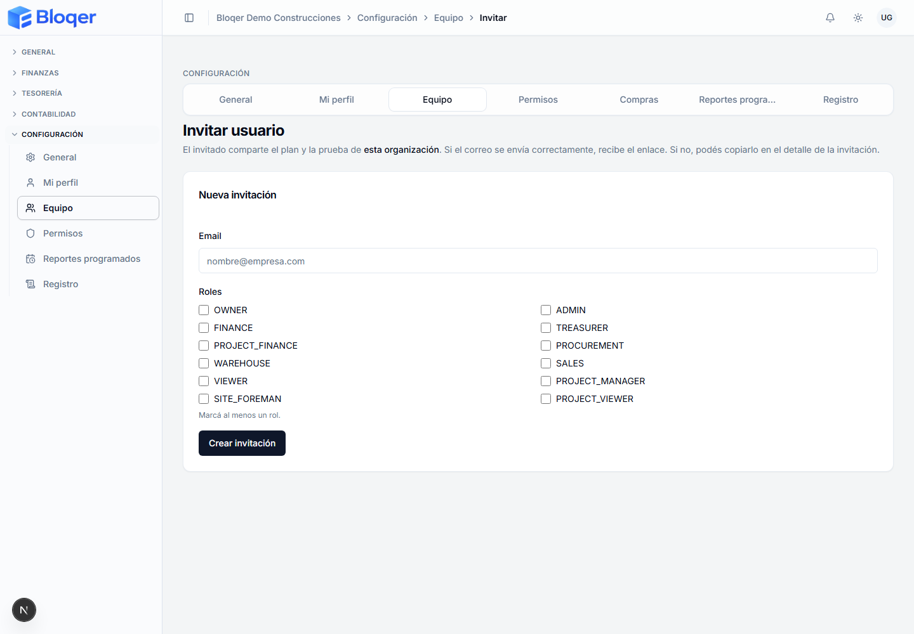

*Invitar usuario.*

<!-- capture:06 aceptar-invitacion -->
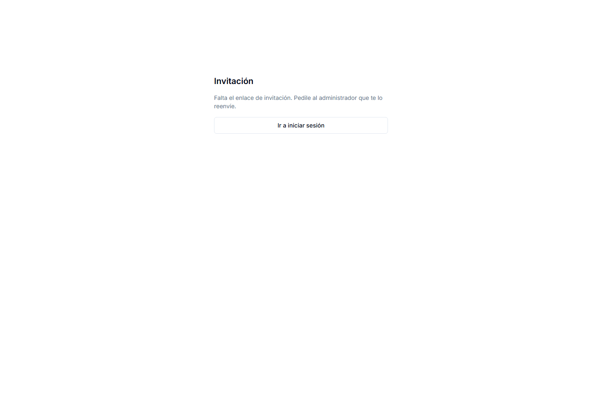

*Aceptar invitación.*

### 2.2 Roles disponibles (enum `UserRole`)

| Ámbito | Roles |
|--------|-------|
| Empresa | `OWNER`, `ADMIN`, `FINANCE`, `TREASURER`, `PROJECT_FINANCE`, `PROCUREMENT`, `WAREHOUSE`, `SALES`, `VIEWER` |
| Proyecto | `PROJECT_MANAGER`, `SITE_FOREMAN`, `PROJECT_VIEWER` |

- **Los roles son fijos** (no se crean roles personalizados). En Equipo se muestran como `PROJECT_MANAGER (Jefe de obra)`.
- Un usuario puede tener **varios roles**; sus permisos efectivos son la **unión** de todos.

### 2.3 Modelo de permisos

- Acciones jerárquicas: **VER < EDITAR < APROBAR** sobre cada módulo.
- **Ruta:** `/configuracion/permisos` muestra la matriz de permisos. **Es una vista de solo lectura** (informativa); no se editan asignaciones desde ahí. Un banner lo aclara y remite a **Equipo** para asignar roles. Los grupos de módulos empiezan **replegados**; abrí el que quieras consultar.
- En la matriz, algunos módulos aparecen como **no disponibles en esta versión** (p. ej. contratos formales, órdenes de cambio, RFIs, impuestos dedicados): no hay pantallas operativas. **Conciliación bancaria** y **cierre de períodos** **sí** están operativos (ver §4.2 y §15.3).
- La autorización se aplica **también en el backend** (servicios), no solo en la interfaz.

<!-- capture:07 matriz-de-permisos-solo-lectura -->
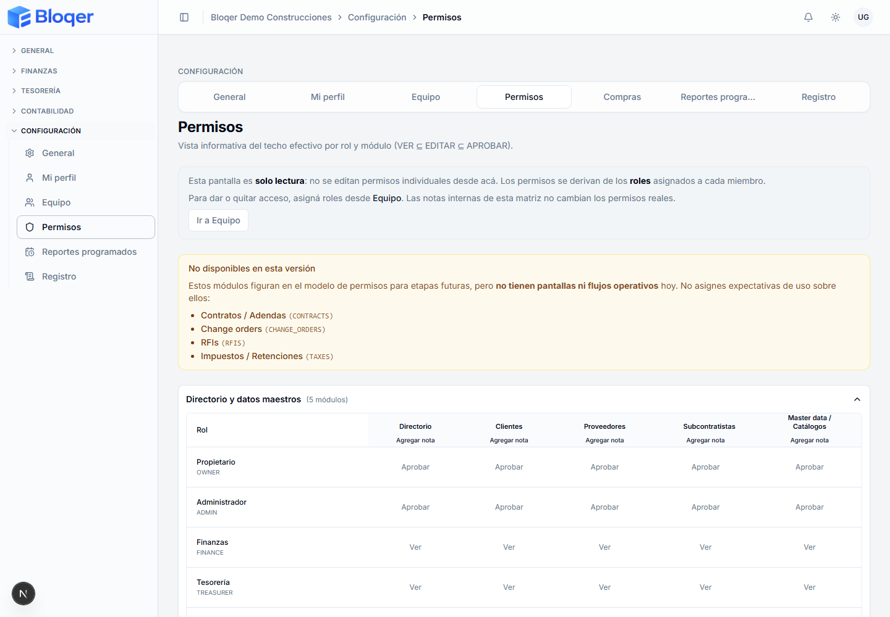

*Matriz de permisos (solo lectura).*

### 2.4 Reglas especiales

- Cierre de período y transferencia de empresa (tenant) están restringidos a `OWNER`/`ADMIN`.
- La **rentabilidad neta consolidada** es visible solo para `OWNER`/`ADMIN`; los demás ven rentabilidad **bruta**.

### 2.5 Company tools vs project tools (finanzas) — D-056

Bloqer separa herramientas de **empresa** y de **proyecto** (estilo Procore):

| Ámbito | Roles típicos | Qué ven |
|--------|---------------|---------|
| **Company finance** | `OWNER`, `ADMIN`, `FINANCE`, `TREASURER`, `VIEWER` | Menú Finanzas / Tesorería / Contabilidad de empresa; CxC/CxP/GG corporativos; saldos de caja |
| **Project finance / operación** | `PROJECT_MANAGER`, `PROCUREMENT`, `SALES`, `PROJECT_FINANCE`, etc. | Finanzas **dentro de la obra** (tablero, CxC/CxP de proyecto, facturas, compras); **sin** hub `/finanzas`, tesorería ni GL de empresa |

- **`FINANCE`** = controller: caja + AR/AP + contabilidad/impuestos (`APPROVE` GL).
- **`TREASURER`** = caja/bancos/cobros/pagos (`APPROVE` tesorería; `EDIT` AR/AP; `VIEW` contabilidad; sin `APPROVE` GL).
- **`PROJECT_FINANCE`** = contador de obra: AR/AP/gastos del **proyecto**; sin company hub ni tesorería/GL de empresa.

> **Error a evitar:** dar a un PM o a Compras un rol de company finance “para que vean más”: verán saldos y hub corporativo. Si solo necesitan la obra, usá roles de proyecto / `PROJECT_FINANCE`.

---

## 3. Directorio (nivel empresa)

- **Ruta:** `/directorio` (alta en `/directorio/nuevo`; se puede preseleccionar rol con `?role=CLIENT` / `SUPPLIER` / `EMPLOYEE` / etc.).
- Un **contacto único** puede tener **uno o varios roles**. No dar de alta la misma persona dos veces.
- Se debe crear el **cliente** antes de crear el proyecto que lo referencia.

| Rol en pantalla | Para qué | Cómo se le paga |
|-----------------|----------|-----------------|
| **Cliente** | Mandante de la obra | No se le paga; se le cobra (CxC) |
| **Proveedor** | Quien nos factura o vende (incluye monotributista) | OC y/o factura de proveedor |
| **Subcontratista** | Paquete de ejecución en una obra | **Subcontrato** → certificar → factura → CxP. **No** es una OC |
| **Empleado** | Personal interno | Gasto **sin OC**: sueldo como costo o reintegro ([D-089]) |
| **Otro** | Residuo / no operativo | No entra en OC ni en el desplegable de gasto |

**Selectores de contacto.** En alta de obra, OC, cotizaciones, facturas de venta, subcontratos, transacciones y mano de obra del parte, el buscador lista **todos** los contactos activos del rol que corresponde (no recorta a 20). Cada opción muestra **razón social** y, si es distinta, el **nombre fantasía** entre paréntesis. Se filtra por cualquiera de los dos nombres (sin CUIT). El listado de `/directorio` sigue paginado y tiene su propia búsqueda.

**Convención Argentina**

- Relación de dependencia / reintegro → rol **Empleado**. No hace falta marcar **Proveedor** solo para pagarle.
- Monotributista que emite factura, aunque “parezca empleado” → rol **Proveedor** (y **Empleado** si también es de la casa).
- Quien vende materiales **y** ejecuta un paquete → **Proveedor** + **Subcontratista**.

<!-- capture:08 directorio-contacto-con-roles -->
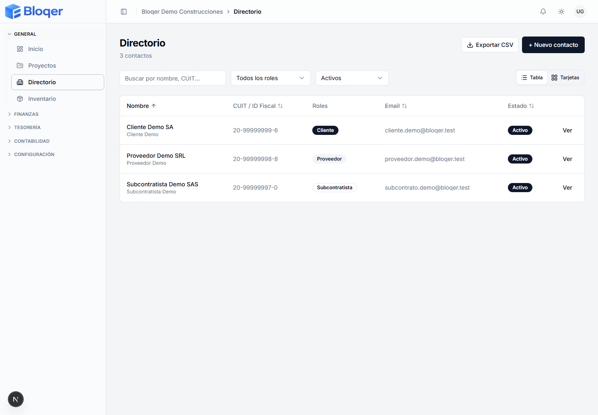

*Directorio / contacto con roles.*

---

## 4. Tesorería (nivel empresa)

Configurar tesorería **antes** de operar cobranzas y pagos.

### 4.0 Pantallas (subnav)

| Etiqueta | Ruta | Para qué |
|----------|------|----------|
| Resumen | `/tesoreria` | Saldos por cuenta/moneda y atajos |
| Cuentas | `/tesoreria/cuentas` · `/nueva` · `/[id]` | Alta de banco/caja/billetera; **extracto** (ledger con saldo corrido) en el detalle; CTAs **Transferir entre cuentas** e historial |
| Flujo de caja | `/tesoreria/flujo-caja` | Ingresos y egresos por período |
| **Conciliación** | `/tesoreria/conciliacion` | Emparejar extracto bancario vs movimientos del sistema (§4.2) |

Rutas auxiliares (sin ítem de menú; se llegan desde Cuentas):

| Ruta | Para qué |
|------|----------|
| `/tesoreria/transferencias` | Historial de transferencias internas (par origen/destino) |
| `/tesoreria/transferencias/nueva` | Alta de transferencia entre cuentas propias (`?fromAccountId=` prellena origen) |
| `/tesoreria/movimientos` | **Redirect** legacy → detalle de cuenta (si hay `accountId`) o listado de Cuentas |

- **Extracto = detalle de cuenta:** abrí **Tesorería → Cuentas → [cuenta]**. Ahí ves el ledger (Confirmado / Conciliado), export CSV/PDF y atajos a transferir / conciliar / ajuste manual. La **descripción** se recorta; clic abre el detalle completo (importe, origen, proyecto, contraparte).
- **Transferencia ≠ pago:** **Transferir entre cuentas** mueve plata entre **cuentas propias** (banco ↔ caja ↔ otro banco). Un **pago a un proveedor** (aunque el método diga «Transferencia», [D-074]) se registra en Finanzas → **Transacciones** / CxP — no es una transferencia interna.
- **Movimientos operativos:** se generan **automáticamente** al cobrar (`INFLOW`) y pagar (`OUTFLOW`); se pueden **anular** con traza (nunca se borran), salvo que estén **conciliados** (hay que desemparejar antes).
- **Transacciones vs extracto:** Finanzas → **Transacciones** es la caja operativa con **terceros** (sin transferencias internas, [D-048]) más el alta (**Registrar transacción**). Tesorería → **Cuentas → detalle** es el extracto por cuenta (incluye internas, saldo corrido, asiento, conciliación).
- En cobranzas y pagos podés indicar **método de liquidación** (Efectivo, Transferencia, Cheque, Tarjeta, Otro) y referencia opcional ([D-074]). Eso **no** crea un `InternalTransfer`.
- **Fondos insuficientes:** un **pago** no puede dejar la cuenta en saldo negativo (igual que transferencias). El sistema muestra el disponible y bloquea.

<!-- capture:09 tesoreria-con-subnav-incl-conciliacion -->
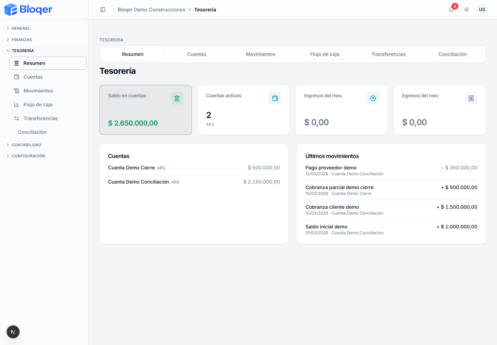

*Tesorería con subnav (incl. Conciliación).*

<!-- capture:10 ledger-de-movimientos-con-estado -->
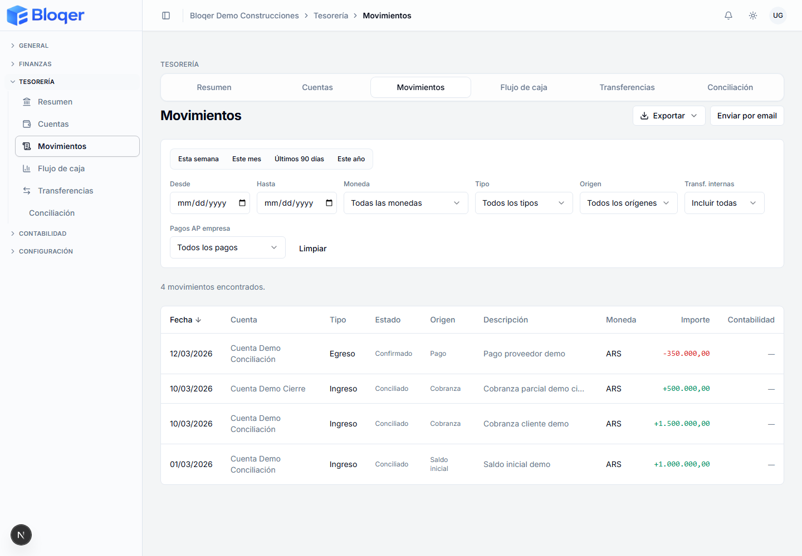

*Ledger de movimientos con Estado.*

> **Terminología correcta:** tipos de movimiento = `INFLOW` (ingreso), `OUTFLOW` (egreso), `TRANSFER_IN`, `TRANSFER_OUT`, `ADJUSTMENT` (ajuste). Estados de movimiento relevantes: **Confirmado** (`CONFIRMED`) y **Conciliado** (`RECONCILED`). Un movimiento conciliado **no** se anula ni se edita hasta desemparejarlo.

> **Limitación actual (importante):** cobros, pagos y transferencias internas operan en **una sola moneda por operación**. **No hay conversión de moneda dentro de tesorería.** Cada documento guarda su moneda, tipo de cambio y monto en pesos, pero el movimiento de caja no convierte.

---

### 4.1 Montos y decimales (regla de trabajo diaria) — D-053

Para operadores: **no hace falta pensar en “escalas de base de datos”**. En pantalla y al cargar montos de dinero:

| Qué | Cómo se ve / se carga |
|-----|------------------------|
| **Dinero** (totales, saldos, pagos, cobros, caja) | Siempre **2 decimales** con miles (ej. `1.234,56` o `$ 1.200.000,00`). Redondeo comercial half-up. |
| **Tipo de cambio** | Hasta **6** decimales. |
| **Cantidades y precios unitarios** | En pantalla **2 decimales** con miles (ej. `1,00` / `1.200.000,00`). |
| **%** (IVA, descuento comercial) | En pantalla **2 decimales** (ej. `0,00` o `10,50`). |

- En **cualquier** formulario de dinero, cantidad, precio unitario o %, usá coma decimal y punto de miles (`1.200.000,00`). Enteros (días, cotizaciones, personas) se cargan sin decimales.
- Al **pagar o cobrar el total**, usá el saldo que muestra el sistema (o el default del formulario). El servidor aplica el saldo almacenado; no reescribás a mano un redondeo distinto.
- Si la cuenta no tiene fondos suficientes para el pago, la operación **se rechaza** con el disponible.

---

### 4.2 Procedimiento — Conciliación bancaria ([D-075] · [D-076] · [D-079] · [D-080])

Cuadrá el extracto del banco (o archivo CSV/OFX) con los movimientos que Bloqer ya tiene en la cuenta.

**Quién:** roles con permiso de conciliación (típicamente `FINANCE`, `TREASURER`, `OWNER`, `ADMIN`). Sin permiso de edición verás el listado / detalle en solo lectura.

**Estados de la sesión**

| Estado UI | Técnico | Significado |
|-----------|---------|-------------|
| Borrador | `DRAFT` | Sesión creada; aún no se empezó a emparejar en serio |
| En progreso | `IN_PROGRESS` | Se cargan líneas y se emparejan |
| Cerrada | `CLOSED` | Conciliación cerrada; matches congelados (reabrir con motivo) |
| Anulada | `CANCELLED` | Sesión descartada |

#### Pasos

1. Ir a **Tesorería → Conciliación** (`/tesoreria/conciliacion`).
2. **Nueva conciliación** (`/tesoreria/conciliacion/nueva`): elegir **cuenta**, rango de fechas y **saldos inicial/final del extracto**.
3. Abrir la sesión (`/tesoreria/conciliacion/[id]`). Si está en borrador, **Iniciar** (pasa a En progreso).
4. Cargar el extracto de una de estas formas:
   - **Importar CSV de extracto** (columnas típicas: fecha, descripción, monto, dirección CREDIT/DEBIT, referencia).
   - **Importar OFX / QFX** (archivo del home banking).
   - Agregar **líneas manuales** una a una.
5. En el workspace de dos columnas: seleccionar una línea de extracto + un movimiento candidato del sistema → **Emparejar seleccionados**. El movimiento pasa a estado **Conciliado**.
6. Si hay una línea de extracto sin movimiento en Bloqer: **Crear movimiento** desde la línea (ajuste operativo + empareje).
7. Cuando el resumen cuadra (saldo extracto = saldo sistema en el rango): **Cerrar conciliación**.
8. Si hace falta corregir después del cierre: **Reabrir sesión** (motivo obligatorio, queda auditado) → vuelve a En progreso; los matches se conservan.
9. Export CSV del listado: desde la pantalla de conciliación / reporte asociado.

> **Errores frecuentes**
> - Intentar **cancelar un pago o cobranza** cuyo movimiento está **Conciliado** → el sistema lo bloquea: primero desemparejá en la sesión abierta (o reabrí).
> - Dos sesiones abiertas a la vez sobre la misma cuenta → el sistema lo impide (una sesión abierta por cuenta).
> - Cerrar el mes contable (§15.3) **antes** de terminar la conciliación del mes → no podrás crear/anular movimientos de esas fechas hasta reabrir el período.

<!-- capture:11 listado-de-conciliaciones -->
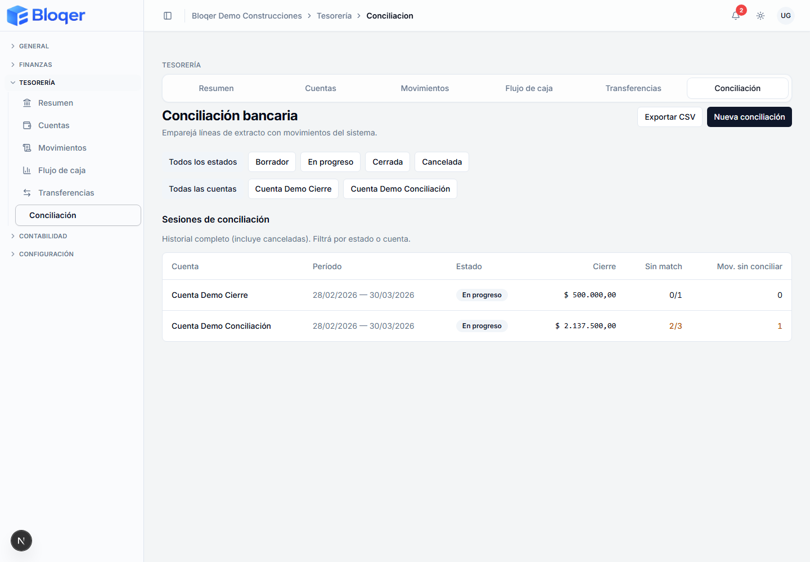

*Listado de conciliaciones.*

<!-- capture:12 nueva-conciliacion-alta -->
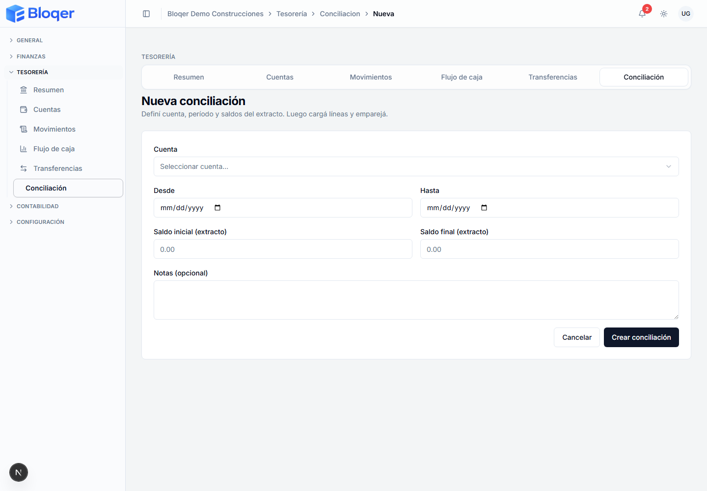

*Nueva conciliación (alta).*

<!-- capture:13 workspace-de-empareje-dos-columnas -->
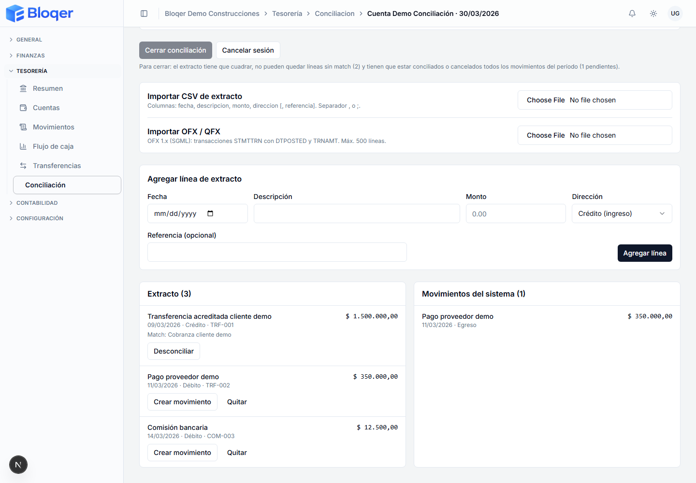

*Workspace de empareje (dos columnas).*

<!-- capture:14 importar-csv-ofx -->
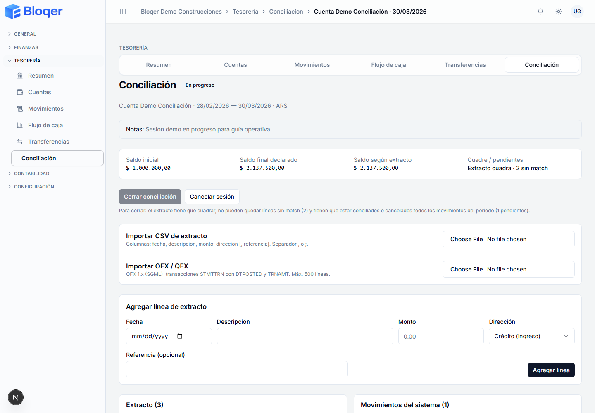

*Importar CSV / OFX.*

<!-- capture:15 cerrar-conciliacion -->
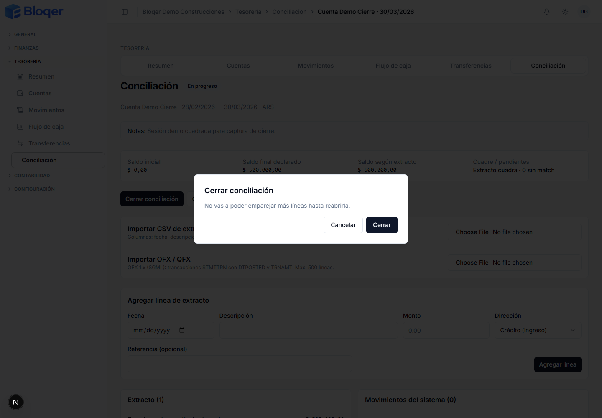

*Cerrar conciliación.*

---

### 4.3 Procedimiento — Ajuste manual de cuenta

Para diferencias de caja/banco que no vienen de un cobro/pago (cargos bancarios, redondeos, correcciones operativas):

1. **Tesorería → Cuentas** → abrir la cuenta activa.
2. Pulsar **Ajuste manual** (`/tesoreria/cuentas/[accountId]/ajuste`).
3. Completar fecha, monto (2 decimales), sentido (ingreso/egreso de ajuste) y **motivo**.
4. **Registrar ajuste** → genera un movimiento `ADJUSTMENT` **Confirmado** (impacta saldo).

> El ajuste queda sujeto a **período abierto** (§15.3) y puede emparejarse luego en conciliación si aparece en el extracto.

<!-- capture:16 ajuste-manual-de-cuenta -->
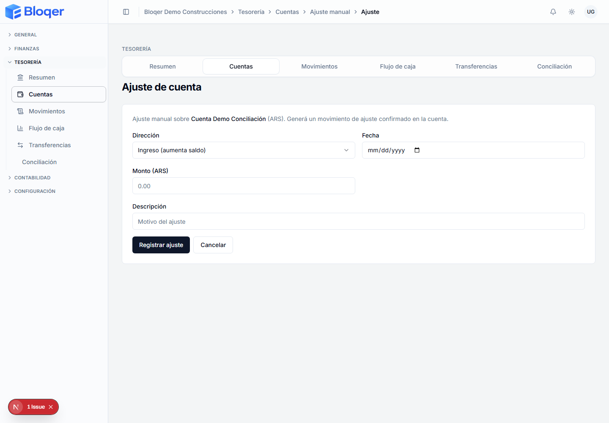

*Ajuste manual de cuenta.*

<!-- capture:17 detalle-de-cuenta-con-cta-ajuste-manual -->
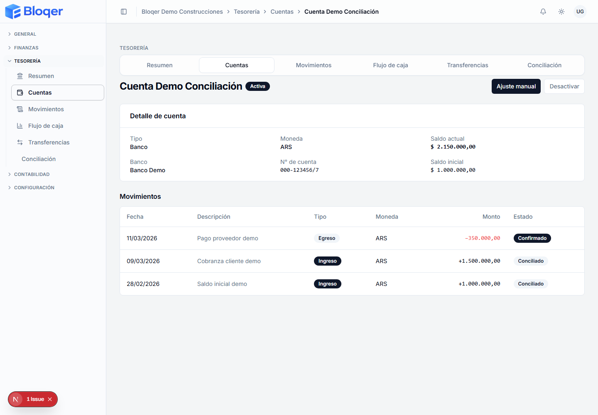

*Detalle de cuenta con CTA Ajuste manual.*

---

## 5. Crear y operar un proyecto (nivel proyecto)

En el listado **Proyectos** (`/proyectos`) la vista por defecto es **Tarjetas** (dos por fila en desktop). Toda la tarjeta abre el proyecto. El toggle **Tabla / Tarjetas** cambia la vista; en tabla, **Ver**, o clic en el **código** o el **nombre**.

### 5.1 Procedimiento — Alta de proyecto

**Prerrequisitos**

1. En `/directorio`, existir al menos un contacto con rol **Cliente** activo (si no, el formulario lo dice y no deja elegir cliente).
2. Permiso para crear proyectos (`EDIT` / alta en módulo Proyectos).

**Pasos**

1. Menú empresa → **Proyectos** → `/proyectos` → **Nuevo proyecto** (o ir a `/proyectos/nuevo`).
2. Completar el formulario:
   - **Código \*** (ej. `PRY-2026-001`)
   - **Tipo \***: **Privado** (`PRIVATE`) o **Público** (`PUBLIC`)
     - Público: techo estricto **100%** en certificaciones.
     - Privado: permite exceder 100% con **nota obligatoria**.
   - **Nombre \***
   - **Cliente \*** (buscador de contactos Cliente: razón social o nombre fantasía)
   - Ubicación / país (default AR) y fechas contractuales si aplica (metadata; **no** reemplazan al cronograma)
3. Pulsar **Crear proyecto**. El proyecto queda asociado a la empresa del tenant (si hay una sola razón social); no hay selector de empresa en el alta.
4. El sistema abre el **Resumen** de la obra (`/proyectos/[id]`). El estado inicial es `DRAFT`.
5. En el resumen / acciones de ciclo de vida, pulsar **Activar** (**Activar obra**) → estado `ACTIVE`. Sin activar, la operación diaria queda limitada.

**Estados posteriores**

| Acción UI | Estado |
|-----------|--------|
| Pausar | `ON_HOLD` |
| Reactivar | `ACTIVE` |
| Completar | `COMPLETED` |
| Cancelar | `CANCELLED` (no destructiva: conserva datos) |

<!-- capture:18 alta-de-proyecto -->
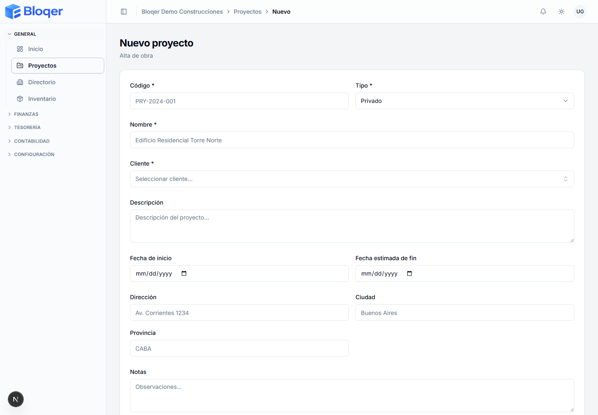

*Alta de proyecto.*

### 5.2 Menú del proyecto (rutas reales)

Al entrar a la obra, el sidebar muestra (según permisos y módulos):

| Sección | Ítems (etiqueta → ruta relativa) |
|---------|----------------------------------|
| Resumen | Resumen → `/proyectos/[id]` |
| Planificación | Presupuesto → `/presupuestos` · Cronograma → `/cronograma` · **EDT y costos** → `/control-costos` · Reportes → `/reportes` |
| Operación | Libro de obra → `/libro-obra` · Certificaciones → `/certificaciones` · **Materiales** → `/materiales` · **Mano de obra** → `/mano-obra` · **Equipos** → `/equipos` · Inventario → `/inventario` · Consumos → `/consumos` · Documentos → `/documentos` |
| Compras | **Tablero de compras** → `/compras` · **Solicitudes de compra** → `/solicitudes-compra` · **Órdenes de compra** → `/ordenes-compra` · **Recepciones** → `/recepciones` · **Subcontratos** → `/subcontratos` |
| Finanzas del proyecto | **Tablero de finanzas** → `/finanzas` · Flujo de caja → `/flujo-caja` · CxP → `/cuentas-por-pagar` · CxC → `/cuentas-por-cobrar` · Facturas proveedor → `/facturas-proveedor` · Facturas emitidas → `/facturas` |
| Administración | Configuración → `/editar` (datos de la obra + **Equipo de obra** al final) |

> En UI, **EDT** = Estructura de Desglose de Trabajo (WBS técnico = `WbsNode`).  
> **Recepciones**, **Órdenes de compra** y **Subcontratos** viven bajo **Compras** (un solo caminito operativo). Comprometido sigue siendo el concepto de dinero (OC confirmada / subcontrato activo), no una sección del menú. **Consumos** viven bajo **Operación**.

<!-- capture:19 menu-del-proyecto-compras-operacion -->


*Menú del proyecto (Compras + Operación).*

---

## 6. Presupuesto, EDT y APU (nivel proyecto)

> En código y modelo de datos la estructura sigue siendo **WBS** (`WbsNode`); en pantalla y en esta guía se dice **EDT**.

**Ruta base:** Planificación → **Presupuesto** → `/proyectos/[id]/presupuestos`

### 6.0 Procedimiento — Crear presupuesto

1. En el listado, **Nuevo presupuesto** → `/presupuestos/nuevo`.
2. Completar:
   - **Nombre del presupuesto \***
   - **Moneda** (default ARS)
   - **Parámetros económicos:** Gastos generales (%) · Costo financiero (%) · Utilidad (%) · Impuestos (%)
   - Opcional: precarga / **Importar EDT** en el mismo alta (sección de preload del formulario)
3. Guardar. Queda en `DRAFT` y abre el detalle `/presupuestos/[budgetId]`.

### 6.1 Estructura — capítulo vs partida vs insumo (D-057)

| Concepto | Tipo | Qué lleva | Para qué sirve |
|----------|------|-----------|----------------|
| **Capítulo** | `GROUP` | Solo rollup de totales (sin unidad/cantidad operativa) | Organizar el cómputo |
| **Partida certificable** | `ITEM` hoja | Unidad, cantidad, **APU** (`CostItem`) | Certificar, comprar e imputar costos |
| **Insumo** | Línea APU (`CostAnalysisLine`) | MAT / LAB / EQP / SUB / OTHER bajo la partida | Composición del costo; **nunca** hijo en el árbol EDT |

- **Anti-patrón:** hierros, mallas o cuadrillas como hijos EDT (`4.1.1`) bajo una partida medible. Los insumos van en el **APU de la partida** (`4.1`).
- Subdividir un `ITEM` convierte al padre en `GROUP`: sirve para partir **alcance de obra**, no para desglosar BOM.

### 6.1a Procedimiento — Cargar la EDT

**Opción A — Importar**

1. En el detalle del presupuesto (`DRAFT`), **Importar EDT**.
2. Diálogo **Importar estructura EDT**: subir Excel/CSV (columna A = numeración, B = nombre; multi-rubro si el archivo trae prefijos).
3. Confirmar **Importar**.

**Opción B — Manual**

1. Agregar capítulos (`GROUP`) e ítems hoja (`ITEM`) desde el árbol (acciones del nodo: p. ej. **Agregar ítem**).
2. En cada partida hoja: unidad + cantidad + guardar (**Guardar** en el panel del ítem).
3. Código único por presupuesto.

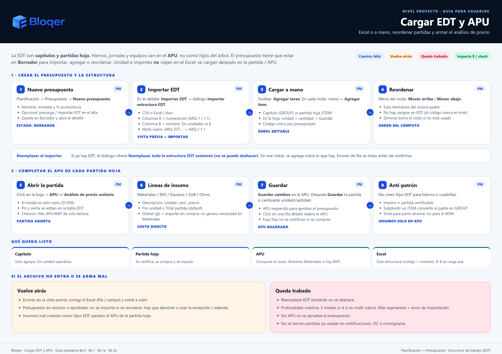

*Cargar EDT (Excel o a mano), reordenar y completar el APU.*

### 6.1b Procedimiento — Completar el APU de una partida

1. En la tabla EDT, abrir la partida hoja (panel / click) → sección **Análisis de precio unitario (APU)** o modal **APU — Análisis de precio unitario**.
2. El modal muestra **solo costo** (D-058): no edita PU ni total de venta (eso va en la tabla EDT, base **Venta**).
3. Por categoría (Materiales / Mano de obra / Equipos / Subcontratos / Otros), agregar líneas con:
   - Descripción, unidad, cantidad/coeficiente, precio
   - Modo de carga: **Por unidad** o **Total partida** (default al agregar: Total partida — “necesito 500 un a $X”; Bloqer calcula el aporte unitario y guarda necesidad para Materiales)
   - **Importes sin compra:** unidad **Global** (`gl`) + cant. 1 (o N) + precio = monto; **no** genera necesidad en el tablero Materiales
4. **Guardar cambios**.
5. En la EDT, expandir la partida (chevron) para ver filas de detalle de solo lectura (`APU·MAT`, etc.) (D-059). Click en una fila detalle → reabre el APU de la **partida**. Esas filas **no** se certifican ni se compran: siempre contra la partida hoja.

### 6.1c Vista EDT (toolbar) — D-058 · D-059 · D-060

- **KPIs de cabecera:** Costo directo total · Precio de venta total · Margen.
- **Toolbar:**
  - Base **Costo** | **Venta**
  - Escala **Compacto** | **Desglose** (desglose por categoría solo en Costo)
  - Toggle **Unitario** (agrega columnas `/u`; los totales siempre se muestran)
  - Toggle **Incidencia** `%` (peso de la fila sobre TOTAL GENERAL)
- **Exports** CSV/XLSX/PDF: solo filas EDT (sin filas APU); respetan el modo activo.

<!-- capture:20 edt-con-insumos-expandibles -->
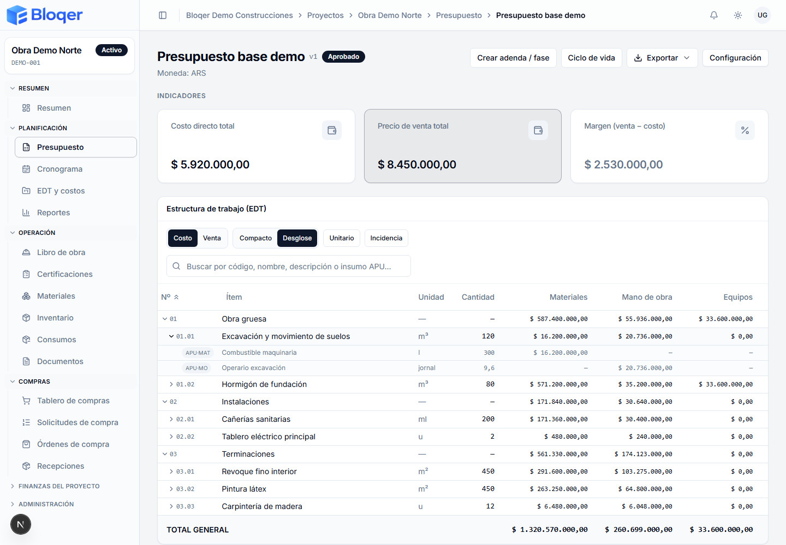

*EDT con insumos expandibles.*

### 6.2 Procedimiento — Aprobar el presupuesto

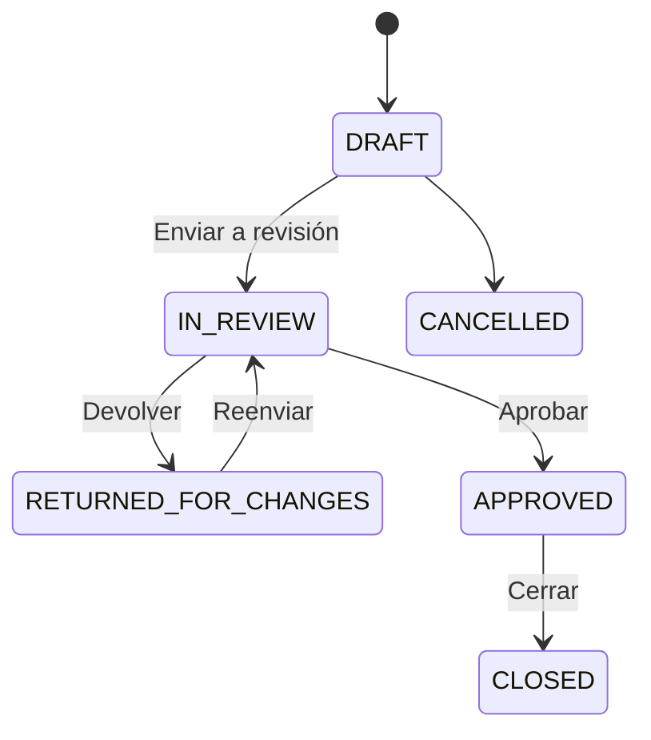
```mermaid
stateDiagram-v2
  [*] --> DRAFT
  DRAFT --> IN_REVIEW: Enviar a revisión
  IN_REVIEW --> RETURNED_FOR_CHANGES: Devolver
  RETURNED_FOR_CHANGES --> IN_REVIEW: Reenviar
  IN_REVIEW --> APPROVED: Aprobar
  APPROVED --> CLOSED: Cerrar
  DRAFT --> CANCELLED
```

1. Con la EDT y APU listos en `DRAFT`, pulsar **Enviar a revisión** → `IN_REVIEW` (economía bloqueada).
2. Un aprobador revisa y pulsa **Aprobar presupuesto** → `APPROVED` (economía congelada).
3. Opcional: **Cerrar** → `CLOSED` (base contractual de presentación).
4. Si hacen falta correcciones en revisión: devolver → `RETURNED_FOR_CHANGES` → editar → reenviar.

| Estado | Qué permite |
|--------|-------------|
| `DRAFT` | Editar estructura EDT, APU y precios |
| `IN_REVIEW` | Solo revisión; economía bloqueada |
| `RETURNED_FOR_CHANGES` | Correcciones y reenvío |
| `APPROVED` | Congelado por defecto; habilita certificaciones, Materiales y baseline de EDT y costos |
| `CLOSED` | Base contractual |
| `CANCELLED` | Anulado |

> **Hito:** con `APPROVED` o `CLOSED` se habilitan certificaciones al cliente, tablero Materiales (líneas MAT) y baseline de control de costos.  
> **Solo un** presupuesto `APPROVED` por proyecto a la vez.

**Excepción (OWNER/ADMIN):** si hace falta corregir un `APPROVED` (agregar partidas, APU, costos o venta), Configuración → **Políticas** → Presupuestos: habilitar el interruptor de la organización **y** el de la obra. Quien tenga permiso de editar presupuestos puede cambiar todo el presupuesto. Al terminar: **Congelar** en la obra (o deshabilitar el interruptor de la organización). Un `CLOSED` no entra: ahí se usa adenda.

<!-- capture:21 presupuesto-aprobado-edt -->
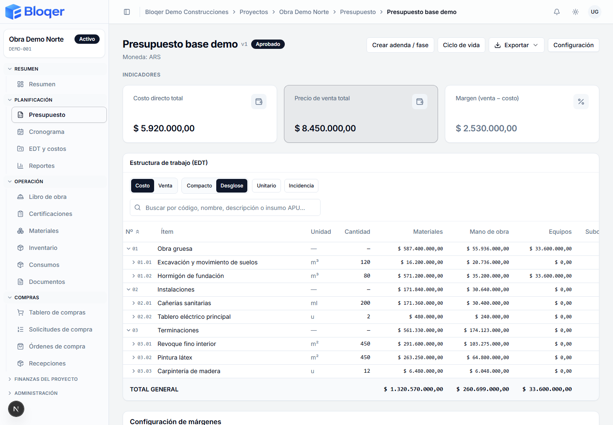

*Presupuesto aprobado / EDT.*

### 6.3 Adendas — limitación actual

- Cambio contractual hoy = **adenda operativa**: nuevo presupuesto con vínculo opcional `parentBudgetId` al APPROVED/CLOSED (UI: **Crear adenda / fase**). No copia la EDT sola.
- Al crear la adenda se **prellenan** los % económicos (GG, financiero, utilidad, IVA) y la moneda del presupuesto padre; son editables.
- El rótulo `v{n}` en UI es numeración de presentación, no versionado contractual.
- **Contratos, adendas y órdenes de cambio como entidades formales no están implementados** (ver §19).

---

## 7. Planificación: Cronograma (nivel proyecto)

**Ruta:** Planificación → **Cronograma** → `/proyectos/[id]/cronograma`

### 7.0 Procedimiento — Armar el cronograma

1. Abrir Cronograma. Vista por defecto: **Gantt** (`?view=gantt`). El eje de tiempo abre en **hoy** (no en el medio del rango); **Ir a hoy** vuelve a esa fecha. También: Calendario, Kanban, Tabla.
2. (Recomendado) **Importar desde presupuesto** → diálogo **Importar EDT al cronograma** → elegir presupuesto aprobado → **Importar**. Así las tareas nacen alineadas a la EDT.
3. Completar fechas en ítems **hoja** (no en contenedores: sus fechas se derivan; usar **Recalcular contenedores** en el Gantt si hace falta). En Gantt: arrastrar/redimensionar barras y **hitos**.
4. Crear ítems adicionales con **+ Tarea / hito** (`TASK` o `MILESTONE`). En **Ubicación**: *Colocar bajo* (capítulo o raíz) e *Insertar después de* (hermano). Si vinculás una partida EDT que ya tiene una tarea hoja, el sistema propone poner el ítem **justo debajo** (hermano, no hijo). El vínculo EDT **no** mueve la fila.
5. Reordenar: el botón **⋮** de cada fila en Gantt, Tabla o detalle (Subir / Bajar / Sangrar / Disminuir sangría). Si sangrás bajo una hoja con fechas, esa hoja pasa a contenedor (fechas derivadas); el sistema pide confirmación.
6. Dependencias: solo **Finish‑to‑Start (FS)** en la pestaña **Dependencias** del detalle (o botón **FS** en el Gantt). Violaciones = advertencias al guardar fechas, no bloqueos. Las flechas del Gantt son de solo lectura.
7. En cada tarea crítica: vincular nodos EDT (uno **primario**) desde el detalle — sin vínculo aparece el chip **Sin EDT** (no hay sync Real ni métricas de costo/cert). Los **hitos** no reciben % Real del libro aunque tengan EDT ([D-103]); se completan a mano o al **confirmar una recepción** de la misma EDT ([D-104]).
8. Filtrá por **Tipo** (Todos / Tareas / Hitos), **Estado** y **Solo atrasados**. **Leyenda de avances** está en esa misma barra. Los hitos se ven con color fijo (diamante) en el Gantt; las barras de tarea **atrasadas** también se pintan en rojo. En el sidebar del Gantt, **▾** colapsa capítulos (estado local del navegador); **Sin EDT** va junto al nombre; a la derecha quedan alineados días, **⋮** y **FS**.
9. Con EDT vinculada: chips **Entrega OC** (fecha prometida de OC confirmada) y **Recibido**; chip ámbar si la prometida es posterior al inicio de una tarea hermana con la misma EDT.
10. Revisar si aparece aviso de **baselineBudgetMismatch** (presupuesto base del cronograma ≠ el aprobado actual).
11. Las tareas **canceladas** están ocultas por defecto en las cuatro vistas; filtrá estado **Cancelado** para verlas.
12. **Exportar:** en escritorio, botón **Exportar** abre un diálogo. Elegí **Tabla**, **Gantt** o **Ambos**, y un lapso opcional (**Desde** / **Hasta**, o atajos Todo / Este mes / Este trimestre / Este año). El archivo respeta también los filtros de la pantalla (tipo, estado, solo atrasados y presupuesto). Sin fechas, el Gantt usa el rango de los ítems filtrados; con lapso, entran ítems que se solapan con ese período **y sus capítulos padre**. El PDF es apaisado y se parte en hojas según el contenido elegido: tabla de **fechas**, tabla de **avance/costos**, y/o Gantt (eje de tiempo a lo ancho + filas a lo largo). Cada hoja lleva empresa y obra. El Excel trae hoja **Tabla** (fechas `dd/mm/aaaa` reales) y/o hoja **Gantt** con celdas pintadas del mismo color que las barras.

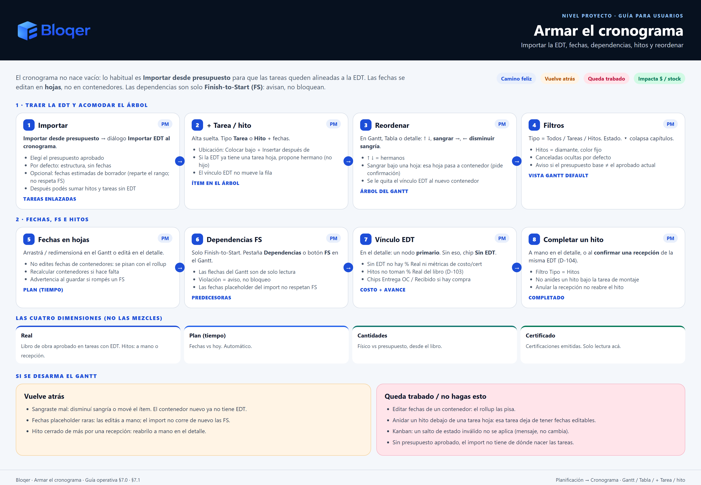

*Importar EDT, fechas, dependencias FS, hitos y reordenar.*

**Estados de ítem:** `PLANNED` · `IN_PROGRESS` · `BLOCKED` · `COMPLETED` · `CANCELLED`.

**Kanban:** solo transiciones permitidas (ej. Planificado → En curso / Bloqueado; En curso → Hecho / Bloqueado; hitos también Planificado → Hecho — [D-104]). Soltar en Planificado o Cancelado, o un salto inválido, muestra un mensaje y no cambia el estado. Para cancelar, usar el detalle de la tarea.

**Montos** en sidebar/tabla/detalle (comprometido, presupuesto, certificado): moneda del presupuesto base del cronograma.

<!-- capture:22 cronograma-gantt -->
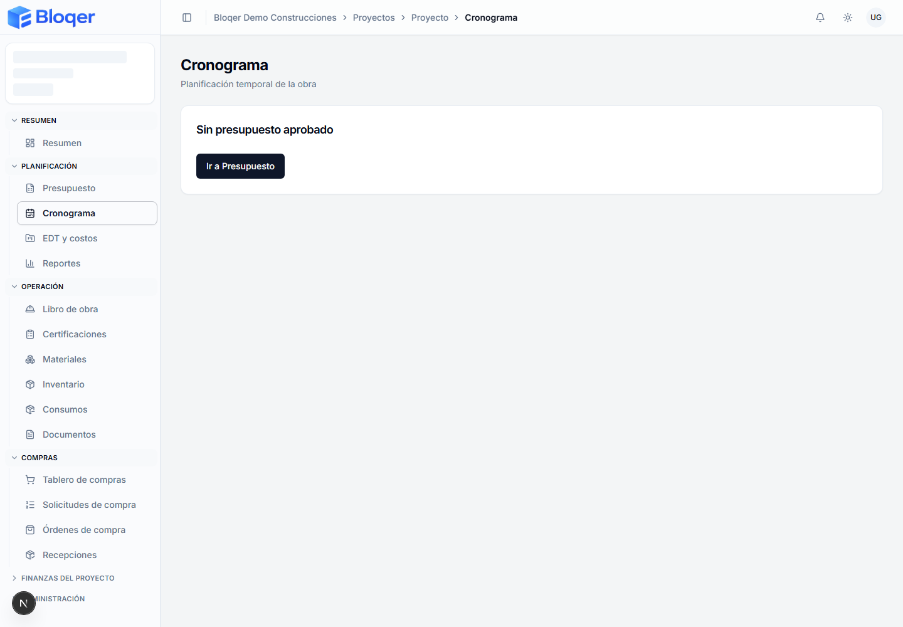

*Cronograma Gantt.*

### 7.1 Cuatro dimensiones de avance (no confundir)

En detalle de tarea / tabla / Gantt aparecen como **Real / plan t. / cant. / cert.** Pasá el mouse por el valor (o por el encabezado en la tabla) para ver qué significa cada uno. El detalle de la tarea abre con **Nombre**, **Planificación** y **EDT enlazado**; el avance y el presupuesto van debajo.

| Dimensión | Fuente | Quién la mueve |
|-----------|--------|----------------|
| **Real** | `ScheduleItem.progressPct` | Libro de obra **aprobado** en **tareas** con EDT primaria; en **hitos** ajuste manual del PM o **confirmación de recepción** de la misma EDT ([D-103]/[D-104]) |
| **Plan (tiempo)** | Fechas vs. hoy | Automático |
| **Cantidades** | Cantidades físicas vs. presupuesto | Libro de obra |
| **Certificado** | Certificaciones emitidas | Módulo Certificaciones (solo lectura en cronograma) |

En el Gantt: relleno oscuro de la barra = **Real**; franja/borde ámbar = **Cert.** Comprometido (compras / OC confirmadas) se ve en sidebar, tabla y bloque «Presupuesto vs real» del detalle cuando hay EDT vinculado.

---

## 8. Ejecución: Libro de obra, avances y consumos (nivel proyecto)

### 8.1 Procedimiento — Parte diario (libro de obra)

**Ruta:** Operación → **Libro de obra** → `/proyectos/[id]/libro-obra`

**Equipo de obra (avisos):** en **Administración → Configuración** (`/editar`), al final, card **Equipo de obra**. Ahí se asignan usuarios activos de la organización (etiqueta PM / Capataz / Otro). Eso **no** cambia permisos de acceso: solo define quién recibe campana + email cuando hay un parte pendiente. Pueden editar el roster quienes tienen permiso de **editar proyectos** (OWNER, ADMIN y PM de la organización; no el capataz). En el **Resumen**, si no hay PM con membresía activa, aparece un aviso con enlace a Configuración. Sin PM activo, esos avisos van solo a OWNER/ADMIN. Un miembro del roster con membresía inactiva se muestra como **membresía inactiva** y no cuenta como supervisor. `/pendientes` sigue mostrando partes de todas las obras para quien puede aprobar.

1. **Nuevo parte** (fecha no futura, clima, cuadrilla, tareas). En **Notas generales** podés usar **viñetas**, **numeración** y **negrita** para listar lo hecho o los problemas del día ([D-101]). En **mano de obra**, el contacto se busca por razón social o nombre fantasía.
2. Cargar **avance por partida EDT**: cada fila necesita **partida** y **cantidad** (el % del día y la cantidad sugerida se precargan al elegir partida). Si después editás el **% del día** o la **cantidad**, el otro campo se recalcula con el presupuesto de la partida (así el % del libro y el **% avance libro** de EDT coinciden). Si falta partida o cantidad, el parte **no se guarda** y se muestra el error. El **% avance libro** en EDT y costos suma el **% del día** de partes **APPROVED** (un parte enviado todavía no mueve esa columna). Si la partida nunca registró % en un parte aprobado, se usa cantidad/presupuesto. La vista *Financiero* no muestra %: usá *Cantidades* o *% Avance*.
3. Adjuntar fotos y observaciones. En **Adjuntos**, la columna **Acciones** es una sola fila de iconos: ojo (**Ver**), flecha (**Descargar**), caja (**Archivar**) y tacho (**Eliminar**). Archivar y eliminar piden confirmación.
4. **Enviar a revisión** → `SUBMITTED` → **campana + email** a OWNER/ADMIN y al PM (u otros supervisores) del **Equipo de obra**.
5. El PM abre el parte (campana, Pendientes o listado) y pulsa **Aprobar parte** → `APPROVED` (queda inmutable salvo anulación con motivo). Si hace falta, **devolver** → el autor recibe campana + email con el motivo.
6. **Exportar PDF** del parte: incluye tablas + **fotos jpeg/png/webp embebidas** (si hay adjuntos en R2). HEIC u otros tipos quedan listados sin embeber.
7. **Envío programado (empresa):** Configuración → Reportes programados → card **Libro de obra — parte del día**. Elegís obras ACTIVE; cada corrida manda el parte SUBMITTED/APPROVED de ese día (zona del envío). Si no hay parte, esa obra se saltea.

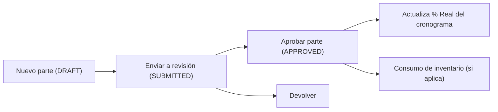
```mermaid
flowchart LR
  N["Nuevo parte (DRAFT)"] --> S["Enviar a revisión (SUBMITTED)"]
  S --> A["Aprobar parte (APPROVED)"]
  S --> R["Devolver"]
  A --> SYNC["Actualiza % Real del cronograma"]
  A --> STK["Consumo de inventario (si aplica)"]
```

### 8.2 Efectos al aprobar el parte

- Actualiza el **% Real** de tareas con partida EDT primaria enlazada.
- Materiales del parte con producto + depósito pueden generar **consumo de inventario**.
- **Imputación EDT del consumo (D-055):** partida EDT de la línea de material (`WbsNode`); si falta y hay **exactamente una** partida de progreso → esa; si hay **varias** partidas y el material no trae partida EDT → **conflicto** (no se crea consumo).

### 8.3 Procedimiento — Consumos de stock (manual)

**Ruta:** Operación → **Consumos** → `/proyectos/[id]/consumos`

1. **Registrar consumo** (abre diálogo; también `?create=1`). La ruta `/consumos/nuevo` redirige al diálogo.
2. Completar: **Producto** · **Depósito** · cantidad · fecha · **Partida EDT (opcional)** · notas.
3. **Registrar consumo**.
4. Atajos: desde Inventario del proyecto o desde Materiales → enlace **Consumos**.

### 8.4 Procedimiento — Documentos de obra

**Ruta:** Operación → **Documentos** → `/proyectos/[id]/documentos`

1. **Agregar documento** sube el archivo a la biblioteca de la obra.
2. En la tabla, la columna **Acciones** no muestra texto: el icono de ojo **abre** el archivo en una pestaña nueva (PDF e imágenes) y el icono de descarga **baja** el archivo. El nombre abre el detalle.
3. En los adjuntos de una ficha (parte de libro de obra, OC, factura, etc.) hay también iconos de **Archivar** (caja) y **Eliminar** (tacho). Archivar y eliminar piden confirmación antes de ejecutarse. El mismo par Ver/Descargar aparece en las tarjetas y en el detalle del documento.

<!-- capture:23 parte-de-obra-detalle -->
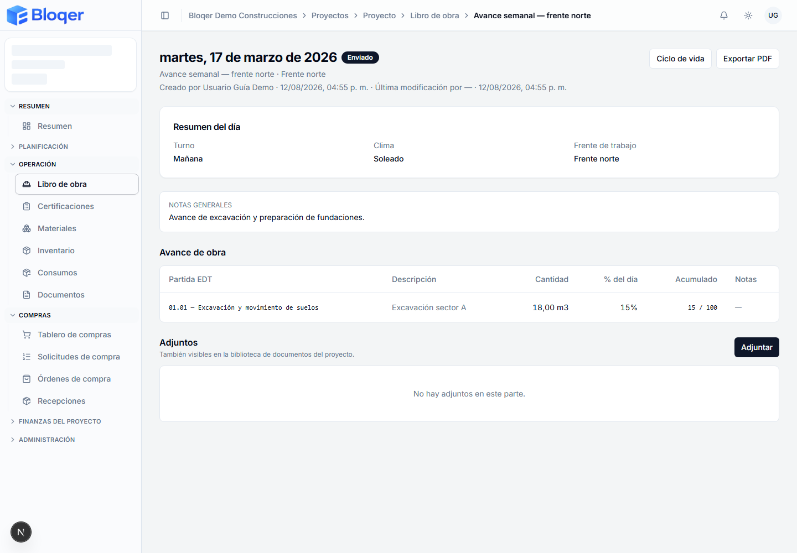

*Parte de obra (detalle).*

<!-- capture:24 listado-de-consumos -->
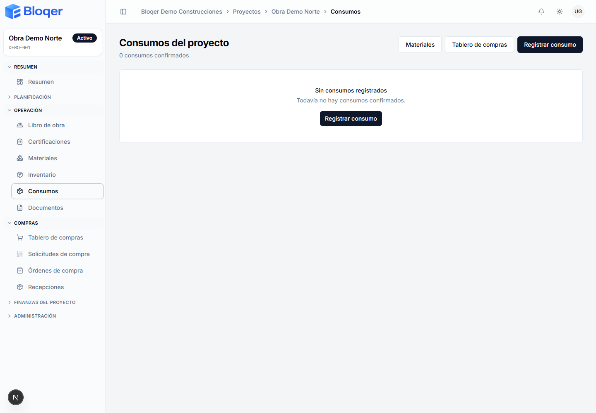

*Listado de consumos.*

---

## 9. Compras, materiales y abastecimiento (nivel proyecto)

En obra **no todo pasa por OC**. Tres caminos de egreso:

| Qué | Camino | Rol del contacto |
|-----|--------|------------------|
| Materiales, insumos, servicios de suministro | **OC** (esta sección) → recepción → factura → pago | **Proveedor** |
| Paquete de ejecución (albañil, electricista, etc.) | **Subcontrato** (§10) → certificar → factura → pago | **Subcontratista** |
| Reintegro al empleado, gasto chico sin compra formal | Factura de proveedor **sin OC** (§12.2), con partida EDT | **Empleado** o **Proveedor** |

**Tablero:** Compras → **Tablero de compras** → `/proyectos/[id]/compras` (pendientes SC / cotización / OC / recepción). Altas de SC/OC en **diálogo** desde el listado (`?create=1`; rutas `/nueva` redirigen). Es el tablero de **documentos** de abastecimiento; el control de **$** por partida está en **EDT y costos**.

**Cómo se mueve el flujo** (si esto, entonces aquello). El caminito: [`guides/assets/flujos/mapa-flujo-compras-si-no.png`](./guides/assets/flujos/mapa-flujo-compras-si-no.png).

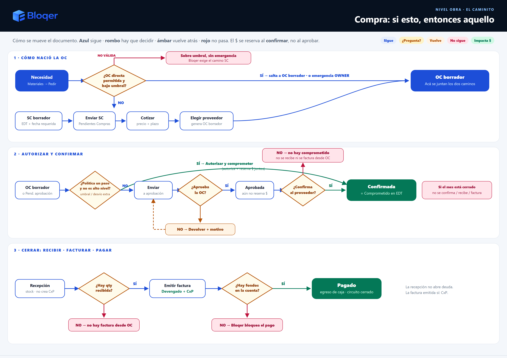

*Caminito de compra: rombo = hay que decidir. Ámbar vuelve atrás. Rojo no sigue. El $ se reserva al confirmar, no al aprobar.*

**Lámina con roles y detalle** (para imprimir o compartir): [`guides/assets/laminas/mapa-circuito-compra-sc-oc.png`](./guides/assets/laminas/mapa-circuito-compra-sc-oc.png).

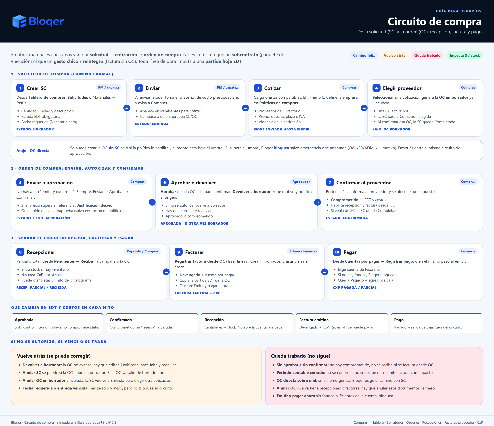

*Lámina: solicitud → cotización → OC → confirmar → recepción → factura → pago.*

### 9.0 Procedimiento — Materiales del proyecto

**Ruta:** Operación → **Materiales** → `/proyectos/[id]/materiales`

**Rol:** tablero de **cantidades** (necesidad APU vs pedido/recibido/consumido). El control de **$** por partida está en Planificación → **EDT y costos** — no lo reemplaza.

**Prerrequisito:** presupuesto `APPROVED`/`CLOSED` con líneas **MATERIAL** en APU.

1. Abrir vista **Operativo** (default). Ventana temporal: Esta semana · **Próximos 14 días** (default) · Este mes · Todo.
2. Revisar KPIs: Presupuesto MAT · Filas con faltante · Cant. recibida · Cant. consumida.
3. Columnas: EDT · Material · Necesidad · $ Presup. · Pedido · Recibido · Consumido · Faltante. Tocá el **código EDT** para abrir el **detalle de la partida en un diálogo** (mismo que EDT y costos); cerrá para volver al tablero. Ctrl/Cmd+clic sigue abriendo la ruta `/control-costos/[wbsNodeId]`.
4. En una fila con **faltante** (necesidad − ya pedido), **Pedir** (o **Pedir resto** si ya hay SC/OC de esa línea) prellena una **solicitud de compra** con la cantidad restante. Si ya hay una solicitud u orden inequívoca, también aparece el atajo.
5. **$ Presup.** es el costo APU presupuestado de la línea (total); **no** baja con lo ya pedido. **Pedido** = SC enviada sin OC confirmada + cantidades de OC confirmada/recibida. **Varianza ($)** es presupuesto MAT vs consumo de stock, no vs pedido.
6. Vista **Varianza ($)** (`?tab=varianza`): desvío monetario. **Exportar** (CSV/PDF) aparece en esa vista.
7. **Operativo** y **Varianza ($)** van a la izquierda, en la misma fila que los atajos a la derecha: **EDT y costos** · **Tablero de compras** · **Consumos**. No hay atajo **Solicitudes**: las SC se abren desde **Tablero de compras** (**Nueva solicitud** / **Todas las solicitudes**) o Compras → Solicitudes de compra. En celular o tablet chica Materiales muestra tarjetas de necesidad/faltante (sin Operativo/Varianza); los mismos atajos quedan en una franja que se desplaza de costado.

<!-- capture:25 materiales-operativo-pedir -->
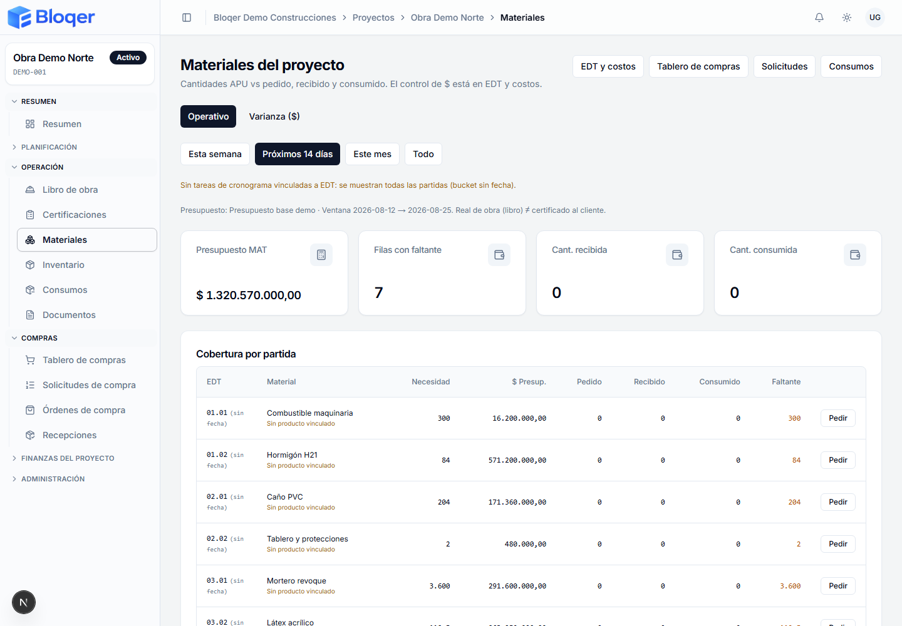

*Materiales Operativo + Pedir.*

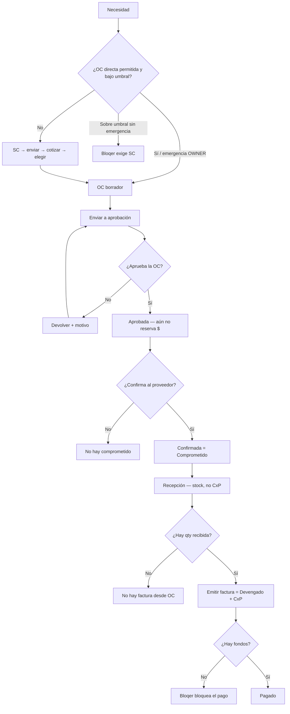
```mermaid
flowchart TD
  N[Necesidad] --> D1{¿OC directa permitida y bajo umbral?}
  D1 -->|Sí / emergencia OWNER| OCD[OC borrador]
  D1 -->|No| SC[SC → enviar → cotizar → elegir]
  SC --> OCD
  D1 -->|Sobre umbral sin emergencia| X1[Bloqer exige SC]
  OCD --> ENV[Enviar a aprobación]
  ENV --> D2{¿Aprueba la OC?}
  D2 -->|No| DEV[Devolver + motivo]
  DEV --> ENV
  D2 -->|Sí| APR[Aprobada — aún no reserva $]
  APR --> D3{¿Confirma al proveedor?}
  D3 -->|No| PARK[No hay comprometido]
  D3 -->|Sí| CONF[Confirmada = Comprometido]
  CONF --> REC[Recepción — stock, no CxP]
  REC --> D4{¿Hay qty recibida?}
  D4 -->|No| X2[No hay factura desde OC]
  D4 -->|Sí| FAC[Emitir factura = Devengado + CxP]
  FAC --> D5{¿Hay fondos?}
  D5 -->|No| X3[Bloqer bloquea el pago]
  D5 -->|Sí| PAY[Pagado]
```

> **Regla (D-050 / D-055):** toda línea de **solicitud/OC** y toda **factura de proveedor de proyecto** imputa a una **partida hoja**. Facturas desde OC **copian** la partida EDT de la OC. Facturas corporativas (sin obra) **sin** partida EDT.

### 9.0.1 Procedimiento — Mano de obra del proyecto

**Ruta:** Operación → **Mano de obra** → `/proyectos/[id]/mano-obra`

**Rol:** tablero de **cantidades** APU `LABOR` (necesidad vs pedido vs facturado). El **$** por tipo está en Planificación → **EDT y costos** (filtro *Mano de obra*).

**Prerrequisito:** presupuesto `APPROVED`/`CLOSED` con líneas **LABOR** en APU (no `gl` / lump sin necesidad física). Con **varios presupuestos** aprobados, el tablero usa el baseline elegido (o el más reciente); al abrir una partida desde EDT, Bloqer resuelve el presupuesto dueño de ese nodo EDT.

1. Vista **Operativo** (default). Misma ventana de cronograma que Materiales. Si el módulo de cronograma está off o entrás desde EDT (drilldown), se muestra en ventana **todas** (solo cantidades).
2. Columnas: EDT · Insumo APU · Necesidad · $ Presup. · Pedido · Facturado · Faltante. Tocá el **código EDT** → diálogo de detalle de partida (cerrar para volver); Ctrl/Cmd+clic = página completa.
3. **Faltante** = necesidad − max(pedido, facturado). Así una liquidación directa (sin OC) también cierra el faltante.
4. **Pedido** cuenta SC enviada (sin OC confirmada) y OC confirmada/recibida tipadas **LAB** o ligadas a APU LABOR. **Facturado** cuenta facturas **emitidas** tipadas LAB (o heredadas de OC tipada LAB); si el módulo AP está off, Facturado queda en 0 y el tablero avisa.
5. **Pedir** / **Pedir resto** abre SC prellenada: partida, cantidad faltante, insumo APU si la fila lo tiene, y **tipo Mano de obra** (`costType=LABOR`) aunque la línea sea texto libre. Camino SC → OC → factura tipada ([D-109]).
6. **Factura** / **Registrar factura** abre factura de proveedor en modo costo directo tipada **Mano de obra** (liquidación, jornal, empleado [D-089]). El prefill guarda el **insumo APU** en la línea (`costAnalysisLineId`) para que el tablero baje el facturado de **esa** fila; no se matchea solo por descripción ([D-110]). Si cambiás la partida EDT, se limpia el vínculo APU: revisá tipado e insumo.
7. Vista **Varianza ($)**: presupuesto APU LAB vs facturas emitidas tipadas LAB (**montos netos sin IVA**, misma base que EDT). **Exportar** CSV en esa vista (rango de fechas inclusivo).
8. Atajos: **EDT y costos** · **Tablero de compras** · **Facturas proveedor**.

> **No es subcontrato.** Paquete con contrato + certificación → Compras → **Subcontratos** (§10). Cuadrilla/jornal/empleado facturado → este tablero + tipo LAB.

**Cómo se mueve el flujo** (si esto, entonces aquello). El caminito: [`guides/assets/flujos/mapa-flujo-mano-obra-equipos-si-no.png`](./guides/assets/flujos/mapa-flujo-mano-obra-equipos-si-no.png).

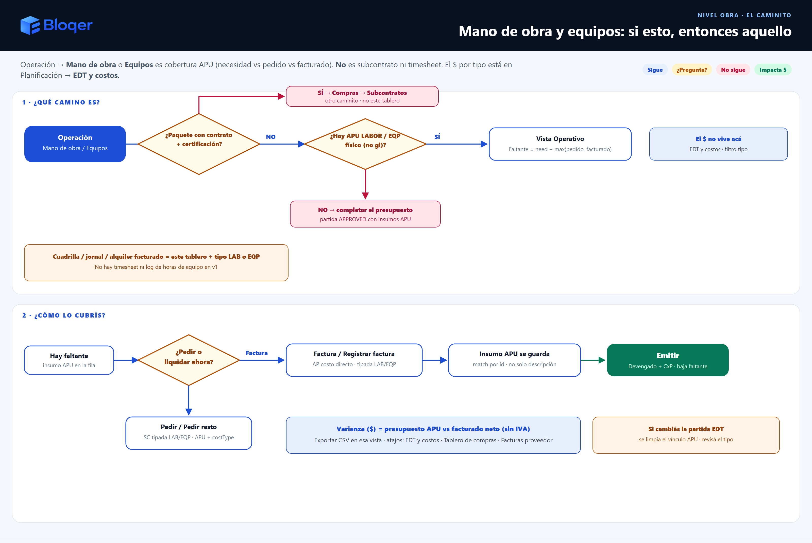

### 9.0.2 Procedimiento — Equipos del proyecto

**Ruta:** Operación → **Equipos** → `/proyectos/[id]/equipos`

Igual que §9.0.1 con categoría APU **EQUIPMENT** (alquileres, andamios, baño químico, etc.). **Pedir** lleva `costType=EQUIPMENT`; **Factura** → AP tipada **Equipos** con vínculo APU ([D-110]). Varianza y export CSV: presupuesto EQP vs facturado **neto** (sin IVA). Sin log de horas de equipo en v1 ([D-099] · [D-109]). Mismo caminito que §9.0.1.

**Comparación de caminos** (Materiales / MO / Equipos / Subcontrato / gasto directo): [`guides/assets/flujos/mapa-flujo-egresos-obra-comparacion.png`](./guides/assets/flujos/mapa-flujo-egresos-obra-comparacion.png) · Ayuda → *Elegir el camino…*.

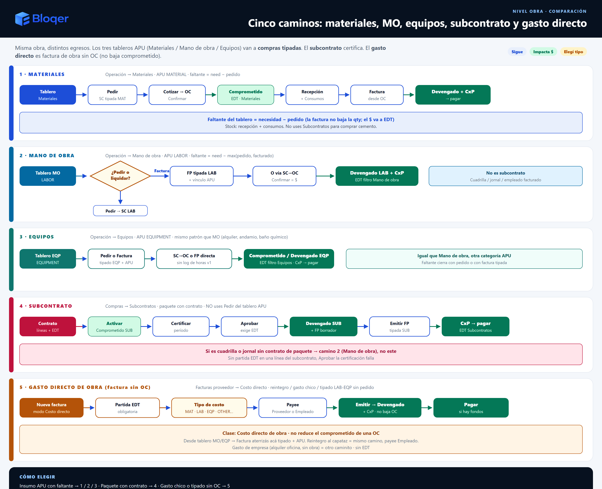

### 9.1 Procedimiento — Solicitud de compra (SC)

**Ruta:** Compras → **Solicitudes de compra**

1. **Nueva solicitud** (diálogo / `?create=1`) desde **Solicitudes de compra** o **Tablero de compras** (**Nueva solicitud** / **Todas las solicitudes**), o llegar prellenada desde Materiales / Mano de obra / Equipos → **Pedir** (`from=materiales|mano-obra|equipos` + `costType` + insumo APU si aplica).
2. En **Nueva solicitud**: primero **Dónde se usa** (partida EDT obligatoria, ordenada por código — 1.2 antes que 19.1). Después **Qué necesito**: podés agregar **varias líneas** de la misma partida con **+ Agregar insumo** o **Agregar faltantes (N)** (insumos APU **materiales, mano de obra o equipos** con faltante según necesidad − ya pedido, sumando todos los presupuestos `APPROVED`/`CLOSED` del proyecto). Cada línea puede ligarse a un **insumo APU** distinto (placeholder *Elegir insumo APU…*; no repetible en la misma SC); al elegirlo se precarga descripción, unidad, cantidad faltante, **monto est.** y, al guardar, **tipo de costo** + línea `SERVICE` si es LABOR/EQUIPMENT. Sin APU, el tipo se hereda del tablero de origen (`costType` / `from`). Luego **Cuándo**.
3. **Fecha requerida obligatoria** ([BR-PUR-017] · [D-096]): cuándo se necesita el material en obra. El formulario no deja guardar la SC sin ese dato. Sirve para priorizar cotizaciones y entregas, y aparece como **Necesaria para** en el listado y **Pendientes**.
4. Guardar `DRAFT` → **Enviar** → `SUBMITTED` (snapshot de costo presupuestario / cantidad por partida EDT).
5. Cargar **Cotizaciones**: elegí proveedor (buscador: razón social o nombre fantasía), **precio unit.**, **Desc. %** (opcional, antes de IVA), **alícuota IVA** y, si el proveedor te pasó el **precio final con IVA** (Factura B), marcá **El precio unitario incluye IVA**. El formulario muestra neto, IVA y total por línea antes de guardar. También **plazo de entrega en días** + validez. En el listado se ve el total y, debajo del proveedor, cada línea con precio neto y **Desc. %**. Mientras la SC esté enviada y la cotización **Recibida** (sin seleccionar), podés **Editar** o **Eliminar** una cotización cargada de más. **Cotizaciones ya guardadas no se recalculan**: quedan con los importes que tienen; el checkbox aplica al cargar/editar de acá en más. Cumplir mínimo de cotizaciones de `/configuracion/politicas`. El umbral que obliga SC+cotizaciones vs OC directa lo setea cada empresa en políticas de compras (no es un monto fijo del producto).
6. **Seleccionar** proveedor → genera **OC en borrador**.
7. En el **listado desktop** de solicitudes: **Código**, **Estado**, **Descripción** (primera línea + “+N más” si hay varias), **WBS** (partida o “Múltiple”), **Monto est.** (Σ cant. × ref. presup. **de cada insumo APU ligado** en la SC, o total de cotización seleccionada; badge **Presup.** / **Cotización**), **Proveedor** (si ya hay cotización elegida), **Necesaria para**. El **solicitante** y fechas de envío/creación se ven en el **detalle** de la SC.
8. **Buscador + filtro de estado** ([D-096]): arriba del listado hay un buscador (código, descripción, WBS, proveedor, solicitante) y botones **Todas / Borrador / Enviada / Cotización elegida / Completada / Anulada** con contador por estado. Los deep-links históricos `?status=SUBMITTED` (por ejemplo desde el email de nueva SC) siguen abriendo el filtro pre-seleccionado; después, quitarlo o cambiarlo se hace desde los mismos botones.
9. **Fecha requerida vencida** ([BR-PUR-019] · [D-097]): mientras la SC esté `SUBMITTED` o `QUOTE_SELECTED`, si `neededByDate` pasó, en el listado y en **Pendientes** aparece el badge rojo **Vencida N d** junto a **Necesaria para**. Todos los días el sistema notifica a compras / aprobadores con CC OWNER/ADMIN hasta que se elija cotización o se emita OC confirmada (dedup 7 días). El colchón (`neededByOverdueGraceDays`) y el toggle se configuran por empresa en **Configuración → Políticas de compras**.
10. Notificaciones: envío a compras + recordatorio SLA si demora. Quienes pueden cotizar también ven la SC en **Pendientes** hasta elegir proveedor ([D-094]). El email de nueva solicitud muestra organización, proyecto, solicitante e ítems; el asunto es `[organización] Nueva solicitud · SC-003`.

### 9.2 Procedimiento — Orden de compra (OC)

**Ruta:** Compras → **Órdenes de compra**

**Estados en pantalla:** Borrador → Pend. aprobación → Aprobada → Confirmada → Recepción parcial / Recibida · Anulada.  
**Enum:** `DRAFT → SUBMITTED → APPROVED → CONFIRMED → PARTIALLY_RECEIVED / RECEIVED` (o `CANCELLED`).

1. **Nueva OC** desde listado/tablero (`?create=1` en escritorio; en celular `/proyectos/[id]/ordenes-compra/nueva`) o desde SC seleccionada. Proveedor: buscador por razón social o nombre fantasía. Cada línea: **partida hoja**, **Tipo de costo** (etiqueta **Sugerido desde APU**), luego **unidad / cantidad / precio unitario / Ref. presupuesto**, y debajo **Desc. % · IVA · total**. **Descuento general %** + **Aplicar a todas** copia el mismo % a cada línea (hay que ingresar un número; 0 limpia todas). **Ref. presupuesto** es el insumo MATERIAL del APU (elegí **Insumo APU** para tomar su $/u), o **costo dir. /u** de la partida si no hay materiales y la unidad es comparable. Si la partida está en **global (`gl`)** y la línea en un/kg/m2, Ref. muestra — (el total de la partida no es un precio unitario). El saldo de partida es aviso, no bloqueo (ver [D-095]).
2. **Listado OC — buscador + filtro de estado** ([D-096]): arriba del listado hay un buscador (código, proveedor, aprobador) y botones **Todas / Borrador / Pend. aprobación / Aprobada / Confirmada / Recep. parcial / Recibida / Anulada** con contador por estado. Los deep-links históricos `?status=` siguen funcionando como estado inicial (por ejemplo desde **Pendientes** o el tablero).
3. **Enviar a aprobación** → `SUBMITTED` (aprobadores: Pendientes + campana). Si quien envía puede aprobar y la OC no es de alto nivel, puede auto-aprobarse; con política [D-107] ON esa auto-aprobación deja la OC **Confirmada**.
4. Aprobador: **Aprobar** → `APPROVED` (control interno; badge outline = todavía no reserva $), o **Devolver a borrador** con **motivo obligatorio**. Con política **Al aprobar, confirmar** ([D-107]) ON y OC no alto nivel, el botón dice **Aprobar y comprometer** y deja `CONFIRMED` (Comprometido). Quien puede confirmar la ve en **Pendientes** (etapa Confirmar) solo si quedó Aprobada; campana de “OC aprobada” llega a origen + quien confirma (si auto-confirmó, llega aviso de confirmada, no “pendiente confirmar”).
5. **Confirmar al proveedor** → `CONFIRMED` = **comprometido** en EDT y costos (badge primary = ya reserva $).
6. **Autorizar y comprometer** ([D-105]/[D-106]): en **Configuración → Políticas → Compras → Atajos operativos**, OWNER/ADMIN puede prender **Un paso: autorizar y comprometer** (apagado por defecto). Con ON: OC bajo umbral → PM/Compras; **alto nivel** → solo OWNER/ADMIN. Un acto autoriza y reserva $ (Confirmada). Si en Pend. aprobación también aplica [D-107], Autorizar es el primario y Aprobar queda secundario (outline). Segregación de auto-aprobación sigue valiendo.
7. **Al aprobar, confirmar** ([D-107]): política en **Atajos operativos** (apagada por defecto). Con ON, aprobar una OC **no** de alto nivel la deja Confirmada = Comprometido (sin card «Confirmar» en Pendientes). Alto nivel no auto-confirma.
8. **Al recibir, borrador de factura** ([D-108]): política en **Atajos operativos** (apagada por defecto). Al confirmar recepción se crea un **borrador** de factura (no CxP). Si falla, la recepción igual queda confirmada y se muestra aviso en pantalla. Emitir sigue creando Devengado + CxP.
9. **Registrar recepción** (parcial o total). Quien puede recibir (Compras / Depósito / PM) la ve en **Pendientes** con botón **Recibir** (abre `…/recepciones/nueva`). La campana de confirmación avisa “Ya se puede registrar la recepción” con CTA **Registrar recepción** a ese mismo formulario.
10. **Entrega prevista vencida sin recepción** ([BR-PUR-018] · [D-097]): mientras la OC esté `CONFIRMED` o `PARTIALLY_RECEIVED` con `expectedDeliveryDate` pasada, en el listado y en **Pendientes** aparece el badge rojo **Vencida N d** junto a **Entrega prevista**. Se envía notificación diaria a quien puede recepcionar con deep-link al form (CTA **Registrar recepción**), CC OWNER/ADMIN, dedup 7 días. Ajustable con `deliveryOverdueGraceDays` y toggle `deliveryAlertsEnabled` por empresa.
11. Con cantidades recibidas: panel **Facturación de la OC** → botón **Registrar factura** (o alta manual en Facturas proveedor). Si ya hay borrador (p. ej. [D-108]), Pendientes dice **Completar factura**.
12. **OC recibida sin factura registrada** ([BR-PUR-020] · [D-097]): apenas hay recepción confirmada y la OC no tiene factura de proveedor `ISSUED`, aparece en **Pendientes** (grupo Compras → Facturar) para quien tiene `EDIT AP`, con CTA **Registrar factura** (abre la OC con el panel destacado vía `?siguiente=facturar`) o **Completar factura** si hay borrador. La **alerta/campana diaria** espera `receiptToInvoiceSlaDays` (default **5**) desde la primera recepción confirmada, CC OWNER/ADMIN, dedup 7 días. Toggle `receiptToInvoiceAlertsEnabled` por empresa. Es la señal que evita que la CxP nunca se genere y que el pago quede en el aire.
13. Desvíos de precio vs referencia: la ficha **siempre** muestra **Ref. presup.** y **Desvío** por línea (también en celular). Si el PU **supera** el referencial (umbrales de políticas), pide **Justificación desvío** en **Editar**; el aviso lista las líneas. Comprar por debajo no exige nota (el % sale en verde). Partida en **global** vs línea física: Ref. = — con texto «no es un $/u» y, si hay un insumo APU en la misma unidad, lo sugiere; Desvío = «Sin $/u comparable»; no bloquea. En **Editar** cada línea muestra PU · Ref · Desvío. Sin referencial comparable (APU y costo dir. /u en cero, unidad física) sí pide justificación. El caminito: [`guides/assets/flujos/mapa-flujo-desvio-oc-si-no.png`](./guides/assets/flujos/mapa-flujo-desvio-oc-si-no.png).

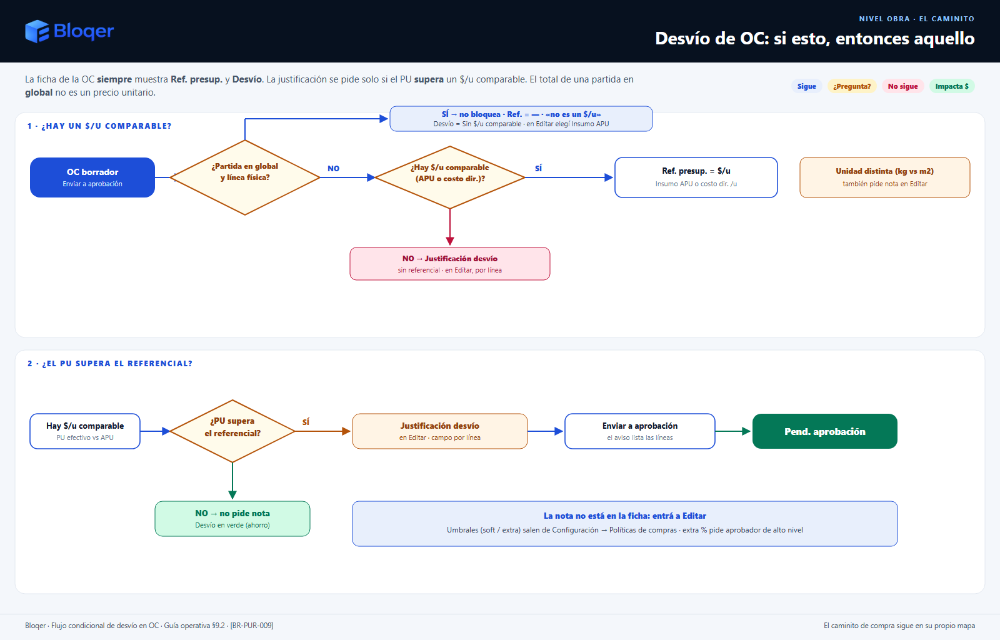
14. **OC directa** (sin SC): solo si la política de compras lo habilita; umbrales altos pueden exigir motivo de emergencia (`OWNER`/`ADMIN`).

| Hito | Impacto |
|------|---------|
| APPROVED | Control interno / segregación |
| CONFIRMED | **Comprometido** |
| Recepción | Stock + cantidades recibidas (**no** crea CxP sola) |
| Factura proveedor **emitida** | **Devengado** + CxP (+ auto-DRAFT contable) |

<!-- capture:26 oc-confirmada-con-links -->
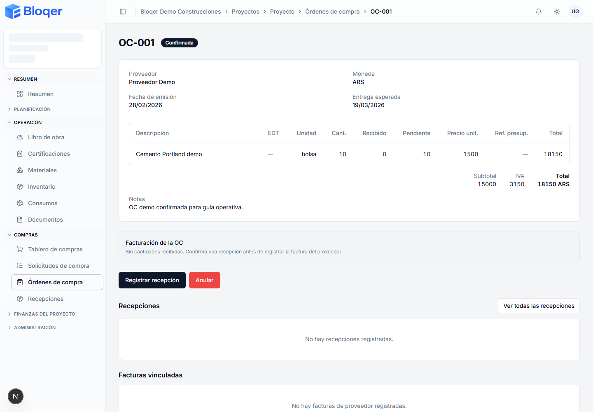

*OC confirmada con links.*

### 9.3 Procedimiento — Recepciones

1. Desde **Pendientes** (botón **Recibir**), desde la **campana** (CTA **Registrar recepción**), Compras → **Recepciones**, o desde la OC → **Nueva recepción** (`/ordenes-compra/[poId]/recepciones/nueva`).
2. Indicar cantidades recibidas por línea; depósito opcional si el módulo Inventario está activo.
3. Confirmar. Si hay producto/depósito → **entrada de stock** (el movimiento IN puede copiar `wbsNodeId`).
4. Al confirmar: si hay un **hito** del mismo proyecto vinculado a la EDT de alguna línea recibida (`PLANNED`/`IN_PROGRESS`), el sistema lo marca **Completado** ([D-104] / [BR-SCH-005]). Anular la recepción **no** reabre el hito.
5. Si la política **Al recibir, crear borrador de factura** está ON ([D-108]), se crea un borrador AP (idempotente). Completar y **emitir** sigue siendo necesario para CxP.

<!-- capture:27 listado-recepciones -->
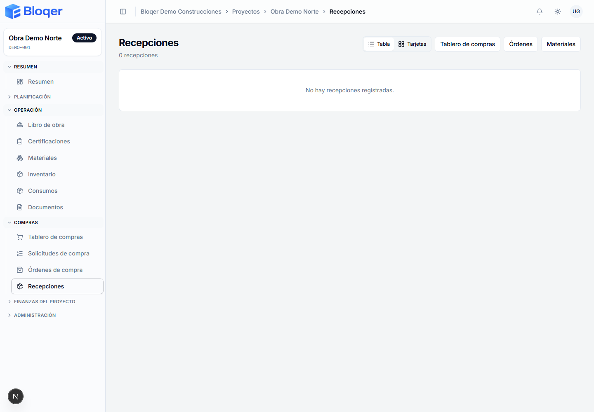

*Listado Recepciones.*

---

## 10. Subcontratos (nivel proyecto)

**Ruta:** Compras → **Subcontratos** → `/proyectos/[id]/subcontratos`

### 10.1 Procedimiento

1. **Nuevo subcontrato** (diálogo/`?create=1` si aplica): subcontratista del directorio (rol **Subcontratista**; buscador: razón social o nombre fantasía), alcance e imputación a partidas con categoría **SUB** en APU cuando corresponda. **Cada línea del subcontrato debe tener partida EDT** antes de aprobar certificaciones (requerido para emitir la factura AP, [D-055]).
2. Crear **certificación de subcontrato** del período.
3. Ciclo (enum `SubcontractCertificationStatus`): `DRAFT` → emitir (`ISSUED`) → **Aprobar** (`APPROVED`) (o `REJECTED` / `CANCELLED`). Si falta partida EDT en alguna línea del subcontrato, **Aprobar** se rechaza con error de validación (no se crea factura incompleta).
4. Al **aprobar**, el sistema genera una **factura de proveedor en borrador** con las partidas EDT copiadas de las líneas del subcontrato (el payee es el subcontratista); hay que **emitirla** para crear la CxP y poder pagar. **No** se paga el subcontrato creando una OC ni eligiendo al subcontratista en el gasto genérico.
5. En el detalle: badge de estado de factura + **Revisar y emitir** o **Ver factura**.

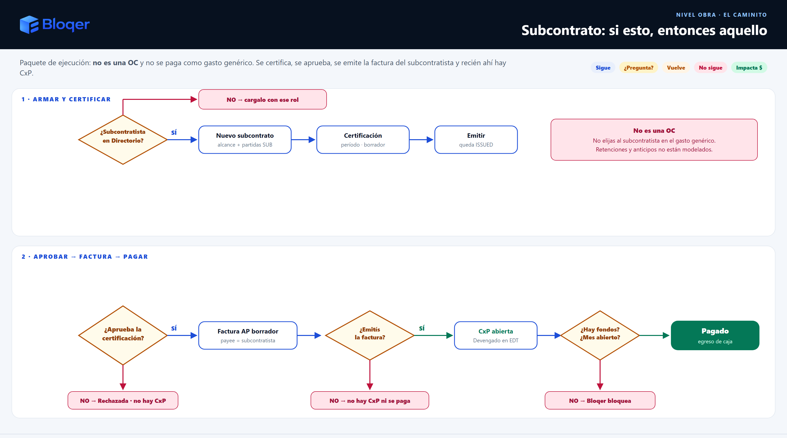

*Caminito de subcontrato: no es OC. Si no se aprueba o no se emite la factura, no hay CxP.*

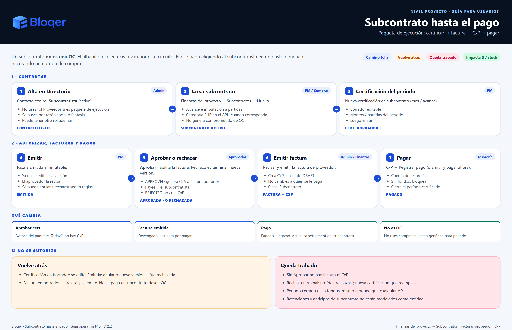

*Lámina: certificar el paquete → factura AP → CxP → pagar.*

<!-- capture:28 cert-subcontrato-con-factura -->
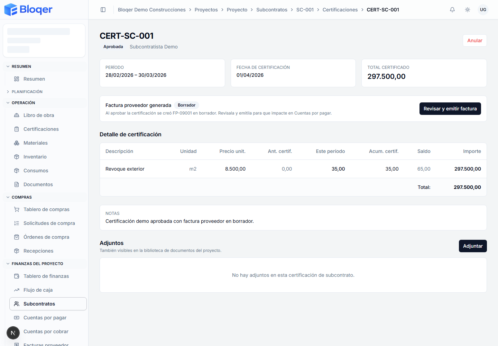

*Cert. subcontrato con factura.*

> **Limitación:** retenciones y anticipos de subcontrato **no** están modelados como entidad separada.

---

## 11. Certificaciones al cliente (nivel proyecto)

**Ruta:** Operación → **Certificaciones** → `/proyectos/[id]/certificaciones`

### 11.1 Precondición

- Presupuesto `APPROVED` o `CLOSED`.

### 11.2 Procedimiento — Emitir y aprobar

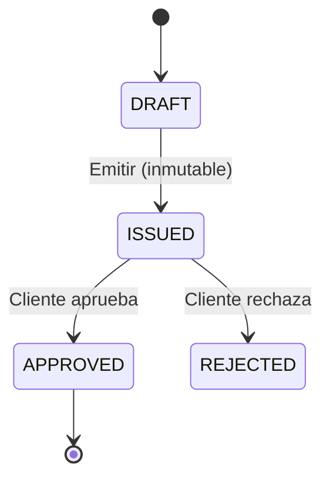
```mermaid
stateDiagram-v2
  [*] --> DRAFT
  DRAFT --> ISSUED: Emitir (inmutable)
  ISSUED --> APPROVED: Cliente aprueba
  ISSUED --> REJECTED: Cliente rechaza
  APPROVED --> [*]
```

1. **Nueva certificación** con período (desde / hasta).
2. Por partida: cargar **Δ% físico** y/o **$ económico** del período (según el formulario).
3. Validar techos: obra **Pública** bloquea si supera 100% acumulado; **Privada** permite con **nota obligatoria**.
4. **Emitir** → `ISSUED` (inmutable).
5. Según respuesta del mandante: marcar **Aprobar** (`APPROVED`) o rechazar (`REJECTED`).

### 11.3 Procedimiento — De la certificación a la factura de venta

1. Con certificación `APPROVED`, en el detalle usar CTA **Emitir factura** (o ver factura ya vinculada).
2. La factura genera **cuenta por cobrar (Receivable)**.
3. Cobrar desde **Cuentas por cobrar** del proyecto (no hay “Cobrar ahora” en el alta de factura de obra).
4. **No** existe estado `INVOICED` en la certificación: el cobro se deriva de las cobranzas.
5. La emisión de factura es **manual**; aprobar la certificación **no** crea la factura sola.

**Certificación, factura y cobro (D-072)**

- La certificación (`APPROVED`) **no** acredita banco ni mueve caja; solo registra avance certificado.
- **Emitir factura** abre la **cuenta por cobrar**; la **cobranza** elige la cuenta de tesorería y genera el ingreso (`INFLOW`).
- Al emitir factura de obra con saldo pendiente, `OWNER`/`ADMIN`/`FINANCE`/`TREASURER` reciben aviso **Listo para cobrar**; un PM con permiso de cobro puede registrar la cobranza igual.

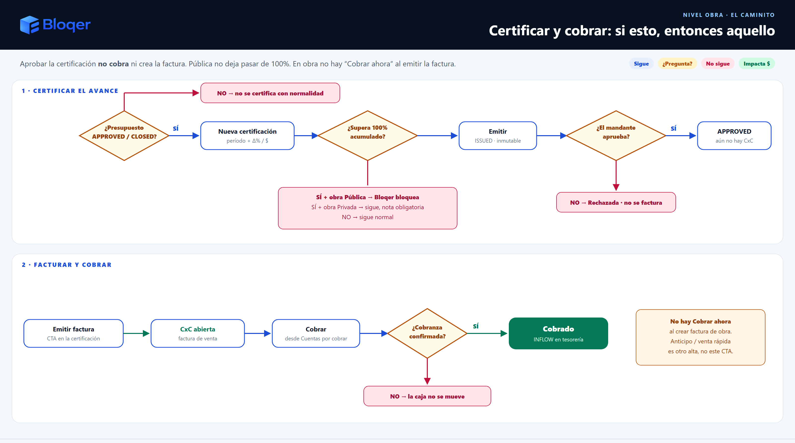

*Caminito: aprobar la certificación no cobra. Pública bloquea si supera 100%. La caja se mueve recién al confirmar la cobranza.*

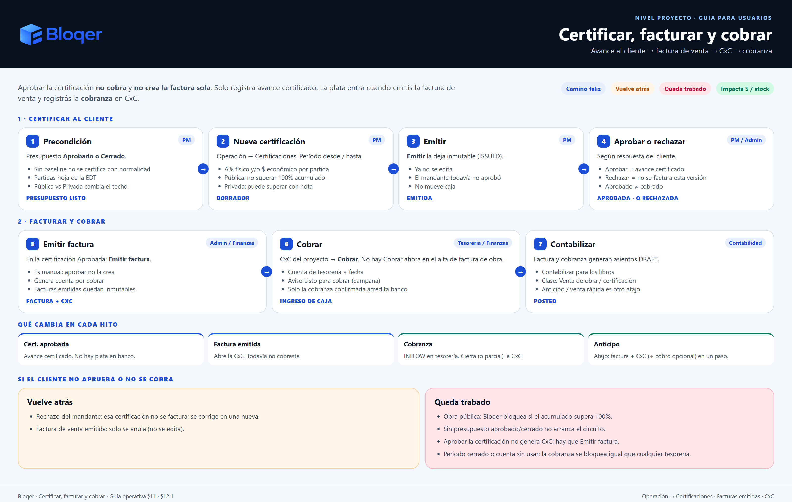

*Lámina: avance al cliente → factura de venta → CxC → cobranza.*

<!-- capture:29 certificacion-cliente-approved -->
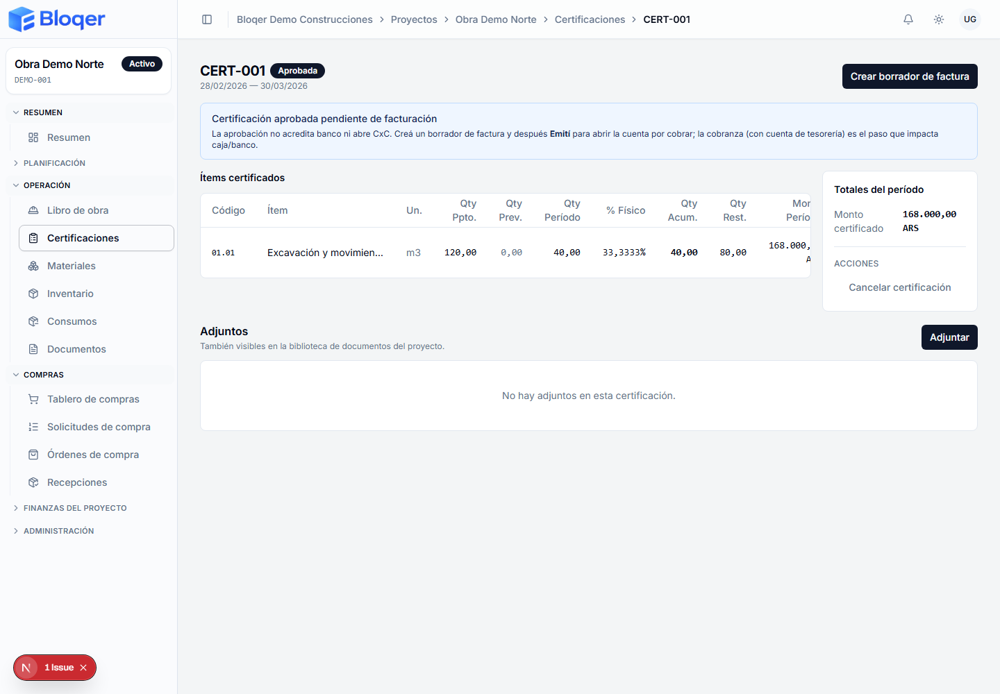

*Certificación cliente APPROVED.*

---

## 12. Facturar, cobrar y pagar (nivel proyecto y empresa)

### 12.0 Clase del documento ([D-102])

Cada factura, CxC/CxP o movimiento de caja muestra un badge **Clase** (solo lectura). No se elige a mano: se deriva de si hay obra, OC, certificación, etc. En listados de caja, **Pago** va en rojo y **Ingreso / Cobranza** en verde.

| Clase | Dónde aparece |
|---|---|
| Venta — certificación / Venta de obra | Facturas emitidas de proyecto |
| Ingreso corporativo | Factura/CxC sin obra (Transacciones → Factura / CxC) |
| Ingreso solo caja | Transacciones → Solo caja (sin factura) |
| Compra comprometida | Factura de proveedor con OC |
| Costo directo de obra | Factura de proveedor de obra **sin** OC |
| Subcontrato | Factura ligada a certificación de subcontrato |
| Gasto general | Factura/gasto sin obra (Transacciones AP, Nueva factura de gasto) |
| Cobranza / Pago | Movimientos de tesorería por cobro/pago |

**Transacciones** (`/finanzas/transacciones`) lista movimientos de caja, **no** facturas impagas. La clase de esas facturas está en **Facturas emitidas** / **Facturas de proveedor** / CxC / CxP. Clic en la **descripción** abre el detalle (texto completo, cuenta, clase, contraparte). Si hay pago o cobranza de obra, desde ahí se abre el documento origen.

### 12.1 Ventas y cobranzas (AR)

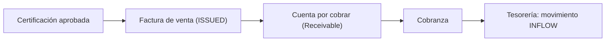
```mermaid
flowchart LR
  CERT["Certificación aprobada"] --> INV["Factura de venta (ISSUED)"]
  INV --> AR["Cuenta por cobrar (Receivable)"]
  AR --> COL["Cobranza"] --> TES["Tesorería: movimiento INFLOW"]
```

#### Obra (proyecto)

- **Facturas emitidas** (`/proyectos/[id]/facturas`, estados Borrador / Emitida / Anulada): una vez emitidas son inmutables; solo se pueden **anular**. Detalle: **Emitir** desde borrador; panel de **adjuntos** del comprobante. Al crear, el cliente se busca por razón social o nombre fantasía. En la línea: **Desc. %** opcional (antes de IVA; el precio unitario es de lista).
- **Cuentas por cobrar** (`/proyectos/[id]/cuentas-por-cobrar`): estados Pendiente / Parcial / Pagado / Vencido. Desde el detalle → **Cobrar** (`…/[receivableId]/cobrar`): cuenta, fecha, monto (2 decimales), **método** (Efectivo / Transferencia / Cheque / Tarjeta / Otro) y referencia opcional. Para saldar el total, dejá el saldo que muestra el sistema. Solo la **cobranza confirmada** acredita tesorería ([D-072]).
- **Cobranzas** (`/proyectos/[id]/cobranzas`): ingresan dinero (`INFLOW`) y bajan el saldo. En el detalle, **Cancelar** muestra el error en pantalla si falla (p. ej. movimiento ya conciliado o período cerrado); no se “traga” el mensaje.
- **Venta rápida / anticipo** (`/proyectos/[id]/facturas/anticipo/nueva`): factura + CxC (+ cobro opcional) en un paso.
- **No disponible hoy:** “Cobrar ahora” **inline** al crear una factura de venta **de proyecto** (diferido; el cobro se hace desde CxC). El cobro inmediato corporativo sí existe en Transacciones (abajo).

#### Ingreso / factura corporativa (sin obra) — D-051

Casos como capacitaciones, venta de materiales o servicios de estructura **sin proyecto**:

1. **Finanzas → Transacciones** (`/finanzas/transacciones`) → **Registrar transacción** → tab **Ingreso / cobro**.
2. Modo **Factura / cuenta por cobrar** (`AR_INCOME`): cliente, fechas, líneas (cantidad, precio, **Desc. %**, IVA), vencimiento; N° comprobante externo opcional; **Cobrar ahora (ingreso a caja)** opcional (cuenta + fecha; requiere permiso de tesorería).
3. Si solo necesitás mover caja **sin** CxC (aportes de socios, préstamos recibidos, un tercero que **devuelve plata a la empresa**): modo **Solo caja** (`TREASURY_INFLOW`). Eso **no** es el reintegro a un empleado (ese es un **egreso**, §12.2.2).
4. Gestionar saldos en **Cuentas por cobrar** (`/finanzas/cuentas-por-cobrar` → **Cobrar**). Filas sin obra se etiquetan **Empresa**.

<!-- capture:31 factura-emitida-cxc-cobranza -->
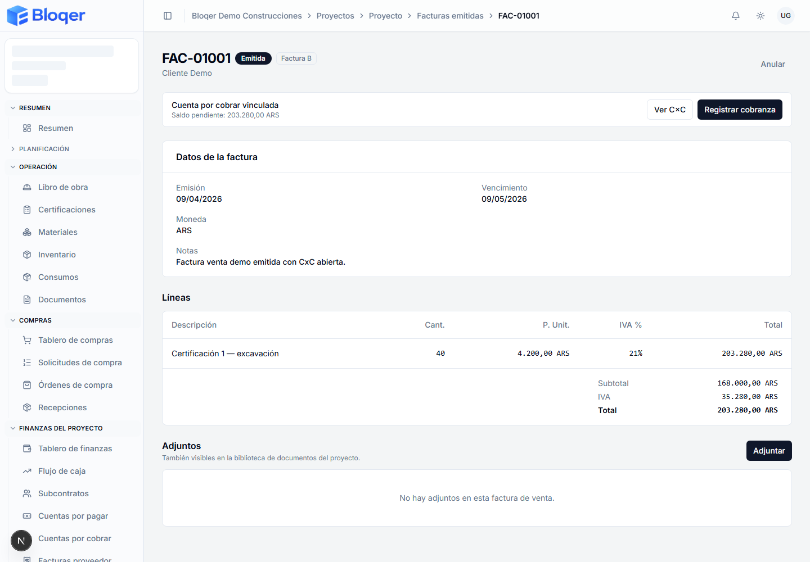

*Factura emitida → CxC / cobranza.*

<!-- capture:32 ingreso-corporativo-con-cxc -->
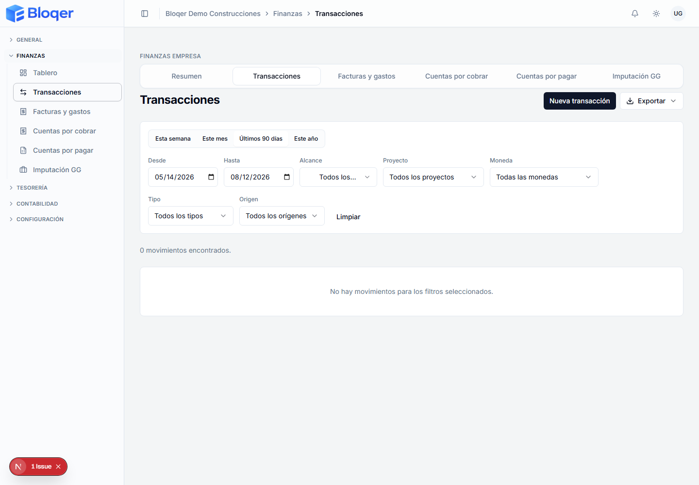

*Ingreso corporativo con CxC.*

### 12.2 Facturas de proveedor y pagos (AP) — D-052 · D-089

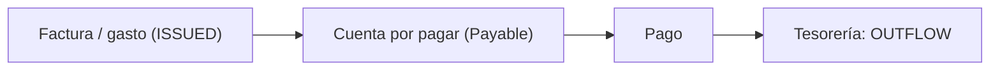
```mermaid
flowchart LR
  SI["Factura / gasto (ISSUED)"] --> AP["Cuenta por pagar (Payable)"]
  AP --> PAY["Pago"] --> TES["Tesorería: OUTFLOW"]
```

Siempre existe la cadena **Factura → Payable → Payment → movimiento de caja**, aunque se pague en el mismo momento (“pagar ahora”). El campo **A quién se le paga** lista solo contactos **activos** con rol **Proveedor** o **Empleado** ([D-089]); no aparecen Cliente, Subcontratista u Otro. Cada opción muestra **razón social** y, si es distinta, el **nombre fantasía** entre paréntesis. Si el contacto está en Directorio y no sale: abrí su ficha y asignale rol Proveedor (o Empleado).

#### Proyecto

| Pantalla | Ruta |
|----------|------|
| Listado / alta | `/proyectos/[id]/facturas-proveedor` · `/nueva` |
| Detalle | `/proyectos/[id]/facturas-proveedor/[id]` (Emitir · Anular · adjuntos · editar borrador) |
| CxP | `/proyectos/[id]/cuentas-por-pagar` → `/[payableId]/pagar` |
| Pagos (consulta) | `/proyectos/[id]/pagos` (también desde CxP / trazabilidad) |

**Alta en obra (`/nueva`):**

1. Elegí el modo **Contra orden de compra** o **Costo directo** ([D-102]). Contra OC: picker de OC + “Traer líneas” (baja el comprometido abierto; copia partida EDT, tipo de costo e **insumo APU** de la OC si había, [D-110]). Costo directo: sin OC; imputá partida y tipo de costo (no reduce comprometido). Desde Operación → **Mano de obra** / **Equipos** → **Factura**, el alta llega tipada LAB/EQP con vínculo APU prellenado. El chip **Clase** muestra Compra comprometida o Costo directo de obra.
2. **A quién se le paga** (proveedor o empleado si no hay OC), fechas, líneas (cada línea con **partida EDT obligatoria**, D-055; **Tipo de costo**; **insumo APU** opcional — se limpia si cambiás la partida; **Desc. %** opcional antes de IVA; **Descuento general %** para copiar el mismo % a todas), **adjunto** opcional (foto/PDF del comprobante).
3. Desde OC / recepción: botón **Registrar factura** del panel Facturación abre en modo Contra OC y copia la partida EDT (y APU) de cada línea.
4. Sin más: **Crear factura** → queda en **borrador** → luego **Emitir** en el detalle (crea CxP + **asiento DRAFT** en contabilidad, ver §15).
5. Con permiso **EDIT tesorería** y módulo Tesorería activo: checkbox **Emitir y pagar ahora (egreso de caja)** → cuenta de pago + fecha → **Emitir y pagar**. Crea factura emitida + CxP + pago + egreso en un paso. Si no hay fondos suficientes, **bloquea**.

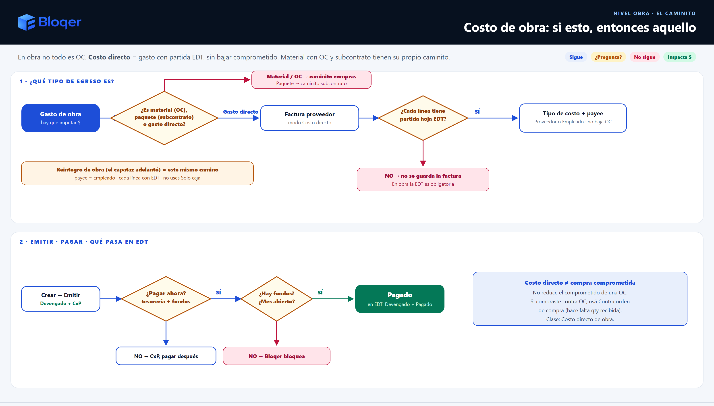

*Caminito de costo de obra (gasto directo). Material con OC y subcontrato tienen su propio flujo. Reintegro de obra = este camino, payee Empleado.*

#### Empresa (corporativo)

| Pantalla | Ruta / etiqueta |
|----------|-----------------|
| Facturas y gastos | `/finanzas/facturas-proveedor` → diálogo **Nueva factura de gasto** (borrador sin proyecto) |
| Alta rápida con pago | `/finanzas/transacciones` → **Gasto / factura** → **A quién se le paga** → opcional **Pagar ahora (egreso de caja)** |
| CxP | `/finanzas/cuentas-por-pagar` → `/[payableId]/pagar` (**Registrar pago**) |
| Detalle de pago | `/finanzas/pagos-proveedor/[paymentId]` |

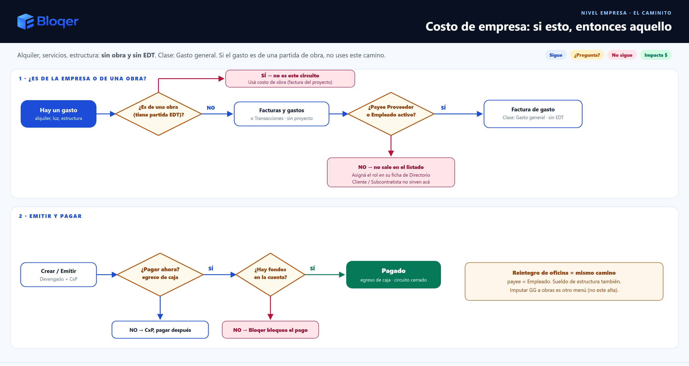

*Caminito de costo de empresa (alquiler, servicios, estructura). Si tiene partida EDT, no es este camino. Imputar GG a obras es otro menú.*

#### 12.2.1 Pagar un sueldo (registro de costo, no nómina)

Bloqer **no** liquida haberes ni aportes. Se registra el egreso como gasto corporativo ligado al empleado.

1. Directorio → el contacto existe con rol **Empleado** (activo).
2. Finanzas → **Transacciones** (`/finanzas/transacciones`) → **Registrar transacción**.
3. Tab **Gasto / factura**.
4. **A quién se le paga:** elegir al empleado (en el listado figura `Razón social · Empleado`, con fantasía entre paréntesis si es distinta).
5. Fecha, líneas (descripción p. ej. `Sueldo agosto 2026`, cantidad 1, importe).
6. Marcar **Pagar ahora (egreso de caja)** → cuenta de tesorería + fecha + método.
7. Confirmar. Queda factura emitida + CxP saldada + egreso de caja, **mapeado al contacto** (no solo en la descripción).

Variante sin pagar en el acto: **Facturas y gastos** → **Nueva factura de gasto** → **Crear factura** (borrador) → **Emitir** → pagar después desde CxP.

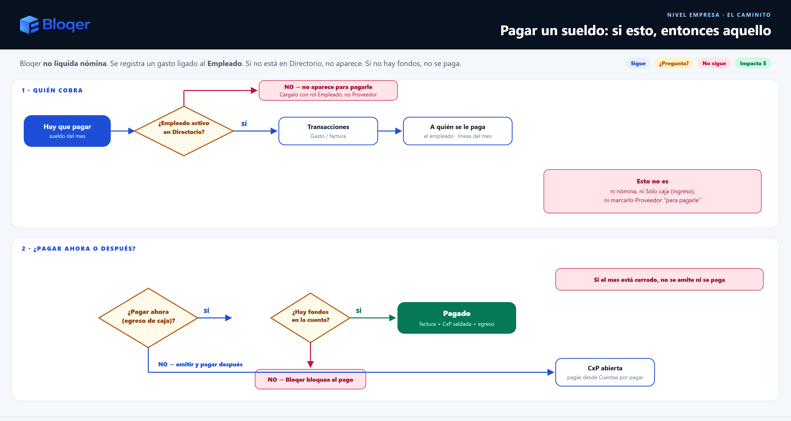

*Caminito de sueldo: no es nómina. Sin Empleado en Directorio no aparece. Sin fondos, Bloqer bloquea.*

#### 12.2.2 Reintegrar un gasto a un empleado

Mismo flujo que el sueldo. El empleado adelantó plata (combustible, ferretería, etc.) y la empresa se la devuelve.

1. Contacto con rol **Empleado**.
2. Transacciones → **Gasto / factura** → elegir al **empleado** (no al comercio donde compró, salvo que quieras cargar la factura fiscal de ese proveedor).
3. Descripción del gasto; **adjunto** del ticket/factura.
4. **Pagar ahora (egreso de caja)** o emitir y pagar después.

- **Empresa** (sueldo de estructura, reintegro de oficina): Transacciones / Facturas y gastos, **sin** proyecto.
- **Obra** (el capataz compró algo para la partida): Facturas de proveedor del **proyecto**, **sin OC**, cada línea con **partida EDT**, payee = empleado.

Si el “empleado” es monotributista y te pasa factura C: cargalo como **Proveedor** (y Empleado si también es de la casa) y registrá la factura fiscal, no un reintegro genérico.

**Registrar pago (obra o empresa):** cuenta de tesorería (misma moneda), fecha, monto a 2 decimales, **método de liquidación** + referencia opcional, notas. El default es el **saldo pendiente**; usarlo para saldar sin residual. Fondos insuficientes → error con disponible. Si el movimiento de caja ya está **Conciliado**, hay que desemparejar antes de cancelar el pago.

> **Notas de navegación y límites:**
> - Consulta consolidada de pagos: `/finanzas/transacciones` filtrando origen `PAYMENT` y egreso.
> - **Retenciones** manuales (sin módulo dedicado).
> - Cobros y pagos: **una sola moneda** por operación.
> - Export **CSV/PDF** desde CxP y Facturas y gastos corporativos.
> - Desde OC / recepción con cantidades recibidas: panel Facturación → **Registrar factura**.
> - Una factura originada por **certificación de subcontrato** no permite cambiar a quién se le paga.

<!-- capture:33 emitir-y-pagar-ahora-obra -->
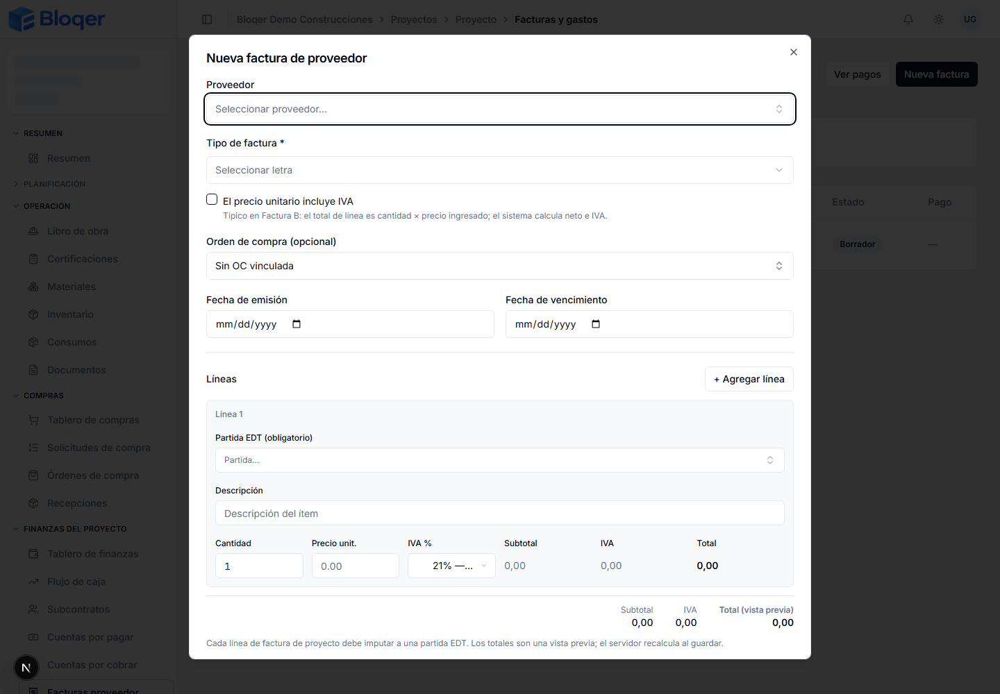

*Emitir y pagar ahora (obra).*

<!-- capture:34 cxp-corporativo-con-export -->
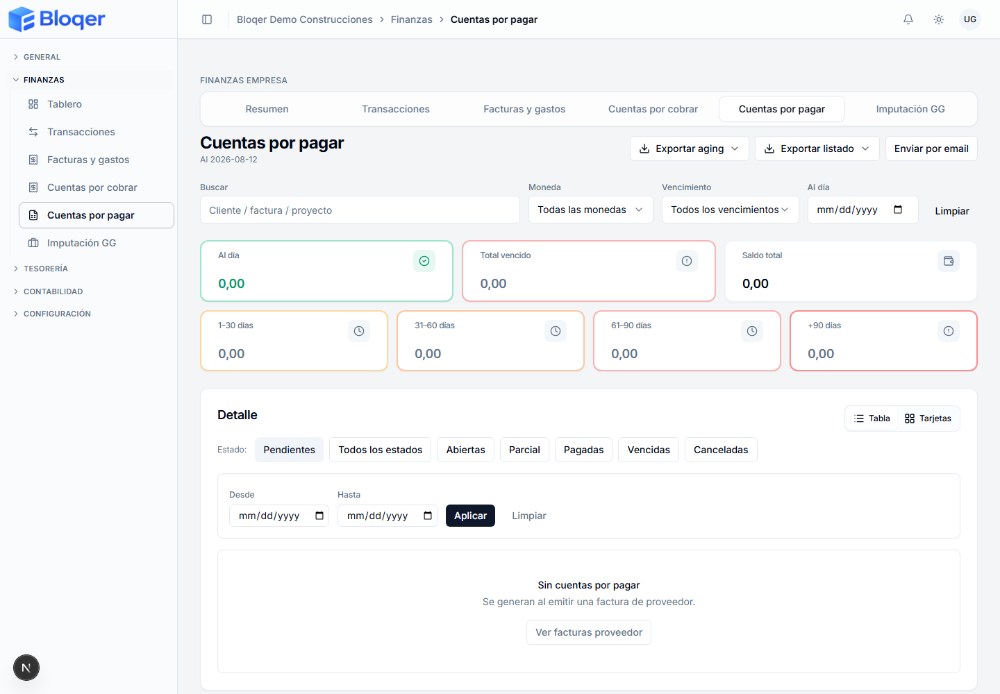

*CxP corporativo con export.*

<!-- capture:35 transacciones-pagos-proveedor -->
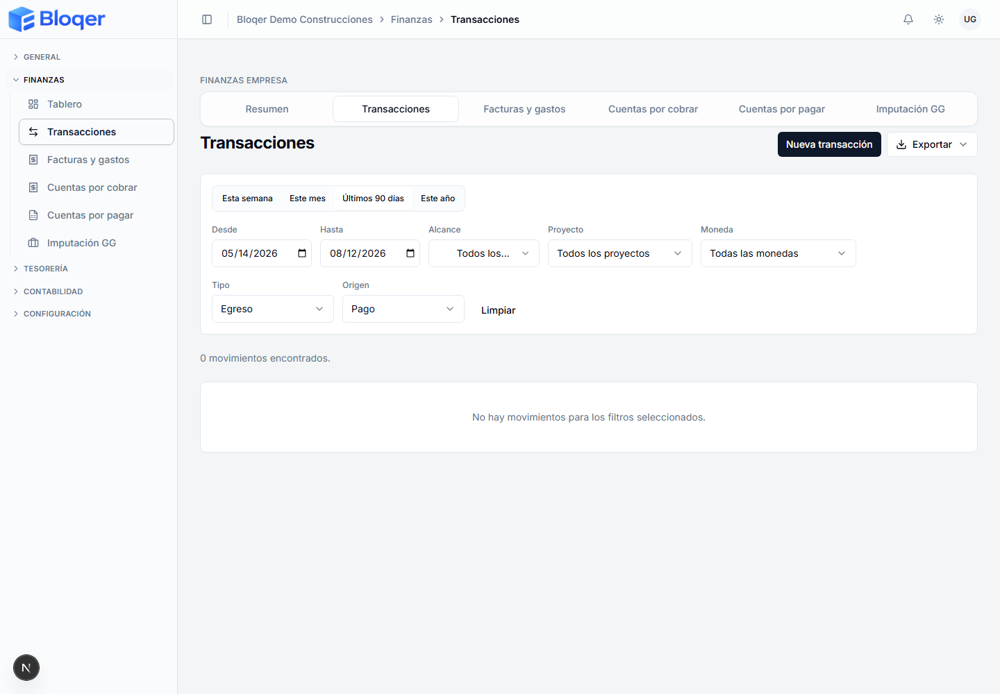

*Transacciones / pagos proveedor.*

---

## 13. EDT y costos, rentabilidad y reportes (nivel proyecto)

### 13.1 EDT y costos (control de costos)

- **Menú:** Planificación → **EDT y costos**.
- **Ruta:** `/proyectos/[id]/control-costos` (título de pantalla: **Estructura de Desglose de Trabajo y Costos**).
- **Detalle de partida:** en el listado, tocá una fila (código o nombre, p. ej. `1.1 Replanteo de Obra`) para abrir el detalle en un **diálogo**, sin salir del tablero. La misma UX aplica al tocar el código EDT en **Materiales / Mano de obra / Equipos** (Operativo y Varianza). La ruta directa `/control-costos/[wbsNodeId]` sigue disponible (p. ej. Ctrl+clic). En el detalle, secciones de cobertura APU **Materiales / Mano de obra / Equipos** enlazan al tablero operativo de esa partida (cantidades; el presupuesto dueño del nodo EDT se resuelve solo).
- Es el **tablero de control de costos** del proyecto. Materiales / Mano de obra / Equipos (cantidades) y Compras (documentos) alimentan este tablero; no lo reemplazan. **Subcontratos** (Compras) es el listado de paquetes contractuales — no es un tablero de cobertura APU como Materiales/MO/Equipos.
- Compara **presupuesto baseline vs. real** por partida EDT, en capas: **comprometido**, **recibido** (informativo), **devengado**, **pagado**, más **certificado acumulado**. Es el tablero de **afectaciones** por partida (§0.2). Arriba de la tabla, dos gráficos lado a lado: **Composición del presupuesto** (torta APU planificada) y **Gasto por tipo** (barras Presup / Devengado / Exposición por categoría, [D-099]). Y **vistas de columnas** (Financiero / Compacto / Cantidades / % Avance / Personalizado; preferencia en el navegador).
- **Filtro por tipo de costo ([D-099]):** en la barra superior, selector *Tipo de costo* (Todos / Materiales / Mano de obra / Equipos / Subcontratos / Otros). Al elegir un tipo, la tabla reemplaza los importes por los del bucket, oculta columnas de cantidad / recepción / avance libro / certificado (son atributos de la partida entera, no de un tipo), y los totales del proyecto se recalculan para ese tipo. El CSV / PDF respeta el filtro (queda en la URL como `?costType=`).
- **Desglose por tipo de costo ([D-099]):** en partidas hoja, el chevron junto al código EDT abre filas de solo lectura por categoría presente (Materiales / Mano de obra / Equipos / Subcontratos / Otros). El presupuesto por tipo viene del APU; el gasto tipado de OC, factura, subcontrato y consumo. Categorías vacías se ocultan. En el diálogo de partida, sección **Por tipo de costo**. El chevron se desactiva cuando el filtro por tipo está activo (redundante).
- **Tipo en OC / factura de obra:** cada línea tiene **Tipo de costo**. **Auto-tipado al elegir partida ([D-099]):** si el APU de la partida tiene una categoría dominante (≥ 60% del costo directo, o categoría única), la línea se pre-tipa con esa. Ej.: baño químico → EQP; excavación con retro (EQP ~70%) → EQP; movimiento de suelos con MAT/LAB/EQP parejo → MATERIAL con hint “varios tipos, elegí el correcto”. Si elegís un insumo APU específico, prevalece su categoría. Si cambiaste el tipo a mano, no se pisa al mover la partida.
- **Mano de obra externa ([D-099]/[D-109]):** no todo LAB es subcontrato. Contratás cuadrilla, empresa de albañilería o pagás un jornal como factura AP → tipo **Mano de obra** (tablero Operación → **Mano de obra**). Subcontrato con contrato + certificación (módulo Subcontratos) → **SUB**. Empleado propio con payee EMPLOYEE ([D-089]) → factura AP tipo **Mano de obra**. Alquiler de equipos → **Equipos** (tablero Operación → **Equipos**). No hay timesheet ni equipment log en v1.
- Si las líneas de factura de proveedor tienen partida EDT, el devengado/pagado se imputa **por línea**; si hay vínculo a línea de OC (`purchaseOrderLineId`, D-066), se usa esa partida; si no (legacy), se prorratea vía OC (D-055).
- **Exposición esperada** = **devengado + comprometido abierto** ([BR-COS-002] / [D-065]). Comprometido abierto = comprometido − devengado ligado al mismo compromiso. **No** usar `max(comprometido, recibido, devengado)` ni sumar OC + factura en bruto. Comprometido de OC = **neto** (`lineSubtotal`, [D-095]/[D-098]). Tipar por categoría **no cambia** las fórmulas: solo parte el mismo total.
- **% útiles:** % compra (comprometido/presup.), **% recepción** (costo recibido = cant. × PU neto de la OC / presup.; misma base que % compra), **% avance libro** (suma del % del día de partes APPROVED; si la partida nunca registró %, qty/presup. [D-045]), % económico (devengado/presup.), % exposición (exposición/presup.). Recibir el 100% de una OC chica no marca 100% de la partida. El **% recepción** puede ser 0 aunque el capataz haya cargado avance: no confundir con el libro. Un parte **SUBMITTED** todavía no mueve % avance libro. Facturas emitidas **sin vincular a la OC** no consumen el comprometido: la exposición suma OC + factura (aviso en el tablero). En el parte, editar % del día o cantidad mantiene el otro campo alineado al presupuesto de la partida.
- **Vista de columnas:** *Financiero* solo muestra montos ($), *Cantidades* separa qty y % avance libro / recepción, *% Avance* combina capas + %, *Compacto* deja lo mínimo (presupuesto, exposición, variación, %).
- **Detalle de partida (diálogo):** links a OC, subcontratos, facturas de proveedor y pagos (trazabilidad partida → documento); desglose por tipo.
- **Matching 3 vías (compras):** en detalle de OC, avisos si facturado supera recibido ± tolerancia de empresa ([D-067]); la recepción respeta tolerancia de sobrecantidad (0–5%).
- **Insumo APU en OC / factura tipada (opcional):** se puede ligar un insumo del APU de la partida para prellenar y para matchear cobertura en tableros MAT/LAB/EQP; la imputación de $ sigue en la partida EDT ([D-068] / [D-110] / [D-057]). En factura, el match de **cantidad facturada** prioriza `costAnalysisLineId` (no solo la descripción). El tipo de costo se sugiere desde la categoría APU ([D-099]).
- La ruta antigua `/reportes/presupuesto-vs-real` redirige acá ([D-098]).

**Smoke manual — trazabilidad partida → pago**

1. Planificación → **EDT y costos** → abrir una partida con saldo (diálogo).
2. Compras → crear/confirmar **OC** imputada a esa partida (insumo APU opcional; **Tipo** Materiales u otro).
3. Registrar **recepción**; crear **factura de proveedor** desde la OC (“Traer líneas”) y **emitir** (el tipo se hereda de la OC).
4. Opcional: factura directa tipada **LAB** o **EQP** a la misma partida → debe aparecer en el expand por tipo.
5. Registrar **pago** de la CxP.
6. Volvé a abrir la partida en el diálogo: deben aparecer links a OC, factura y pago; la exposición = devengado + comprometido abierto; **Por tipo de costo** separa MAT vs LAB/EQP si tipaste distinto.

<!-- capture:36 edt-y-costos -->
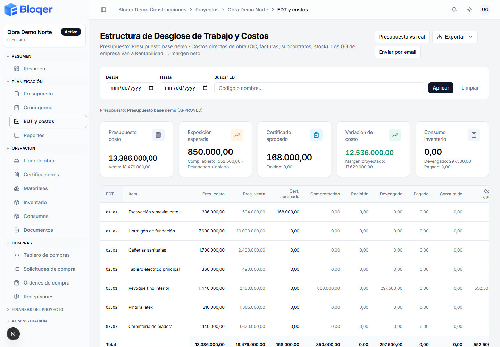

*EDT y costos.*

### 13.2 Rentabilidad y reportes

- **Tablero de finanzas de obra** (`/proyectos/[id]/finanzas`): después de la visión rápida del mes (mes calendario actual), **Tendencia mensual** a todo el ancho (ingresos vs gastos; rangos Este mes / 3 / 6 / 12 meses).
- **Hub de obra:** Planificación → **Reportes** → `/proyectos/[id]/reportes` (título: **Reportes del proyecto**). Las cards se agrupan en **Financieros** y **Operativos**.
- **Financieros:** aging CxC/CxP, **Caja y proyección**, **Flujo de caja (detalle)**, **Ingresos vs gastos**, **Rentabilidad**.
- **Operativos:** **EDT y costos** (control $ por partida + composición APU + gasto por tipo + filtro por tipo de costo, [D-099]), **Certificaciones**, **Proveedores** (`/reportes/proveedores`: tabla, líderes por pedidos/monto/saldo CxP, concentración), **Análisis de compras** (varianza OC vs APU, [D-044]; **no** solapa con EDT), **Materiales**, **Subcontratos**.
- **Proveedores de la obra:** `/proyectos/[id]/reportes/proveedores`. Resumen (cantidad, comprometido, exposición, pagado, saldo CxP, concentración top 3), líderes por **monto**, **pedidos** y **saldo a pagar**, y tabla por proveedor. El filtro Desde/Hasta recorta OC, facturas y recepciones; el **saldo CxP** es el abierto de hoy. Las certificaciones de subcontrato no entran (van a **Subcontratos**). Exportar CSV / PDF.
- **Rentabilidad:** `/proyectos/[id]/reportes/rentabilidad` (margen bruto; neto según overhead imputado, visible a `OWNER`/`ADMIN`).
- **Gastos generales de obra:** `/proyectos/[id]/reportes/gastos-generales` — compara **presupuesto GG** (partidas cuyo nombre/grupo sugiere «Gastos generales», «Indirectos» o código `GG…`) vs **gastado** = **devengado** en esas partidas + **devengado** sin partida EDT + **GG de empresa imputados** (OWNER/ADMIN; solo si la moneda coincide). El comprometido abierto se muestra aparte. Si hay varios presupuestos aprobados/cerrados, hay que elegir uno (igual que EDT). Export CSV. Requiere permiso de control de costos. No reemplaza EDT y costos ni la Imputación GG corporativa.
- **Hub de empresa:** General → **Reportes** → `/reportes` — mismas secciones **Financieros** (rentabilidad multi-obra, aging CxC/CxP, flujo de caja, GG por proyecto) y **Operativos** (portafolio, compras multi-obra, inventario) ([D-098]).
- **Exportar:** en cada pantalla de reporte, menú **Exportar** → **CSV** / **PDF** (o botón **Exportar PDF** si solo hay PDF). Contabilidad/tesorería/finanzas/inventario/registro siguen el mismo patrón; algunos libros ofrecen también XLSX.
- **Envíos programados por email:** `/proyectos/[id]/reportes/programados` (obra) y Configuración → **Reportes programados** → `/configuracion/reportes`. El listado muestra el catálogo por alcance (**Empresa general** / **Un proyecto**) y por sección (**Financieros** / **Operativos**). En el alta, elegí el alcance con las dos tarjetas. Formato **PDF** o **CSV (Excel)** según el reporte. *Presupuesto vs real* quedó absorbido por **EDT y costos** y no se ofrece en envíos nuevos. **Libro de obra — parte del día** ([D-100]): solo en alcance empresa, solo PDF, multi-obra ACTIVE, un adjunto por parte del día de la corrida (no aparece en el catálogo de una sola obra). En el detalle de un envío **Activo**, **Enviar ahora** (junto a Volver / Pausar / Eliminar) genera y manda el correo de inmediato; pide confirmación y **no** mueve la próxima ejecución programada. El job automático en Vercel Hobby corre **una vez al día** (05:05 UTC); si necesitás el adjunto ya, usá **Enviar ahora**.

---

## 14. Finanzas corporativas, gastos generales e inventario (nivel empresa)

- **Finanzas corporativas** (`/finanzas`): tablero con **Indicadores** en grilla 4+4 (no copia los KPIs de Tesorería: saldo / ingresos-egresos del mes). **Fila 1 (empresa):** Egresos imputados a obras · Egresos corporativos · Facturas borrador (siempre visible, también en 0) · Pagos esperados (90d) (C×P corporativas abiertas con vencimiento ≤90d, incluye vencidas). **Fila 2 (CxP/CxC):** C×P corporativas · C×P vencidas · C×C abiertas · C×C vencidas. Luego **Tendencia mensual** (ingresos vs gastos; rangos Este mes / 3 / 6 / 12 meses; pestaña Caja para tesorería), proyección de liquidez y actividad consolidada. Contabilidad se abre desde el menú **Contabilidad**, no desde una card del tablero.
- **Transacciones** (`/finanzas/transacciones`): alta rápida de **gasto corporativo (AP)** a proveedor o **empleado** ([D-089], §12.2), **factura/CxC corporativa (AR, D-051)** y **ingreso solo caja** (`TREASURY_INFLOW`, sin obligación). El listado es el ledger de caja operativa (sin transferencias internas). Clic en la descripción = detalle del movimiento.
- **Cuentas por cobrar empresa** (`/finanzas/cuentas-por-cobrar`): consolida obra + filas **Empresa**; detalle y cobranza corporativa en `/finanzas/cuentas-por-cobrar/[id]`.
- **Gastos generales / overhead** (`/finanzas/gastos-generales`): se **imputan a las obras** de forma **manual** o por **prorrateo automático** según el peso del costo directo, con **cierre de período**. *(Es un módulo complejo; conviene validar los cálculos en producción.)*
- **Inventario corporativo** (`/inventario`): hub con **Productos**, **Depósitos**, **Movimientos**, **Transferencias** y **Reportes** (misma subnav en todas las pantallas). Productos (`/inventario/productos`), depósitos (`/inventario/depositos`), movimientos (`/inventario/movimientos`, ledger append‑only; el saldo se calcula sumando movimientos), transferencias (`/inventario/transferencias`) y reportes (`/inventario/reportes`: **Stock actual** y **Movimientos** confirmados).

<!-- capture:37 inventario-con-subnav -->
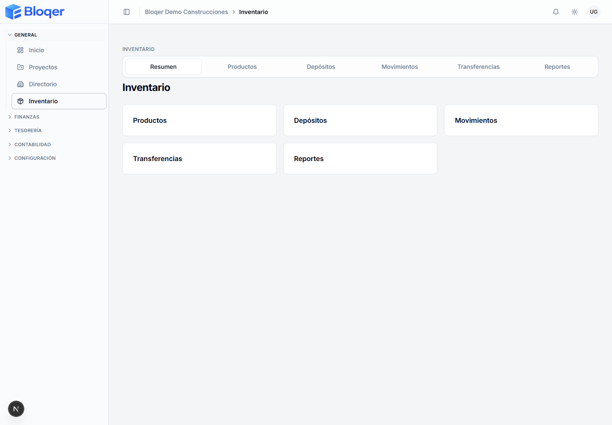

*Inventario con subnav.*

> **Limitación:** no hay **valuación de inventario FIFO/promedio** configurable; el costo se toma de la compra.

---

## 15. Contabilidad (nivel empresa) — D-061 · D-062 · D-063

Contabilidad **gerencial interna** (libro mayor). No sustituye estados oficiales, AFIP ni ajuste por inflación. Visible solo para roles de company finance (§2.5).

### 15.0 Procedimiento — Puesta en marcha (una vez por empresa)

1. Confirmar módulo Contabilidad habilitado y usuario con permiso de editar/contabilizar.
2. Ir a **Contabilidad → Cuentas** (`/contabilidad/cuentas`).
3. Si el plan está vacío: **Aplicar plantilla AR** (~40 cuentas típicas AR + reglas de mapeo). Es **idempotente por código** (reaplicar no duplica).
4. Revisar **Reglas** (`/contabilidad/reglas`): mapeo evento → cuentas Debe/Haber; ajustar si la empresa usa códigos propios.
5. Opcional: alta manual de cuentas (**Nueva cuenta**) si faltan rubros.

### 15.1 Pantallas (subnav)

| Etiqueta | Ruta | Para qué |
|----------|------|----------|
| Resumen | `/contabilidad` | KPIs: **Borradores**, **Contabilizados del mes**, **Resultado del mes**, **Activo a hoy** + card **Borradores pendientes** |
| Cuentas | `/contabilidad/cuentas` | Plan de cuentas; CTA **Aplicar plantilla AR** |
| Asientos | `/contabilidad/asientos` | Listado `DRAFT` / `POSTED` / `CANCELLED` |
| **Cierres** | `/contabilidad/cierres` | Cierre / reapertura mensual de tesorería + asientos (§15.3) |
| Reglas | `/contabilidad/reglas` | Mapeo evento → cuentas Debe/Haber |
| Libro diario | `/contabilidad/libro-diario` | Solo asientos `POSTED` |
| Sumas y saldos | `/contabilidad/sumas-y-saldos` | Trial balance por período |
| Situación | `/contabilidad/situacion-patrimonial` | ESP al corte (`asOfDate`) |
| Resultados | `/contabilidad/estado-resultados` | EERR del período |

Exports CSV/PDF (y XLSX en sumas, diario, ESP y EERR) desde `/api/reports/contabilidad/*`.

### 15.2 Procedimiento — Día a día (auto-DRAFT + posteo)

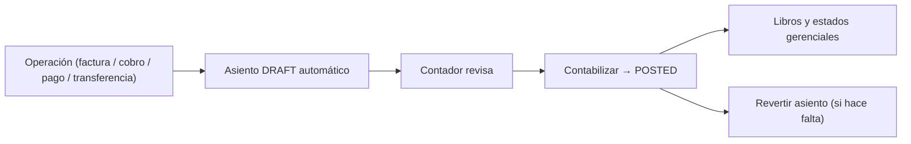
```mermaid
flowchart LR
  OP["Operación (factura / cobro / pago / transferencia)"] --> DRAFT["Asiento DRAFT automático"]
  DRAFT --> REV["Contador revisa"]
  REV --> POST["Contabilizar → POSTED"]
  POST --> REP["Libros y estados gerenciales"]
  POST --> REV2["Revertir asiento (si hace falta)"]
```

1. Operar finanzas con normalidad (facturas, cobros, pagos, transferencias). Cada hecho relevante **crea un asiento DRAFT** en segundo plano (soft: no bloquea la operación si falla la contabilidad).
2. Abrir `/contabilidad` y revisar card **Borradores pendientes**, o ir a **Asientos** filtrando borradores.
3. Abrir el asiento:
   - Si tiene **origen operativo** (sourced): montos/moneda/estructura **bloqueados** (D-063); sí se pueden ajustar **cuentas** y textos.
   - Si es **manual**: editable al 100%.
4. Pulsar **Contabilizar** → `POSTED`. **Nunca** se auto-posta.
5. Quienes editan contabilidad reciben aviso in-app (máx. uno cada 24 h por empresa) cuando hay borradores nuevos.
6. Corrección: **Revertir** un `POSTED` (crea asiento de reversa). Anular un borrador: **Anular borrador**.
7. Al **anular el documento origen**, se cancela el DRAFT vinculado. Si hay `POSTED` sin reverso, la anulación del origen **se bloquea**.
8. Correr reportes del período (Libro diario / Sumas y saldos / Situación / Resultados) — solo incluyen `POSTED`.

**Qué genera auto-DRAFT hoy**

| Origen | Asiento DRAFT |
|--------|----------------|
| Factura de venta emitida | Sí (devengo AR) |
| Factura de proveedor emitida | Sí (devengo AP) |
| Cobranza | Sí |
| Pago a proveedor | Sí |
| Transferencia interna | Sí |
| Ingreso corporativo solo caja (`TREASURY_INFLOW`) | Sí |
| Movimiento de tesorería cuyo origen ya es cobro/pago/apertura | **No** (anti doble conteo) |
| Consumo de stock / recepción | **No** aún (costeo diferido) |

> **Limitaciones:** sin cierre de **ejercicio** GL ni numeración correlativa de asientos; sí hay **cierre mensual operativo** (§15.3). Reportes gerenciales on-the-fly ≠ AFIP; multi-moneda por bloques sin consolidación FX; IVA/retenciones solo si hay cuentas en el plan.

<!-- capture:38 contabilidad-hub-plantilla -->
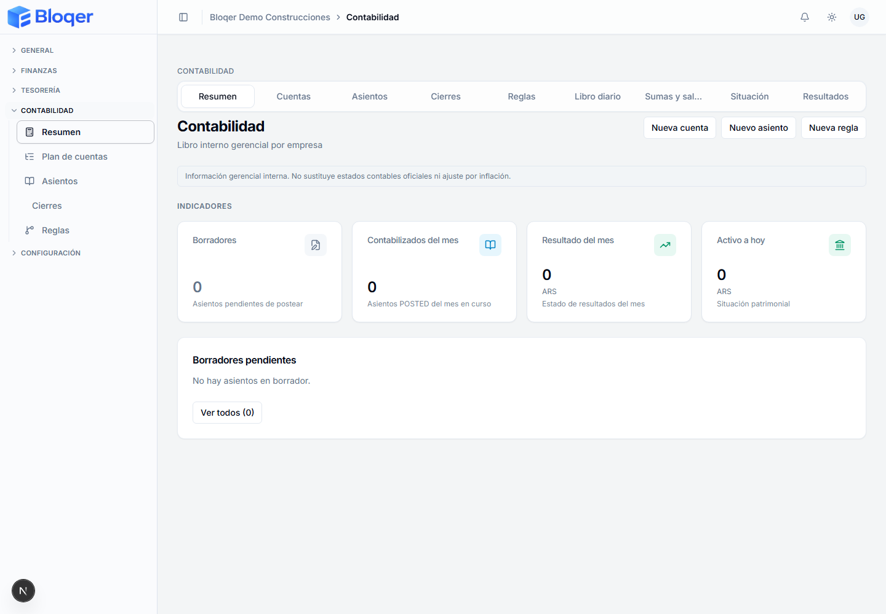

*Contabilidad hub + plantilla.*

<!-- capture:39 aplicar-plantilla-ar -->
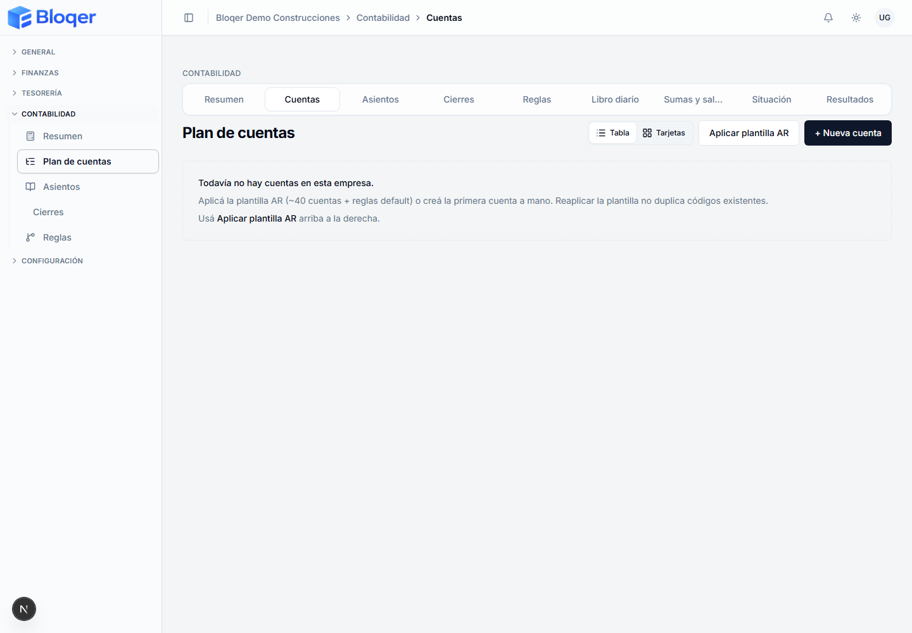

*Aplicar plantilla AR.*

### 15.3 Procedimiento — Cierre de períodos (bloqueo mensual) — [D-014] · [D-078]

Congela **movimientos de tesorería** y **asientos contables** cuya fecha cae en un mes cerrado. No es el cierre de gastos generales (GG / overhead), que es otro flujo en `/finanzas/gastos-generales`.

**Quién opera:** solo **OWNER** / **ADMIN** (permiso `PERIOD_CLOSE`). El módulo debe estar habilitado para el tenant.

#### Pasos — Cerrar

1. Ir a **Contabilidad → Cierres** (`/contabilidad/cierres`).
2. Verificar la empresa (si hay varias y el usuario no está anclado a una sola).
3. En la tabla **Períodos mensuales**, ubicar el mes (`YYYY-MM`) en estado **Abierto**.
4. Pulsar **Cerrar** → confirmar en el diálogo **Cerrar período**.
5. El período pasa a **Cerrado**. A partir de ahí, crear/editar/anular/postear/revertir con fecha en ese mes → error `PERIOD_CLOSED` (mensaje en español en pantalla).

#### Pasos — Reabrir

1. En el mismo listado, período **Cerrado** → **Reabrir**.
2. Ingresar **motivo obligatorio** (queda en auditoría).
3. El período vuelve a **Abierto**.

> **Orden recomendado del mes:** (1) terminar cobros/pagos, (2) **contabilizar** borradores del mes, (3) **conciliar** banco (§4.2), (4) **cerrar** el período. Cerrar antes de conciliar complica las correcciones.

> **No confundir**
> - **Cierre de período** (`/contabilidad/cierres`) = bloquea caja + GL del mes.
> - **Cierre de GG / overhead** (`/finanzas/gastos-generales`) = congela el prorrateo automático de gastos generales; **no** bloquea tesorería ni asientos.

<!-- capture:40 cierres-de-periodo-listado -->


*Cierres de período (listado).*

<!-- capture:41 dialogo-cerrar-periodo -->


*Diálogo Cerrar período.*

<!-- capture:42 dialogo-reabrir-con-motivo -->
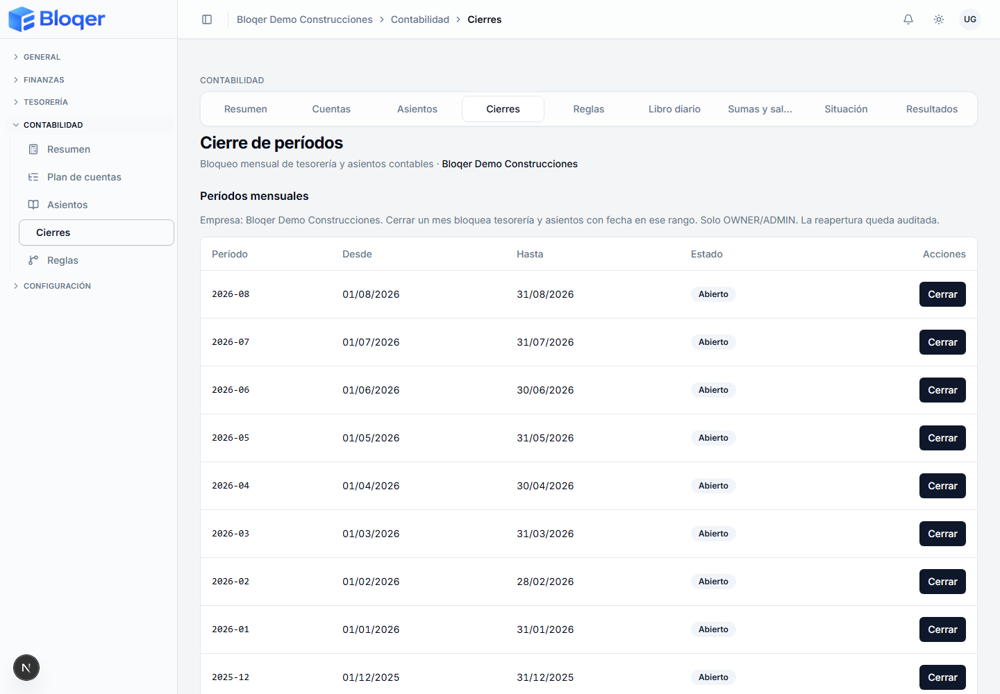

*Diálogo Reabrir con motivo.*

---

## 16. Qué acciones producen impactos económicos o contables

| Acción | Efecto económico | Efecto en tesorería | Efecto contable |
|--------|------------------|---------------------|-----------------|
| Aprobar presupuesto | Habilita baseline y certificaciones | — | — |
| Enviar/Aprobar/Devolver OC | Sin impacto económico (control de flujo y aprobación) | — | — |
| Confirmar OC | **Comprometido** | — | — |
| Recepción de OC | Ingreso de stock | — | — (sin auto-DRAFT aún) |
| Emitir factura de proveedor | **Devengado** + cuenta por pagar | — | **Auto-DRAFT** → Contabilizar a mano |
| Emitir y pagar ahora (AP) | Devengado + pagado en un paso | Movimiento `OUTFLOW` | Auto-DRAFT factura + Auto-DRAFT pago (no TREASURY duplicado) |
| Pago a proveedor | **Pagado** | Movimiento `OUTFLOW` (bloquea si fondos insuficientes) | **Auto-DRAFT** → Contabilizar |
| Certificación aprobada | **Certificado** | — | — |
| Emitir factura de venta | **Facturado** + cuenta por cobrar | — | **Auto-DRAFT** → Contabilizar |
| Cobranza / Cobrar ahora (AR corporativo) | **Cobrado** | Movimiento `INFLOW` | **Auto-DRAFT** → Contabilizar |
| Transferencia interna | — | TRANSFER_OUT + TRANSFER_IN | **Auto-DRAFT** → Contabilizar |
| Ajuste manual de cuenta | — | Movimiento `ADJUSTMENT` confirmado | Según reglas (si aplica) |
| Emparejar en conciliación | — | Movimiento → estado **Conciliado** | — |
| Cerrar conciliación | — | Sesión `CLOSED`; matches congelados | — |
| Cerrar período contable | Bloquea mutaciones del mes | No crea movimientos; **impide** crear/anular en fechas cerradas | Impide postear/anular/revertir asientos del mes |
| Aprobar cert. de subcontrato | **Devengado** (factura proveedor DRAFT) | — | Al **emitir** la factura → Auto-DRAFT |
| Imputar / cerrar GG (overhead) | Afecta rentabilidad neta | Según pago | Independiente del cierre de período GL |

### Diferencias entre estados económicos

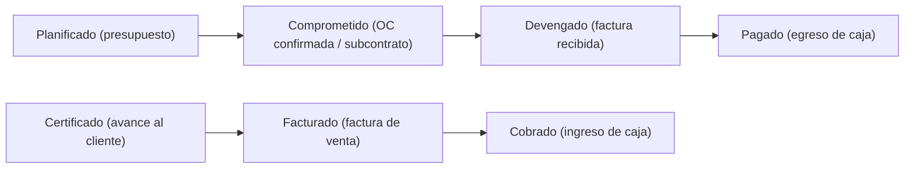
```mermaid
flowchart LR
  PLAN["Planificado (presupuesto)"] --> COMP["Comprometido (OC confirmada / subcontrato)"]
  COMP --> DEV["Devengado (factura recibida)"]
  DEV --> PAG["Pagado (egreso de caja)"]
  CERT["Certificado (avance al cliente)"] --> FAC["Facturado (factura de venta)"]
  FAC --> COB["Cobrado (ingreso de caja)"]
```

---

## 17. Errores operativos a evitar

| Error | Consecuencia | Orden correcto |
|-------|--------------|----------------|
| Certificar sin presupuesto aprobado | Bloqueo o datos inválidos | Aprobar el presupuesto primero |
| Modelar insumos (hierros, etc.) como hijos EDT | Partidas certificables falsas / doble multiplicación | Insumos en el **APU** de la partida (D-057); ver filas APU expandibles (D-059) |
| Crear línea de compra o factura de obra sin partida EDT | El sistema lo rechaza | Imputar cada línea a una **partida hoja**; gastos generales → partida de indirectos |
| Aprobar tu propia OC cuando no corresponde | Sin segregación de funciones | Que apruebe otro; la autoaprobación depende de la política y del umbral |
| Confundir avance de Gantt con certificado | Reportes incoherentes | Real = libro de obra; Certificado = certificaciones |
| Sumar OC + factura como costo total | Doble conteo | Usar **exposición esperada** |
| Editar fechas de un contenedor del cronograma | Se pisa con el rollup | Editar solo hojas |
| Pagar sin factura/devengado | Caja sin respaldo | Factura → cuenta por pagar → pago (o Emitir y pagar ahora) |
| Duplicar contactos por rol | Datos partidos | Un contacto con múltiples roles |
| Marcar al empleado como **Proveedor** solo para pagarle | Ensucia el listado de OC | Rol **Empleado**; gasto sin OC (§12.2.1) |
| Pagar un subcontrato con OC o gasto genérico | Doble conteo / payee incorrecto | Certificar → emitir la factura del subcontrato (§10) |
| Creer que en obra todo pasa por OC | Subcontratos y reintegros mal cargados | OC = materiales; Subcontrato = paquete; gasto sin OC = reintegro/chico (§9) |
| Usar **Solo caja** (ingreso) para reintegrar a un empleado | El movimiento entra en vez de salir | Tab **Gasto / factura** + **Pagar ahora (egreso de caja)** |
| Creer que “apareció el borrador” = ya está contabilizado | Libros (diario/sumas/ESP) vacíos o desfasados | Revisar borradores y **Contabilizar**; los reportes solo usan `POSTED` |
| Dar company finance a PM/Compras “para ver más” | Ven hub/caja/GL de empresa | Usar roles de proyecto / `PROJECT_FINANCE` (D-056) |
| Cobrar/pagar esperando conversión de moneda | Descalce | Operar en la misma moneda de la cuenta |
| Reescribir el monto “a ojo” al pagar el total | Residual o rechazo | Usar el saldo pendiente que muestra el sistema (2 decimales); click en el saldo para autocompletar |
| Pagar con cuenta sin fondos | Operación bloqueada | Verificar saldo de tesorería antes |
| Esperar “Cobrar ahora” al crear factura de obra | No existe (diferido) | Cobrar desde CxC del proyecto |
| Buscar Recepciones bajo Operación | No aparece | Menú **Compras → Recepciones** |
| Cancelar pago/cobranza con movimiento **Conciliado** | Bloqueo | Desemparejar (o reabrir sesión) y recién entonces cancelar |
| Operar caja en un mes **Cerrado** | Error `PERIOD_CLOSED` | Reabrir el período (OWNER/ADMIN + motivo) o usar fecha de mes abierto |
| Confundir cierre de período con cierre de GG | Expectativa incorrecta | Cierres GL = `/contabilidad/cierres`; GG = `/finanzas/gastos-generales` |
| Cerrar el mes antes de conciliar / postear | Correcciones bloqueadas | Conciliar + Contabilizar → recién ahí Cerrar |

---

## 18. Checklists por rol

> **Hábitos diarios / semanales** (esta sección). Para un **smoke verificable** con rutas y criterios PASS/FAIL por rol (capacitación / UAT), usar  
> [`08-architecture/OPERATIONAL_SMOKE_CHECKLIST_BY_ROLE.md`](./08-architecture/OPERATIONAL_SMOKE_CHECKLIST_BY_ROLE.md) (J-02).

### Dueño / Director

- [ ] Usuarios y roles asignados (mínimo un `OWNER`/`ADMIN`); company finance solo a quien corresponda (D-056)
- [ ] Módulos habilitados confirmados con el proveedor del servicio (incl. Tesorería, Conciliación, Contabilidad, Cierre de períodos)
- [ ] Cuentas de tesorería creadas con saldo de apertura
- [ ] Contabilidad: **Aplicar plantilla AR** si el plan está vacío
- [ ] Revisión periódica de finanzas corporativas (`/finanzas`) y rentabilidad neta
- [ ] Campana / inbox y **Alertas operativas** revisadas (`/notificaciones/alertas`)
- [ ] Reportes programados revisados
- [ ] Comprender: los asientos **nacen en borrador** solos, pero hay que **Contabilizarlos**
- [ ] Cierre de mes: cobros/pagos OK → borradores contabilizados → conciliaciones cerradas → **Cerrar período** (`/contabilidad/cierres`)
- [ ] Si hay que corregir un mes cerrado: **Reabrir** con motivo auditado

<!-- capture:43 alertas-ultima-actividad -->
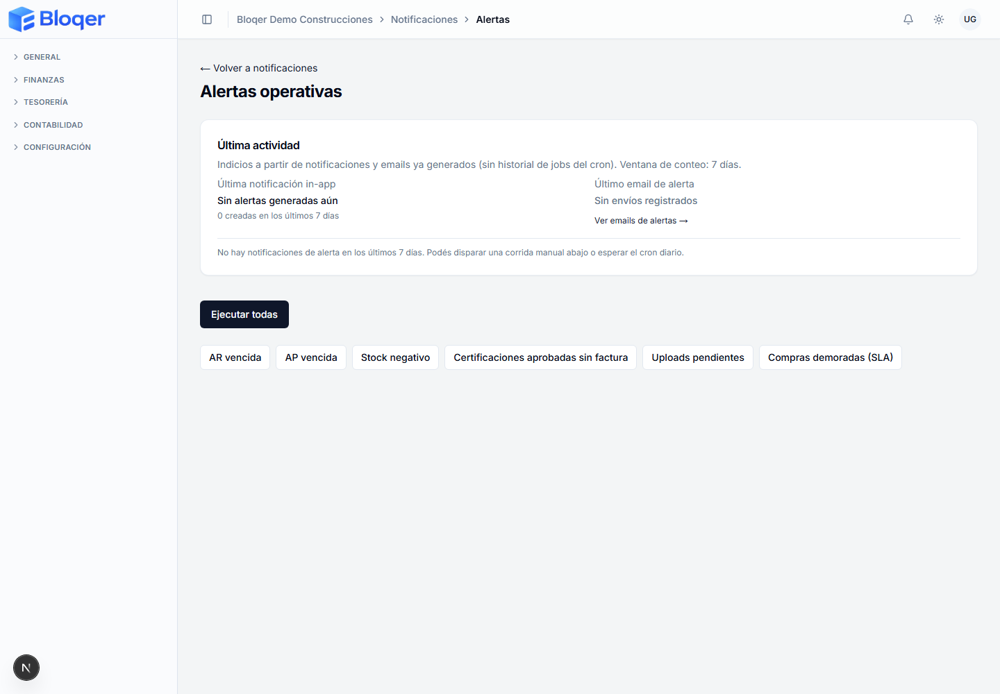

*Alertas · Última actividad.*

<!-- capture:44 reportes-programados-omitido-fallido -->
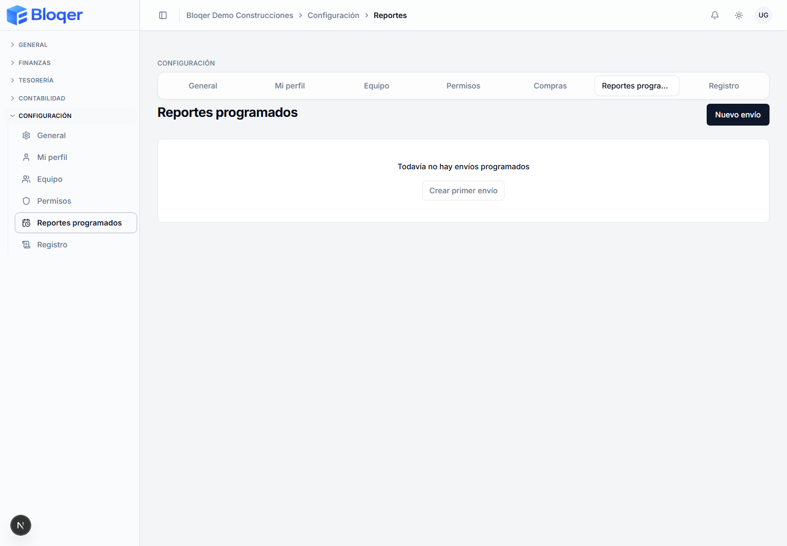

*Reportes programados (Omitido ≠ Fallido).*

### Project Manager / Jefe de obra

- [ ] Proyecto en `ACTIVE`
- [ ] Presupuesto `APPROVED`/`CLOSED` (un solo APPROVED por obra)
- [ ] Partidas medibles con APU; **insumos en APU**, no como hijos EDT (D-057)
- [ ] Cronograma con fechas en hojas y dependencias FS
- [ ] Partida EDT primaria en tareas críticas
- [ ] Libro de obra al día y aprobado (materiales con partida EDT si hay varias partidas)
- [ ] Tablero **Materiales** revisado (faltantes → Pedir)
- [ ] Certificaciones periódicas (y CTA a factura cuando corresponda)
- [ ] Recepciones (Compras) y consumos (Operación) al día
- [ ] **EDT y costos** revisado semanalmente (tablero de $; Materiales = cantidades; Compras = documentos)
- [ ] Smoke: partida → OC → factura → pago visible en el diálogo de la partida en EDT y costos

### Capataz

- [ ] Parte diario cargado (clima, cuadrilla, avance por partida EDT, fotos)
- [ ] Parte enviado (`SUBMITTED`) para aprobación del PM
- [ ] Materiales consumidos registrados (listado `/consumos`); partida EDT del material si el parte toca varias partidas

### Compras

- [ ] Política de compras revisada en `/configuracion/politicas`
- [ ] Tablero **Materiales** / **Tablero de compras** como punto de partida del faltante
- [ ] Todas las líneas con **partida EDT** (indirectos → partida de gastos generales)
- [ ] Solicitudes cotizadas (mínimo según política), comparando **precio y plazo**
- [ ] Desvíos de precio con **justificación** cuando corresponde
- [ ] OC enviada → aprobada (o **devuelta con motivo**) → **confirmada** al proveedor
- [ ] Recepciones registradas (menú **Compras → Recepciones** o desde la OC)
- [ ] Facturas de proveedor con partida EDT (desde OC o alta manual)
- [ ] Tras emitir factura/pago: verificar partida en **EDT y costos** (no solo en Materiales)

### Administración / Finanzas / Tesorería

- [ ] Facturas de venta emitidas desde certificaciones (o venta directa / anticipo)
- [ ] Cobranzas de obra aplicadas desde CxC del proyecto (click en saldo para autocompletar); revisar avisos **Listo para cobrar** ([D-072]) tras emitir facturas
- [ ] Ingresos corporativos con CxC desde Transacciones (Factura / cuenta por cobrar) cuando corresponde
- [ ] Ingresos solo caja (sin CxC) solo cuando no hay obligación de cobro
- [ ] CxC empresa revisadas en `/finanzas/cuentas-por-cobrar` (filas **Empresa**)
- [ ] Facturas de proveedor de obra: borrador → emitir, o **Emitir y pagar ahora** si hay permiso de tesorería
- [ ] Gastos corporativos desde Facturas y gastos / Transacciones (**A quién se le paga** = proveedor o empleado)
- [ ] Sueldos y reintegros mapeados al contacto con rol **Empleado** (§12.2.1 / §12.2.2); no solo texto en la descripción
- [ ] CxP revisadas; pagos con saldo a 2 decimales; fondos suficientes en la cuenta
- [ ] Exports CSV/PDF de CxP / facturas / transacciones corporativas cuando haga falta
- [ ] **Conciliación bancaria** del mes: importar extracto → emparejar → **Cerrar conciliación** (§4.2)
- [ ] Ajustes manuales de caja solo con motivo documentado (§4.3)
- [ ] Reportes de flujo de caja y aging revisados
- [ ] Si también tienen contabilidad: revisar **Borradores pendientes** del hub
- [ ] Pedir a OWNER/ADMIN el **cierre de período** cuando el mes quedó cerrado (§15.3)

### Contabilidad

- [ ] **Aplicar plantilla AR** (o plan de cuentas propio) + reglas de mapeo
- [ ] Revisar **Borradores pendientes** tras el día operativo
- [ ] **Contabilizar** asientos DRAFT (y **Revertir** si hay corrección)
- [ ] Correr Sumas y saldos / Libro diario / Situación / Resultados del período
- [ ] Exportar libros cuando haga falta (CSV/PDF/XLSX)
- [ ] Coordinar con tesorería: conciliación del mes antes del cierre
- [ ] Pedir / ejecutar **Cerrar período** del mes (OWNER/ADMIN) en `/contabilidad/cierres` cuando corresponda
- [ ] Recordar: gerencial ≠ AFIP; stock aún sin auto-asiento

---

## 19. Limitaciones actuales

| Limitación | Detalle |
|------------|---------|
| **Contabilidad: sin auto-POST** | Los asientos **sí** se crean en `DRAFT` solos (D-061); hay que **Contabilizar** a mano. Stock/consumos aún **sin** auto-DRAFT. Hay **cierre mensual operativo** (§15.3); **no** hay cierre de ejercicio GL ni numeración correlativa. Reportes gerenciales ≠ AFIP. |
| **Conciliación bancaria** | **Implementada** (manual + CSV/OFX, §4.2). **No** hay conexión API directa con el banco (integración futura). |
| **Contratos, adendas y órdenes de cambio** | Entidades formales Contract/CO no implementadas (Q-057). Adenda operativa = presupuesto hijo con `parentBudgetId` (UI **Crear adenda / fase**). |
| **RFIs** | No implementados. |
| **Multi‑moneda en tesorería** | Cobros, pagos y transferencias exigen misma moneda. Contabilidad: bloques por moneda sin consolidación FX. |
| **Valuación de inventario** | Sin política FIFO/promedio configurable; por eso el costeo de stock no auto-asienta aún. |
| **Impuestos / retenciones** | Solo IVA por línea; retenciones manuales, sin módulo dedicado. |
| **Documentos** | Si R2 no está configurado: metadata + badge **PLACEHOLDER**; la descarga explica el límite. |
| **Anticipo a proveedor** | Servicio stub (ADR-013); **sin** CTA en UI. |
| **Cobrar ahora en factura de obra** | Disponible en alta manual de factura de proyecto ([D-077] / Q-055); requiere `EDIT TREASURY`. Certificación sigue: emitir → cobrar aparte. Corporativo: cobro opcional en Transacciones. |
| **Ajustes de caja** | **Hay UI** de ajuste manual por cuenta (§4.3). Ajustes de **stock** siguen sin pantalla dedicada de ajuste genérico. |
| **Notificaciones** | Sin Web Push / preferencias mute; polling 30 s en pestaña visible (D-054). Libro de obra: in-app + email ([D-091]). |
| **Permisos** | La matriz es de solo lectura; los roles son fijos. Roster `ProjectTeamMember` solo para avisos ([D-091]); techos “solo su proyecto” (R-USR-007) aún sin enforcement. |
| **Nómina / RRHH** | Bloqer **no** liquida haberes ni aportes. El sueldo se registra como **gasto** ligado al empleado (§12.2.1). |
| **Segundo factor (2FA)** | No disponible; acceso con Google o email/contraseña. |
| **DOCX de guía** | Un solo entregable: `guides/Guía_Operativa_Bloqer_v2.docx`. Regenerar con `node build_guide.js` tras editar **esta** MD. |

> Estas limitaciones **no impiden** el uso productivo del sistema, pero deben conocerse para no asumir capacidades que hoy son manuales o inexistentes.

---

## 20. Referencias

- Panorama ejecutivo: [`PANORAMA_GENERAL_BLOQER_V2.md`](./PANORAMA_GENERAL_BLOQER_V2.md)
- Relevamiento técnico y clasificación A–G: [`RELEVAMIENTO_TECNICO_FUNCIONAL_BLOQER_V2.md`](./RELEVAMIENTO_TECNICO_FUNCIONAL_BLOQER_V2.md)
- Plan de mejoras corto plazo: [`PLAN_MEJORAS_CORTO_PLAZO_BLOQER_V2.md`](./PLAN_MEJORAS_CORTO_PLAZO_BLOQER_V2.md)
- Smoke por rol (J-02): [`08-architecture/OPERATIONAL_SMOKE_CHECKLIST_BY_ROLE.md`](./08-architecture/OPERATIONAL_SMOKE_CHECKLIST_BY_ROLE.md)
- Changelog UI Lotes 1–6 (autores): [`guides/CHANGELOG_UI_LOTES_1_6.md`](./guides/CHANGELOG_UI_LOTES_1_6.md)
- Decisiones recientes: [D-050](./00-product/DECISION_LOG.md)–[D-055](./00-product/DECISION_LOG.md) (compras/EDT/AR/AP/decimales/notif) · [D-056](./00-product/DECISION_LOG.md) (company vs project finance) · [D-057](./00-product/DECISION_LOG.md)–[D-060](./00-product/DECISION_LOG.md) (EDT/APU) · [D-061](./00-product/DECISION_LOG.md)–[D-063](./00-product/DECISION_LOG.md) (contabilidad) · [D-064](./00-product/DECISION_LOG.md) (invitación por email) · [D-072](./00-product/DECISION_LOG.md) (cobranza CxC) · [D-074](./00-product/DECISION_LOG.md) (método de liquidación) · [D-075](./00-product/DECISION_LOG.md)–[D-080](./00-product/DECISION_LOG.md) (conciliación / OFX / reapertura) · [D-078](./00-product/DECISION_LOG.md) (cierre de período) · [D-089](./00-product/DECISION_LOG.md) (payee AP: proveedor o empleado; tres caminos de egreso)
- Tesorería / conciliación: [`02-modules/TREASURY.md`](./02-modules/TREASURY.md), [`02-modules/BANK_RECONCILIATION.md`](./02-modules/BANK_RECONCILIATION.md), workflow [`05-workflows/RECONCILE_BANK.md`](./05-workflows/RECONCILE_BANK.md)
- Cierre de período: [`03-finance/PERIOD_CLOSE_AND_LOCKS.md`](./03-finance/PERIOD_CLOSE_AND_LOCKS.md), workflow [`05-workflows/CLOSE_PERIOD.md`](./05-workflows/CLOSE_PERIOD.md)
- Contabilidad: [`02-modules/ACCOUNTING.md`](./02-modules/ACCOUNTING.md), [`08-architecture/ACCOUNTING_LEDGER_ARCHITECTURE.md`](./08-architecture/ACCOUNTING_LEDGER_ARCHITECTURE.md)
- Notificaciones: [`02-modules/NOTIFICATIONS.md`](./02-modules/NOTIFICATIONS.md)
- Estados canónicos: [`01-domain/STATE_MACHINES.md`](./01-domain/STATE_MACHINES.md)
- Fórmulas de costo: [`04-formulas/COST_FORMULAS.md`](./04-formulas/COST_FORMULAS.md)
- Módulos: [`02-modules/EXPENSES_AND_PAYMENTS.md`](./02-modules/EXPENSES_AND_PAYMENTS.md), [`02-modules/SALES_AND_COLLECTIONS.md`](./02-modules/SALES_AND_COLLECTIONS.md), [`02-modules/WBS_AND_COST_ITEMS.md`](./02-modules/WBS_AND_COST_ITEMS.md)

---

## 21. Mantenimiento de esta guía (obligatorio para el equipo)

1. **Fuente viva (única):** este archivo (`GUIA_OPERATIVA_BLOQER_V2.md`). Se **sobrescribe** en el mismo path ante cada cambio de producto.
2. **Entregable cliente:** únicamente `docs/bloqer2.0/guides/Guía_Operativa_Bloqer_v2.docx`.
3. **Centro de ayuda in-app ([D-090](./00-product/DECISION_LOG.md)):** hermano de esta guía, no la reemplaza. Ruta `/ayuda`. Catálogo en `apps/web/features/help/`. Todo PR del punto 4 debe actualizar **también** las fichas afectadas (pasos, rutas, keywords, related). Ver [`08-architecture/HELP_CENTER.md`](./08-architecture/HELP_CENTER.md).
4. **Cuándo actualizar:** todo PR que cambie rutas, menús, etiquetas, flujos de OC/CxP/CxC/tesorería/conciliación/cierres/contabilidad, presupuesto/EDT, notificaciones, permisos visibles o reglas de montos.
5. **Cómo regenerar el DOCX:** `cd docs/bloqer2.0/guides && node build_guide.js`.
6. **Capturas:** los bloques `📷 Captura sugerida` del DOCX aparecen como cajas grises con título y tip; **reemplazalos** con pantallazos reales del producto (no inventar UI). Priorizar las marcadas en §§4.2, 4.3 y 15.3 si el entregable incluye los módulos nuevos.
7. **Smoke:** validar con [`OPERATIONAL_SMOKE_CHECKLIST_BY_ROLE.md`](./08-architecture/OPERATIONAL_SMOKE_CHECKLIST_BY_ROLE.md) si el cambio afecta operación diaria.

---

*Documento vivo. Actualizado septiembre 2026: tableros Mano de obra / Equipos ([D-109]), vínculo APU en factura ([D-110]), caminito MO/EQP, Pedir tipado desde faltante, varianza CSV neto. Antes: agosto 2026 — descuento % en líneas ([D-093]); centro de ayuda `/ayuda` ([D-090]); payee AP proveedor o empleado (D-089, §3 / §12.2), conciliación bancaria (§4.2), ajuste manual de caja (§4.3), cierre de períodos (§15.3), métodos de liquidación, estados Confirmado/Conciliado, invitaciones sin token en URL, menús Tesorería/Contabilidad. Actualizar en el mismo PR que el cambio de producto.*
