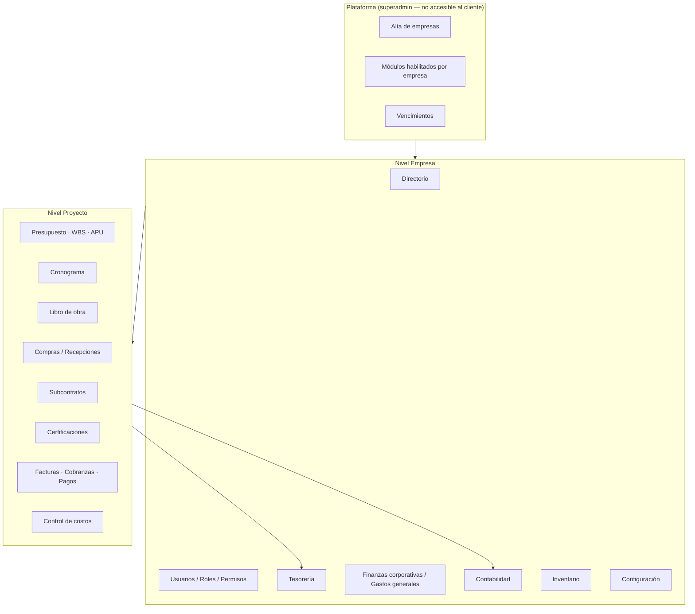
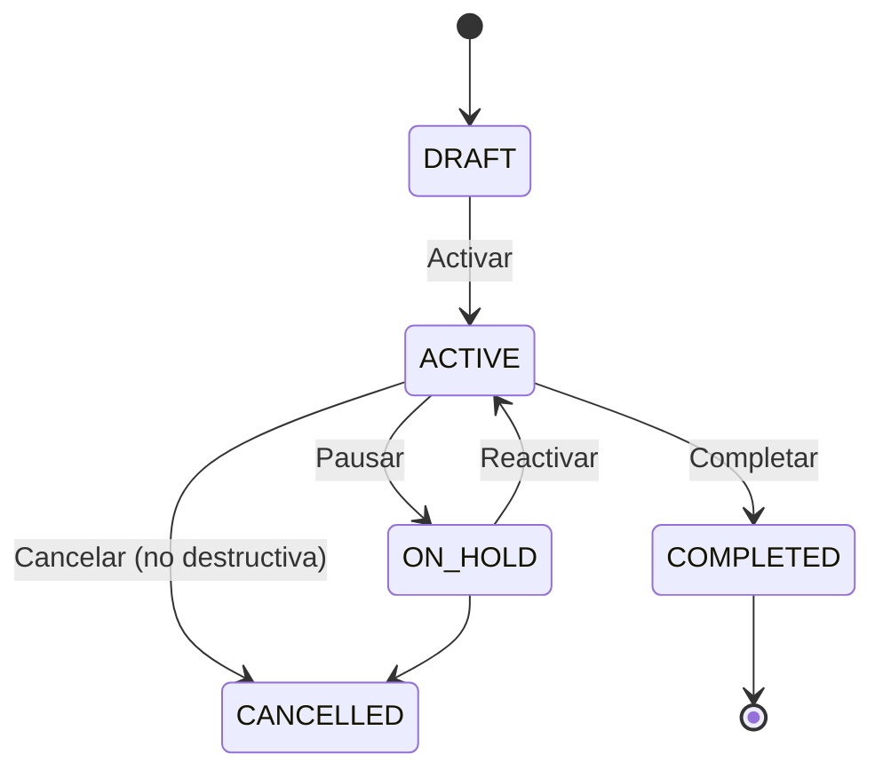
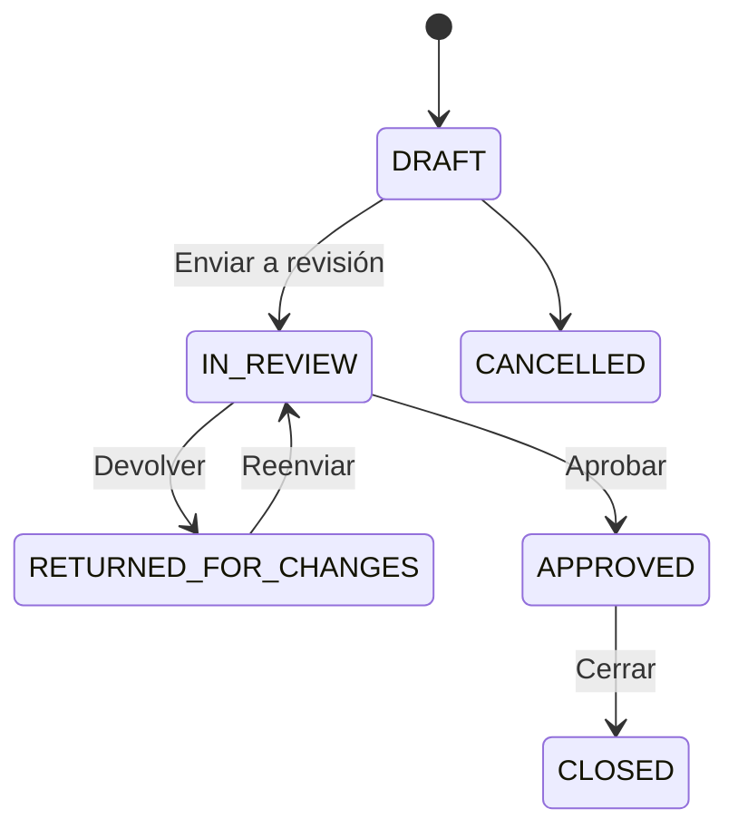
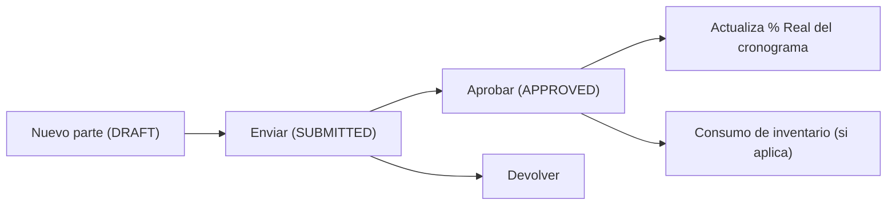
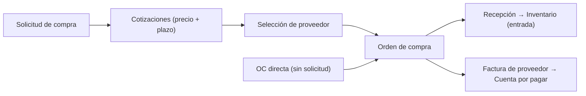
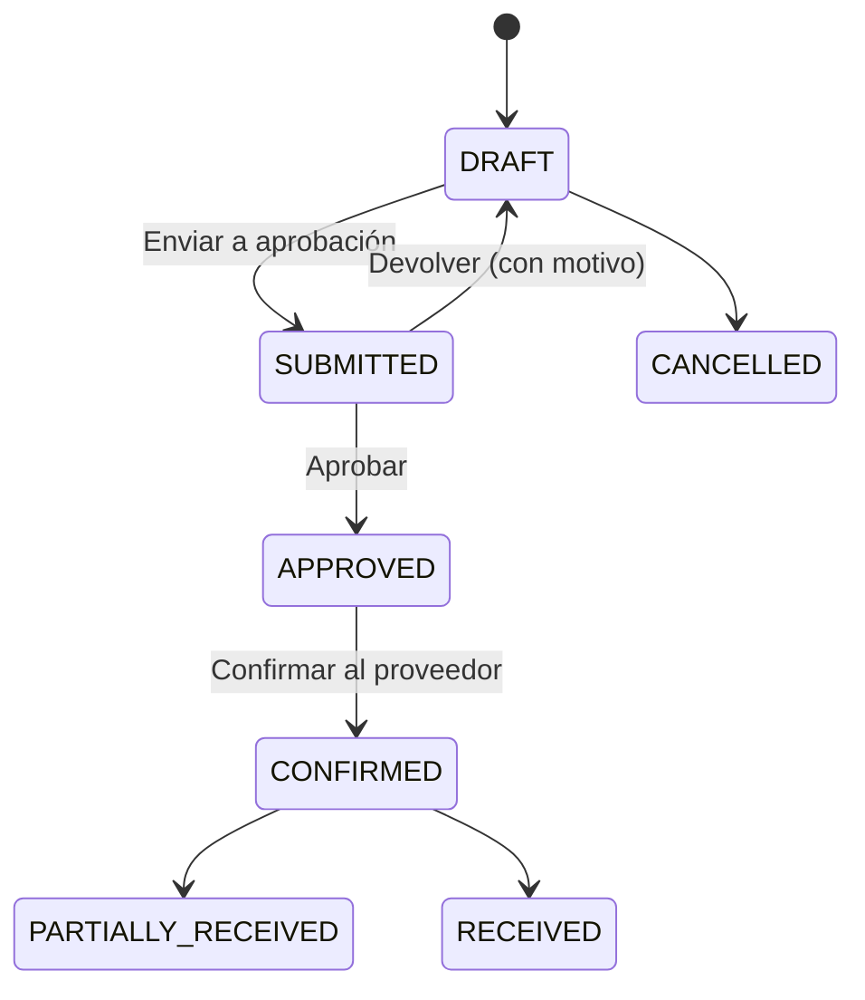
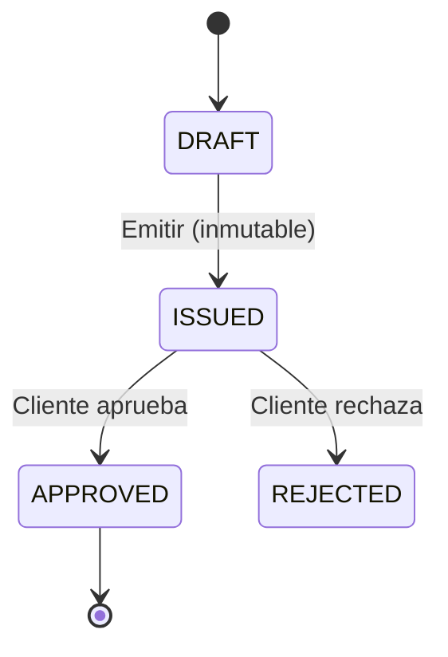
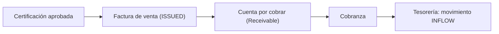
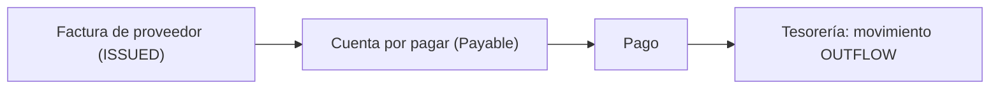
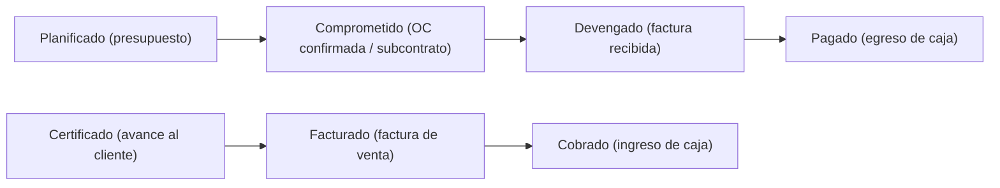

# Guía operativa — Bloqer v2 (revisada)

> **Audiencia:** dueños/directores, Project Managers, jefes de obra, capataces, compras, administración, finanzas, tesorería y contabilidad.
> **Alcance:** operación de punta a punta a **nivel empresa** y **nivel proyecto**, desde la configuración inicial hasta el control de costos, la facturación, la cobranza y el pago.
> **Base de evidencia:** rutas implementadas en `apps/web`, servicios en `packages/services`, enums en `packages/database/prisma/schema.prisma` y la spec funcional de `docs/bloqer2.0/`.
> **Regla de prevalencia:** cuando el texto de una pantalla o de la documentación difiere del comportamiento del código, esta guía describe **lo que hace el sistema hoy**.
> **Relación con otros documentos:** para la visión ejecutiva ver [`PANORAMA_GENERAL_BLOQER_V2.md`](./PANORAMA_GENERAL_BLOQER_V2.md); para el estado técnico y clasificación A–G ver [`RELEVAMIENTO_TECNICO_FUNCIONAL_BLOQER_V2.md`](./RELEVAMIENTO_TECNICO_FUNCIONAL_BLOQER_V2.md). Esta guía **no reemplaza** ni sobrescribe [`guides/GUIA_OPERATIVA_PROYECTO.md`](./guides/GUIA_OPERATIVA_PROYECTO.md), que se conserva como fuente original.
> **Capturas:** los bloques `📷 Captura sugerida` indican dónde insertar pantallazos reales en el DOCX / PDF. No inventar UI: fotografiar el producto actual (Lotes 1–7).

---

## 0. Cómo leer esta guía

Bloqer v2 trabaja en **dos niveles** más una consola de plataforma:

- **Nivel empresa (corporativo):** datos maestros y funciones transversales a todas las obras (directorio, usuarios, tesorería, finanzas corporativas, contabilidad, inventario, configuración).
- **Nivel proyecto (obra):** el corazón operativo; casi toda la actividad económica cuelga de un proyecto.
- **Plataforma (superadmin SaaS):** alta de empresas, habilitación de módulos y vencimientos. **No es accesible para los usuarios de la empresa**; la gestionan los administradores del servicio.

> Cada ítem de menú aparece **solo si** el usuario tiene el **permiso** correspondiente **y** el **módulo está habilitado** para la empresa.

---

## 1. Configuración inicial de la empresa (nivel empresa)

### 1.1 Ingreso y navegación

- Acceso mediante **inicio de sesión con Google** (`/login`). No hay usuario/contraseña propios ni segundo factor (2FA) al momento de este relevamiento.
- El **menú lateral de empresa** agrupa: **General · Finanzas · Tesorería · Contabilidad · Configuración**.
- Al entrar a una obra, el menú lateral se reemplaza por el **menú del proyecto**.

> **📷 Captura sugerida — Login Google**  
> Ruta: `/login` · Mostrar botón de Google y marca Bloqer · Tip: desktop, sin datos sensibles.

> **📷 Captura sugerida — Dashboard / menú empresa**  
> Ruta: `/dashboard` · Mostrar sidebar (General · Finanzas · Tesorería · Contabilidad · Configuración) + campana de notificaciones en el header · Tip: recortar solo shell + KPI principales.

### 1.2 Menú de empresa (rutas reales)

| Sección | Ítems (etiqueta → ruta) |
|---------|--------------------------|
| General | Inicio → `/dashboard` · Proyectos → `/proyectos` · Directorio → `/directorio` · Inventario → `/inventario` |
| Finanzas | Tablero → `/finanzas` · Transacciones → `/finanzas/transacciones` · Facturas y gastos → `/finanzas/facturas-proveedor` · Cuentas por cobrar → `/finanzas/cuentas-por-cobrar` · Cuentas por pagar → `/finanzas/cuentas-por-pagar` · Imputación GG → `/finanzas/gastos-generales` |
| Tesorería | Resumen → `/tesoreria` · Cuentas → `/tesoreria/cuentas` · Transferencias → `/tesoreria/transferencias` · Reportes → `/tesoreria/reportes` |
| Contabilidad | Resumen → `/contabilidad` · Plan de cuentas → `/contabilidad/cuentas` · Asientos → `/contabilidad/asientos` · Reglas → `/contabilidad/reglas` |
| Configuración | General → `/configuracion` · Mi perfil → `/configuracion/perfil` · Equipo → `/configuracion/equipo` · Permisos → `/configuracion/permisos` · Reportes programados → `/configuracion/reportes` · Registro → `/configuracion/registro` |

> Las **notificaciones** se abren desde la **campana del encabezado** (no tienen ítem propio en el menú lateral). Rutas: `/notificaciones`, `/notificaciones/alertas`, `/notificaciones/emails`.

### 1.3 Datos de la empresa

- **Ruta:** `/configuracion`.
- Datos de la empresa, preferencias de visualización y políticas (incluida la política de compras en `/configuracion/compras`, accesible desde la subnavegación de configuración).

> **📷 Captura sugerida — Configuración + acceso Compras**  
> Ruta: `/configuracion` · Mostrar card/enlace a política de compras · Tip: incluir subnav de configuración si está visible.

### 1.4 Módulos habilitados

- Cada empresa puede tener módulos **activos o inactivos**. La habilitación se administra desde la **consola de plataforma** (`/platform/tenants/[id]/modules`), no desde la empresa.
- **Comportamiento por defecto:** si nunca se creó una configuración de módulo para la empresa, **el módulo se considera habilitado** (default-on). Tenerlo en cuenta al asumir que algo está "apagado".

> **📷 Captura sugerida — Plataforma · módulos del tenant**  
> Ruta: `/platform/tenants/[id]/modules` · Mostrar columnas Explícita/Default-on y cobertura · Tip: solo para material interno del proveedor SaaS (no entregar al cliente final).

---

## 2. Usuarios, roles y permisos (nivel empresa)

### 2.1 Alta de usuarios

- **Ruta:** `/configuracion/equipo` → **Invitar** (`/configuracion/equipo/invitar`).
- El invitado acepta desde el email; queda como miembro con uno o más roles.
- Gestión de cada miembro: `/configuracion/equipo/[membershipId]`.

### 2.2 Roles disponibles (enum `UserRole`)

| Ámbito | Roles |
|--------|-------|
| Empresa | `OWNER`, `ADMIN`, `FINANCE`, `PROCUREMENT`, `WAREHOUSE`, `SALES`, `VIEWER` |
| Proyecto | `PROJECT_MANAGER`, `SITE_FOREMAN`, `PROJECT_VIEWER` |

- **Los roles son fijos** (no se crean roles personalizados).
- Un usuario puede tener **varios roles**; sus permisos efectivos son la **unión** de todos.

### 2.3 Modelo de permisos

- Acciones jerárquicas: **VER < EDITAR < APROBAR** sobre cada módulo.
- **Ruta:** `/configuracion/permisos` muestra la matriz de permisos. **Es una vista de solo lectura** (informativa); no se editan asignaciones desde ahí. Un banner lo aclara y remite a **Equipo** para asignar roles.
- En la matriz, algunos módulos aparecen como **no disponibles en esta versión** (p. ej. contratos, órdenes de cambio, RFIs, conciliación bancaria, impuestos): no hay pantallas operativas.
- La autorización se aplica **también en el backend** (servicios), no solo en la interfaz.

> **📷 Captura sugerida — Matriz de permisos (solo lectura)**  
> Ruta: `/configuracion/permisos` · Mostrar banner “solo lectura” + aviso de módulos no disponibles · Tip: no recortar el banner.

### 2.4 Reglas especiales

- Cierre de período y transferencia de empresa (tenant) están restringidos a `OWNER`/`ADMIN`.
- La **rentabilidad neta consolidada** es visible solo para `OWNER`/`ADMIN`; los demás ven rentabilidad **bruta**.

---

## 3. Directorio (nivel empresa)

- **Ruta:** `/directorio` (alta en `/directorio/nuevo`).
- Un **contacto único** puede tener **uno o varios roles**: **CLIENT** (mandante), **SUPPLIER** (proveedor), **SUBCONTRACTOR** (subcontratista).
- **Error a evitar:** dar de alta el mismo contacto dos veces cuando cumple varios roles. Usar siempre un contacto con múltiples roles.
- Se debe crear el **cliente** antes de crear el proyecto que lo referencia.

> **📷 Captura sugerida — Directorio / contacto con roles**  
> Ruta: `/directorio` o detalle de contacto · Mostrar roles CLIENT / SUPPLIER / SUBCONTRACTOR en un mismo contacto · Tip: datos demo, sin CUIT reales de clientes.

---

## 4. Tesorería (nivel empresa)

Configurar tesorería **antes** de operar cobranzas y pagos.

- **Cuentas** (`/tesoreria/cuentas`, alta en `/tesoreria/cuentas/nueva`): banco, caja o billetera, con **saldo de apertura**.
- **Movimientos:** se generan **automáticamente** al cobrar (ingreso) y pagar (egreso); se pueden **anular** con traza (nunca se borran).
- **Transferencias internas** (`/tesoreria/transferencias`): mueven fondos entre cuentas propias como **dos movimientos atómicos** (salida + entrada).
- **Reportes** (`/tesoreria/reportes`): posición de caja, movimientos y flujo de caja.

> **📷 Captura sugerida — Tesorería con subnav**  
> Ruta: `/tesoreria` · Mostrar `ModuleSubnav` (Resumen · Cuentas · Transferencias · Reportes) · Tip: incluir al menos una cuenta con saldo.

> **Terminología correcta:** los tipos de movimiento en el sistema son `INFLOW` (ingreso), `OUTFLOW` (egreso), `TRANSFER_IN`, `TRANSFER_OUT` y `ADJUSTMENT`. (La guía original mencionaba `INCOME`/`OUTCOME`; esos términos **no existen** en el código.)

> **Limitación actual (importante):** cobros, pagos y transferencias internas operan en **una sola moneda por operación**. **No hay conversión de moneda dentro de tesorería.** Cada documento guarda su moneda, tipo de cambio y monto en pesos, pero el movimiento de caja no convierte.

---

## 5. Crear y operar un proyecto (nivel proyecto)

### 5.1 Alta

- **Ruta:** `/proyectos/nuevo`.
- Campos: código, nombre, **cliente** (del directorio), **tipo de obra** y fechas contractuales (metadata, no reemplazan al cronograma).
  - **PUBLIC:** techo estricto de 100% en certificaciones.
  - **PRIVATE:** permite exceder el 100% con **nota obligatoria**.

### 5.2 Ciclo de vida (enum `ProjectStatus`)

- La **cancelación es no destructiva** (conserva datos y traza).
- **Menú del proyecto:** Resumen · Planificación · Operación · Finanzas del proyecto · Administración.

> **📷 Captura sugerida — Alta de proyecto**  
> Ruta: `/proyectos/nuevo` · Mostrar campos código, nombre, cliente, tipo PUBLIC/PRIVATE · Tip: no enviar sin completar cliente.

> **📷 Captura sugerida — Menú del proyecto (Operación)**  
> Ruta: cualquier `/proyectos/[id]/…` · Expandir sección Operación con **Recepciones** y **Consumos** visibles · Tip: captura clave post Lotes 1–3.

### 5.3 Menú del proyecto (rutas reales)

| Sección | Ítems (etiqueta → ruta relativa) |
|---------|----------------------------------|
| Resumen | Resumen → `/proyectos/[id]` |
| Planificación | Presupuesto → `/presupuestos` · Cronograma → `/cronograma` · WBS y costos → `/control-costos` · Reportes → `/reportes` |
| Operación | Libro de obra → `/libro-obra` · Certificaciones → `/certificaciones` · Recepciones → `/recepciones` · Inventario → `/inventario` · Consumos → `/consumos` · Documentos → `/documentos` |
| Finanzas del proyecto | Tablero de finanzas → `/finanzas` · Flujo de caja → `/flujo-caja` · Solicitudes de compra → `/solicitudes-compra` · Órdenes de compra → `/ordenes-compra` · Subcontratos → `/subcontratos` · Cuentas por pagar → `/cuentas-por-pagar` · Cuentas por cobrar → `/cuentas-por-cobrar` · Facturas proveedor → `/facturas-proveedor` · Facturas emitidas → `/facturas` |
| Administración | Configuración → `/editar` |

---

## 6. Presupuesto, WBS y APU (nivel proyecto)

**Ruta:** `/proyectos/[id]/presupuestos`

### 6.1 Estructura

- **WBS:** estructura de cómputo. Capítulos (`GROUP`) e ítems hoja (`ITEM`). **Solo los ítems hoja llevan APU**; los capítulos agregan totales.
- **APU (análisis de precio unitario)** por ítem hoja, con categorías: **MAT** (materiales), **LAB** (mano de obra), **EQP** (equipos), **SUB** (subcontratos), **OTHER** (otros).
- Se puede **importar desde Excel/CSV** o cargar manualmente.
- **Parámetros de venta** (BudgetSettings): gastos generales %, utilidad %, impuestos.

### 6.2 Ciclo de aprobación (enum `BudgetStatus`)

| Estado | Qué permite |
|--------|-------------|
| `DRAFT` | Editar WBS, APU y precios |
| `IN_REVIEW` | Solo revisión; economía bloqueada |
| `RETURNED_FOR_CHANGES` | Correcciones y reenvío |
| `APPROVED` | Economía congelada; habilita certificaciones y baseline de control de costos |
| `CLOSED` | Base contractual |
| `CANCELLED` | Anulado |

> **Hito clave:** con `APPROVED` o `CLOSED` se habilitan las certificaciones al cliente y el baseline de control de costos.

> **📷 Captura sugerida — Presupuesto aprobado / WBS**  
> Ruta: `/proyectos/[id]/presupuestos/[budgetId]` · Mostrar estado APPROVED + árbol WBS con un ítem hoja · Tip: copy de adenda operativa (sin “versión” formal).

### 6.3 Adendas — limitación actual

- Un cambio contractual se maneja hoy como **adenda operativa / presupuesto nuevo** del proyecto (copy de producto: **sin** “versión” formal automática).
- **Solo un presupuesto `APPROVED` por proyecto** a la vez.
- **No existe** un estado `SUPERSEDED` ni un vínculo formal padre‑hijo entre presupuestos. **Contratos, adendas y órdenes de cambio como entidades formales no están implementados** (ver §19).

---

## 7. Planificación: Cronograma (nivel proyecto)

**Ruta:** `/proyectos/[id]/cronograma`

- Un **cronograma** por proyecto, con **presupuesto base** opcional como referencia.
- **Vistas:** Gantt (`?view=gantt`), Calendario (`?view=calendar`), Kanban (`?view=kanban`), Tabla (`?view=table`).
- **Tipos de ítem:** `TASK` (tarea con duración) y `MILESTONE` (hito). Los **contenedores** derivan fechas de sus hojas (no se editan a mano).
- **Estados de ítem (enum `ScheduleItemStatus`):** `PLANNED`, `IN_PROGRESS`, `BLOCKED`, `COMPLETED`, `CANCELLED` (el Kanban se organiza por estos estados).
- **Dependencias:** solo **Finish‑to‑Start (FS)**. Las violaciones generan **advertencias**, no bloqueos.
- **Vínculo WBS ↔ cronograma:** cada tarea puede enlazar nodos WBS (uno primario), lo que habilita KPIs y el sync de avance real.

> **📷 Captura sugerida — Cronograma Gantt**  
> Ruta: `/proyectos/[id]/cronograma?view=gantt` · Mostrar tareas + hitos · Tip: una obra con 5–8 ítems alcanza.

### 7.1 Cuatro dimensiones de avance (no confundir)

| Dimensión | Fuente | Quién la mueve |
|-----------|--------|----------------|
| **Real** | `ScheduleItem.progressPct` | Libro de obra aprobado (o ajuste manual del PM) |
| **Plan (tiempo)** | Fechas vs. hoy | Automático |
| **Cantidades** | Cantidades físicas vs. presupuesto | Libro de obra |
| **Certificado** | Certificaciones emitidas | Módulo de certificaciones |

---

## 8. Ejecución: Libro de obra (nivel proyecto)

**Ruta:** `/proyectos/[id]/libro-obra`

### 8.1 Flujo diario

1. **Nuevo parte** con fecha (no futura), clima, cuadrilla, tareas y avance por WBS.
2. Adjuntar fotos y observaciones.
3. **Enviar** → `SUBMITTED`; el PM **aprueba** → `APPROVED`.

> **📷 Captura sugerida — Parte de obra (detalle)**  
> Ruta: `/proyectos/[id]/libro-obra/[logId]` · Mostrar avance por WBS + adjuntos · Tip: estado SUBMITTED o APPROVED.

### 8.2 Efectos al aprobar

- El parte queda **inmutable** (salvo anulación con motivo).
- Actualiza el **% Real** de las tareas con WBS primario enlazado.
- Los materiales con producto + depósito pueden generar **consumo de inventario** (salida de stock).

> **Nota de navegación:** el listado de consumos está en `/proyectos/[id]/consumos` (menú Operación → **Consumos**). El alta es `/consumos/nuevo`.

> **📷 Captura sugerida — Listado de consumos**  
> Ruta: `/proyectos/[id]/consumos` · Mostrar empty state con CTA o filas de consumo · Tip: no confundir con Inventario genérico.

---

## 9. Compras y abastecimiento (nivel proyecto)

> **Regla base (D-050): toda línea de compra —de solicitud o de orden— imputa obligatoriamente a un ítem WBS del presupuesto.** Los gastos generales/indirectos no quedan sin WBS: se imputan a la **partida de indirectos** correspondiente. Al elegir la partida se muestra el **costo referencial de materiales** y el **saldo de la partida** (presupuestado − comprometido) como ayuda; el saldo es una **alerta**, no un bloqueo.

### 9.1 Solicitudes de compra

- **Ruta:** `/proyectos/[id]/solicitudes-compra`.
- Flujo: crear `DRAFT` → **Enviar** (`SUBMITTED`, toma snapshot del costo presupuestario y de la cantidad por WBS) → **Cotizaciones** → **Seleccionar** → genera **OC en borrador**.
- **Cotizaciones comparables:** cada cotización registra **precio** y **plazo de entrega (lead time, en días)**, además de la validez y la referencia de presupuesto, para comparar por precio **y** plazo. El mínimo de cotizaciones es configurable por empresa.
- **Notificaciones:** al enviar una solicitud se avisa a compras/aprobadores (in‑app + email). Si una solicitud queda demorada sin cotizar, se emite un **recordatorio por SLA**.

### 9.2 Órdenes de compra

- **Ruta:** `/proyectos/[id]/ordenes-compra`.
- Ciclo (enum `PurchaseOrderStatus`): `DRAFT → SUBMITTED → APPROVED → CONFIRMED → PARTIALLY_RECEIVED / RECEIVED` (o `CANCELLED`).
- **Devolución para cambios:** un aprobador puede **devolver** una OC en `SUBMITTED` de vuelta a `DRAFT` indicando un **motivo**; el solicitante corrige y reenvía. Queda registrado quién y por qué.

**Flujo formal (un paso por acción):**

> El atajo “Emitir y confirmar (rápido)” fue **retirado**: la OC recorre siempre **Enviar → Aprobar → Confirmar** para preservar la segregación de funciones.

| Hito | Impacto económico |
|------|-------------------|
| **APPROVED** | Aprobación interna (segregación: quien solicita no aprueba, salvo autoaprobación habilitada por empresa y bajo umbral) |
| **CONFIRMED** | **Comprometido** en el control de costos |
| Recepción | Ingreso de stock + cantidades recibidas |
| Factura del proveedor | **Devengado** + cuenta por pagar |

- **Imputación:** cada línea se asigna a un nodo **WBS** ítem hoja (obligatorio).
- **Control de desvíos de precio** contra el costo referencial del presupuesto por tramos: alerta suave, **nota/justificación** requerida a partir de un umbral y **aprobación de administración** para desvíos altos. La justificación de desvío se guarda en la línea.
- **OC directa (sin solicitud):** permitida solo si la política de la empresa lo habilita. Por encima del umbral configurado exige **motivo de emergencia** y solo la puede autorizar administración (`OWNER`/`ADMIN`).
- **Notificaciones (in‑app + email):** OC pendiente de aprobación, aprobada, devuelta y confirmada; más **recordatorio por SLA** cuando una OC lleva demasiado tiempo pendiente de aprobación.

> **📷 Captura sugerida — OC confirmada con links**  
> Ruta: `/proyectos/[id]/ordenes-compra/[poId]` · Mostrar estado CONFIRMED + enlace a recepción / factura · Tip: incluir botones Enviar/Aprobar/Devolver según estado.

### 9.3 Recepciones

- **Menú:** Operación → **Recepciones** (`/proyectos/[id]/recepciones`).
- **Alta:** desde la OC → **Nueva recepción** (`/ordenes-compra/[poId]/recepciones/nueva`) o desde el listado de recepciones.
- Al confirmar, actualiza cantidades recibidas y puede generar **entrada de stock** si hay depósito/producto.

> **📷 Captura sugerida — Listado Recepciones**  
> Ruta: `/proyectos/[id]/recepciones` · Mostrar listado (no solo URL oculta) · Tip: captura clave Lote 1 D-01.

---

## 10. Subcontratos (nivel proyecto)

**Ruta:** `/proyectos/[id]/subcontratos`

1. Alta del contrato con un **subcontratista** del directorio; imputable a WBS categoría **SUB**.
2. **Certificaciones de subcontrato** (enum `SubcontractCertificationStatus`): `DRAFT → ISSUED → APPROVED` (o `REJECTED` / `CANCELLED`).
3. Al **aprobar** la certificación se genera (o se ofrece CTA hacia) una **factura de proveedor en borrador** (y con ello una cuenta por pagar), habilitando el pago.

> **📷 Captura sugerida — Cert. subcontrato con factura**  
> Ruta: `/proyectos/[id]/subcontratos/[subId]/certificaciones/[certId]` · Mostrar badge de estado de factura + CTA “Revisar y emitir” o “Ver factura” · Tip: Lote 3 B-03.

> **Corrección respecto de la guía original:** el estado intermedio es **`ISSUED`** (emitida), no `SUBMITTED`. Además, la certificación de subcontrato aprobada genera una **factura de proveedor (SupplierInvoice) en DRAFT**, que al emitirse crea la cuenta por pagar.

> **Limitación:** **retenciones y anticipos** de subcontratos no están modelados como entidad separada.

---

## 11. Certificaciones al cliente (nivel proyecto)

**Ruta:** `/proyectos/[id]/certificaciones`

### 11.1 Precondición

- Presupuesto `APPROVED` o `CLOSED`.

### 11.2 Emitir y aprobar (enum `CertificationStatus`)

1. **Nueva certificación** con período (desde/hasta).
2. Por ítem: **Δ% físico** y **$ económico** del período.
3. Validación de techos: obra **pública** bloquea si supera 100% acumulado; obra **privada** permite con **nota obligatoria**.
4. **Emitir** → `ISSUED` (inmutable). Marcar `APPROVED`/`REJECTED` según respuesta del mandante.

### 11.3 De la certificación a la factura

- La **factura de venta** se emite desde la certificación (`/proyectos/[id]/facturas`) y genera una **cuenta por cobrar (Receivable)**.
- Con certificación en `APPROVED`, la pantalla de detalle ofrece CTA **Emitir factura** (o muestra la factura ya vinculada).
- **No hay estado `INVOICED`** en la certificación: el estado de cobro se **deriva** de las cobranzas asociadas (por diseño).
- La emisión de la factura es un **paso manual**; la certificación aprobada **no crea la factura automáticamente**.

> **📷 Captura sugerida — Certificación cliente APPROVED**  
> Ruta: `/proyectos/[id]/certificaciones/[certId]` · Mostrar CTA **Emitir factura** o panel de factura vinculada · Tip: Lote 3 B-02.

---

## 12. Facturar, cobrar y pagar (nivel proyecto y empresa)

### 12.1 Ventas y cobranzas (AR)

- **Facturas de venta** (`/proyectos/[id]/facturas`, estados `DRAFT/ISSUED/CANCELLED`): una vez emitidas son inmutables; solo se pueden **anular**.
- **Cuentas por cobrar** (`/proyectos/[id]/cuentas-por-cobrar` y consolidado `/finanzas/cuentas-por-cobrar`), con aging.
- **Cobranzas** (`/proyectos/[id]/cobranzas`): ingresan dinero a una cuenta de tesorería (movimiento `INFLOW`) y reducen el saldo pendiente.
- **Venta rápida / anticipo** (`/proyectos/[id]/facturas/anticipo/nueva`): crea factura + cuenta por cobrar (+ cobro opcional) en un paso.

> **📷 Captura sugerida — Factura emitida → CxC / cobranza**  
> Ruta: `/proyectos/[id]/facturas/[invoiceId]` · Mostrar panel CxC vinculada + CTA Registrar cobranza · Tip: Lote 3 D-03.

### 12.2 Facturas de proveedor y pagos (AP)

- **Facturas de proveedor** (`/proyectos/[id]/facturas-proveedor` y consolidado `/finanzas/facturas-proveedor`).
- **Cuentas por pagar** (`/proyectos/[id]/cuentas-por-pagar` y `/finanzas/cuentas-por-pagar`), con aging.
- **Pagos** (`/proyectos/[id]/pagos`, o desde CxP): egresan dinero (movimiento `OUTFLOW`) y actualizan el estado del payable a `PARTIAL`/`PAID`.
- **Gasto corporativo:** desde `/finanzas/facturas-proveedor`, **Nueva factura** abre un diálogo para registrar el documento sin proyecto. El alta rápida con pago opcional vive en `/finanzas/transacciones`.

> **Notas de navegación y límites:**
> - Los pagos a proveedor se consultan en `/finanzas/transacciones` filtrando origen `PAYMENT` y egreso. No existe un listado independiente; el detalle del pago sigue disponible desde CxP y trazabilidad.
> - **Retenciones** en pagos son **manuales** (no hay módulo dedicado ni acumulados de retención).
> - Igual que en tesorería, cobros y pagos operan en **una sola moneda**.
> - Desde CxP y Facturas y gastos se pueden **exportar CSV/PDF** del listado corporativo.

> **📷 Captura sugerida — CxP corporativo con export**  
> Ruta: `/finanzas/cuentas-por-pagar` · Mostrar aging o listado + botones Exportar · Tip: Lote 5 F-01/G-01.

> **📷 Captura sugerida — Transacciones / pagos proveedor**  
> Ruta: `/finanzas/transacciones?sourceType=PAYMENT&type=OUTFLOW` · Mostrar filtros y movimientos de pago.

---

## 13. Control de costos, rentabilidad y reportes (nivel proyecto)

### 13.1 Control de costos

- **Ruta:** `/proyectos/[id]/control-costos` (drill-down en `/control-costos/[wbsNodeId]`).
- Compara **presupuesto baseline vs. real** por ítem WBS, en capas: **comprometido**, **devengado**, **pagado**, **consumido**, más **certificado acumulado**.
- **Exposición esperada** = devengado + comprometido abierto (**no** suma OC + factura duplicados; diseño anti doble conteo).

> **📷 Captura sugerida — Control de costos**  
> Ruta: `/proyectos/[id]/control-costos` · Mostrar tabla con columnas comprometido/devengado/pagado · Tip: primera columna sticky si aplica.

### 13.2 Rentabilidad y reportes

- **Rentabilidad:** `/proyectos/[id]/reportes/rentabilidad` (margen bruto; neto según overhead imputado, visible a `OWNER`/`ADMIN`).
- **Hub de reportes:** `/proyectos/[id]/reportes` (presupuesto vs. real, compras y proveedores, materiales, subcontratos, certificaciones/ingresos‑gastos, caja).
- **Exportaciones CSV/PDF** desde cada pantalla de reporte.

---

## 14. Finanzas corporativas, gastos generales e inventario (nivel empresa)

- **Finanzas corporativas** (`/finanzas`): tablero con KPIs, proyección y actividad consolidada.
- **Transacciones** (`/finanzas/transacciones`): incluye el **ingreso corporativo de tesorería** (movimiento no ligado a obra).
- **Gastos generales / overhead** (`/finanzas/gastos-generales`): se **imputan a las obras** de forma **manual** o por **prorrateo automático** según el peso del costo directo, con **cierre de período**. *(Es un módulo complejo; conviene validar los cálculos en producción.)*
- **Inventario corporativo** (`/inventario`): productos (`/inventario/productos`), depósitos (`/inventario/depositos`), movimientos (`/inventario/movimientos`, ledger append‑only; el saldo se calcula sumando movimientos) y transferencias (`/inventario/transferencias`).

> **📷 Captura sugerida — Inventario con subnav**  
> Ruta: `/inventario` · Mostrar ModuleSubnav Productos / Depósitos / Movimientos / Transferencias · Tip: Lote 4 D-05.

> **Limitación:** no hay **valuación de inventario FIFO/promedio** configurable; el costo se toma de la compra.

---

## 15. Contabilidad (nivel empresa)

- **Plan de cuentas** (`/contabilidad/cuentas`).
- **Asientos** (`/contabilidad/asientos`, estados `DRAFT/POSTED/CANCELLED`).
- **Reglas de mapeo** (`/contabilidad/reglas`) que, junto con las **sugerencias**, permiten generar asientos **en borrador** a partir de cobros, pagos y movimientos.

> **Limitación crítica (leer antes de apoyarse en contabilidad):**
> - La contabilidad **no se genera automáticamente**. Cobros, pagos y movimientos de stock **no crean asientos por sí solos**: producen **sugerencias** que un usuario debe revisar y **postear a mano**.
> - Un asiento **`POSTED` no puede anularse** desde la interfaz (no hay reversa); corregir un asiento posteado no es posible por UI.
> - **No hay un cierre de período contable general** (solo existe congelamiento de período para gastos generales).
> - En la práctica, la contabilidad funciona hoy como un **libro paralelo mayormente manual**.

> **📷 Captura sugerida — Contabilidad con subnav**  
> Ruta: `/contabilidad` · Mostrar ModuleSubnav Resumen / Cuentas / Asientos / Reglas · Tip: dejar claro que es sugerencias + posteo manual.

---

## 16. Qué acciones producen impactos económicos o contables

| Acción | Efecto económico | Efecto en tesorería | Efecto contable |
|--------|------------------|---------------------|-----------------|
| Aprobar presupuesto | Habilita baseline y certificaciones | — | — |
| Enviar/Aprobar/Devolver OC | Sin impacto económico (control de flujo y aprobación) | — | — |
| Confirmar OC | **Comprometido** | — | — |
| Recepción de OC | Ingreso de stock | — | — |
| Emitir factura de proveedor | **Devengado** + cuenta por pagar | — | Sugerencia (manual) |
| Pago a proveedor | **Pagado** | Movimiento `OUTFLOW` | Sugerencia (manual) |
| Certificación aprobada | **Certificado** | — | — |
| Emitir factura de venta | **Facturado** + cuenta por cobrar | — | Sugerencia (manual) |
| Cobranza | **Cobrado** | Movimiento `INFLOW` | Sugerencia (manual) |
| Aprobar cert. de subcontrato | **Devengado** (factura proveedor DRAFT) | — | — |
| Imputar gasto general | Afecta rentabilidad neta | Según pago | — |

### Diferencias entre estados económicos

---

## 17. Errores operativos a evitar

| Error | Consecuencia | Orden correcto |
|-------|--------------|----------------|
| Certificar sin presupuesto aprobado | Bloqueo o datos inválidos | Aprobar el presupuesto primero |
| Crear línea de compra sin WBS | El sistema lo rechaza (WBS obligatorio) | Imputar cada línea a un ítem WBS; gastos generales → partida de indirectos |
| Aprobar tu propia OC cuando no corresponde | Sin segregación de funciones | Que apruebe otro; la autoaprobación depende de la política y del umbral |
| Confundir avance de Gantt con certificado | Reportes incoherentes | Real = libro de obra; Certificado = certificaciones |
| Sumar OC + factura como costo total | Doble conteo | Usar **exposición esperada** |
| Editar fechas de un contenedor del cronograma | Se pisa con el rollup | Editar solo hojas |
| Pagar sin factura/devengado | Caja sin respaldo | Factura → cuenta por pagar → pago |
| Duplicar contactos por rol | Datos partidos | Un contacto con múltiples roles |
| Asumir que la contabilidad se actualiza sola | Libro contable desalineado | Revisar y postear asientos manualmente |
| Cobrar/pagar esperando conversión de moneda | Descalce | Operar en la misma moneda de la cuenta |

---

## 18. Checklists por rol

> **Hábitos diarios / semanales** (esta sección). Para un **smoke verificable** con rutas y criterios PASS/FAIL por rol (capacitación / UAT), usar  
> [`08-architecture/OPERATIONAL_SMOKE_CHECKLIST_BY_ROLE.md`](./08-architecture/OPERATIONAL_SMOKE_CHECKLIST_BY_ROLE.md) (J-02).

### Dueño / Director

- [ ] Usuarios y roles asignados (mínimo un `OWNER`/`ADMIN`)
- [ ] Módulos habilitados confirmados con el proveedor del servicio
- [ ] Cuentas de tesorería creadas con saldo de apertura
- [ ] Revisión periódica de finanzas corporativas (`/finanzas`) y rentabilidad neta
- [ ] Reportes programados y alertas operativas revisados (OWNER/ADMIN)
- [ ] Comprender que la **contabilidad es manual** hoy

> **📷 Captura sugerida — Alertas · Última actividad**  
> Ruta: `/notificaciones/alertas` · Mostrar card Última actividad · Tip: Lote 5 G-03; solo OWNER/ADMIN.

> **📷 Captura sugerida — Reportes programados (Omitido ≠ Fallido)**  
> Ruta: `/configuracion/reportes` · Mostrar badge de última corrida con hint visible · Tip: Lote 5 G-02.

### Project Manager / Jefe de obra

- [ ] Proyecto en `ACTIVE`
- [ ] Presupuesto `APPROVED`/`CLOSED` (un solo APPROVED por obra)
- [ ] Cronograma con fechas en hojas y dependencias FS
- [ ] WBS primario en tareas críticas
- [ ] Libro de obra al día y aprobado
- [ ] Certificaciones periódicas (y CTA a factura cuando corresponda)
- [ ] Recepciones y consumos revisados desde el menú Operación
- [ ] Control de costos revisado semanalmente

### Capataz

- [ ] Parte diario cargado (clima, cuadrilla, avance por WBS, fotos)
- [ ] Parte enviado (`SUBMITTED`) para aprobación del PM
- [ ] Materiales consumidos registrados (listado `/consumos`)

### Compras

- [ ] Todas las líneas con **WBS** (indirectos → partida de gastos generales)
- [ ] Solicitudes cotizadas (mínimo según política), comparando **precio y plazo**
- [ ] Desvíos de precio con **justificación** cuando corresponde
- [ ] OC enviada → aprobada (o **devuelta con motivo**) → **confirmada** al proveedor
- [ ] Recepciones registradas (menú Operación o desde la OC)
- [ ] Facturas de proveedor vinculadas a la OC

### Administración / Finanzas / Tesorería

- [ ] Facturas de venta emitidas desde certificaciones
- [ ] Cobranzas aplicadas a las cuentas por cobrar
- [ ] Cuentas por pagar revisadas y pagos consultados en Transacciones (`sourceType=PAYMENT`)
- [ ] Exports CSV/PDF de CxP / facturas corporativas cuando haga falta
- [ ] Movimientos de caja conciliados manualmente (no hay conciliación bancaria automática)
- [ ] Reportes de flujo de caja y aging revisados

### Contabilidad

- [ ] Plan de cuentas configurado
- [ ] Reglas de mapeo definidas
- [ ] Asientos sugeridos revisados y **posteados** a mano
- [ ] Verificar que el libro contable coincida con las transacciones (control manual)

---

## 19. Limitaciones actuales

| Limitación | Detalle |
|------------|---------|
| **Contabilidad automática** | No existe; los asientos se sugieren y se postean a mano. Asiento `POSTED` no reversible. Sin cierre de período GL general. |
| **Conciliación bancaria** | No implementada (módulo marcado no disponible en permisos). |
| **Contratos, adendas y órdenes de cambio** | Documentados, sin entidad ni pantalla. Las adendas se manejan como presupuesto/adenda operativa sin vínculo automático. |
| **RFIs** | No implementados. |
| **Multi‑moneda en tesorería** | Cobros, pagos y transferencias exigen misma moneda. |
| **Valuación de inventario** | Sin política FIFO/promedio configurable. |
| **Impuestos / retenciones** | Solo IVA por línea; retenciones manuales, sin módulo dedicado. |
| **Documentos** | Si R2 no está configurado: metadata + badge **PLACEHOLDER**; la descarga explica el límite. |
| **Anticipo a proveedor** | Servicio stub (ADR-013); **sin** CTA en UI. |
| **Ajustes de stock/caja (`ADJUSTMENT`)** | Enum reservado; sin UI. |
| **Permisos** | La matriz es de solo lectura; los roles son fijos. |
| **Segundo factor (2FA)** | No disponible; el acceso es solo con Google. |
| **DOCX de guía** | Regenerar desde esta MD + [`guides/CHANGELOG_UI_LOTES_1_6.md`](./guides/CHANGELOG_UI_LOTES_1_6.md). Los bloques `📷 Captura sugerida` marcan huecos para pantallazos reales. |

> Estas limitaciones **no impiden** el uso productivo del sistema, pero deben conocerse para no asumir capacidades que hoy son manuales o inexistentes.

---

## 20. Referencias

- Panorama ejecutivo: [`PANORAMA_GENERAL_BLOQER_V2.md`](./PANORAMA_GENERAL_BLOQER_V2.md)
- Relevamiento técnico y clasificación A–G: [`RELEVAMIENTO_TECNICO_FUNCIONAL_BLOQER_V2.md`](./RELEVAMIENTO_TECNICO_FUNCIONAL_BLOQER_V2.md)
- Plan de mejoras corto plazo: [`PLAN_MEJORAS_CORTO_PLAZO_BLOQER_V2.md`](./PLAN_MEJORAS_CORTO_PLAZO_BLOQER_V2.md)
- Smoke por rol (J-02): [`08-architecture/OPERATIONAL_SMOKE_CHECKLIST_BY_ROLE.md`](./08-architecture/OPERATIONAL_SMOKE_CHECKLIST_BY_ROLE.md)
- Changelog UI Lotes 1–6 (autores DOCX): [`guides/CHANGELOG_UI_LOTES_1_6.md`](./guides/CHANGELOG_UI_LOTES_1_6.md)
- Guía original (conservada): [`guides/GUIA_OPERATIVA_PROYECTO.md`](./guides/GUIA_OPERATIVA_PROYECTO.md)
- Estados canónicos: [`01-domain/STATE_MACHINES.md`](./01-domain/STATE_MACHINES.md)
- Fórmulas de costo: [`04-formulas/COST_FORMULAS.md`](./04-formulas/COST_FORMULAS.md)

---

*Documento vivo. Actualizado post Lotes 1–7 (UI/UX + placeholders de capturas). Actualizar cuando cambien rutas, servicios o el Prisma schema.*
