# Guía operativa — Bloqer v2

> **Audiencia:** dueños/directores, Project Managers, jefes de obra, capataces, compras, administración, finanzas, tesorería y contabilidad.
> **Alcance:** operación de punta a punta a **nivel empresa** y **nivel proyecto**, desde la configuración inicial hasta el control de costos, la facturación, la cobranza y el pago.
> **Base de evidencia:** rutas implementadas en `apps/web`, servicios en `packages/services`, enums en `packages/database/prisma/schema.prisma` y la spec funcional de `docs/bloqer2.0/`.
> **Regla de prevalencia:** cuando el texto de una pantalla o de la documentación difiere del comportamiento del código, esta guía describe **lo que hace el sistema hoy**.
> **Relación con otros documentos:** visión ejecutiva [`PANORAMA_GENERAL_BLOQER_V2.md`](./PANORAMA_GENERAL_BLOQER_V2.md); estado técnico A–G [`RELEVAMIENTO_TECNICO_FUNCIONAL_BLOQER_V2.md`](./RELEVAMIENTO_TECNICO_FUNCIONAL_BLOQER_V2.md); smoke por rol [`08-architecture/OPERATIONAL_SMOKE_CHECKLIST_BY_ROLE.md`](./08-architecture/OPERATIONAL_SMOKE_CHECKLIST_BY_ROLE.md).
> **Entregable DOCX:** un solo archivo `guides/Guía_Operativa_Bloqer_v2.docx`, regenerado con `cd docs/bloqer2.0/guides && node build_guide.js` desde **esta** MD.
> **Mantenimiento obligatorio:** todo cambio de UX, rutas, etiquetas, flujos financieros/contables, presupuesto/EDT, notificaciones o reglas visibles al usuario **debe actualizar esta guía en el mismo PR** (y regenerar el DOCX si se entrega a cliente). Ver [D-050](./00-product/DECISION_LOG.md)–[D-062](./00-product/DECISION_LOG.md) y `AGENT_GUARDRAILS.md`.
> **Capturas:** los bloques `📷 Captura sugerida` indican dónde insertar pantallazos reales. No inventar UI: fotografiar el producto actual.

---

## 0. Cómo leer esta guía

Bloqer v2 trabaja en **dos niveles** más una consola de plataforma:

- **Nivel empresa (corporativo):** datos maestros y funciones transversales a todas las obras (directorio, usuarios, tesorería, finanzas corporativas, contabilidad, inventario, configuración).
- **Nivel proyecto (obra):** el corazón operativo; casi toda la actividad económica cuelga de un proyecto.
- **Plataforma (superadmin SaaS):** alta de empresas, habilitación de módulos y vencimientos. **No es accesible para los usuarios de la empresa**; la gestionan los administradores del servicio.

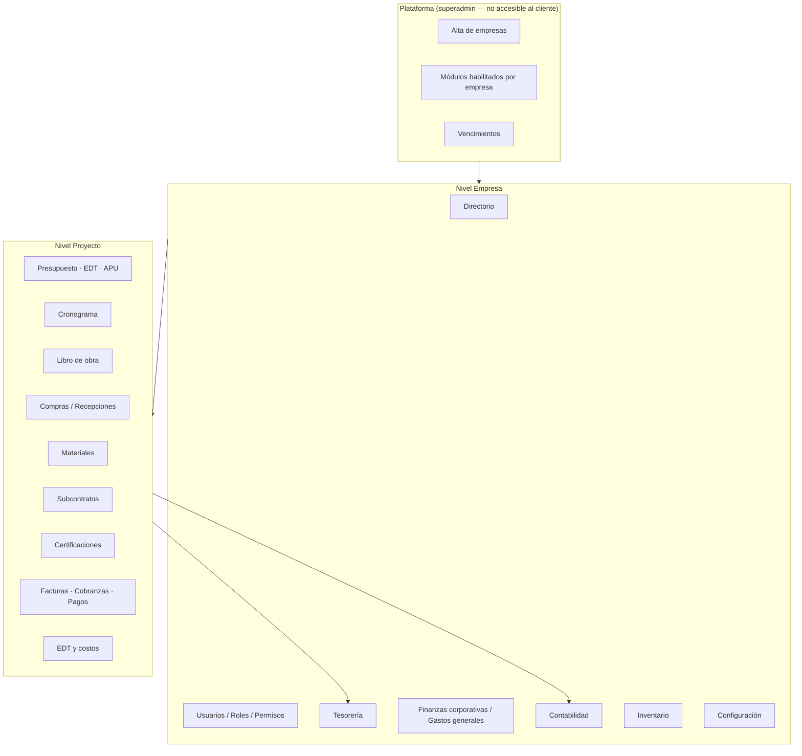
```mermaid
flowchart TB
  subgraph PLAT["Plataforma (superadmin — no accesible al cliente)"]
    P1["Alta de empresas"]
    P2["Módulos habilitados por empresa"]
    P3["Vencimientos"]
  end
  subgraph EMP["Nivel Empresa"]
    E1["Directorio"]
    E2["Usuarios / Roles / Permisos"]
    E3["Tesorería"]
    E4["Finanzas corporativas / Gastos generales"]
    E5["Contabilidad"]
    E6["Inventario"]
    E7["Configuración"]
  end
  subgraph PROJ["Nivel Proyecto"]
    R1["Presupuesto · EDT · APU"]
    R2["Cronograma"]
    R3["Libro de obra"]
    R4["Compras / Recepciones"]
    R5["Materiales"]
    R6["Subcontratos"]
    R7["Certificaciones"]
    R8["Facturas · Cobranzas · Pagos"]
    R9["EDT y costos"]
  end
  PLAT --> EMP --> PROJ
  PROJ --> E3
  PROJ --> E5
```

> Cada ítem de menú aparece **solo si** el usuario tiene el **permiso** correspondiente **y** el **módulo está habilitado** para la empresa.

---

## 1. Configuración inicial de la empresa (nivel empresa)

### 1.1 Ingreso y navegación

- Acceso en `/login` con **email y contraseña** (registro en `/registro` + confirmación por email) o **Google**. No hay segundo factor (2FA) al momento de este relevamiento.
- El **menú lateral de empresa** agrupa: **General · Finanzas · Tesorería · Contabilidad · Configuración**.
- Al entrar a una obra, el menú lateral se reemplaza por el **menú del proyecto**.

> **📷 Captura sugerida — Login Google**  
> Ruta: `/login` · Mostrar botón de Google y marca Bloqer · Tip: desktop, sin datos sensibles.

> **📷 Captura sugerida — Dashboard / menú empresa**  
> Ruta: `/dashboard` · Mostrar sidebar (General · Finanzas · Tesorería · Contabilidad · Configuración) + campana de notificaciones en el header · Tip: recortar solo shell + KPI principales.

### 1.2 Menú de empresa (rutas reales)

| Sección | Ítems (etiqueta → ruta) |
|---------|--------------------------|
| General | Inicio → `/dashboard` · Proyectos → `/proyectos` · Directorio → `/directorio` · Inventario → `/inventario` |
| Finanzas | Tablero → `/finanzas` · Transacciones → `/finanzas/transacciones` · Facturas y gastos → `/finanzas/facturas-proveedor` · Cuentas por cobrar → `/finanzas/cuentas-por-cobrar` · Cuentas por pagar → `/finanzas/cuentas-por-pagar` · Imputación GG → `/finanzas/gastos-generales` |
| Tesorería | Resumen → `/tesoreria` · Cuentas → `/tesoreria/cuentas` · Movimientos → `/tesoreria/movimientos` · Flujo de caja → `/tesoreria/flujo-caja` · Transferencias → `/tesoreria/transferencias` |
| Contabilidad | Resumen → `/contabilidad` · Cuentas → `/contabilidad/cuentas` · Asientos → `/contabilidad/asientos` · Reglas → `/contabilidad/reglas` · Libro diario → `/contabilidad/libro-diario` · Sumas y saldos → `/contabilidad/sumas-y-saldos` · Situación → `/contabilidad/situacion-patrimonial` · Resultados → `/contabilidad/estado-resultados` |
| Configuración | General → `/configuracion` · Mi perfil → `/configuracion/perfil` · Equipo → `/configuracion/equipo` · Permisos → `/configuracion/permisos` · Reportes programados → `/configuracion/reportes` · Registro → `/configuracion/registro` |

> **Visibilidad (D-056):** las secciones **Finanzas**, **Tesorería** y **Contabilidad** del menú de empresa solo aparecen para roles de **company finance**: `OWNER`, `ADMIN`, `FINANCE`, `TREASURER` y `VIEWER` (lectura). Roles operativos (`PROJECT_MANAGER`, `PROCUREMENT`, `SALES`, `PROJECT_FINANCE`, etc.) trabajan finanzas desde el **proyecto**, no desde el hub corporativo.

> Las **notificaciones** se abren desde la **campana del encabezado** (no tienen ítem propio en el menú lateral). Ver §1.5.

### 1.3 Datos de la empresa

- **Ruta:** `/configuracion`.
- Datos de la empresa, preferencias de visualización y políticas.
- **Política de compras:** `/configuracion/compras` (subnavegación Configuración → **Compras**, o card desde `/configuracion`): umbral de aprobación OC, SC requerida, min/max cotizaciones, OC directa, auto-aprobación, emergencia, % desvíos.

> **📷 Captura sugerida — Configuración + acceso Compras**  
> Ruta: `/configuracion` · Mostrar card/enlace a política de compras · Tip: incluir subnav de configuración si está visible.

### 1.4 Módulos habilitados

- Cada empresa puede tener módulos **activos o inactivos**. La habilitación se administra desde la **consola de plataforma** (`/platform/tenants/[id]/modules`), no desde la empresa.
- **Comportamiento por defecto:** si nunca se creó una configuración de módulo para la empresa, **el módulo se considera habilitado** (default-on). Tenerlo en cuenta al asumir que algo está "apagado".

> **📷 Captura sugerida — Plataforma · módulos del tenant**  
> Ruta: `/platform/tenants/[id]/modules` · Mostrar columnas Explícita/Default-on y cobertura · Tip: solo para material interno del proveedor SaaS (no entregar al cliente final).

### 1.5 Notificaciones (campana, inbox, alertas y emails) — D-054

Las notificaciones **no** tienen ítem en el menú lateral: se usan desde la **campana del encabezado**.

| Superficie | Ruta / comportamiento |
|------------|------------------------|
| **Campana** | Dropdown con las **últimas 5** no archivadas; badge solo si hay no leídas; pie **Ver todas** → `/notificaciones`. Polling cada **30 s** (pestaña visible); al abrir el dropdown se refresca. |
| **Inbox** | `/notificaciones` — filtros Todas / No leídas / Leídas / Archivadas; **Marcar todas como leídas**; marcar como no leída; archivar. |
| **Alertas operativas** | `/notificaciones/alertas` — solo `OWNER`/`ADMIN`: AR vencida, AP vencida, stock negativo, certificaciones aprobadas sin factura, uploads pendientes, compras demoradas (SLA) + card **Última actividad**. |
| **Emails enviados** | `/notificaciones/emails` — historial (NOTIFICATION, OPERATIONAL_ALERT, REPORT_*). |

**Quién las recibe**

- Destinatarios primarios y/o por permiso del evento, con **CC siempre a OWNER/ADMIN** activos (salvo exclusiones del actor).
- **Excepción anti-ruido:** `CERTIFICATION_APPROVED` llega al creador ∪ OWNER/ADMIN (no se difunde a todo quien tenga VER certificaciones).
- Cada usuario tiene su propia fila: marcar leída **no** afecta la copia de otro.
- Compras (SC/OC): in-app + email en cambios de estado y recordatorios SLA (ver §9).

> **Montos en notificaciones:** saldos y montos se muestran a **2 decimales** (D-053), igual que en el resto de la UI.

> **📷 Captura sugerida — Campana abierta**  
> Ruta: cualquier pantalla autenticada · Abrir campana con badge + 1–2 ítems + “Ver todas” · Tip: sin datos sensibles de clientes reales.

---

## 2. Usuarios, roles y permisos (nivel empresa)

### 2.1 Alta de usuarios

- **Ruta:** `/configuracion/equipo` → **Invitar** (`/configuracion/equipo/invitar`).
- El invitado acepta desde el email; queda como miembro con uno o más roles.
- Gestión de cada miembro: `/configuracion/equipo/[membershipId]`.

### 2.2 Roles disponibles (enum `UserRole`)

| Ámbito | Roles |
|--------|-------|
| Empresa | `OWNER`, `ADMIN`, `FINANCE`, `TREASURER`, `PROJECT_FINANCE`, `PROCUREMENT`, `WAREHOUSE`, `SALES`, `VIEWER` |
| Proyecto | `PROJECT_MANAGER`, `SITE_FOREMAN`, `PROJECT_VIEWER` |

- **Los roles son fijos** (no se crean roles personalizados).
- Un usuario puede tener **varios roles**; sus permisos efectivos son la **unión** de todos.

### 2.3 Modelo de permisos

- Acciones jerárquicas: **VER < EDITAR < APROBAR** sobre cada módulo.
- **Ruta:** `/configuracion/permisos` muestra la matriz de permisos. **Es una vista de solo lectura** (informativa); no se editan asignaciones desde ahí. Un banner lo aclara y remite a **Equipo** para asignar roles.
- En la matriz, algunos módulos aparecen como **no disponibles en esta versión** (p. ej. contratos, órdenes de cambio, RFIs, conciliación bancaria, impuestos): no hay pantallas operativas.
- La autorización se aplica **también en el backend** (servicios), no solo en la interfaz.

> **📷 Captura sugerida — Matriz de permisos (solo lectura)**  
> Ruta: `/configuracion/permisos` · Mostrar banner “solo lectura” + aviso de módulos no disponibles · Tip: no recortar el banner.

### 2.4 Reglas especiales

- Cierre de período y transferencia de empresa (tenant) están restringidos a `OWNER`/`ADMIN`.
- La **rentabilidad neta consolidada** es visible solo para `OWNER`/`ADMIN`; los demás ven rentabilidad **bruta**.

### 2.5 Company tools vs project tools (finanzas) — D-056

Bloqer separa herramientas de **empresa** y de **proyecto** (estilo Procore):

| Ámbito | Roles típicos | Qué ven |
|--------|---------------|---------|
| **Company finance** | `OWNER`, `ADMIN`, `FINANCE`, `TREASURER`, `VIEWER` | Menú Finanzas / Tesorería / Contabilidad de empresa; CxC/CxP/GG corporativos; saldos de caja |
| **Project finance / operación** | `PROJECT_MANAGER`, `PROCUREMENT`, `SALES`, `PROJECT_FINANCE`, etc. | Finanzas **dentro de la obra** (tablero, CxC/CxP de proyecto, facturas, compras); **sin** hub `/finanzas`, tesorería ni GL de empresa |

- **`FINANCE`** = controller: caja + AR/AP + contabilidad/impuestos (`APPROVE` GL).
- **`TREASURER`** = caja/bancos/cobros/pagos (`APPROVE` tesorería; `EDIT` AR/AP; `VIEW` contabilidad; sin `APPROVE` GL).
- **`PROJECT_FINANCE`** = contador de obra: AR/AP/gastos del **proyecto**; sin company hub ni tesorería/GL de empresa.

> **Error a evitar:** dar a un PM o a Compras un rol de company finance “para que vean más”: verán saldos y hub corporativo. Si solo necesitan la obra, usá roles de proyecto / `PROJECT_FINANCE`.

---

## 3. Directorio (nivel empresa)

- **Ruta:** `/directorio` (alta en `/directorio/nuevo`).
- Un **contacto único** puede tener **uno o varios roles**: **CLIENT** (mandante), **SUPPLIER** (proveedor), **SUBCONTRACTOR** (subcontratista).
- **Error a evitar:** dar de alta el mismo contacto dos veces cuando cumple varios roles. Usar siempre un contacto con múltiples roles.
- Se debe crear el **cliente** antes de crear el proyecto que lo referencia.

> **📷 Captura sugerida — Directorio / contacto con roles**  
> Ruta: `/directorio` o detalle de contacto · Mostrar roles CLIENT / SUPPLIER / SUBCONTRACTOR en un mismo contacto · Tip: datos demo, sin CUIT reales de clientes.

---

## 4. Tesorería (nivel empresa)

Configurar tesorería **antes** de operar cobranzas y pagos.

- **Cuentas** (`/tesoreria/cuentas`, alta en `/tesoreria/cuentas/nueva`): banco, caja o billetera, con **saldo de apertura**.
- **Movimientos:** se generan **automáticamente** al cobrar (ingreso) y pagar (egreso); se pueden **anular** con traza (nunca se borran).
- **Transferencias internas** (`/tesoreria/transferencias`): mueven fondos entre cuentas propias como **dos movimientos atómicos** (salida + entrada).
- **Resumen** (`/tesoreria`): saldos por cuenta y moneda, atajos a movimientos y flujo.
- **Movimientos** (`/tesoreria/movimientos`): extracto / ledger de caja.
- **Flujo de caja** (`/tesoreria/flujo-caja`): ingresos y egresos por período.

> **📷 Captura sugerida — Tesorería con subnav**  
> Ruta: `/tesoreria` · Mostrar `ModuleSubnav` (Resumen · Cuentas · Movimientos · Flujo de caja · Transferencias) · Tip: incluir al menos una cuenta con saldo.

> **Terminología correcta:** los tipos de movimiento en el sistema son `INFLOW` (ingreso), `OUTFLOW` (egreso), `TRANSFER_IN`, `TRANSFER_OUT` y `ADJUSTMENT`. (La guía original mencionaba `INCOME`/`OUTCOME`; esos términos **no existen** en el código.)

> **Limitación actual (importante):** cobros, pagos y transferencias internas operan en **una sola moneda por operación**. **No hay conversión de moneda dentro de tesorería.** Cada documento guarda su moneda, tipo de cambio y monto en pesos, pero el movimiento de caja no convierte.

> **Fondos insuficientes:** un **pago** a proveedor no puede dejar la cuenta de origen en saldo negativo (mismo criterio que las transferencias internas). El sistema muestra el disponible y bloquea la operación.

---

## 4.1 Montos y decimales (regla de trabajo diaria) — D-053

Para operadores: **no hace falta pensar en “escalas de base de datos”**. En pantalla y al cargar montos de dinero:

| Qué | Cómo se ve / se carga |
|-----|------------------------|
| **Dinero** (totales, saldos, pagos, cobros, caja) | Siempre **2 decimales** (ej. `1.234,56`). Redondeo comercial half-up. |
| **Tipo de cambio** | Hasta **6** decimales. |
| **Cantidades** (líneas, stock) y **%** (IVA, etc.) | Hasta **4** decimales. |

- Al **pagar o cobrar el total**, usá el saldo que muestra el sistema (o el default del formulario). El servidor aplica el saldo almacenado; no reescribás a mano un redondeo distinto.
- Si la cuenta no tiene fondos suficientes para el pago, la operación **se rechaza** con el disponible.

---

## 5. Crear y operar un proyecto (nivel proyecto)

### 5.1 Alta

- **Ruta:** `/proyectos/nuevo`.
- Campos: código, nombre, **cliente** (del directorio), **tipo de obra** y fechas contractuales (metadata, no reemplazan al cronograma).
  - **PUBLIC:** techo estricto de 100% en certificaciones.
  - **PRIVATE:** permite exceder el 100% con **nota obligatoria**.

### 5.2 Ciclo de vida (enum `ProjectStatus`)

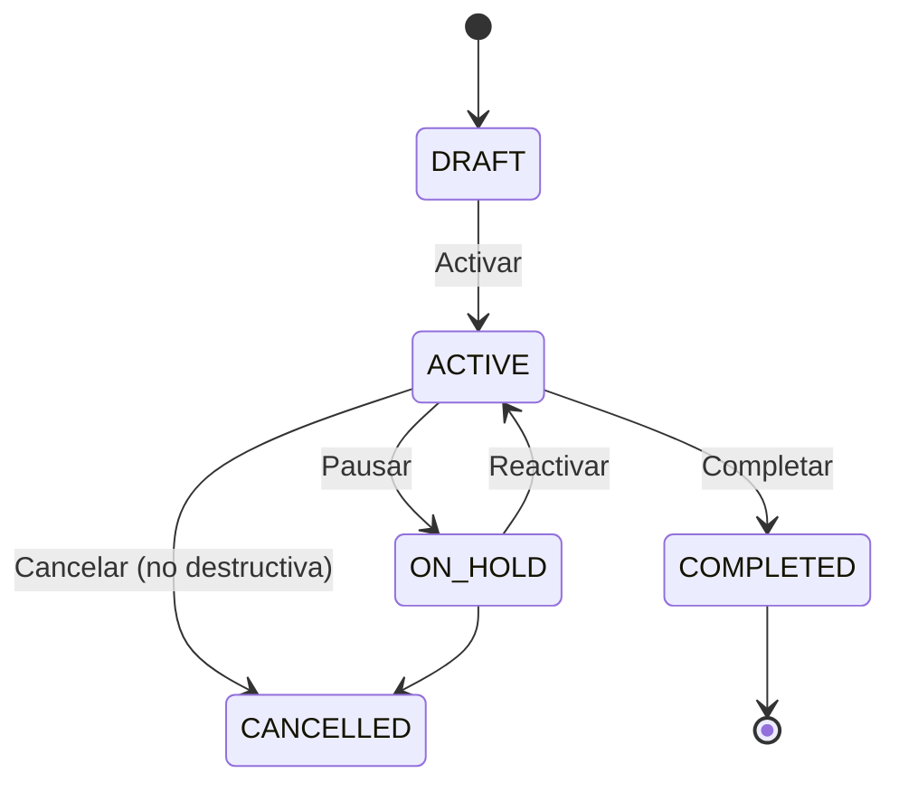
```mermaid
stateDiagram-v2
  [*] --> DRAFT
  DRAFT --> ACTIVE: Activar
  ACTIVE --> ON_HOLD: Pausar
  ON_HOLD --> ACTIVE: Reactivar
  ACTIVE --> COMPLETED: Completar
  ACTIVE --> CANCELLED: Cancelar (no destructiva)
  ON_HOLD --> CANCELLED
  COMPLETED --> [*]
```

- La **cancelación es no destructiva** (conserva datos y traza).
- **Menú del proyecto:** Resumen · Planificación · Operación · Finanzas del proyecto · Administración.

> **📷 Captura sugerida — Alta de proyecto**  
> Ruta: `/proyectos/nuevo` · Mostrar campos código, nombre, cliente, tipo PUBLIC/PRIVATE · Tip: no enviar sin completar cliente.

> **📷 Captura sugerida — Menú del proyecto (Compras + Operación)**  
> Ruta: cualquier `/proyectos/[id]/…` · Expandir **Compras** (Tablero · Solicitudes · Órdenes · Recepciones) y **Operación** (Materiales · Consumos) · Tip: Recepciones está bajo Compras, no bajo Operación.

### 5.3 Menú del proyecto (rutas reales)

| Sección | Ítems (etiqueta → ruta relativa) |
|---------|----------------------------------|
| Resumen | Resumen → `/proyectos/[id]` |
| Planificación | Presupuesto → `/presupuestos` · Cronograma → `/cronograma` · **EDT y costos** → `/control-costos` · Reportes → `/reportes` |
| Operación | Libro de obra → `/libro-obra` · Certificaciones → `/certificaciones` · **Materiales** → `/materiales` · Inventario → `/inventario` · Consumos → `/consumos` · Documentos → `/documentos` |
| Compras | **Tablero de compras** → `/compras` · **Solicitudes de compra** → `/solicitudes-compra` · **Órdenes de compra** → `/ordenes-compra` · **Recepciones** → `/recepciones` |
| Finanzas del proyecto | **Tablero de finanzas** → `/finanzas` · Flujo de caja → `/flujo-caja` · Subcontratos → `/subcontratos` · CxP → `/cuentas-por-pagar` · CxC → `/cuentas-por-cobrar` · Facturas proveedor → `/facturas-proveedor` · Facturas emitidas → `/facturas` |
| Administración | Configuración → `/editar` |

> En UI, “EDT” = **Estructura de Desglose de Trabajo** (término en español del WBS técnico). En código/Prisma sigue siendo `WbsNode`; en pantallas se usa **EDT**.

---

## 6. Presupuesto, EDT/WBS y APU (nivel proyecto)

**Ruta:** `/proyectos/[id]/presupuestos`

### 6.1 Estructura — capítulo vs partida vs insumo (D-057)

| Concepto | Tipo | Qué lleva | Para qué sirve |
|----------|------|-----------|----------------|
| **Capítulo** | `GROUP` | Solo rollup de totales (sin unidad/cantidad operativa) | Organizar el cómputo |
| **Partida certificable** | `ITEM` hoja | Unidad, cantidad, **APU** (`CostItem`) | Certificar, comprar e imputar costos |
| **Insumo** | Línea APU (`CostAnalysisLine`) | MAT / LAB / EQP / SUB / OTHER bajo la partida | Composición del costo; **nunca** hijo WBS |

- Se puede **importar desde Excel/CSV** o cargar manualmente.
- **Parámetros de venta** (BudgetSettings): gastos generales %, utilidad %, impuestos.
- **Anti-patrón (muy frecuente):** modelar hierros, mallas o cuadrillas como hijos WBS (`4.1.1`, `4.1.2`) bajo una partida medible (ej. zapata ml × 390). Eso rompe unidad/cantidad y genera partidas certificables falsas. Los insumos van en el **APU de la partida** (`4.1`), no como nodos del árbol.
- Subdividir un `ITEM` convierte al padre en `GROUP` (migrar o descartar APU): sirve para partir **alcance de obra**, no para desglosar BOM.

### 6.1b Vista EDT en el presupuesto (D-058 · D-059 · D-060)

En el detalle del presupuesto (árbol EDT):

- **KPIs de cabecera:** Costo directo total · Precio de venta total · Margen (venta − costo).
- **Toolbar de vista:**
  - Base **Costo** | **Venta**
  - Escala **Compacto** | **Desglose** (desglose por categoría solo en base Costo)
  - Toggle **Unitario** (aditivo: agrega columnas `/u` al lado; los totales **siempre** se muestran)
  - Toggle **Incidencia** `%` (independiente): peso de la fila sobre el TOTAL GENERAL
- **Modal APU = solo costo** (D-058): unidad, cantidad, costo directo unitario/total y desglose MAT/LAB/EQP/SUB. **Sin** PU ni total de venta (la venta se edita/ve en la tabla EDT).
- **Modo de carga:** por unidad o **Total partida** (reparto al APU).
- **Expandir partida hoja** (D-059): muestra filas de detalle APU de solo lectura (badges `APU·MAT`, etc.). Click abre el modal APU de la partida. **No** son nodos WBS: no se certifican ni se imputan compras contra esas filas — siempre contra la partida (ej. `4.1`).
- **Exports** CSV/XLSX/PDF: solo filas WBS (sin filas APU); respetan modo activo (`base`, `scale`, `detail`, `incidence`).

> **📷 Captura sugerida — EDT con insumos expandibles**  
> Ruta: `/proyectos/[id]/presupuestos/[budgetId]` · Partida hoja expandida con filas APU·MAT + toolbar Costo/Venta · Tip: dejar claro que el chevron APU ≠ hijos WBS.

### 6.2 Ciclo de aprobación (enum `BudgetStatus`)

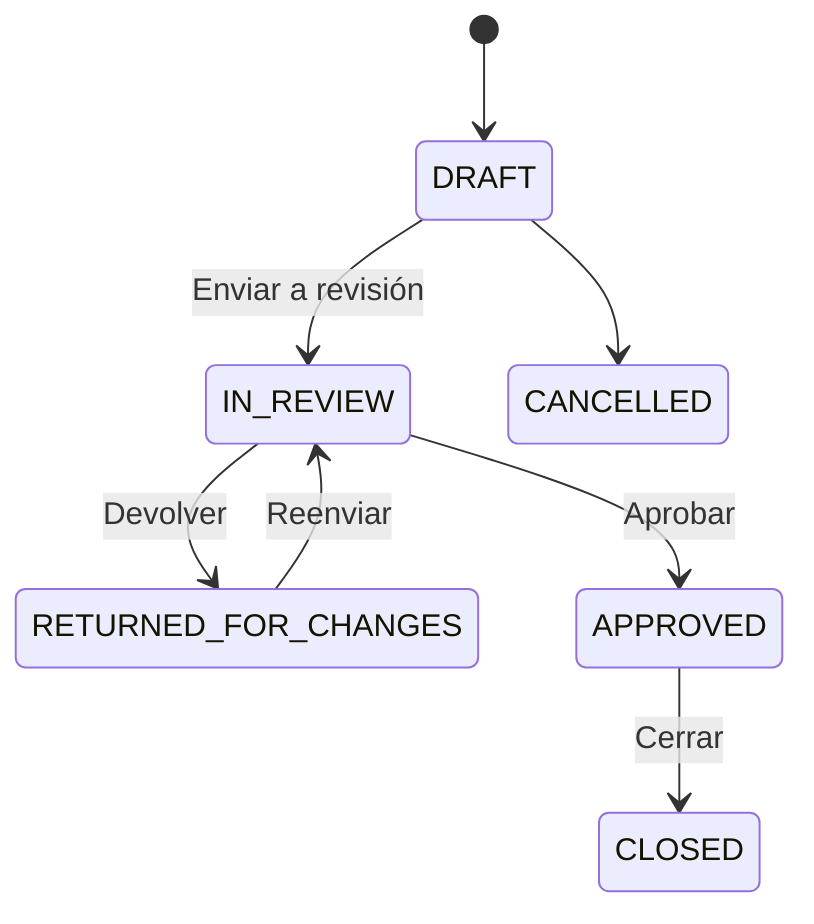
```mermaid
stateDiagram-v2
  [*] --> DRAFT
  DRAFT --> IN_REVIEW: Enviar a revisión
  IN_REVIEW --> RETURNED_FOR_CHANGES: Devolver
  RETURNED_FOR_CHANGES --> IN_REVIEW: Reenviar
  IN_REVIEW --> APPROVED: Aprobar
  APPROVED --> CLOSED: Cerrar
  DRAFT --> CANCELLED
```

| Estado | Qué permite |
|--------|-------------|
| `DRAFT` | Editar WBS, APU y precios |
| `IN_REVIEW` | Solo revisión; economía bloqueada |
| `RETURNED_FOR_CHANGES` | Correcciones y reenvío |
| `APPROVED` | Economía congelada; habilita certificaciones y baseline de control de costos |
| `CLOSED` | Base contractual |
| `CANCELLED` | Anulado |

> **Hito clave:** con `APPROVED` o `CLOSED` se habilitan las certificaciones al cliente y el baseline de control de costos.

> **📷 Captura sugerida — Presupuesto aprobado / WBS**  
> Ruta: `/proyectos/[id]/presupuestos/[budgetId]` · Mostrar estado APPROVED + árbol WBS con un ítem hoja · Tip: copy de adenda operativa (sin “versión” formal).

### 6.3 Adendas — limitación actual

- Un cambio contractual se maneja hoy como **adenda operativa / presupuesto nuevo** del proyecto (copy de producto: **sin** “versión” formal automática).
- En UI puede aparecer un rótulo `v{n}`: es numeración de presentación, **no** versionado contractual con vínculo padre‑hijo.
- **Solo un presupuesto `APPROVED` por proyecto** a la vez.
- **No existe** un estado `SUPERSEDED` ni un vínculo formal padre‑hijo entre presupuestos. **Contratos, adendas y órdenes de cambio como entidades formales no están implementados** (ver §19).

---

## 7. Planificación: Cronograma (nivel proyecto)

**Ruta:** `/proyectos/[id]/cronograma`

- Un **cronograma** por proyecto, con **presupuesto base** opcional como referencia.
- **Vistas:** Gantt (`?view=gantt`), Calendario (`?view=calendar`), Kanban (`?view=kanban`), Tabla (`?view=table`).
- **Tipos de ítem:** `TASK` (tarea con duración) y `MILESTONE` (hito). Los **contenedores** derivan fechas de sus hojas (no se editan a mano).
- **Estados de ítem (enum `ScheduleItemStatus`):** `PLANNED`, `IN_PROGRESS`, `BLOCKED`, `COMPLETED`, `CANCELLED` (el Kanban se organiza por estos estados).
- **Dependencias:** solo **Finish‑to‑Start (FS)**. Las violaciones generan **advertencias**, no bloqueos.
- **Vínculo WBS ↔ cronograma:** cada tarea puede enlazar nodos WBS (uno primario), lo que habilita KPIs y el sync de avance real.

> **📷 Captura sugerida — Cronograma Gantt**  
> Ruta: `/proyectos/[id]/cronograma?view=gantt` · Mostrar tareas + hitos · Tip: una obra con 5–8 ítems alcanza.

### 7.1 Cuatro dimensiones de avance (no confundir)

| Dimensión | Fuente | Quién la mueve |
|-----------|--------|----------------|
| **Real** | `ScheduleItem.progressPct` | Libro de obra aprobado (o ajuste manual del PM) |
| **Plan (tiempo)** | Fechas vs. hoy | Automático |
| **Cantidades** | Cantidades físicas vs. presupuesto | Libro de obra |
| **Certificado** | Certificaciones emitidas | Módulo de certificaciones |

---

## 8. Ejecución: Libro de obra (nivel proyecto)

**Ruta:** `/proyectos/[id]/libro-obra`

### 8.1 Flujo diario

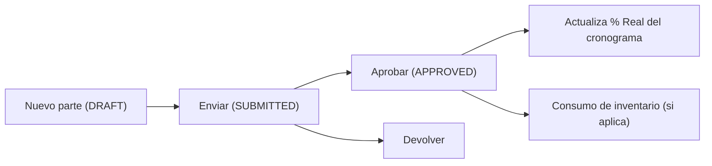
```mermaid
flowchart LR
  N["Nuevo parte (DRAFT)"] --> S["Enviar (SUBMITTED)"]
  S --> A["Aprobar (APPROVED)"]
  S --> R["Devolver"]
  A --> SYNC["Actualiza % Real del cronograma"]
  A --> STK["Consumo de inventario (si aplica)"]
```

1. **Nuevo parte** con fecha (no futura), clima, cuadrilla, tareas y avance por WBS.
2. Adjuntar fotos y observaciones.
3. **Enviar** → `SUBMITTED`; el PM **aprueba** → `APPROVED`.

> **📷 Captura sugerida — Parte de obra (detalle)**  
> Ruta: `/proyectos/[id]/libro-obra/[logId]` · Mostrar avance por WBS + adjuntos · Tip: estado SUBMITTED o APPROVED.

### 8.2 Efectos al aprobar

- El parte queda **inmutable** (salvo anulación con motivo).
- Actualiza el **% Real** de las tareas con WBS primario enlazado.
- Los materiales con producto + depósito pueden generar **consumo de inventario** (salida de stock).
- **Imputación WBS del consumo (D-055):** se usa el WBS de la línea de material; si falta y hay **exactamente una** partida de progreso en el parte, se usa esa; si hay **varias** partidas de progreso y el material no trae WBS → **conflicto** (no se crea consumo sin partida).

> **Nota de navegación:** el listado de consumos está en `/proyectos/[id]/consumos` (menú Operación → **Consumos**). El alta es `/consumos/nuevo`.

> **📷 Captura sugerida — Listado de consumos**  
> Ruta: `/proyectos/[id]/consumos` · Mostrar empty state con CTA o filas de consumo · Tip: no confundir con Inventario genérico.

---

## 9. Compras, materiales y abastecimiento (nivel proyecto)

**Tablero de compras:** `/proyectos/[id]/compras` — pendientes de SC, cotización, OC y recepción en un solo lugar (menú **Compras** → **Tablero de compras**). El alta de SC/OC puede abrirse como diálogo desde el listado (también con `?create=1`).

### 9.0 Materiales del proyecto (plan operativo)

**Ruta:** `/proyectos/[id]/materiales` (menú Operación → **Materiales**).

Tablero de necesidad APU **MAT** vs pedido / recibido / consumido. Requiere presupuesto `APPROVED` o `CLOSED` con líneas MATERIAL en el APU.

| Vista | Contenido |
|-------|-----------|
| **Operativo** (default) | Ventanas: Esta semana · **Próximos 14 días** (default) · Este mes · Todo. KPIs: Presupuesto MAT · Filas con faltante · Cant. recibida · Cant. consumida. Columnas: EDT · Material · Necesidad · $ Presup. · Pedido · Recibido · Consumido · Faltante. CTA **Pedir** → prellena solicitud de compra. |
| **Varianza ($)** (`?tab=varianza`) | Desvío monetario de materiales (export CSV/PDF). Antes vivía en `/reportes/materiales`. |

Atajos desde la pantalla: Tablero de compras · Solicitudes · Consumos.

> **📷 Captura sugerida — Materiales Operativo + Pedir**  
> Ruta: `/proyectos/[id]/materiales` · Mostrar fila con faltante + CTA Pedir · Tip: ventana “Próximos 14 días”.

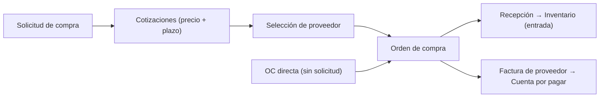
```mermaid
flowchart LR
  PR["Solicitud de compra"] --> Q["Cotizaciones (precio + plazo)"]
  Q --> SEL["Selección de proveedor"]
  SEL --> PO["Orden de compra"]
  DIR["OC directa (sin solicitud)"] --> PO
  PO --> REC["Recepción → Inventario (entrada)"]
  PO --> SI["Factura de proveedor → Cuenta por pagar"]
```

> **Regla base (D-050 / D-055):** toda línea de **solicitud/OC** y toda línea de **factura de proveedor de proyecto** imputa obligatoriamente a un ítem WBS (partida hoja). Las facturas generadas desde OC **copian** el WBS de la línea de OC. Facturas corporativas (sin obra) **no** llevan WBS. Los consumos de libro de obra también imputan WBS al aprobar el parte (§8.2).

### 9.1 Solicitudes de compra

- **Ruta:** `/proyectos/[id]/solicitudes-compra` (menú **Solicitudes de compra**).
- Flujo: crear `DRAFT` → **Enviar** (`SUBMITTED`, toma snapshot del costo presupuestario y de la cantidad por WBS) → **Cotizaciones** → **Seleccionar** → genera **OC en borrador**.
- En listados conviene revisar la columna de **quién solicitó / envió** (trazabilidad más allá del estado).
- **Cotizaciones comparables:** cada cotización registra **precio** y **plazo de entrega (lead time, en días)**, además de la validez y la referencia de presupuesto, para comparar por precio **y** plazo. El mínimo de cotizaciones es configurable por empresa.
- **Notificaciones (§1.5):** al enviar una solicitud se avisa a compras/aprobadores (in‑app + email, con CC a OWNER/ADMIN). Si una solicitud queda demorada sin cotizar, se emite un **recordatorio por SLA**.

### 9.2 Órdenes de compra

- **Ruta:** `/proyectos/[id]/ordenes-compra` (+ `/nueva`, detalle `/[poId]`, edición `/[poId]/editar`).
- **Estados en pantalla:** Borrador → Pend. aprobación → Aprobada → Confirmada → Recepción parcial / Recibida · Anulada.
- Ciclo técnico (enum `PurchaseOrderStatus`): `DRAFT → SUBMITTED → APPROVED → CONFIRMED → PARTIALLY_RECEIVED / RECEIVED` (o `CANCELLED`).
- **Devolución:** un aprobador puede **devolver** una OC en `SUBMITTED` a `DRAFT` con **motivo obligatorio**; queda auditoría de quién y por qué.
- En listados: columnas de actor según hito (**Aprobado por**, etc.) para trazabilidad.

**Acciones del detalle (según estado y permisos):** Editar · Enviar a aprobación · Aprobar · Devolver a borrador · **Confirmar al proveedor** · Registrar recepción · **Registrar factura desde OC** (requiere cantidades recibidas) · Anular.

**Flujo formal (un paso por acción):**

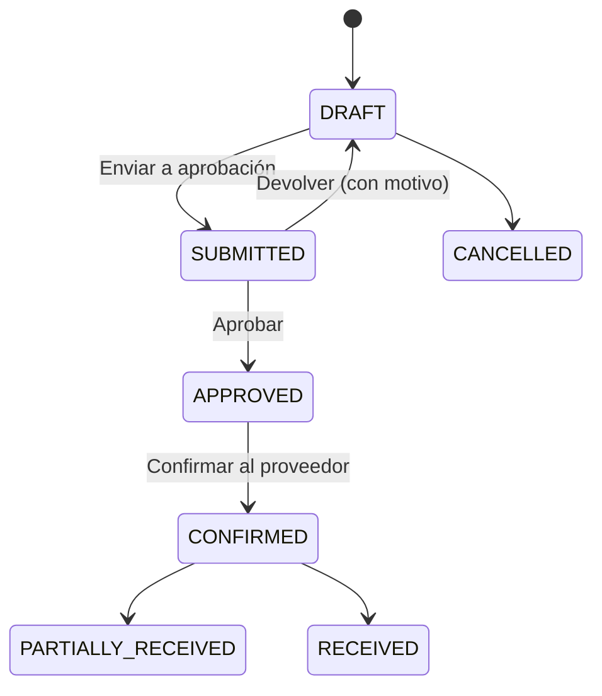
```mermaid
stateDiagram-v2
  [*] --> DRAFT
  DRAFT --> SUBMITTED: Enviar a aprobación
  SUBMITTED --> APPROVED: Aprobar
  SUBMITTED --> DRAFT: Devolver (con motivo)
  APPROVED --> CONFIRMED: Confirmar al proveedor
  CONFIRMED --> PARTIALLY_RECEIVED
  CONFIRMED --> RECEIVED
  DRAFT --> CANCELLED
```

> El atajo “Emitir y confirmar (rápido)” fue **retirado**: la OC recorre siempre **Enviar → Aprobar → Confirmar** para preservar la segregación de funciones.

| Hito | Impacto económico |
|------|-------------------|
| **APPROVED** | Aprobación interna (segregación / política de empresa) |
| **CONFIRMED** | **Comprometido** en el control de costos |
| Recepción | Ingreso de stock + cantidades recibidas (**no** crea CxP por sí sola) |
| Factura de proveedor **emitida** | **Devengado** + cuenta por pagar |

- **Imputación:** cada línea → WBS ítem hoja (**obligatorio**, D-050). Al elegir partida: **costo ref. materiales** y **saldo de partida** (alerta, no bloqueo).
- **Desvíos de precio** vs costo referencial: alerta → justificación → aprobación admin en tramos altos.
- **OC directa (sin solicitud):** solo si `/configuracion/compras` lo habilita; umbral alto exige motivo de emergencia (`OWNER`/`ADMIN`).
- **Cotizaciones:** comparar **precio y plazo (días)**.
- **Notificaciones:** pendiente / aprobada / devuelta / confirmada + recordatorio SLA.

> **📷 Captura sugerida — OC confirmada con links**  
> Ruta: `/proyectos/[id]/ordenes-compra/[poId]` · Mostrar estado Confirmada + enlace a recepción / factura · Tip: incluir botones Enviar/Aprobar/Devolver según estado.

### 9.3 Recepciones

- **Menú:** Compras → **Recepciones** (`/proyectos/[id]/recepciones`).
- **Alta:** desde la OC → **Nueva recepción** (`/ordenes-compra/[poId]/recepciones/nueva`) o desde el listado de recepciones.
- Al confirmar, actualiza cantidades recibidas y puede generar **entrada de stock** si hay depósito/producto (el movimiento IN puede copiar `wbsNodeId` cuando está disponible).

> **📷 Captura sugerida — Listado Recepciones**  
> Ruta: `/proyectos/[id]/recepciones` · Mostrar listado bajo menú Compras · Tip: no confundir con Operación → Consumos.

---

## 10. Subcontratos (nivel proyecto)

**Ruta:** `/proyectos/[id]/subcontratos`

1. Alta del contrato con un **subcontratista** del directorio; imputable a WBS categoría **SUB**.
2. **Certificaciones de subcontrato** (enum `SubcontractCertificationStatus`): `DRAFT → ISSUED → APPROVED` (o `REJECTED` / `CANCELLED`).
3. Al **aprobar** la certificación se genera (o se ofrece CTA hacia) una **factura de proveedor en borrador** (y con ello una cuenta por pagar), habilitando el pago.

> **📷 Captura sugerida — Cert. subcontrato con factura**  
> Ruta: `/proyectos/[id]/subcontratos/[subId]/certificaciones/[certId]` · Mostrar badge de estado de factura + CTA “Revisar y emitir” o “Ver factura” · Tip: Lote 3 B-03.

> **Corrección respecto de la guía original:** el estado intermedio es **`ISSUED`** (emitida), no `SUBMITTED`. Además, la certificación de subcontrato aprobada genera una **factura de proveedor (SupplierInvoice) en DRAFT**, que al emitirse crea la cuenta por pagar.

> **Limitación:** **retenciones y anticipos** de subcontratos no están modelados como entidad separada.

---

## 11. Certificaciones al cliente (nivel proyecto)

**Ruta:** `/proyectos/[id]/certificaciones`

### 11.1 Precondición

- Presupuesto `APPROVED` o `CLOSED`.

### 11.2 Emitir y aprobar (enum `CertificationStatus`)

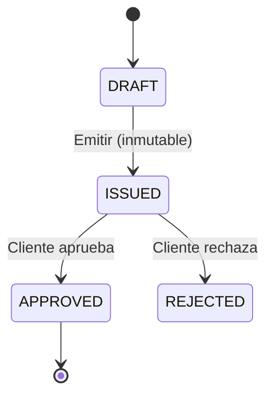
```mermaid
stateDiagram-v2
  [*] --> DRAFT
  DRAFT --> ISSUED: Emitir (inmutable)
  ISSUED --> APPROVED: Cliente aprueba
  ISSUED --> REJECTED: Cliente rechaza
  APPROVED --> [*]
```

1. **Nueva certificación** con período (desde/hasta).
2. Por ítem: **Δ% físico** y **$ económico** del período.
3. Validación de techos: obra **pública** bloquea si supera 100% acumulado; obra **privada** permite con **nota obligatoria**.
4. **Emitir** → `ISSUED` (inmutable). Marcar `APPROVED`/`REJECTED` según respuesta del mandante.

### 11.3 De la certificación a la factura

- La **factura de venta** se emite desde la certificación (`/proyectos/[id]/facturas`) y genera una **cuenta por cobrar (Receivable)**.
- Con certificación en `APPROVED`, la pantalla de detalle ofrece CTA **Emitir factura** (o muestra la factura ya vinculada).
- **No hay estado `INVOICED`** en la certificación: el estado de cobro se **deriva** de las cobranzas asociadas (por diseño).
- La emisión de la factura es un **paso manual**; la certificación aprobada **no crea la factura automáticamente**.

> **📷 Captura sugerida — Certificación cliente APPROVED**  
> Ruta: `/proyectos/[id]/certificaciones/[certId]` · Mostrar CTA **Emitir factura** o panel de factura vinculada · Tip: Lote 3 B-02.

---

## 12. Facturar, cobrar y pagar (nivel proyecto y empresa)

### 12.1 Ventas y cobranzas (AR)

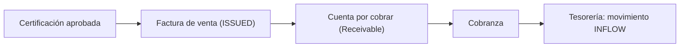
```mermaid
flowchart LR
  CERT["Certificación aprobada"] --> INV["Factura de venta (ISSUED)"]
  INV --> AR["Cuenta por cobrar (Receivable)"]
  AR --> COL["Cobranza"] --> TES["Tesorería: movimiento INFLOW"]
```

#### Obra (proyecto)

- **Facturas emitidas** (`/proyectos/[id]/facturas`, estados Borrador / Emitida / Anulada): una vez emitidas son inmutables; solo se pueden **anular**. Detalle: **Emitir** desde borrador; panel de **adjuntos** del comprobante.
- **Cuentas por cobrar** (`/proyectos/[id]/cuentas-por-cobrar`): estados Pendiente / Parcial / Pagado / Vencido. Desde el detalle → **Cobrar** (`…/[receivableId]/cobrar`): cuenta, fecha, monto (2 decimales). Para saldar el total, dejá el saldo que muestra el sistema.
- **Cobranzas** (`/proyectos/[id]/cobranzas`): ingresan dinero (`INFLOW`) y bajan el saldo.
- **Venta rápida / anticipo** (`/proyectos/[id]/facturas/anticipo/nueva`): factura + CxC (+ cobro opcional) en un paso.
- **No disponible hoy:** “Cobrar ahora” **inline** al crear una factura de venta **de proyecto** (diferido; el cobro se hace desde CxC). El cobro inmediato corporativo sí existe en Transacciones (abajo).

#### Ingreso / factura corporativa (sin obra) — D-051

Casos como capacitaciones, venta de materiales o servicios de estructura **sin proyecto**:

1. **Finanzas → Transacciones** (`/finanzas/transacciones`) → **Registrar transacción** → tab **Ingreso / cobro**.
2. Modo **Factura / cuenta por cobrar** (`AR_INCOME`): cliente, fechas, líneas, impuestos, vencimiento; N° comprobante externo opcional; **Cobrar ahora (ingreso a caja)** opcional (cuenta + fecha; requiere permiso de tesorería).
3. Si solo necesitás mover caja **sin** CxC (aportes, préstamos, reintegros): modo **Solo caja** (`TREASURY_INFLOW`).
4. Gestionar saldos en **Cuentas por cobrar** (`/finanzas/cuentas-por-cobrar` → **Cobrar**). Filas sin obra se etiquetan **Empresa**.

> **📷 Captura sugerida — Factura emitida → CxC / cobranza**  
> Ruta: `/proyectos/[id]/facturas/[invoiceId]` · Mostrar panel CxC + CTA Registrar cobranza + adjuntos · Tip: Lote 3 D-03 / D-052.

> **📷 Captura sugerida — Ingreso corporativo con CxC**  
> Ruta: `/finanzas/transacciones` · Registrar transacción → Ingreso / cobro → Factura / cuenta por cobrar · Tip: D-051.

### 12.2 Facturas de proveedor y pagos (AP) — D-052

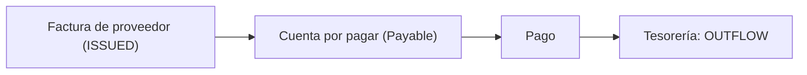
```mermaid
flowchart LR
  SI["Factura de proveedor (ISSUED)"] --> AP["Cuenta por pagar (Payable)"]
  AP --> PAY["Pago"] --> TES["Tesorería: OUTFLOW"]
```

Siempre existe la cadena **Factura → Payable → Payment → movimiento de caja**, aunque se pague en el mismo momento (“pagar ahora”).

#### Proyecto

| Pantalla | Ruta |
|----------|------|
| Listado / alta | `/proyectos/[id]/facturas-proveedor` · `/nueva` |
| Detalle | `/proyectos/[id]/facturas-proveedor/[id]` (Emitir · Anular · adjuntos · editar borrador) |
| CxP | `/proyectos/[id]/cuentas-por-pagar` → `/[payableId]/pagar` |
| Pagos (consulta) | `/proyectos/[id]/pagos` (también desde CxP / trazabilidad) |

**Alta en obra (`/nueva`):**

1. Proveedor, fechas, líneas (cada línea con **WBS obligatorio**, D-055), OC opcional, **adjunto** opcional (foto/PDF del comprobante).
2. Desde OC: **Registrar factura desde OC** copia el WBS de cada línea de la orden.
3. Sin más: **Crear factura** → queda en **borrador** → luego **Emitir** en el detalle (crea CxP + **asiento DRAFT** en contabilidad, ver §15).
4. Con permiso **EDIT tesorería** y módulo Tesorería activo: checkbox **Emitir y pagar ahora (egreso de caja)** → cuenta de pago + fecha → **Emitir y pagar**. Crea factura emitida + CxP + pago + egreso en un paso. Si no hay fondos suficientes, **bloquea**.

#### Empresa (corporativo)

| Pantalla | Ruta / etiqueta |
|----------|-----------------|
| Facturas y gastos | `/finanzas/facturas-proveedor` → diálogo **Nueva factura de gasto** (borrador sin proyecto) |
| Alta rápida con pago | `/finanzas/transacciones` → **Gasto / factura proveedor** → opcional **Pagar ahora** |
| CxP | `/finanzas/cuentas-por-pagar` → `/[payableId]/pagar` (**Registrar pago**) |
| Detalle de pago | `/finanzas/pagos-proveedor/[paymentId]` |

**Registrar pago (obra o empresa):** cuenta de tesorería (misma moneda), fecha, monto a 2 decimales, notas. El default es el **saldo pendiente**; usarlo para saldar sin residual. Fondos insuficientes → error con disponible.

> **Notas de navegación y límites:**
> - Consulta consolidada de pagos: `/finanzas/transacciones` filtrando origen `PAYMENT` y egreso.
> - **Retenciones** manuales (sin módulo dedicado).
> - Cobros y pagos: **una sola moneda** por operación.
> - Export **CSV/PDF** desde CxP y Facturas y gastos corporativos.
> - Desde OC confirmada: **Registrar factura desde OC** cuando hay cantidades recibidas.

> **📷 Captura sugerida — Emitir y pagar ahora (obra)**  
> Ruta: `/proyectos/[id]/facturas-proveedor/nueva` · Checkbox Emitir y pagar ahora + cuenta + fecha · Tip: D-052; usuario con EDIT tesorería.

> **📷 Captura sugerida — CxP corporativo con export**  
> Ruta: `/finanzas/cuentas-por-pagar` · Listado + Exportar · Tip: Lote 5.

> **📷 Captura sugerida — Transacciones / pagos proveedor**  
> Ruta: `/finanzas/transacciones?sourceType=PAYMENT&type=OUTFLOW` · Filtros y movimientos de pago.

---

## 13. EDT y costos, rentabilidad y reportes (nivel proyecto)

### 13.1 EDT y costos (control de costos)

- **Menú:** Planificación → **EDT y costos**.
- **Ruta:** `/proyectos/[id]/control-costos` (título de pantalla: **Estructura de Desglose de Trabajo y Costos**; drill-down en `/control-costos/[wbsNodeId]`).
- Compara **presupuesto baseline vs. real** por ítem EDT/WBS, en capas: **comprometido**, **devengado**, **pagado**, **consumido**, más **certificado acumulado**.
- Si las líneas de factura de proveedor tienen WBS, el devengado/pagado se imputa **por línea**; si no (legacy), se prorratea vía OC (D-055).
- **Exposición esperada** = devengado + comprometido abierto (**no** suma OC + factura duplicados; diseño anti doble conteo).

> **📷 Captura sugerida — EDT y costos**  
> Ruta: `/proyectos/[id]/control-costos` · Mostrar título EDT + columnas comprometido/devengado/pagado · Tip: primera columna sticky si aplica.

### 13.2 Rentabilidad y reportes

- **Rentabilidad:** `/proyectos/[id]/reportes/rentabilidad` (margen bruto; neto según overhead imputado, visible a `OWNER`/`ADMIN`).
- **Hub de reportes:** `/proyectos/[id]/reportes` (presupuesto vs. real, compras y proveedores, materiales → `/materiales?tab=varianza`, subcontratos, certificaciones/ingresos‑gastos, caja).
- **Exportaciones CSV/PDF** desde cada pantalla de reporte.

---

## 14. Finanzas corporativas, gastos generales e inventario (nivel empresa)

- **Finanzas corporativas** (`/finanzas`): tablero con KPIs, proyección y actividad consolidada.
- **Transacciones** (`/finanzas/transacciones`): alta rápida de **gasto corporativo (AP)**, **factura/CxC corporativa (AR, D-051)** y **ingreso solo caja** (`TREASURY_INFLOW`, sin obligación).
- **Cuentas por cobrar empresa** (`/finanzas/cuentas-por-cobrar`): consolida obra + filas **Empresa**; detalle y cobranza corporativa en `/finanzas/cuentas-por-cobrar/[id]`.
- **Gastos generales / overhead** (`/finanzas/gastos-generales`): se **imputan a las obras** de forma **manual** o por **prorrateo automático** según el peso del costo directo, con **cierre de período**. *(Es un módulo complejo; conviene validar los cálculos en producción.)*
- **Inventario corporativo** (`/inventario`): productos (`/inventario/productos`), depósitos (`/inventario/depositos`), movimientos (`/inventario/movimientos`, ledger append‑only; el saldo se calcula sumando movimientos) y transferencias (`/inventario/transferencias`).

> **📷 Captura sugerida — Inventario con subnav**  
> Ruta: `/inventario` · Mostrar ModuleSubnav Productos / Depósitos / Movimientos / Transferencias · Tip: Lote 4 D-05.

> **Limitación:** no hay **valuación de inventario FIFO/promedio** configurable; el costo se toma de la compra.

---

## 15. Contabilidad (nivel empresa) — D-061 · D-062

Contabilidad **gerencial interna** (libro mayor). No sustituye estados oficiales, AFIP ni ajuste por inflación. Visible solo para roles de company finance (§2.5).

### 15.1 Pantallas (subnav)

| Etiqueta | Ruta | Para qué |
|----------|------|----------|
| Resumen | `/contabilidad` | KPIs: **Borradores**, **Contabilizados del mes**, **Resultado del mes**, **Activo a hoy** + card **Borradores pendientes** |
| Cuentas | `/contabilidad/cuentas` | Plan de cuentas; CTA **Aplicar plantilla AR** |
| Asientos | `/contabilidad/asientos` | Listado `DRAFT` / `POSTED` / `CANCELLED` |
| Reglas | `/contabilidad/reglas` | Mapeo evento → cuentas Debe/Haber |
| Libro diario | `/contabilidad/libro-diario` | Solo asientos `POSTED` |
| Sumas y saldos | `/contabilidad/sumas-y-saldos` | Trial balance por período |
| Situación | `/contabilidad/situacion-patrimonial` | ESP al corte (`asOfDate`) |
| Resultados | `/contabilidad/estado-resultados` | EERR del período |

Exports CSV/PDF (y XLSX en sumas, diario, ESP y EERR) desde `/api/reports/contabilidad/*`.

### 15.2 Arranque: plantilla de plan de cuentas (AR)

En **Cuentas** → **Aplicar plantilla AR**: carga ~40 cuentas típicas argentinas (Caja, Bancos ARS/USD, Clientes, Proveedores, IVA crédito/débito, Materiales en stock, Ingresos por obras, Costo de materiales, etc.) **más reglas de mapeo default**. Es **idempotente por código** (reaplicar no duplica).

### 15.3 Flujo diario (auto-DRAFT + posteo manual)

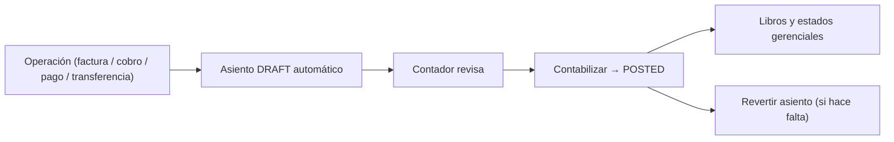
```mermaid
flowchart LR
  OP["Operación (factura / cobro / pago / transferencia)"] --> DRAFT["Asiento DRAFT automático"]
  DRAFT --> REV["Contador revisa"]
  REV --> POST["Contabilizar → POSTED"]
  POST --> REP["Libros y estados gerenciales"]
  POST --> REV2["Revertir asiento (si hace falta)"]
```

1. Las operaciones económicas **crean un asiento en borrador** de forma automática (soft, post-commit): no bloquean cobros/pagos si falla la contabilidad; no exigen permiso EDIT ACCOUNTING para que aparezca el borrador.
2. Un usuario con permiso de contabilidad **revisa** el borrador en `/contabilidad/asientos` y pulsa **Contabilizar** (`POSTED`).
3. **Nunca** se auto-posta: el paso humano es obligatorio.
4. En borradores **con origen operativo**, los **montos/moneda/estructura** no se editan (sí cuentas y textos). Los asientos manuales siguen editables al 100% ([D-063](./00-product/DECISION_LOG.md)).
5. Quienes tienen permiso de editar contabilidad reciben un **aviso in-app** (máx. uno cada 24 h por empresa) cuando hay borradores nuevos.
6. Un asiento `POSTED` se puede **Revertir** desde la UI (crea el asiento de reversa). Anular un borrador: **Anular borrador**.
7. Al **anular el documento origen**, se cancela el DRAFT vinculado. Si hay asiento `POSTED` sin reverso, la anulación del origen **se bloquea**.

**Qué genera auto-DRAFT hoy**

| Origen | Asiento DRAFT |
|--------|----------------|
| Factura de venta emitida | Sí (devengo AR) |
| Factura de proveedor emitida | Sí (devengo AP) |
| Cobranza | Sí |
| Pago a proveedor | Sí |
| Transferencia interna | Sí |
| Ingreso corporativo solo caja (`TREASURY_INFLOW`) | Sí |
| Movimiento de tesorería cuyo origen ya es cobro/pago/apertura | **No** (anti doble conteo) |
| Consumo de stock / recepción | **No** aún (costeo diferido) |

> **Limitaciones que siguen vigentes:**
> - No hay **cierre de período / ejercicio GL** ni numeración correlativa de libro.
> - Reportes = **gerenciales on-the-fly** sobre `POSTED` únicamente; disclaimer en el hub.
> - Multi-moneda: bloques por moneda, **sin** consolidación FX.
> - IVA/retenciones: solo si hay cuentas en el plan; no hay motor fiscal.

> **📷 Captura sugerida — Contabilidad hub + plantilla**  
> Ruta: `/contabilidad` · Subnav completo (incl. Libro diario / Sumas / Situación / Resultados) + card Borradores pendientes · Tip: D-061/D-062.

> **📷 Captura sugerida — Aplicar plantilla AR**  
> Ruta: `/contabilidad/cuentas` · CTA Aplicar plantilla AR · Tip: empresa nueva o sin plan.

---

## 16. Qué acciones producen impactos económicos o contables

| Acción | Efecto económico | Efecto en tesorería | Efecto contable |
|--------|------------------|---------------------|-----------------|
| Aprobar presupuesto | Habilita baseline y certificaciones | — | — |
| Enviar/Aprobar/Devolver OC | Sin impacto económico (control de flujo y aprobación) | — | — |
| Confirmar OC | **Comprometido** | — | — |
| Recepción de OC | Ingreso de stock | — | — (sin auto-DRAFT aún) |
| Emitir factura de proveedor | **Devengado** + cuenta por pagar | — | **Auto-DRAFT** → Contabilizar a mano |
| Emitir y pagar ahora (AP) | Devengado + pagado en un paso | Movimiento `OUTFLOW` | Auto-DRAFT factura + Auto-DRAFT pago (no TREASURY duplicado) |
| Pago a proveedor | **Pagado** | Movimiento `OUTFLOW` (bloquea si fondos insuficientes) | **Auto-DRAFT** → Contabilizar |
| Certificación aprobada | **Certificado** | — | — |
| Emitir factura de venta | **Facturado** + cuenta por cobrar | — | **Auto-DRAFT** → Contabilizar |
| Cobranza / Cobrar ahora (AR corporativo) | **Cobrado** | Movimiento `INFLOW` | **Auto-DRAFT** → Contabilizar |
| Transferencia interna | — | TRANSFER_OUT + TRANSFER_IN | **Auto-DRAFT** → Contabilizar |
| Aprobar cert. de subcontrato | **Devengado** (factura proveedor DRAFT) | — | Al **emitir** la factura → Auto-DRAFT |
| Imputar gasto general | Afecta rentabilidad neta | Según pago | — |

### Diferencias entre estados económicos

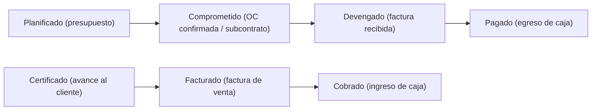
```mermaid
flowchart LR
  PLAN["Planificado (presupuesto)"] --> COMP["Comprometido (OC confirmada / subcontrato)"]
  COMP --> DEV["Devengado (factura recibida)"]
  DEV --> PAG["Pagado (egreso de caja)"]
  CERT["Certificado (avance al cliente)"] --> FAC["Facturado (factura de venta)"]
  FAC --> COB["Cobrado (ingreso de caja)"]
```

---

## 17. Errores operativos a evitar

| Error | Consecuencia | Orden correcto |
|-------|--------------|----------------|
| Certificar sin presupuesto aprobado | Bloqueo o datos inválidos | Aprobar el presupuesto primero |
| Modelar insumos (hierros, etc.) como hijos WBS | Partidas certificables falsas / doble multiplicación | Insumos en el **APU** de la partida (D-057); ver filas APU expandibles (D-059) |
| Crear línea de compra o factura de obra sin WBS | El sistema lo rechaza | Imputar cada línea a una **partida hoja**; gastos generales → partida de indirectos |
| Aprobar tu propia OC cuando no corresponde | Sin segregación de funciones | Que apruebe otro; la autoaprobación depende de la política y del umbral |
| Confundir avance de Gantt con certificado | Reportes incoherentes | Real = libro de obra; Certificado = certificaciones |
| Sumar OC + factura como costo total | Doble conteo | Usar **exposición esperada** |
| Editar fechas de un contenedor del cronograma | Se pisa con el rollup | Editar solo hojas |
| Pagar sin factura/devengado | Caja sin respaldo | Factura → cuenta por pagar → pago (o Emitir y pagar ahora) |
| Duplicar contactos por rol | Datos partidos | Un contacto con múltiples roles |
| Creer que “apareció el borrador” = ya está contabilizado | Libros (diario/sumas/ESP) vacíos o desfasados | Revisar borradores y **Contabilizar**; los reportes solo usan `POSTED` |
| Dar company finance a PM/Compras “para ver más” | Ven hub/caja/GL de empresa | Usar roles de proyecto / `PROJECT_FINANCE` (D-056) |
| Cobrar/pagar esperando conversión de moneda | Descalce | Operar en la misma moneda de la cuenta |
| Reescribir el monto “a ojo” al pagar el total | Residual o rechazo | Usar el saldo pendiente que muestra el sistema (2 decimales); click en el saldo para autocompletar |
| Pagar con cuenta sin fondos | Operación bloqueada | Verificar saldo de tesorería antes |
| Esperar “Cobrar ahora” al crear factura de obra | No existe (diferido) | Cobrar desde CxC del proyecto |
| Buscar Recepciones bajo Operación | No aparece | Menú **Compras → Recepciones** |

---

## 18. Checklists por rol

> **Hábitos diarios / semanales** (esta sección). Para un **smoke verificable** con rutas y criterios PASS/FAIL por rol (capacitación / UAT), usar  
> [`08-architecture/OPERATIONAL_SMOKE_CHECKLIST_BY_ROLE.md`](./08-architecture/OPERATIONAL_SMOKE_CHECKLIST_BY_ROLE.md) (J-02).

### Dueño / Director

- [ ] Usuarios y roles asignados (mínimo un `OWNER`/`ADMIN`); company finance solo a quien corresponda (D-056)
- [ ] Módulos habilitados confirmados con el proveedor del servicio
- [ ] Cuentas de tesorería creadas con saldo de apertura
- [ ] Contabilidad: **Aplicar plantilla AR** si el plan está vacío
- [ ] Revisión periódica de finanzas corporativas (`/finanzas`) y rentabilidad neta
- [ ] Campana / inbox y **Alertas operativas** revisadas (`/notificaciones/alertas`)
- [ ] Reportes programados revisados
- [ ] Comprender: los asientos **nacen en borrador** solos, pero hay que **Contabilizarlos**

> **📷 Captura sugerida — Alertas · Última actividad**  
> Ruta: `/notificaciones/alertas` · Mostrar card Última actividad · Tip: Lote 5 G-03; solo OWNER/ADMIN.

> **📷 Captura sugerida — Reportes programados (Omitido ≠ Fallido)**  
> Ruta: `/configuracion/reportes` · Mostrar badge de última corrida con hint visible · Tip: Lote 5 G-02.

### Project Manager / Jefe de obra

- [ ] Proyecto en `ACTIVE`
- [ ] Presupuesto `APPROVED`/`CLOSED` (un solo APPROVED por obra)
- [ ] Partidas medibles con APU; **insumos en APU**, no como hijos EDT (D-057)
- [ ] Cronograma con fechas en hojas y dependencias FS
- [ ] WBS/EDT primario en tareas críticas
- [ ] Libro de obra al día y aprobado (materiales con WBS si hay varias partidas)
- [ ] Tablero **Materiales** revisado (faltantes → Pedir)
- [ ] Certificaciones periódicas (y CTA a factura cuando corresponda)
- [ ] Recepciones (Compras) y consumos (Operación) al día
- [ ] **EDT y costos** revisado semanalmente

### Capataz

- [ ] Parte diario cargado (clima, cuadrilla, avance por WBS, fotos)
- [ ] Parte enviado (`SUBMITTED`) para aprobación del PM
- [ ] Materiales consumidos registrados (listado `/consumos`); WBS del material si el parte toca varias partidas

### Compras

- [ ] Política de compras revisada en `/configuracion/compras`
- [ ] Tablero **Materiales** / **Tablero de compras** como punto de partida del faltante
- [ ] Todas las líneas con **WBS/partida** (indirectos → partida de gastos generales)
- [ ] Solicitudes cotizadas (mínimo según política), comparando **precio y plazo**
- [ ] Desvíos de precio con **justificación** cuando corresponde
- [ ] OC enviada → aprobada (o **devuelta con motivo**) → **confirmada** al proveedor
- [ ] Recepciones registradas (menú **Compras → Recepciones** o desde la OC)
- [ ] Facturas de proveedor con WBS (desde OC o alta manual)

### Administración / Finanzas / Tesorería

- [ ] Facturas de venta emitidas desde certificaciones (o venta directa / anticipo)
- [ ] Cobranzas de obra aplicadas desde CxC del proyecto (click en saldo para autocompletar)
- [ ] Ingresos corporativos con CxC desde Transacciones (Factura / cuenta por cobrar) cuando corresponde
- [ ] Ingresos solo caja (sin CxC) solo cuando no hay obligación de cobro
- [ ] CxC empresa revisadas en `/finanzas/cuentas-por-cobrar` (filas **Empresa**)
- [ ] Facturas de proveedor de obra: borrador → emitir, o **Emitir y pagar ahora** si hay permiso de tesorería
- [ ] Gastos corporativos desde Facturas y gastos / Transacciones
- [ ] CxP revisadas; pagos con saldo a 2 decimales; fondos suficientes en la cuenta
- [ ] Exports CSV/PDF de CxP / facturas / transacciones corporativas cuando haga falta
- [ ] Movimientos de caja conciliados manualmente (no hay conciliación bancaria automática)
- [ ] Reportes de flujo de caja y aging revisados
- [ ] Si también tienen contabilidad: revisar **Borradores pendientes** del hub

### Contabilidad

- [ ] **Aplicar plantilla AR** (o plan de cuentas propio) + reglas de mapeo
- [ ] Revisar **Borradores pendientes** tras el día operativo
- [ ] **Contabilizar** asientos DRAFT (y **Revertir** si hay corrección)
- [ ] Correr Sumas y saldos / Libro diario / Situación / Resultados del período
- [ ] Exportar libros cuando haga falta (CSV/PDF/XLSX)
- [ ] Recordar: gerencial ≠ AFIP; stock aún sin auto-asiento

---

## 19. Limitaciones actuales

| Limitación | Detalle |
|------------|---------|
| **Contabilidad: sin auto-POST** | Los asientos **sí** se crean en `DRAFT` solos (D-061); hay que **Contabilizar** a mano. Stock/consumos aún **sin** auto-DRAFT. Sin cierre de ejercicio GL ni numeración correlativa. Reportes gerenciales ≠ AFIP. |
| **Conciliación bancaria** | No implementada (módulo marcado no disponible en permisos). |
| **Contratos, adendas y órdenes de cambio** | Documentados, sin entidad ni pantalla. Las adendas se manejan como presupuesto/adenda operativa sin vínculo automático (`v{n}` es solo presentación). |
| **RFIs** | No implementados. |
| **Multi‑moneda en tesorería** | Cobros, pagos y transferencias exigen misma moneda. Contabilidad: bloques por moneda sin consolidación FX. |
| **Valuación de inventario** | Sin política FIFO/promedio configurable; por eso el costeo de stock no auto-asienta aún. |
| **Impuestos / retenciones** | Solo IVA por línea; retenciones manuales, sin módulo dedicado. |
| **Documentos** | Si R2 no está configurado: metadata + badge **PLACEHOLDER**; la descarga explica el límite. |
| **Anticipo a proveedor** | Servicio stub (ADR-013); **sin** CTA en UI. |
| **Cobrar ahora en factura de obra** | Diferido (Q-055); cobrar desde CxC. Corporativo sí tiene cobro opcional en Transacciones. |
| **Ajustes de stock/caja (`ADJUSTMENT`)** | Enum reservado; sin UI. |
| **Notificaciones** | Sin Web Push / preferencias mute; polling 30 s en pestaña visible (D-054). |
| **Permisos** | La matriz es de solo lectura; los roles son fijos. Techos “solo su proyecto” aún sin `ProjectMembership`. |
| **Segundo factor (2FA)** | No disponible; acceso con Google o email/contraseña. |
| **DOCX de guía** | Un solo entregable: `guides/Guía_Operativa_Bloqer_v2.docx`. Regenerar con `node build_guide.js` tras editar **esta** MD. |

> Estas limitaciones **no impiden** el uso productivo del sistema, pero deben conocerse para no asumir capacidades que hoy son manuales o inexistentes.

---

## 20. Referencias

- Panorama ejecutivo: [`PANORAMA_GENERAL_BLOQER_V2.md`](./PANORAMA_GENERAL_BLOQER_V2.md)
- Relevamiento técnico y clasificación A–G: [`RELEVAMIENTO_TECNICO_FUNCIONAL_BLOQER_V2.md`](./RELEVAMIENTO_TECNICO_FUNCIONAL_BLOQER_V2.md)
- Plan de mejoras corto plazo: [`PLAN_MEJORAS_CORTO_PLAZO_BLOQER_V2.md`](./PLAN_MEJORAS_CORTO_PLAZO_BLOQER_V2.md)
- Smoke por rol (J-02): [`08-architecture/OPERATIONAL_SMOKE_CHECKLIST_BY_ROLE.md`](./08-architecture/OPERATIONAL_SMOKE_CHECKLIST_BY_ROLE.md)
- Changelog UI Lotes 1–6 (autores): [`guides/CHANGELOG_UI_LOTES_1_6.md`](./guides/CHANGELOG_UI_LOTES_1_6.md)
- Decisiones recientes: [D-050](./00-product/DECISION_LOG.md) (compras/WBS) · [D-051](./00-product/DECISION_LOG.md) (AR corporativo) · [D-052](./00-product/DECISION_LOG.md) (AP pay-now) · [D-053](./00-product/DECISION_LOG.md) (decimales) · [D-054](./00-product/DECISION_LOG.md) (notificaciones) · [D-055](./00-product/DECISION_LOG.md) (WBS en factura/JL) · [D-056](./00-product/DECISION_LOG.md) (company vs project finance) · [D-057](./00-product/DECISION_LOG.md)–[D-060](./00-product/DECISION_LOG.md) (EDT/APU) · [D-061](./00-product/DECISION_LOG.md)–[D-062](./00-product/DECISION_LOG.md) (contabilidad auto-DRAFT + reportes)
- Contabilidad: [`02-modules/ACCOUNTING.md`](./02-modules/ACCOUNTING.md), [`08-architecture/ACCOUNTING_LEDGER_ARCHITECTURE.md`](./08-architecture/ACCOUNTING_LEDGER_ARCHITECTURE.md)
- Notificaciones: [`02-modules/NOTIFICATIONS.md`](./02-modules/NOTIFICATIONS.md)
- Estados canónicos: [`01-domain/STATE_MACHINES.md`](./01-domain/STATE_MACHINES.md)
- Fórmulas de costo: [`04-formulas/COST_FORMULAS.md`](./04-formulas/COST_FORMULAS.md)
- Módulos: [`02-modules/EXPENSES_AND_PAYMENTS.md`](./02-modules/EXPENSES_AND_PAYMENTS.md), [`02-modules/SALES_AND_COLLECTIONS.md`](./02-modules/SALES_AND_COLLECTIONS.md), [`02-modules/WBS_AND_COST_ITEMS.md`](./02-modules/WBS_AND_COST_ITEMS.md)

---

## 21. Mantenimiento de esta guía (obligatorio para el equipo)

1. **Fuente viva:** este archivo (`GUIA_OPERATIVA_BLOQER_V2_REVISADA.md`).
2. **Entregable cliente:** únicamente `docs/bloqer2.0/guides/Guía_Operativa_Bloqer_v2.docx` (no hay variante “PROFESIONAL”).
3. **Cuándo actualizar:** todo PR que cambie rutas, menús, etiquetas, flujos de OC/CxP/CxC/tesorería/contabilidad, presupuesto/EDT, notificaciones, permisos visibles o reglas de montos.
4. **Cómo regenerar el DOCX:** `cd docs/bloqer2.0/guides && node build_guide.js`.
5. **Smoke:** validar con [`OPERATIONAL_SMOKE_CHECKLIST_BY_ROLE.md`](./08-architecture/OPERATIONAL_SMOKE_CHECKLIST_BY_ROLE.md) si el cambio afecta operación diaria.

---

*Documento vivo. Actualizado julio 2026 (D-050…D-062: compras, AR/AP, decimales, notificaciones, EDT/APU, materiales, company finance, contabilidad auto-DRAFT y reportes gerenciales). Actualizar en el mismo PR que el cambio de producto.*
