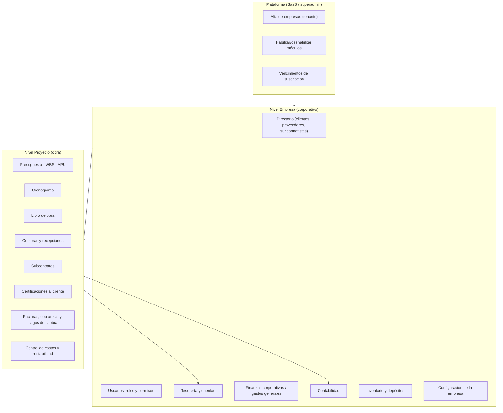
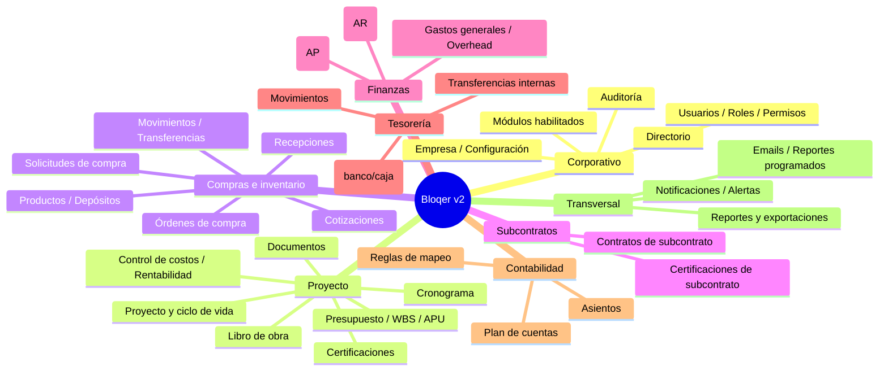
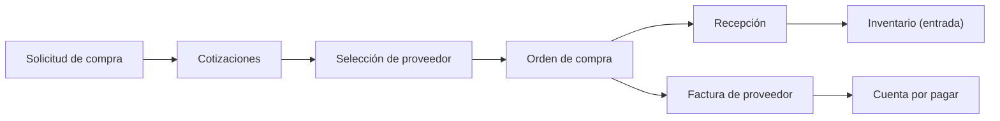
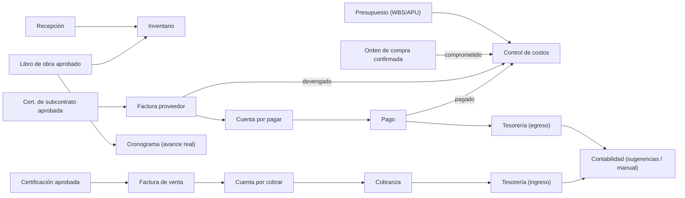
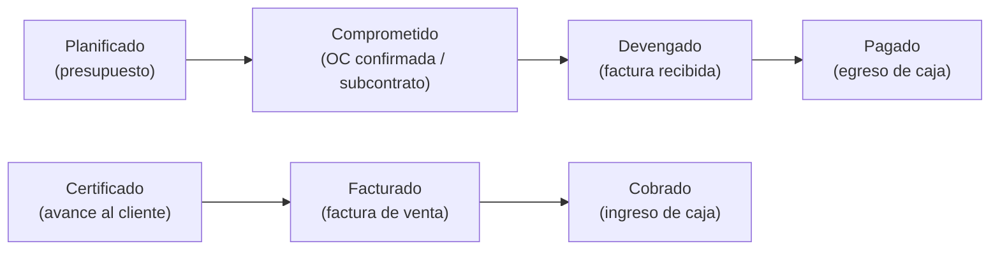

# Panorama general de Bloqer v2

> **Propósito:** entender toda la plataforma sin necesidad de leer código.
> **Audiencia:** dirección, product, ventas, implementadores y usuarios clave.
> **Estado:** producto funcional y en producción. Este documento describe **lo que realmente puede hacerse hoy**, diferenciándolo de lo parcial o pendiente.
> **Nota:** cuando algo existe solo a nivel técnico (base de datos o backend) sin poder operarse desde la interfaz, se aclara explícitamente y **no** se describe como disponible.

---

## 1. Resumen ejecutivo

**Bloqer v2 es un ERP SaaS multiempresa (multitenant) para empresas constructoras.** Cubre el ciclo completo de una obra: desde el alta del proyecto y su presupuesto, pasando por la planificación temporal, la ejecución diaria, las compras, los subcontratos y las certificaciones al cliente, hasta la facturación, la cobranza, los pagos, la tesorería y el control de costos y rentabilidad.

El producto está diseñado para que **toda la actividad económica quede vinculada a un proyecto** (salvo los gastos generales de la empresa), permitiendo saber en todo momento cuánto se **comprometió, devengó, pagó, certificó, facturó y cobró** en cada obra.

**Qué puede hacerse hoy (resumen):** operar de punta a punta proyectos, presupuestos (WBS + APU), cronogramas (Gantt/Kanban/tabla/calendario), libro de obra, compras (solicitud → cotización → orden de compra → recepción), inventario, subcontratos, certificaciones, ventas y cobranzas, facturas de proveedor y pagos, tesorería, gastos generales, control de costos y una amplia batería de reportes y exportaciones. Todo con control de accesos por rol, módulos habilitables por empresa y auditoría.

**Qué no puede hacerse hoy (resumen):** contabilidad **automática** (los asientos se sugieren pero se cargan manualmente), conciliación bancaria, contratos/adendas y órdenes de cambio como entidades formales, RFIs, y operaciones de tesorería en **distinta moneda** (cobros/pagos/transferencias exigen misma moneda).

---

## 2. Arquitectura funcional de la plataforma

Bloqer v2 organiza el trabajo en **dos grandes niveles** más una **consola de plataforma**:

- **Plataforma:** administra el SaaS (quién es cliente, qué módulos tiene habilitados, vencimientos).
- **Empresa (tenant):** los datos maestros y las funciones que son transversales a todas las obras.
- **Proyecto (obra):** el corazón operativo; casi toda la actividad económica cuelga de un proyecto.

---

## 3. Mapa de módulos

---

## 4. Navegación general

La aplicación tiene un **menú lateral por empresa** y, al entrar a una obra, se reemplaza por el **menú lateral del proyecto**.

### Menú de empresa

| Sección | Ítems |
|---------|-------|
| General | Inicio, Proyectos, Directorio, Inventario |
| Finanzas | Tablero, Transacciones, Facturas y gastos, Cuentas por cobrar, Cuentas por pagar, Imputación de gastos generales |
| Tesorería | Resumen, Cuentas, Transferencias, Reportes |
| Contabilidad | Resumen, Plan de cuentas, Asientos, Reglas |
| Configuración | General, Mi perfil, Equipo, Permisos, Reportes programados, Registro (auditoría) |

### Menú del proyecto

| Sección | Ítems |
|---------|-------|
| Resumen | Resumen del proyecto |
| Planificación | Presupuesto, Cronograma, EDT y costos, Reportes |
| Operación | Libro de obra, Certificaciones, Inventario, Documentos |
| Finanzas del proyecto | Tablero de finanzas, Flujo de caja, Solicitudes de compra, Órdenes de compra, Subcontratos, Cuentas por pagar, Cuentas por cobrar, Facturas proveedor, Facturas emitidas |
| Administración | Configuración del proyecto |

> Cada ítem aparece solo si el usuario tiene el **permiso** y el **módulo está habilitado** para la empresa. Las **notificaciones** se abren desde la campana del encabezado.

---

## 5. Módulos corporativos

- **Directorio:** contactos únicos que pueden tener uno o varios roles (**cliente**, **proveedor**, **subcontratista**). Evita duplicar un mismo contacto que cumple varios roles.
- **Usuarios, roles y permisos:** invitación de usuarios, asignación de roles y visualización de la matriz de permisos.
- **Empresa / configuración:** datos de la empresa, preferencias de visualización y políticas de compras.
- **Módulos habilitados:** cada empresa puede tener módulos activos o inactivos (se gestiona desde la consola de plataforma).
- **Auditoría:** registro de quién hizo qué y cuándo sobre entidades críticas, con visor y exportación.

---

## 6. Módulos de proyectos

- **Proyecto:** unidad central. Tiene ciclo de vida `Borrador → Activo → (En pausa) → Completado`, con posibilidad de **cancelación no destructiva** y reactivación.
- **Presupuesto / WBS / APU:** el plan económico versionado. La **WBS** es la estructura de cómputo (capítulos e ítems); el **APU** es el análisis de precio unitario de cada ítem (materiales, mano de obra, equipos, subcontratos, otros).
- **Certificaciones:** documentos al cliente que reconocen avance y habilitan la facturación. Respetan techos según obra **pública** (no supera 100%) o **privada** (permite exceder con nota).
- **Control de costos y rentabilidad:** comparación de presupuesto vs. real por ítem WBS, con las capas comprometido/devengado/pagado, y márgenes.
- **Documentos:** adjuntos (contratos, planos, actas, fotos) vinculados a entidades del proyecto.

---

## 7. Planificación y ejecución

- **Cronograma:** un plan temporal por proyecto, con vistas **Gantt, Kanban, tabla y calendario**, tareas e hitos, dependencias tipo Finish-to-Start y vínculo opcional con la WBS.
- **Libro de obra:** parte diario con clima, cuadrillas, avance por WBS, materiales, incidentes y fotos. Al **aprobarse**, actualiza el **avance real** del cronograma y puede generar **consumo de inventario**.
- **Cuatro dimensiones de avance** (no confundir): **Real** (libro de obra), **Plan temporal** (fechas vs. hoy), **Cantidades físicas** y **Certificado** (certificaciones emitidas).

---

## 8. Compras e inventario

Flujo de abastecimiento:

- **Solicitudes de compra** con cotizaciones y política de mínimo de cotizaciones por empresa.
- **Órdenes de compra** con flujo de aprobación (Borrador → Enviada → Aprobada → Confirmada) y control de desvíos de precio contra el presupuesto.
- **Recepciones** que ingresan stock y actualizan cantidades recibidas.
- **Inventario:** productos, depósitos, movimientos (registro histórico, el saldo se calcula sumando movimientos) y transferencias entre depósitos.

---

## 9. Subcontratos

- **Contrato de subcontrato** con un subcontratista del directorio, imputable a la WBS.
- **Certificaciones de subcontrato:** al aprobarse generan una **factura de proveedor** (y por lo tanto una cuenta por pagar), habilitando el pago.

---

## 10. Finanzas

- **Ventas y cobranzas (AR):** las **facturas de venta** (habitualmente originadas en una certificación) crean una **cuenta por cobrar**; las **cobranzas** ingresan dinero a una cuenta de tesorería y reducen el saldo pendiente.
- **Facturas de proveedor y pagos (AP):** las facturas de proveedor crean **cuentas por pagar**; los **pagos** egresan dinero y reducen el saldo.
- **Gastos generales / overhead:** gastos de la empresa que se **imputan a las obras** de forma manual o por prorrateo automático según el peso del costo directo, con cierre de período.
- **Finanzas corporativas:** tablero con KPIs, proyección y actividad financiera consolidada.

---

## 11. Tesorería

- **Cuentas** de banco, caja o billetera digital, con saldo de apertura.
- **Movimientos** de ingreso/egreso (se generan automáticamente al cobrar y pagar) con anulación trazable.
- **Transferencias internas** entre cuentas propias (dos movimientos atómicos).
- **Reportes** de posición de caja, movimientos y flujo de caja.

> **Limitación actual:** cobros, pagos y transferencias operan en **una sola moneda por operación**; no hay conversión de moneda dentro de tesorería.

---

## 12. Contabilidad

- **Plan de cuentas** configurable.
- **Asientos** manuales (Borrador → Posteado).
- **Reglas de mapeo** que, junto con las **sugerencias**, permiten generar asientos en **borrador** a partir de cobros, pagos y movimientos.

> **Limitación actual (importante):** la contabilidad **no se genera automáticamente**. Cobros, pagos y movimientos de stock **no crean asientos por sí solos**: producen sugerencias que un usuario debe revisar y postear. Además, un asiento **posteado no puede anularse** desde la interfaz, y no hay un cierre de período contable general. En la práctica, la contabilidad funciona hoy como un **libro paralelo mayormente manual**.

---

## 13. Configuración, usuarios, roles y permisos

- **Roles globales:** `OWNER`, `ADMIN`, `FINANCE`, `PROCUREMENT`, `WAREHOUSE`, `SALES`, `VIEWER`.
- **Roles por proyecto:** `PROJECT_MANAGER`, `SITE_FOREMAN`, `PROJECT_VIEWER`.
- **Acciones:** `VER < EDITAR < APROBAR`. Los permisos efectivos son la **unión** de los roles del usuario.
- **Módulos por empresa:** cada módulo puede estar habilitado o no para la empresa (por defecto habilitado).
- Reglas especiales: cierre de período y transferencia de tenant restringidos a `OWNER`/`ADMIN`; rentabilidad neta consolidada solo `OWNER`/`ADMIN`.

---

## 14. Reportes y tableros

- **Tablero de empresa** (`/dashboard`) y **tablero por proyecto** (resumen).
- **Reportes de proyecto:** presupuesto vs. real, compras y proveedores, materiales, subcontratos, certificaciones/ingresos-gastos, rentabilidad, caja.
- **Reportes corporativos:** aging de cuentas por cobrar y pagar, posición de caja, flujo de caja, movimientos, stock.
- **Exportaciones CSV/PDF** desde cada pantalla de reporte.
- **Reportes programados por email** (envío automático diario/semanal/mensual con historial de ejecuciones).
- **Alertas operativas** diarias: cuentas por cobrar/pagar vencidas, stock negativo, certificaciones aprobadas sin factura, documentos sin subir.

---

## 15. Integraciones entre módulos

---

## 16. Flujos principales end-to-end

**A. De la obra al cobro (ingresos):**
Proyecto activo → presupuesto aprobado → avance en obra (libro de obra) → certificación emitida y aprobada → factura de venta → cuenta por cobrar → cobranza → ingreso a tesorería.

**B. De la necesidad al pago (egresos):**
Solicitud de compra → cotizaciones → orden de compra confirmada (comprometido) → recepción (stock) → factura de proveedor (devengado) → cuenta por pagar → pago (pagado) → egreso de tesorería.

**C. Subcontratos:**
Contrato de subcontrato → certificación de subcontrato aprobada → factura de proveedor → cuenta por pagar → pago.

**D. Gastos generales:**
Gasto corporativo → imputación (manual o prorrateo) a obras → impacto en rentabilidad neta.

---

## 17. Capacidades actuales (lo que sí puede hacerse)

- Operar proyectos completos con presupuesto, WBS y APU.
- Planificar con Gantt, Kanban, tabla y calendario; registrar avance real desde el libro de obra.
- Gestionar el ciclo de compras completo con control de desvíos e inventario.
- Gestionar subcontratos y sus certificaciones.
- Certificar al cliente y facturar; gestionar cuentas por cobrar y pagar; cobrar y pagar.
- Administrar tesorería (cuentas, movimientos, transferencias internas).
- Imputar gastos generales a las obras.
- Controlar costos por capas (comprometido/devengado/pagado) y rentabilidad.
- Generar reportes y exportaciones, y programar envíos por email.
- Gestionar usuarios, roles, permisos, módulos por empresa y auditoría.

---

## 18. Limitaciones actuales (lo que no puede hacerse o es parcial)

| Limitación | Detalle |
|------------|---------|
| **Contabilidad automática** | No existe; los asientos se sugieren y se cargan/postean a mano. Asiento posteado no reversible; sin cierre de período GL. |
| **Conciliación bancaria** | No implementada. |
| **Contratos/adendas y órdenes de cambio** | Documentados pero sin entidad/pantalla; las adendas se manejan como un presupuesto nuevo. |
| **RFIs** | No implementados. |
| **Multi-moneda en tesorería** | Cobros, pagos y transferencias exigen misma moneda; sin conversión FX en caja. |
| **Valuación de inventario** | Sin política FIFO/promedio configurable (el costo se toma de la compra). |
| **Impuestos/retenciones** | Solo IVA por línea; sin módulo dedicado ni acumulados de retención. |
| **Documentos** | Si el almacenamiento en la nube no está configurado, se guarda solo la metadata (sin archivo). |
| **Rutas no navegables** | Listado de recepciones y de pagos corporativos existen pero se acceden por contexto/URL. |

---

## 19. Glosario

| Término | Significado |
|---------|-------------|
| **Tenant / Empresa** | Instancia aislada de datos de una empresa cliente del SaaS. |
| **Proyecto / Obra** | Unidad central; casi toda la actividad económica cuelga de ella. |
| **WBS** | Estructura de desglose de trabajo (capítulos e ítems). |
| **APU** | Análisis de precio unitario de un ítem. |
| **Certificación** | Documento al cliente que reconoce avance y habilita facturación. |
| **Comprometido** | Costo firmado (orden de compra confirmada, subcontrato activo). |
| **Devengado** | Costo reconocido (factura de proveedor emitida, certificación de subcontrato aprobada). |
| **Pagado** | Dinero efectivamente egresado. |
| **Certificado** | Avance reconocido al cliente. |
| **Facturado** | Documento de venta emitido. |
| **Cobrado** | Dinero efectivamente ingresado. |
| **Cuenta por cobrar / pagar** | Saldo pendiente de cobro/pago derivado de facturas. |
| **Overhead / Gastos generales** | Gastos de la empresa imputados a las obras. |

### Diferencias entre estados económicos

- **Planificado:** lo previsto en el presupuesto.
- **Comprometido:** lo que ya firmamos con proveedores/subcontratistas.
- **Devengado:** lo que ya debemos (factura reconocida), aunque no se haya pagado.
- **Pagado:** lo que efectivamente salió de caja.
- **Certificado:** el avance reconocido al cliente.
- **Facturado:** la factura de venta emitida.
- **Cobrado:** el dinero efectivamente ingresado.

---

## 20. Matrices de referencia

### 20.1 Módulo × rol (uso principal)

> Uso predominante según roles documentados (`USER_ROLES.md`) y la matriz de permisos. El detalle exacto VER/EDITAR/APROBAR se define en la configuración de permisos de la empresa.

| Módulo | OWNER/ADMIN | FINANCE | PROCUREMENT | WAREHOUSE | SALES | PM | FOREMAN | VIEWER |
|--------|:-:|:-:|:-:|:-:|:-:|:-:|:-:|:-:|
| Proyectos | ✔ | ✔ | ✔ | – | ✔ | ✔ | 👁 | 👁 |
| Presupuesto/WBS/APU | ✔ | 👁 | 👁 | – | – | ✔ | 👁 | 👁 |
| Cronograma | ✔ | – | – | – | – | ✔ | 👁 | 👁 |
| Libro de obra | ✔ | – | – | – | – | ✔ | ✔ | 👁 |
| Certificaciones | ✔ | 👁 | – | – | – | ✔ | – | 👁 |
| Compras | ✔ | 👁 | ✔ | 👁 | – | ✔ | – | 👁 |
| Inventario | ✔ | – | 👁 | ✔ | – | 👁 | 👁 | 👁 |
| Subcontratos | ✔ | 👁 | ✔ | – | – | ✔ | – | 👁 |
| Ventas/Cobranzas | ✔ | ✔ | – | – | ✔ | 👁 | – | 👁 |
| Facturas prov./Pagos | ✔ | ✔ | 👁 | – | – | 👁 | – | 👁 |
| Tesorería | ✔ | ✔ | – | – | – | – | – | 👁 |
| Contabilidad | ✔ | ✔ | – | – | – | – | – | 👁 |
| Reportes/Rentabilidad | ✔ | ✔ | 👁 | – | 👁 | ✔ | – | 👁 (bruta) |

`✔` opera · `👁` consulta · `–` sin acceso habitual.

### 20.2 Módulo × información generada

| Módulo | Información que genera |
|--------|------------------------|
| Presupuesto | Baseline de costo y venta por ítem WBS |
| Cronograma | Fechas, avance planificado y real |
| Libro de obra | Avance físico, consumos, incidentes, evidencia |
| Compras | Comprometido, recepciones, stock, base de factura |
| Subcontratos | Comprometido/devengado de terceros, cuentas por pagar |
| Certificaciones | Avance certificado, base de facturación |
| Ventas/Cobranzas | Facturado, cuentas por cobrar, cobrado, ingresos de caja |
| Facturas prov./Pagos | Devengado, cuentas por pagar, pagado, egresos de caja |
| Tesorería | Saldos, posición y flujo de caja |
| Gastos generales | Imputación de overhead a obras |
| Control de costos | Presupuesto vs. real, exposición esperada |
| Contabilidad | Asientos (manuales), plan de cuentas |

### 20.3 Rutas principales

| Área | Ruta |
|------|------|
| Inicio | `/dashboard` |
| Proyectos | `/proyectos`, `/proyectos/[id]` |
| Directorio | `/directorio` |
| Inventario | `/inventario` |
| Tesorería | `/tesoreria` |
| Contabilidad | `/contabilidad` |
| Finanzas | `/finanzas` |
| Configuración | `/configuracion` |
| Plataforma | `/platform` |

---

## 21. Conclusión

Bloqer v2 ofrece hoy una **plataforma operativa y financiera completa para la gestión de obras**, con trazabilidad económica de punta a punta y controles de acceso maduros. Sus fortalezas están en el flujo obra→certificación→cobro y en el flujo compra→pago, con control de costos anti doble conteo.

Las áreas a considerar antes de apoyarse en ellas como si fueran automáticas son **la contabilidad** (hoy mayormente manual), **la conciliación bancaria** (ausente) y **la operatoria multi-moneda en tesorería** (limitada). Estas no impiden el uso productivo, pero deben comunicarse con claridad a la dirección y a los clientes para alinear expectativas.

Para el detalle técnico, clasificación por estado (A–G) y recomendaciones priorizadas, ver [`RELEVAMIENTO_TECNICO_FUNCIONAL_BLOQER_V2.md`](./RELEVAMIENTO_TECNICO_FUNCIONAL_BLOQER_V2.md). Para el uso operativo paso a paso, ver [`GUIA_OPERATIVA_BLOQER_V2_REVISADA.md`](./GUIA_OPERATIVA_BLOQER_V2_REVISADA.md).
