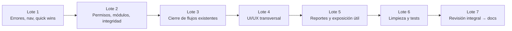

# Plan de mejoras a corto plazo — Bloqer v2

> **Objetivo de esta etapa:** mejorar Bloqer v2 como producto operativo (estabilidad, claridad, coherencia, usabilidad, permisos, navegación, reportes existentes, limpieza técnica y tests), **sin** desarrollar contabilidad completa.
> **Fuentes:** [`RELEVAMIENTO_TECNICO_FUNCIONAL_BLOQER_V2.md`](./RELEVAMIENTO_TECNICO_FUNCIONAL_BLOQER_V2.md), [`PANORAMA_GENERAL_BLOQER_V2.md`](./PANORAMA_GENERAL_BLOQER_V2.md), [`GUIA_OPERATIVA_BLOQER_V2_REVISADA.md`](./GUIA_OPERATIVA_BLOQER_V2_REVISADA.md).
> **Estado:** plan de trabajo — **Lotes 1–4 implementados** (ver §Resultado). Lotes 5+ pendientes de aprobación.
> **Alcance excluido:** posteo contable automático, cierres contables, reversión avanzada de asientos, conciliación bancaria, motor de impuestos, retenciones fiscales completas, reportes contables avanzados e integración contable definitiva (ver §L).

---

## 0. Cómo usar este plan

1. Las tareas están agrupadas por categoría (A–L).
2. La implementación se hace por **lotes pequeños y revisables** (§3).
3. Cada lote debe poder validarse sin completar los demás.
4. Contabilidad queda en **POSTERGADO** salvo bugs que rompan pantallas generales o integridad.
5. Al terminar los lotes de plataforma, se congela la UI y se actualiza documentación/capacitación (fase posterior).

### Criterios de priorización aplicados

| Prioridad | Criterio |
|-----------|----------|
| **P0** | Bloquea operación normal, riesgo de seguridad/tenant/integridad, o acción visible que falla |
| **P1** | Flujo incompleto que deja al usuario en callejón sin salida, o inconsistencia grave de permisos/módulos |
| **P2** | Mejora importante de claridad, usabilidad o exposición de valor ya existente |
| **P3** | Optimización, limpieza o polish |

### Leyenda de campos por tarea

| Campo | Significado |
|-------|-------------|
| Migración Prisma | `Sí` / `No` / `Solo si se elige opción X` |
| Cambia UI | `Sí` / `No` / `Mínimo` (copy o link) |
| Guía operativa | Si al implementar hay que reflejarlo luego en la guía final |

---

## 1. Resumen ejecutivo

Bloqer v2 ya tiene un núcleo operativo utilizable (proyectos → presupuesto → cronograma → libro de obra → compras → AR/AP → tesorería → control de costos). El trabajo de esta etapa no es inventar módulos nuevos, sino:

- Cerrar **brechas visibles** (rutas huérfanas, textos incorrectos, pantallas confusas).
- Reducir **riesgos de gobernanza** (permisos de módulos inexistentes, gating default-on).
- Mejorar **integridad no contable** (restricción de presupuesto aprobado, storage/placeholder).
- Exponer **solo** lo que esté casi listo y aporte valor (exports corporativos).
- Ampliar **tests** de circuitos principales.
- Dejar contabilidad **estable y explícitamente limitada**, fuera del sprint.

**Anticipo a proveedor:** el servicio `registerSupplierAdvance` **lanza CONFLICT** a propósito (ADR-013 / Phase 2). **No** se expone en esta etapa; se documenta/oculta si aparece en UI.

---

## 2. Los 15 problemas a atacar primero

| # | ID | Problema | Por qué primero | Lote |
|---|-----|----------|-----------------|------|
| 1 | A-01 | Texto UI “cron horario” cuando el cron es diario | Error visible, confunde operadores | 1 |
| 2 | D-01 | Listado de recepciones no navegable | Flujo de compras incompleto en menú | 1 |
| 3 | D-02 | Listado de pagos a proveedor no navegable | Finanzas no encuentra pagos consolidados | 1 |
| 4 | C-01 | Banner/claridad de storage `PLACEHOLDER` | Usuario cree que subió un archivo y no hay binario | 1 |
| 5 | E-01 | Matriz de permisos muestra módulos sin backend | Expectativa falsa de capacidades | 2 |
| 6 | E-02 | Gating de módulos default-on sin explicación | Módulo “apagado” puede seguir usable si no hay fila | 2 |
| 7 | A-02 | Índice/restricción DB: un solo budget `APPROVED` por proyecto | Integridad: hoy solo en service layer | 2 |
| 8 | H-01 | Clarificar pantalla de permisos (solo lectura) | Usuarios intentan editar sin éxito | 1 |
| 9 | G-01 | Exports corporativos CxP / facturas proveedor sin botón | Capacidad real sin acceso visible | 5 |
| 10 | B-01 | Consumos: alta sin listado ni enlace claro | Callejón / traza incompleta | 3 |
| 11 | C-02 | Configuración de compras semi-oculta | Política crítica difícil de encontrar | 1 |
| 12 | D-03 | Enlaces cruzados OC ↔ recepción ↔ factura | Navegación entre documentos relacionados | 3 |
| 13 | I-01 | Código muerto / nav legacy | Reduce ruido y errores futuros | 6 |
| 14 | J-01 | Tests faltantes en compras, libro de obra, certificaciones | Regresión en circuitos críticos | 6 |
| 15 | H-02 | Estados vacíos y mensajes de error inconsistentes | Dificulta aprendizaje y capacitación | 4 |

---

## 3. Lotes de implementación



| Lote | Nombre | Objetivo | Migraciones | Mezclar con |
|------|--------|----------|-------------|-------------|
| **1** | Errores, navegación y quick wins | Corregir textos, enlazar rutas huérfanas, clarificar storage y permisos read-only | No | — |
| **2** | Permisos, módulos e integridad | Ocultar módulos fantasma; clarificar/ajustar gating; índice budget | Solo A-02 | No mezclar con rediseño UX |
| **3** | Cierre de flujos existentes | Consumos listado, deep-links, feedback de flujos de compra/certificación | Idealmente no | No nuevas features grandes |
| **4** | UI/UX transversal | Empty states, toasts, tablas, terminología | No | No refactors estructurales |
| **5** | Reportes y exposición útil | Botones de export corporativo; visibilidad de jobs/emails | No | No anticipo proveedor |
| **6** | Limpieza técnica y tests | Dead code, tests de circuitos | No (salvo limpieza trivial) | No features |
| **7** | Revisión integral | Smoke manual + checklist para congelar UI y docs | No | — |

---

## 4. Contenido exacto del Lote 1 (propuesta para aprobación)

> **Estado: IMPLEMENTADO** (2026-07-16). Sin migraciones Prisma. Sin cambios de modelo. Sin contabilidad. Sin refactors amplios.

| ID | Tarea | Complejidad | Prio | Estado Lote 1 |
|----|-------|-------------|------|---------------|
| A-01 | Corregir copy “cron horario” → “diario” en reportes programados | Baja | P1 | ✅ Hecho |
| D-01 | Enlazar listado `/proyectos/[id]/recepciones` (Operación + detalle OC) | Baja | P1 | ✅ Hecho |
| D-02 | Enlazar `/finanzas/pagos-proveedor` desde hub Finanzas y CxP | Baja | P1 | ✅ Hecho |
| C-01 | Advertencia visible cuando storage está en `PLACEHOLDER` | Baja | P1 | ✅ Hecho |
| H-01 | Banner en `/configuracion/permisos`: solo lectura → Equipo | Baja | P2 | ✅ Hecho |
| C-02 | Card “Compras” en hub `/configuracion` | Baja | P2 | ✅ Hecho |
| C-03 | Auditar etiquetas Ingreso/Egreso | Baja | P2 | ✅ Sin cambios (ya coherente) |
| H-03 | Errores de descarga PLACEHOLDER | Baja | P2 | ✅ Hecho (con C-01) |
| F-02 | CTA anticipo proveedor | Baja | P1 | ✅ N/A (sin CTA en UI) |

**Criterio de salida del Lote 1:** un usuario nuevo puede llegar a recepciones y pagos sin URL manual; entiende que los permisos no se editan ahí; no confunde frecuencia del cron; y ve aviso claro si los archivos no se almacenan de verdad.

**Validación:** smoke manual en un tenant de prueba (sin reset destructivo): navegar OC→recepciones, CxP→pagos, subir documento con R2 off (si aplica en local), abrir permisos y reportes programados.

---

## Categoría A — Bugs y errores funcionales

### A-01 — Texto incorrecto del cron de reportes programados

| Campo | Valor |
|-------|-------|
| **Módulo** | Reportes programados |
| **Problema actual** | La UI dice que el “cron horario” genera adjuntos; el cron real es diario (`vercel.json` ~23:00 UTC). |
| **Evidencia** | `apps/web/app/(app)/configuracion/reportes/page.tsx` (subtitle); `apps/web/vercel.json`; RELEVAMIENTO F-59 / D-5 |
| **Impacto** | Operadores esperan envíos cada hora y no entienden el historial. |
| **Solución** | Cambiar copy a “cron diario” / “una vez al día” y, si hay tooltip, mostrar hora UTC documentada. |
| **Áreas** | `configuracion/reportes/page.tsx`, posiblemente `scheduled-report-form.tsx` |
| **Riesgo** | Bajo |
| **Complejidad** | Baja |
| **Prioridad** | P1 |
| **Dependencias** | Ninguna |
| **Criterios de aceptación** | Ninguna pantalla de reportes programados menciona “horario” como frecuencia del job. |
| **Tests** | No unitario; smoke visual |
| **Migración Prisma** | No |
| **Cambia UI** | Mínimo |
| **Guía operativa** | Sí (frecuencia real) |
| **Lote** | 1 |

### A-02 — Un solo presupuesto `APPROVED` por proyecto solo en service layer

| Campo | Valor |
|-------|-------|
| **Módulo** | Presupuestos |
| **Problema actual** | `BR-BUD-001` se aplica en `budget.service` al aprobar, pero no hay índice/restricción en DB. Condiciones de carrera o bugs futuros podrían dejar dos aprobados. |
| **Evidencia** | `packages/services/src/budget/budget.service.ts` (~BR-BUD-001); RELEVAMIENTO F-10 / B-2 |
| **Impacto** | Riesgo de integridad en certificaciones y baseline de costos. |
| **Solución** | Índice único parcial (o equivalente Prisma) `projectId` donde `status = APPROVED`; manejar error de conflicto en UI. |
| **Áreas** | `schema.prisma`, migración, `budget.service.ts`, UI de aprobación |
| **Riesgo** | Medio (migración; datos existentes con duplicados fallarían) |
| **Complejidad** | Baja–media |
| **Prioridad** | P1 |
| **Dependencias** | **Decisión humana:** ¿auditar producción por duplicados antes de migrar? |
| **Criterios de aceptación** | Imposible persistir dos `APPROVED` en el mismo proyecto; UI muestra error claro. |
| **Tests** | Test de servicio de aprobación concurrente / conflicto |
| **Migración Prisma** | **Sí** |
| **Cambia UI** | Mínimo (mensaje de error) |
| **Guía operativa** | Sí (regla de un presupuesto aprobado) |
| **Lote** | 2 |

### A-03 — Auto-aprobación de OC y segregación de funciones

| Campo | Valor |
|-------|-------|
| **Módulo** | Compras / OC |
| **Problema actual** | Política puede auto-aprobar OC si no aplica umbral high-level; conviene verificar que no diluya segregación “quien solicita no aprueba”. |
| **Evidencia** | RELEVAMIENTO F-22; `purchase-order-workflow.service.ts` |
| **Impacto** | Riesgo de gobierno interno / compliance operativo. |
| **Solución** | Auditar reglas de auto-approve; si el comportamiento es intencional, documentarlo en UI (badge/aviso). Si no, reforzar bloqueo self-approval. |
| **Áreas** | `purchase-order-workflow.service.ts`, settings de compras, UI de OC |
| **Riesgo** | Medio |
| **Complejidad** | Media |
| **Prioridad** | P2 |
| **Dependencias** | **Decisión humana:** política comercial deseada |
| **Criterios de aceptación** | Comportamiento documentado y coherente con settings; no hay auto-approve silencioso inesperado. |
| **Tests** | Tests de workflow OC (self-approval / tiers) |
| **Migración Prisma** | No |
| **Cambia UI** | Posible |
| **Guía operativa** | Sí |
| **Lote** | 3 |

---

## Categoría B — Flujos existentes incompletos

### B-01 — Consumos: alta sin listado

| Campo | Valor |
|-------|-------|
| **Módulo** | Inventario / proyecto |
| **Problema actual** | Existe `/proyectos/[id]/consumos/nuevo` pero no listado ni ítem de menú claro. |
| **Evidencia** | RELEVAMIENTO F-17, §14; página `consumos/nuevo` |
| **Impacto** | Capataz/PM no ve historial de consumos desde obra. |
| **Solución** | Listado mínimo de consumos del proyecto (o enlace filtrado a movimientos de inventario) + link desde inventario del proyecto. |
| **Áreas** | `proyectos/[id]/consumos/**`, nav proyecto, `stock-movement` |
| **Riesgo** | Bajo |
| **Complejidad** | Media |
| **Prioridad** | P2 |
| **Dependencias** | Ninguna crítica |
| **Criterios de aceptación** | Desde el proyecto se puede ver y crear consumos sin URL inventada. |
| **Tests** | Smoke + test de listado si hay service |
| **Migración Prisma** | No |
| **Cambia UI** | Sí |
| **Guía operativa** | Sí |
| **Lote** | 3 |

### B-02 — Clarificar flujo certificación → factura (paso manual)

| Campo | Valor |
|-------|-------|
| **Módulo** | Certificaciones / AR |
| **Problema actual** | Certificación aprobada no crea factura automáticamente (por diseño D-026); usuarios pueden quedar esperando. |
| **Evidencia** | RELEVAMIENTO F-18; guía revisada §11.3 |
| **Impacto** | Callejón percibido: “aprobé y no pasa nada”. |
| **Solución** | CTA visible “Emitir factura” desde certificación `APPROVED` sin factura; empty state explicativo. |
| **Áreas** | `certificaciones/[certId]/page.tsx`, componentes de certificación |
| **Riesgo** | Bajo |
| **Complejidad** | Baja |
| **Prioridad** | P2 |
| **Dependencias** | Ninguna |
| **Criterios de aceptación** | Desde certificación aprobada sin factura hay un camino obvio a facturar. |
| **Tests** | Smoke UI |
| **Migración Prisma** | No |
| **Cambia UI** | Sí |
| **Guía operativa** | Ya documentado; reforzar |
| **Lote** | 3 |

### B-03 — Clarificar cert. subcontrato → factura proveedor DRAFT

| Campo | Valor |
|-------|-------|
| **Módulo** | Subcontratos / AP |
| **Problema actual** | Al aprobar cert. SC se genera factura proveedor DRAFT; el siguiente paso (emitir) puede no ser obvio. |
| **Evidencia** | RELEVAMIENTO F-30; guía §10 |
| **Impacto** | CxP no aparece hasta emitir; confusión. |
| **Solución** | Banner/CTA “Revisar y emitir factura generada” con link. |
| **Áreas** | páginas de certificación SC |
| **Riesgo** | Bajo |
| **Complejidad** | Baja |
| **Prioridad** | P2 |
| **Dependencias** | Ninguna |
| **Criterios de aceptación** | Tras aprobar, el usuario llega a la factura DRAFT en ≤2 clics. |
| **Tests** | Smoke |
| **Migración Prisma** | No |
| **Cambia UI** | Sí |
| **Guía operativa** | Sí |
| **Lote** | 3 |

### B-04 — Versionado de presupuesto / adendas formales

| Campo | Valor |
|-------|-------|
| **Módulo** | Presupuestos |
| **Problema actual** | Adenda = nuevo budget sin `SUPERSEDED` ni vínculo padre-hijo. |
| **Evidencia** | RELEVAMIENTO F-13, §11 |
| **Impacto** | Trazabilidad contractual débil. |
| **Solución en esta etapa** | **No modelar adenda formal.** Mejorar copy en listado de presupuestos: “crear nuevo presupuesto como adenda (sin vínculo automático)”. |
| **Áreas** | UI presupuestos |
| **Riesgo** | Bajo |
| **Complejidad** | Baja (copy) / Alta (modelo formal → postergado) |
| **Prioridad** | P3 (copy) / **postergado** (modelo) |
| **Dependencias** | Decisión de producto para modelo formal (fuera de corto plazo) |
| **Criterios de aceptación (corto plazo)** | UI no promete adenda formal. |
| **Tests** | — |
| **Migración Prisma** | No (corto plazo) |
| **Cambia UI** | Mínimo |
| **Guía operativa** | Ya aclarado |
| **Lote** | 4 (copy) / K (modelo) |

---

## Categoría C — UI/UX

### C-01 — Storage PLACEHOLDER: advertencia clara

| Campo | Valor |
|-------|-------|
| **Módulo** | Documentos |
| **Problema actual** | Si R2 no está configurado, se guarda metadata sin archivo. Hay aviso parcial; hay que reforzarlo en upload y detalle. |
| **Evidencia** | `entity-documents-panel.tsx` (`placeholderWarning`); `documentos/[documentId]/page.tsx` (`storageProvider === "PLACEHOLDER"`); RELEVAMIENTO F-55 / R-08 |
| **Impacto** | Pérdida percibida de evidencia de obra / contratos. |
| **Solución** | Banner persistente en módulo documentos + bloquear o marcar “sin archivo” en descarga; mensaje de error si se intenta descargar placeholder. |
| **Áreas** | features/documents, páginas de documentos |
| **Riesgo** | Bajo |
| **Complejidad** | Baja |
| **Prioridad** | P1 |
| **Dependencias** | Confirmar en producción si R2 está ON (**decisión/ops**) |
| **Criterios de aceptación** | Imposible creer que hay archivo cuando `PLACEHOLDER`; descarga falla con mensaje claro. |
| **Tests** | Smoke; opcional unit de mensaje |
| **Migración Prisma** | No |
| **Cambia UI** | Sí |
| **Guía operativa** | Sí |
| **Lote** | 1 |

### C-02 — Configuración de compras más visible

| Campo | Valor |
|-------|-------|
| **Módulo** | Configuración / Compras |
| **Problema actual** | `/configuracion/compras` solo en subnav horizontal. |
| **Evidencia** | RELEVAMIENTO §14, §17 |
| **Impacto** | Políticas de mínimo de cotizaciones / umbrales difíciles de encontrar. |
| **Solución** | Card en hub `/configuracion` + opcional ítem en sidebar Configuración. |
| **Áreas** | `configuracion/page.tsx`, `global-workspace-nav.ts`, `configuracion-subnav.ts` |
| **Riesgo** | Bajo |
| **Complejidad** | Baja |
| **Prioridad** | P2 |
| **Dependencias** | Ninguna |
| **Criterios de aceptación** | Acceso a compras en ≤2 clics desde Configuración. |
| **Tests** | — |
| **Migración Prisma** | No |
| **Cambia UI** | Sí |
| **Guía operativa** | Sí |
| **Lote** | 1 |

### C-03 — Terminología de movimientos de caja

| Campo | Valor |
|-------|-------|
| **Módulo** | Tesorería |
| **Problema actual** | Docs antiguas usaban INCOME/OUTCOME; UI debe usar Ingreso/Egreso consistentemente. |
| **Evidencia** | Enum `INFLOW`/`OUTFLOW`; guía revisada §4 |
| **Impacto** | Confusión en capacitación. |
| **Solución** | Auditar labels ES en pantallas de tesorería/cobros/pagos; unificar. |
| **Áreas** | features treasury/collections/payments |
| **Riesgo** | Bajo |
| **Complejidad** | Baja |
| **Prioridad** | P2 |
| **Dependencias** | Ninguna |
| **Criterios de aceptación** | No aparecen “INCOME/OUTCOME” ni traducciones mixtas en UI ES. |
| **Tests** | — |
| **Migración Prisma** | No |
| **Cambia UI** | Mínimo |
| **Guía operativa** | Ya corregida |
| **Lote** | 1 |

### C-04 — Empty states y mensajes de éxito/error

| Campo | Valor |
|-------|-------|
| **Módulo** | Transversal |
| **Problema actual** | Pantallas vacías o errores genéricos dificultan aprendizaje. |
| **Evidencia** | RELEVAMIENTO §17; hallazgo H-02 |
| **Impacto** | Capacitación más lenta; soporte. |
| **Solución** | Patrón común de empty state (título, qué hacer, CTA) en hubs: proyectos, compras, CxC/CxP, inventario, notificaciones. |
| **Áreas** | páginas listado principales |
| **Riesgo** | Bajo |
| **Complejidad** | Media (volumen) |
| **Prioridad** | P2 |
| **Dependencias** | Lote 1 (nav) preferible |
| **Criterios de aceptación** | Listados clave con 0 datos muestran CTA accionable, no pantalla en blanco. |
| **Tests** | Smoke |
| **Migración Prisma** | No |
| **Cambia UI** | Sí |
| **Guía operativa** | No obligatorio |
| **Lote** | 4 |

### C-05 — Tablas extensas / responsive básico

| Campo | Valor |
|-------|-------|
| **Módulo** | Transversal |
| **Problema actual** | Tablas densas (control de costos, aging, movimientos) pueden ser difíciles en pantallas chicas. |
| **Evidencia** | Hallazgo de auditoría UX |
| **Impacto** | Uso en obra / notebook. |
| **Solución** | Scroll horizontal consistente, columnas prioritarias, sticky primera columna donde aporte. Sin rediseño total. |
| **Áreas** | tablas de cost-control, aging, inventario |
| **Riesgo** | Bajo |
| **Complejidad** | Media |
| **Prioridad** | P3 |
| **Dependencias** | Ninguna |
| **Criterios de aceptación** | En viewport 1280px y 768px las tablas clave no “rompen” el layout. |
| **Tests** | Manual |
| **Migración Prisma** | No |
| **Cambia UI** | Sí |
| **Guía operativa** | No |
| **Lote** | 4 |

### C-06 — Accesibilidad básica

| Campo | Valor |
|-------|-------|
| **Módulo** | Transversal |
| **Problema actual** | Revisar labels, focus en modales, contraste de badges de estado. |
| **Evidencia** | Alcance solicitado |
| **Impacto** | Usabilidad y profesionalismo. |
| **Solución** | Checklist a11y mínimo en formularios críticos (login, OC, certificación, cobranza/pago). |
| **Áreas** | forms clave |
| **Riesgo** | Bajo |
| **Complejidad** | Media |
| **Prioridad** | P3 |
| **Dependencias** | Ninguna |
| **Criterios de aceptación** | Inputs con label; diálogos cerrables por teclado en flujos auditados. |
| **Tests** | Manual |
| **Migración Prisma** | No |
| **Cambia UI** | Mínimo |
| **Guía operativa** | No |
| **Lote** | 4 |

---

## Categoría D — Navegación

### D-01 — Recepciones: ruta huérfana

| Campo | Valor |
|-------|-------|
| **Módulo** | Compras |
| **Problema actual** | `/proyectos/[id]/recepciones` existe pero no está en nav; solo se llega desde OC a `nueva`/`[receiptId]`. |
| **Evidencia** | RELEVAMIENTO §14 F-23; `project-workspace-nav.ts` sin ítem; página `recepciones/page.tsx` |
| **Impacto** | No se puede consultar recepciones del proyecto fácilmente. |
| **Solución** | Agregar ítem “Recepciones” en sección Finanzas del proyecto (junto a OC) **o** link destacado en detalle OC + hub compras. Preferencia: **ambos** (nav + link en OC). |
| **Áreas** | `packages/services/src/project/project-workspace-nav.ts`, detalle OC, página listado |
| **Riesgo** | Bajo |
| **Complejidad** | Baja |
| **Prioridad** | P1 |
| **Dependencias** | Ninguna |
| **Criterios de aceptación** | Listado alcanzable desde menú del proyecto; desde OC se ve historial de recepciones. |
| **Tests** | Smoke |
| **Migración Prisma** | No |
| **Cambia UI** | Sí |
| **Guía operativa** | Sí |
| **Lote** | 1 |

### D-02 — Pagos a proveedor corporativos: ruta huérfana

| Campo | Valor |
|-------|-------|
| **Módulo** | Finanzas / AP |
| **Problema actual** | `/finanzas/pagos-proveedor` no está en sidebar/hub. |
| **Evidencia** | RELEVAMIENTO §14 |
| **Impacto** | Finanzas no encuentra el consolidado de pagos. |
| **Solución** | Link en hub `/finanzas` y/o en `/finanzas/cuentas-por-pagar`. |
| **Áreas** | `finanzas/page.tsx`, CxP corporativo, `global-workspace-nav.ts` (opcional) |
| **Riesgo** | Bajo |
| **Complejidad** | Baja |
| **Prioridad** | P1 |
| **Dependencias** | Ninguna |
| **Criterios de aceptación** | Pagos corporativos alcanzables sin URL manual. |
| **Tests** | Smoke |
| **Migración Prisma** | No |
| **Cambia UI** | Sí |
| **Guía operativa** | Sí |
| **Lote** | 1 |

### D-03 — Navegación cruzada entre documentos relacionados

| Campo | Valor |
|-------|-------|
| **Módulo** | Compras / AP / AR |
| **Problema actual** | PR→OC→Recepción→Factura→Pago y Cert→Factura→Cobro a veces carecen de breadcrumb/links bidireccionales. |
| **Evidencia** | Alcance solicitado; guía operativa flujos E2E |
| **Impacto** | Tiempo operativo y errores de contexto. |
| **Solución** | Panel “Relacionados” o links estándar en detalle de cada documento. |
| **Áreas** | detalles OC, recepción, factura proveedor, pago, certificación, factura venta, cobranza |
| **Riesgo** | Bajo |
| **Complejidad** | Media |
| **Prioridad** | P2 |
| **Dependencias** | D-01/D-02 preferibles |
| **Criterios de aceptación** | Desde cada documento del flujo compra/cobro se llega al anterior/siguiente en ≤1 clic. |
| **Tests** | Smoke |
| **Migración Prisma** | No |
| **Cambia UI** | Sí |
| **Guía operativa** | Opcional |
| **Lote** | 3 |

### D-04 — Notificaciones en sidebar (opcional)

| Campo | Valor |
|-------|-------|
| **Módulo** | Notificaciones |
| **Problema actual** | Solo campana/header. |
| **Evidencia** | RELEVAMIENTO D-2 |
| **Impacto** | Bajo si la campana es descubrible. |
| **Solución** | Evaluar ítem “Notificaciones” en General; o mejorar discoverability de la campana. |
| **Áreas** | `global-workspace-nav.ts`, header |
| **Riesgo** | Bajo |
| **Complejidad** | Baja |
| **Prioridad** | P3 |
| **Dependencias** | **Decisión humana:** ¿sidebar o solo campana? |
| **Criterios de aceptación** | Decisión documentada; si sidebar, visible con permiso. |
| **Tests** | — |
| **Migración Prisma** | No |
| **Cambia UI** | Sí si se elige |
| **Guía operativa** | Sí |
| **Lote** | 4 |

### D-05 — Subnav de hubs (Inventario / Tesorería / Contabilidad)

| Campo | Valor |
|-------|-------|
| **Módulo** | Navegación |
| **Problema actual** | Hubs por tarjetas pueden desorientar. |
| **Evidencia** | RELEVAMIENTO §17 D-4 |
| **Impacto** | Orientación. |
| **Solución** | Subnav ligera dentro del hub (sin rediseño total). Contabilidad: solo polish, sin nuevas features. |
| **Áreas** | layouts/hubs |
| **Riesgo** | Bajo |
| **Complejidad** | Media |
| **Prioridad** | P3 |
| **Dependencias** | Ninguna |
| **Criterios de aceptación** | Dentro de inventario/tesorería se navega entre subpáginas sin volver al dashboard. |
| **Tests** | — |
| **Migración Prisma** | No |
| **Cambia UI** | Sí |
| **Guía operativa** | Opcional |
| **Lote** | 4 |

---

## Categoría E — Permisos y módulos

### E-01 — Ocultar / marcar módulos de permiso sin implementación

| Campo | Valor |
|-------|-------|
| **Módulo** | Permisos |
| **Problema actual** | `CONTRACTS`, `CHANGE_ORDERS`, `RFIS`, `BANK_RECONCILIATION`, `TAXES` (y afines) aparecen en matriz/`OVERVIEW_MODULES` sin servicio operativo. |
| **Evidencia** | `packages/domain/src/permissions/matrix.ts`, `matrix-overview.ts`; RELEVAMIENTO §15 |
| **Impacto** | Expectativa falsa; confusión en capacitación. |
| **Solución** | En UI de permisos: sección “No disponible en esta versión” o filtrar del overview visible. **No** borrar del enum de dominio aún (rompe tipos); solo presentación + comentario. |
| **Áreas** | `permissions-overview`, página permisos, posiblemente platform modules UI |
| **Riesgo** | Bajo–medio (si se filtra mal un módulo real) |
| **Complejidad** | Media |
| **Prioridad** | P1 |
| **Dependencias** | Lista canónica de módulos “reales” vs “futuros” (**decisión humana** para confirmar lista) |
| **Criterios de aceptación** | Usuario no cree que puede operar contratos/RFIs/conciliación/impuestos. |
| **Tests** | Unit del overview filtrado |
| **Migración Prisma** | No |
| **Cambia UI** | Sí |
| **Guía operativa** | Sí |
| **Lote** | 2 |

### E-02 — Gating de módulos default-on: claridad y robustez

| Campo | Valor |
|-------|-------|
| **Módulo** | Plataforma / tenant modules |
| **Problema actual** | `TenantModuleGate`: ausencia de fila = habilitado. Riesgo de asumir “apagado” sin fila. |
| **Evidencia** | `tenant-module-gate.ts` (“defaults missing DB rows to enabled”); RELEVAMIENTO R-10 |
| **Impacto** | Gobernanza de módulos; seguridad de superficie. |
| **Solución (corto plazo)** | (1) UI plataforma muestra explícitamente default-on; (2) al provisionar/onboarding asegurar filas explícitas; (3) opcional: script/check de tenants sin filas. **No** cambiar a default-off sin decisión (rompe tenants existentes). |
| **Áreas** | `tenant-module.service`, platform modules UI, onboarding |
| **Riesgo** | Alto si se cambia semántica default sin migración de datos |
| **Complejidad** | Media |
| **Prioridad** | P1 |
| **Dependencias** | **Decisión humana:** ¿mantener default-on o migrar a default-off explícito? |
| **Criterios de aceptación** | Comportamiento documentado en UI admin; tenants nuevos con filas explícitas. |
| **Tests** | Unit gate + test onboarding inserts |
| **Migración Prisma** | No (salvo si se elige backfill masivo de settings) |
| **Cambia UI** | Sí (plataforma) |
| **Guía operativa** | Sí (para implementadores) |
| **Lote** | 2 |

### E-03 — Verificar que mutaciones respetan módulo deshabilitado

| Campo | Valor |
|-------|-------|
| **Módulo** | Seguridad / gating |
| **Problema actual** | Nav oculta módulos; hay que confirmar que server actions también rechazan si el módulo está off. |
| **Evidencia** | RELEVAMIENTO R-04; `assertModuleEnabled` en services |
| **Impacto** | Bypass por URL/API. |
| **Solución** | Auditoría estática de actions críticas + tests de gate en 5–8 flujos (budget, OC, certificación, cobranza, pago). |
| **Áreas** | services + actions |
| **Riesgo** | Medio si hay huecos |
| **Complejidad** | Media |
| **Prioridad** | P1 |
| **Dependencias** | E-02 |
| **Criterios de aceptación** | Con módulo off, action responde FORBIDDEN/MODULE_DISABLED; UI no ofrece CTA. |
| **Tests** | **Sí** (prioridad alta) |
| **Migración Prisma** | No |
| **Cambia UI** | No / mínimo |
| **Guía operativa** | No |
| **Lote** | 2 |

---

## Categoría F — Backend/Prisma razonable de exponer (o no)

### F-01 — Exports corporativos CSV (exponer botones)

| Campo | Valor |
|-------|-------|
| **Módulo** | Reportes / Finanzas |
| **Problema actual** | `/api/reports/finanzas/cxp-corporativo.csv` y `facturas-proveedor-corporativo.csv` existen sin botón. |
| **Evidencia** | RELEVAMIENTO §8 |
| **Impacto** | Valor disponible solo vía reportes programados. |
| **Solución** | Botones de descarga en `/finanzas/cuentas-por-pagar` y `/finanzas/facturas-proveedor` (mismos permisos que el API). |
| **Áreas** | páginas finanzas, helpers de export |
| **Riesgo** | Bajo |
| **Complejidad** | Baja |
| **Prioridad** | P2 |
| **Dependencias** | Ninguna |
| **Criterios de aceptación** | Descarga CSV con mismo dataset que el reporte programado. |
| **Tests** | Smoke de auth en route |
| **Migración Prisma** | No |
| **Cambia UI** | Sí |
| **Guía operativa** | Sí |
| **Lote** | 5 |

### F-02 — Anticipo a proveedor — **NO exponer**

| Campo | Valor |
|-------|-------|
| **Módulo** | AP |
| **Problema actual** | `registerSupplierAdvance` lanza siempre `CONFLICT` (ADR-013 / Phase 2). |
| **Evidencia** | `packages/services/src/ap/register-supplier-advance.service.ts` |
| **Impacto** | Si hay CTA, el usuario recibe error permanente. |
| **Solución** | Asegurar que **no** hay botón; si hay, ocultarlo y mostrar nota “no disponible”. Mantener servicio stub. |
| **Áreas** | UI AP / transacciones |
| **Riesgo** | Bajo |
| **Complejidad** | Baja |
| **Prioridad** | P1 (si hay UI visible) / P3 (si no hay) |
| **Dependencias** | Ninguna |
| **Criterios de aceptación** | Ningún camino de UI llama al stub. |
| **Tests** | Test existente de CONFLICT; mantener |
| **Migración Prisma** | No |
| **Cambia UI** | Solo si hay CTA |
| **Guía operativa** | Sí (limitación) |
| **Lote** | 1 (si hay CTA) / K (feature real) |

### F-03 — Ajustes de stock / caja (`ADJUSTMENT`) — no exponer

| Campo | Valor |
|-------|-------|
| **Módulo** | Inventario / Tesorería |
| **Problema actual** | Enums reservados sin UI. |
| **Evidencia** | RELEVAMIENTO §9 |
| **Solución** | Mantener reservado; no exponer en este sprint. |
| **Prioridad** | Postergado (K) |
| **Migración Prisma** | No |
| **Lote** | K |

---

## Categoría G — Reportes y exportaciones

### G-01 — Botones exports corporativos

*(Ver F-01 — misma tarea.)*

### G-02 — Clarificar estado de reportes programados y emails

| Campo | Valor |
|-------|-------|
| **Módulo** | Reportes / Notificaciones |
| **Problema actual** | Historial existe; conviene revisar empty states y mensajes cuando Resend está off. |
| **Evidencia** | RELEVAMIENTO F-58/F-59; `/notificaciones/emails`, `/configuracion/reportes` |
| **Impacto** | Ops no sabe si el mail falló o se skipeó. |
| **Solución** | Labels claros de estado (enviado / fallido / omitido); enlace a log de emails desde detalle de run. |
| **Áreas** | scheduled-reports UI, emails page |
| **Riesgo** | Bajo |
| **Complejidad** | Media |
| **Prioridad** | P2 |
| **Dependencias** | A-01 |
| **Criterios de aceptación** | Un run fallido o skipped se entiende sin mirar logs de servidor. |
| **Tests** | Smoke |
| **Migración Prisma** | No |
| **Cambia UI** | Sí |
| **Guía operativa** | Sí |
| **Lote** | 5 |

### G-03 — Alertas operativas: historial de corridas (ligero)

| Campo | Valor |
|-------|-------|
| **Módulo** | Notificaciones |
| **Problema actual** | Cron diario sin historial de corridas del job. |
| **Evidencia** | RELEVAMIENTO F-57 |
| **Impacto** | Difícil saber si el cron corrió. |
| **Solución** | Si ya hay notificaciones generadas, mostrar “última generación” agregada; no construir infra nueva pesada. |
| **Áreas** | `/notificaciones/alertas` |
| **Riesgo** | Bajo |
| **Complejidad** | Baja–media |
| **Prioridad** | P3 |
| **Dependencias** | Ninguna |
| **Criterios de aceptación** | Ops ve indicios de última actividad de alertas. |
| **Tests** | — |
| **Migración Prisma** | No |
| **Cambia UI** | Sí |
| **Guía operativa** | Opcional |
| **Lote** | 5 |

---

## Categoría H — Manejo de errores y estados vacíos

### H-01 — Permisos: pantalla solo lectura explícita

| Campo | Valor |
|-------|-------|
| **Módulo** | Usuarios / permisos |
| **Problema actual** | Matriz informativa sin CTA de edición; usuarios intentan “cambiar permisos”. |
| **Evidencia** | RELEVAMIENTO F-06; `/configuracion/permisos` |
| **Impacto** | Frustración. |
| **Solución** | Banner + link a Equipo; texto “los permisos se definen por rol; asigná roles en Equipo”. |
| **Áreas** | `permisos/page.tsx` |
| **Riesgo** | Bajo |
| **Complejidad** | Baja |
| **Prioridad** | P2 |
| **Dependencias** | Ninguna |
| **Criterios de aceptación** | Queda claro que no es editable. |
| **Tests** | — |
| **Migración Prisma** | No |
| **Cambia UI** | Mínimo |
| **Guía operativa** | Sí |
| **Lote** | 1 |

### H-02 — Empty states y toasts consistentes

*(Ver C-04 — misma línea de trabajo, Lote 4.)*

### H-03 — Errores de carga de archivos

| Campo | Valor |
|-------|-------|
| **Módulo** | Documentos |
| **Problema actual** | Fallos de upload / placeholder pueden ser opacos. |
| **Evidencia** | Alcance; C-01 |
| **Solución** | Mensajes diferenciados: R2 no configurado vs error de red vs tipo/tamaño inválido. |
| **Áreas** | upload documents |
| **Riesgo** | Bajo |
| **Complejidad** | Baja |
| **Prioridad** | P2 |
| **Dependencias** | C-01 |
| **Criterios de aceptación** | Tres clases de error distinguibles en UI. |
| **Tests** | — |
| **Migración Prisma** | No |
| **Cambia UI** | Sí |
| **Guía operativa** | Opcional |
| **Lote** | 1–4 |

---

## Categoría I — Limpieza técnica

### I-01 — Nav legacy y acciones muertas

| Campo | Valor |
|-------|-------|
| **Módulo** | Infra |
| **Problema actual** | `MAIN_NAV_DEF` / `filterMainNav` en `nav-config.ts` no alimentan la shell; `cancelInternalTransferFormAction` sin uso; `issuePurchaseOrder` `@deprecated`. |
| **Evidencia** | RELEVAMIENTO §13 |
| **Impacto** | Deuda y confusión para agentes/devs. |
| **Solución** | Eliminar o marcar claramente dead code tras confirmar 0 referencias. |
| **Áreas** | `nav-config.ts`, `tesoreria/actions.ts`, `purchase-order-workflow.service.ts` |
| **Riesgo** | Bajo si se grepea bien |
| **Complejidad** | Baja |
| **Prioridad** | P3 |
| **Dependencias** | Ninguna |
| **Criterios de aceptación** | Sin exports muertos referenciados; build OK. |
| **Tests** | Typecheck |
| **Migración Prisma** | No |
| **Cambia UI** | No |
| **Guía operativa** | No |
| **Lote** | 6 |

### I-02 — `packages/ui` stub

| Campo | Valor |
|-------|-------|
| **Módulo** | Monorepo |
| **Problema actual** | Stub Phase 0. |
| **Evidencia** | RELEVAMIENTO §13 |
| **Solución** | Dejar o documentar; **no** completar design system en este sprint. Remover del tree solo si no rompe workspace. |
| **Prioridad** | P3 |
| **Migración Prisma** | No |
| **Cambia UI** | No |
| **Lote** | 6 |
| **Dependencias** | **Decisión humana:** ¿mantener paquete vacío? |

### I-03 — Aliases `@deprecated`

| Campo | Valor |
|-------|-------|
| **Módulo** | Varios |
| **Problema actual** | Deuda menor (wbs-codes, export links, etc.). |
| **Solución** | Limpiar gradualmente tras Lote 1–5. |
| **Prioridad** | P3 |
| **Lote** | 6 |

---

## Categoría J — Tests y control de calidad

### J-01 — Tests de circuitos principales (no contables)

| Campo | Valor |
|-------|-------|
| **Módulo** | QA |
| **Problema actual** | Tests concentrados en budget/finance/treasury/schedule; faltan procurement, certificaciones, jobsite, inventory, permissions/gating. |
| **Evidencia** | RELEVAMIENTO §28.4 |
| **Impacto** | Regresiones en flujos que se van a capacitar. |
| **Solución** | Suite mínima por circuito: (1) PR→OC confirm, (2) recepción→stock, (3) libro obra approve→progress, (4) certificación techos, (5) cobranza/pago moneda, (6) module gate off. |
| **Áreas** | `packages/services/**/*.test.ts` |
| **Riesgo** | Bajo |
| **Complejidad** | Media–alta (volumen) |
| **Prioridad** | P2 |
| **Dependencias** | Ninguna para empezar |
| **Criterios de aceptación** | Al menos 1 test feliz + 1 de rechazo por permisos/estado en cada circuito listado. |
| **Tests** | (esta es la tarea) |
| **Migración Prisma** | No |
| **Cambia UI** | No |
| **Guía operativa** | No |
| **Lote** | 6 |

### J-02 — Smoke checklist manual por rol

| Campo | Valor |
|-------|-------|
| **Módulo** | QA |
| **Problema actual** | Capacitación necesita guión verificable. |
| **Solución** | Checklist en docs (no script one-off) alineado a Lote 7. |
| **Prioridad** | P2 |
| **Migración Prisma** | No |
| **Cambia UI** | No |
| **Guía operativa** | Base para guías por rol |
| **Lote** | 7 |

---

## Categoría K — Mejoras que deben postergarse (fuera de este sprint, no contabilidad)

| ID | Tema | Motivo de postergación |
|----|------|------------------------|
| K-01 | Adendas formales / `SUPERSEDED` / Change Orders / Contratos | Requiere modelo + producto; no es polish |
| K-02 | RFIs | No implementado |
| K-03 | Multi-moneda FX en tesorería | Complejidad alta; documentar límite basta |
| K-04 | Valuación FIFO/promedio inventario | Decisión de producto + modelo |
| K-05 | Anticipo proveedor real (puente ADR-013) | Servicio stub a propósito |
| K-06 | Ajustes de stock/caja (`ADJUSTMENT`) | Reservado |
| K-07 | Reserva de stock | Sin modelo |
| K-08 | Versionado documental | Sin modelo |
| K-09 | 2FA / auth más allá de Google | Fuera de alcance operativo corto |
| K-10 | Billing SaaS real | Placeholder de plataforma |
| K-11 | Portales externos cliente/proveedor | Futuro |
| K-12 | Roles custom | Q-024 abierta |

---

## Categoría L — POSTERGADO — FASE CONTABILIDAD

> **No implementar en esta etapa.** Mantener pantallas actuales estables. Documentar limitaciones cuando el copy sea engañoso (solo si confunde operación general).

| ID | Tema | Nota |
|----|------|------|
| L-01 | Posteo contable automático | P0 del relevamiento original — **fuera de alcance ahora** |
| L-02 | Reversa de asientos `POSTED` | Contabilidad avanzada |
| L-03 | Cierre de período GL / `Period` | Contabilidad |
| L-04 | Conciliación bancaria | Contabilidad / tesorería bancaria |
| L-05 | Motor de impuestos / retenciones fiscales | Contabilidad / fiscal |
| L-06 | Reportes contables avanzados (mayores, diario formal) | Contabilidad |
| L-07 | Integración definitiva cobros/pagos/stock → GL | Contabilidad |
| L-08 | Reconciliar dashboard vs libro contable | Depende de L-01 |

### Excepciones permitidas (solo si aplica)

Corregir contabilidad **ahora** únicamente si:

- Rompe una pantalla general (crash).
- Genera error de ejecución que impide usar la app.
- Contamina datos de otros módulos (AR/AP/tesorería).
- Riesgo grave de seguridad o integridad cross-tenant.

Ejemplo permitido: crash al abrir `/contabilidad/asientos` por null no controlado → bugfix.  
Ejemplo **no** permitido: implementar reversa de `POSTED` “porque falta”.

### Copy mínimo permitido (sin features)

Si la UI de contabilidad sugiere automatismo inexistente, se puede agregar un aviso: “Los asientos se generan como borrador sugerido y se postean manualmente”. Eso es clarificación, no desarrollo contable.

---

## 5. Tareas ejecutables **sin** migración Prisma

Todas las del **Lote 1**, más: B-01 a B-03, C-04 a C-06, D-03 a D-05, E-01, E-03 (tests), F-01/G-01, G-02, G-03, H-*, I-*, J-*, copy de B-04, aviso de limitaciones contables (clarificación).

**Requieren migración (o backfill):** A-02 (índice budget). E-02 solo si se decide backfill masivo de `TenantModuleSetting`.

---

## 6. Decisiones humanas requeridas antes / durante

| # | Decisión | Bloquea | Opciones sugeridas |
|---|----------|---------|-------------------|
| H-D1 | ¿Auditar producción por presupuestos `APPROVED` duplicados antes del índice? | A-02 | Sí auditar → migrar / No hay duplicados → migrar directo |
| H-D2 | ¿Mantener gating **default-on** o migrar a **default-off** explícito? | E-02 | **Recomendación:** mantener default-on + filas explícitas + UI clara |
| H-D3 | Lista final de módulos “fantasma” a ocultar en permisos | E-01 | Partir de CONTRACTS, CHANGE_ORDERS, RFIS, BANK_RECONCILIATION, TAXES (+ BILLING/TENANT_TRANSFER si aplica) |
| H-D4 | Política de auto-aprobación de OC / self-approval | A-03 | Documentar vs endurecer |
| H-D5 | ¿Ítem Notificaciones en sidebar? | D-04 | Campana solo vs sidebar |
| H-D6 | ¿R2 está configurado en producción? | C-01 (urgencia) | Ops confirma; si no, P0 operativo de infra (no código) |
| H-D7 | ¿Mantener `packages/ui` stub? | I-02 | Mantener documentado vs remover |

---

## 7. Matriz rápida: lote × IDs

| Lote | IDs |
|------|-----|
| **1** | A-01, D-01, D-02, C-01, C-02, C-03, H-01, H-03 (parcial), F-02 (si hay CTA) |
| **2** | A-02, E-01, E-02, E-03 |
| **3** | B-01, B-02, B-03, A-03, D-03 |
| **4** | C-04/H-02, C-05, C-06, D-04, D-05, B-04 (copy) |
| **5** | F-01/G-01, G-02, G-03 |
| **6** | I-01, I-02, I-03, J-01 |
| **7** | J-02 + revisión integral + preparación docs (sin regenerar DOCX aún) |
| **K** | K-01…K-12 |
| **L** | L-01…L-08 |

---

## 8. Criterios de éxito de la etapa (plataforma)

Al cerrar Lotes 1–7, Bloqer v2 debe estar:

- **Más estable:** menos callejones y copy engañoso.
- **Más clara:** permisos, módulos, storage y estados comprensibles.
- **Más coherente:** navegación a rutas que existen; terminología unificada.
- **Más agradable:** empty states y flujos con CTA.
- **Más fácil de aprender/capacitar:** checklist por rol y guías alineadas (fase docs).
- **Más segura:** gate de módulos verificado; módulos fantasma no prometidos.
- **Más profesional:** exports visibles, jobs con estado legible, deuda limpia.

**No** se exige: contabilidad automática, conciliación, impuestos, adendas formales, multi-moneda FX.

---

## 9. Próximo paso

1. ~~Aprobar Lote 1~~ → **hecho**.
2. ~~Lote 2~~ → **hecho** (aplicar migración `20260716120000` en cada entorno).
3. ~~Lote 3~~ → **hecho**.
4. ~~Lote 4~~ → **hecho**.
5. ~~Lote 5~~ → **hecho** (F-01/G-01 exports CSV, G-02 labels/emails, G-03 actividad alertas).
6. ~~Lote 6~~ → **hecho** (I-01 dead code, I-02 stub documentado, I-03 aliases, J-01 circuit tests).
7. ~~Lote 7~~ → **hecho** (J-02 smoke por rol + preparación docs; **sin** regenerar DOCX).
8. Siguiente fase: K/L postergados o regeneración DOCX cuando negocio lo pida.

---

## Resultado de implementación del Lote 1

> Fecha: 2026-07-16. Sin Prisma/migraciones/seeds/commit/push.

### Decisiones aplicadas

| Decisión | Resultado |
|----------|-----------|
| H-D2 | Completada en Lote 2 (E-02): default-on mantenido + UI explicativa |
| H-D3 | Completada en Lote 2 (E-01): cinco módulos marcados no disponibles |
| H-D4 | Diferida a Lote 3 (A-03) |
| H-D5 | Sin ítem sidebar de notificaciones |
| H-D6 | Avisos PLACEHOLDER por runtime |
| H-D7 | `packages/ui` sin cambios |

### Por ID (Lote 1)

| ID | Cambio |
|----|--------|
| A-01 | “cron diario” |
| D-01 | Recepciones en Operación + link desde OC |
| D-02 | Pagos a proveedores desde Finanzas/CxP |
| C-01 / H-03 | Badge y mensajes PLACEHOLDER |
| H-01 | Banner permisos solo lectura |
| C-02 | Card Compras en Configuración |
| C-03 | Sin cambios (ya coherente) |
| F-02 | N/A |

---

## Resultado de implementación del Lote 2

> Fecha: 2026-07-16. Sin seeds/reset/commit/push. Migración **creada**; **pendiente de aplicar** en entornos con `DATABASE_URL`/`DIRECT_URL`.

### Por ID

| ID | Cambio |
|----|--------|
| **E-01** | Matriz operable oculta CONTRACTS, CHANGE_ORDERS, RFIS, BANK_RECONCILIATION, TAXES; aviso “No disponibles en esta versión”. BILLING / TENANT_TRANSFER no ocultos. |
| **E-02** | Plataforma: explicación default-on, columna Explícita/Default-on, cobertura N/M. Onboarding ya crea filas explícitas. Sin cambio a default-off. |
| **E-03** | Tests de gate default-on / disabled / FORBIDDEN. |
| **A-02** | Migración sobre `budgets` existente: cierra APPROVED duplicados + índice único parcial. Service mapea P2002. **Sin tablas nuevas.** |

### Consistencia A-02

1. No hay modelo/tabla Prisma nueva.
2. SQL cierra duplicados `APPROVED` (conserva el más reciente → `CLOSED` el resto).
3. Índice `budgets_one_approved_per_project_key` WHERE `status = 'APPROVED'`.
4. Comentario en `schema.prisma` documenta el índice parcial.

### Aplicar migración

```bash
pnpm db:migrate:deploy
```

### Tests

- domain: `matrix-overview.test.ts` (5) OK  
- services: `tenant-module-gate.test.ts` (6) OK  
- Typecheck domain/services/web: OK  

---

## Resultado de implementación del Lote 3

> Fecha: 2026-07-16. Sin Prisma/migraciones/seeds/commit/push. Sin tablas nuevas.

### Por ID

| ID | Cambio |
|----|--------|
| **B-01** | Nueva ruta `/proyectos/[id]/consumos` con listado filtrado sobre `StockMovement` existente (`sourceType = CONSUMPTION`, `status = CONFIRMED`); link desde nav del proyecto y desde Inventario. |
| **B-02** | Certificación cliente `APPROVED` sin factura muestra aviso y CTA “Emitir factura”; si ya existe factura activa, muestra panel “Factura vinculada”. |
| **B-03** | Certificación de subcontrato `APPROVED` muestra CTA “Revisar y emitir factura” hacia la factura proveedor DRAFT generada; service expone código/estado de esa factura. |
| **A-03** | Autoaprobación OC auditada: se mantiene la política actual, pero la UI aclara que solo aplica bajo umbral y sin desvío extra. Tests puros cubren bloqueo por self-approval deshabilitado, desvío extra y aprobación high-level. |
| **D-03** | Navegación cruzada reforzada: factura emitida → CxC/cobranza; factura proveedor → OC / cert. subcontrato / CxP; pago → factura proveedor. |

### Consistencia de datos

1. No se agregaron modelos ni tablas Prisma.
2. `Consumos` reutiliza `stock_movements`; no crea entidad paralela.
3. Links relacionados se basan en FKs existentes: `salesInvoiceId`, `supplierInvoiceId`, `purchaseOrderId`, `subcontractCertificationId`.
4. No se cambia la política de aprobación de OC; solo copy + tests.

### Tests

- Typecheck `@bloqer/services`: OK
- Typecheck `@bloqer/web`: OK
- Tests focalizados services: `procurement-policy.test.ts`, `project-workspace-nav.test.ts`, `tenant-module-gate.test.ts` (16) OK
- Suite completa `@bloqer/services`: 247/247 OK. Se corrigió `aggregateCorporatePayableBalances` para aceptar `asOf` explícito; `obligation-date.test.ts` quedó determinístico y verde.

---

## Resultado de implementación del Lote 4

> Fecha: 2026-07-16. Sin Prisma/migraciones/seeds/commit/push. Sin tablas nuevas.

### Por ID

| ID | Cambio |
|----|--------|
| **C-04** | `ListEmptyState` con título/descripción/CTA. Empty accionables en proyectos, CxP, CxC, productos, depósitos, movimientos, transferencias, solicitudes, presupuestos, notificaciones. |
| **C-05** | `TableScroll` con `stickyFirstColumn`; aplicado en cost-control, aging, stock movements, CxP/CxC, productos/depósitos, transferencias. |
| **C-06** | Labels asociados (`htmlFor`/`id`) en OC, certificación, cobranza y pago. Diálogos Radix ya cerrables por teclado. |
| **D-04** | H-D5: **sin** ítem Notificaciones en sidebar. Campana del header con `aria-label`/title que incluye conteo sin leer. |
| **D-05** | Subnav `ModuleSubnav` en layouts de Inventario, Tesorería y Contabilidad (rutas existentes). |
| **B-04** | Copy de presupuestos: deja de hablar de “versión” formal; aclara adenda operativa sin vínculo automático. |

### Consistencia

1. Sin modelos Prisma nuevos.
2. Subnav solo enlaza rutas App Router ya existentes.
3. Contabilidad: polish de navegación únicamente (sin features nuevas).

### Lote 5 — hecho

| ID | Cambio |
|----|--------|
| **F-01 / G-01** | Botones export CSV/PDF en CxP (`cxp-corporativo.csv` + aging) y facturas proveedor (`facturas-proveedor-corporativo.csv`). |
| **G-02** | Hints de estado corrida/email (Omitido ≠ Fallido); empty states y badges en reportes programados e historial de emails. |
| **G-03** | Card “Última actividad” en `/notificaciones/alertas` (agrega notificaciones + último email OPERATIONAL_ALERT; sin tablas nuevas). |

### Lote 6 — hecho

| ID | Cambio |
|----|--------|
| **I-01** | Eliminados `MAIN_NAV_DEF`/`filterMainNav`, `cancelInternalTransferFormAction`, widgets dashboard muertos, wrappers `ReportCsv/PdfExportLink`. |
| **I-02** | H-D7: stub `@bloqer/ui` documentado (`packages/ui/README.md` + `PACKAGE_STRUCTURE.md`). |
| **I-03** | Removidos aliases sin uso (`WBS_MAX_CODE_SEGMENTS`, `nextChildItem/GroupCode`, `normalizeItemCode`, `budgetWbsExportPdfRows`, `isLeafApuNode`, tipos dashboard deprecados). |
| **J-01** | Guards puros + tests: procurement policy/variance/receipt, certificación techos, jobsite approve, moneda cobranza/pago. Gate de módulos ya cubierto. |

### Lote 7 — hecho

| ID | Cambio |
|----|--------|
| **J-02** | [`08-architecture/OPERATIONAL_SMOKE_CHECKLIST_BY_ROLE.md`](./08-architecture/OPERATIONAL_SMOKE_CHECKLIST_BY_ROLE.md) — smoke manual por rol (rutas + PASS/FAIL). |
| **Docs** | Guía operativa revisada alineada (Recepciones/Consumos, pagos, permisos, limitaciones); changelog UI [`guides/CHANGELOG_UI_LOTES_1_6.md`](./guides/CHANGELOG_UI_LOTES_1_6.md). **Sin** regenerar DOCX. |

---

*Lotes 1–7 del plan de mejoras corto plazo cerrados. Regeneración DOCX y categorías K/L quedan fuera de este sprint.*
