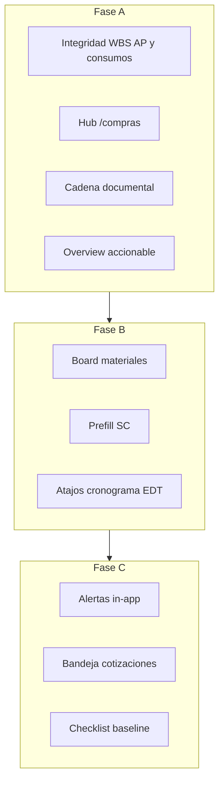
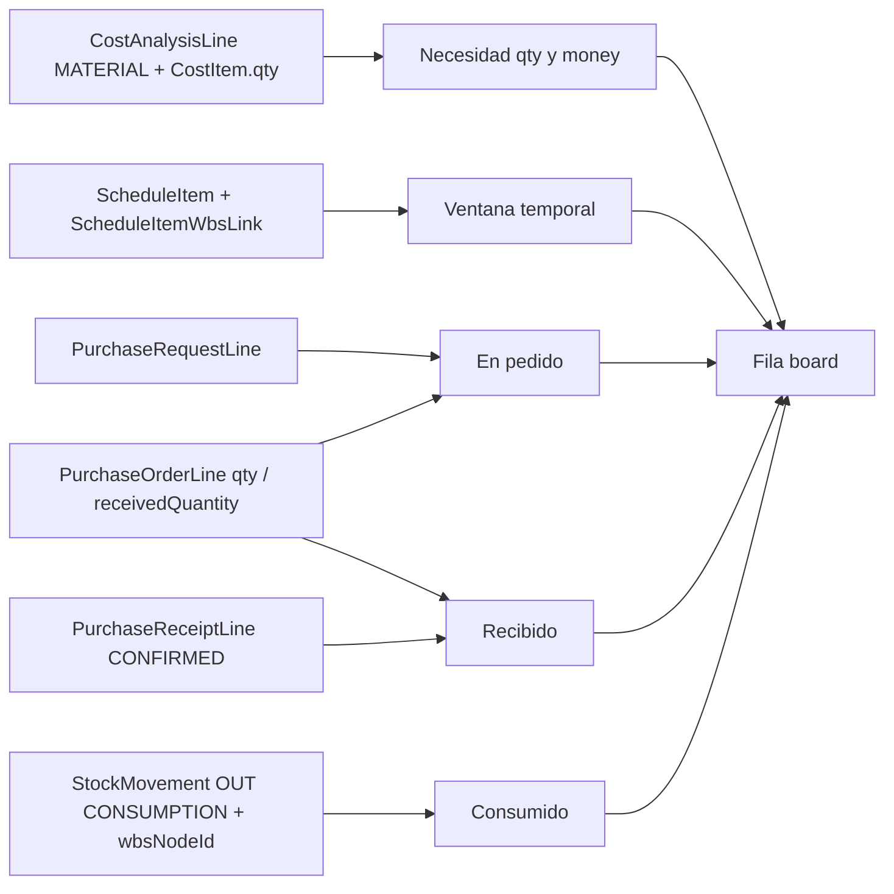

# Plan de mejoras operativas de proyecto (Materiales + interconexión)

## Contexto y decisión de producto

Bloqer ya tiene el circuito de dominio correcto (WBS/APU → cronograma → SC/OC → recepción/stock → libro/cert → EDT). El gap es de **experiencia operativa** y de **algunos huecos de integridad** que hoy impiden una verdad homogénea tipo Procore.

**Fuente de verdad de modelo:** Prisma ([`packages/database/prisma/schema.prisma`](packages/database/prisma/schema.prisma)). El ERD en docs es intención; si hay drift, gana Prisma + Decision Log.

**Decisiones fijadas:**

1. Ruta operativa nueva `/proyectos/[id]/materiales` (APU MAT es el “BOM”; **no** entidad BOM nueva).
2. Reporte `/reportes/materiales` se absorbe como tab **Varianza** (CSV R-MAT-01 se mantiene).
3. Hub `/proyectos/[id]/compras` + **sección nav “Compras”** (hub primero; SC/OC/recepciones siguen como rutas).
4. Sin MRP, FIFO, reservas de stock, contabilidad automática, anticipo proveedor UI.
5. Doc de trabajo al implementar: `docs/bloqer2.0/PLAN_MEJORAS_OPERATIVAS_PROYECTO.md`.
6. Orden **A → B → C**; cada fase demoable sola.
7. Estándares no negociables: mutaciones en `packages/services`; dinero con `roundMoney`/`serializeMoney` (2 dp); qty 4 dp; `tenant_id` en queries; UI es-AR; enums en inglés.

---

## Auditoría Prisma / ERD — hallazgos y mejoras al plan

### Críticas (bloquean verdad homogénea — van en Fase A antes del board)

| ID | Hallazgo | Impacto | Mejora en el plan |
|----|----------|---------|-------------------|
| **CRIT-1** | `SupplierInvoiceLine` **no tiene** `wbsNodeId` (Q-053). El plan viejo decía “validar si el campo existe”: **incorrecto**. | Facturas de proyecto pueden quedar ciegas al EDT. | **A0/A5:** migración Prisma + FK/index + validators Zod + UI de línea + Decision Log. Corporativo (`projectId` null) sigue sin WBS. |
| **CRIT-2** | Consumo desde libro de obra (`createJobsiteLogMaterialStockMovements`) **no setea** `StockMovement.wbsNodeId` ni costos. `JobsiteLogMaterialUsage` no tiene `wbsNodeId`. R-MAT-01 filtra `wbsNodeId not null` → consumos JL **invisibles** por partida. | Board “consumido” y reporte materiales mienten. | **A0:** al aprobar parte, imputar WBS (partida de progreso del mismo log o campo explícito en línea de material) al crear CONSUMPTION; backfill best-effort documentado. |
| **CRIT-3** | Semántica APU: necesidad **no** es `CostAnalysisLine.quantity` (no existe). Es `coefficient` (por unidad de ítem) × `CostItem.quantity`; dinero MAT = `totalCost` × `CostItem.quantity` ([D-047]). | Board mal calculado si se copia mal. | **B1** especifica fórmulas qty/$ por separado. |
| **CRIT-4** | “Recibido” por WBS **no** debe depender de `StockMovement.wbsNodeId` en IN (recepción hoy tampoco lo copia). | Subconteo de recibido. | **B1:** recibido = `PurchaseReceiptLine.quantityReceived` vía PO line (`wbsNodeId` / `receivedQuantity` en OC). |

### Medias (calidad Procore / robustez — Fase A/B)

| ID | Hallazgo | Mejora en el plan |
|----|----------|-------------------|
| **MED-1** | `PurchaseRequestLine.wbsNodeId` / `PurchaseOrderLine.wbsNodeId` nullable en DB; D-050 solo en service. | Mantener assert en services; **no** migración NOT NULL en este plan (riesgo datos legacy). Documentar deuda. |
| **MED-2** | Filas MAT sin `productId`: identidad de fila = `wbsNodeId` + (`productId` \|\| normalizado `description`). | **B1/B5:** key compuesto + warning; prefill SC con description aunque no haya producto. |
| **MED-3** | Nav: SC/OC en Finanzas vs Recepciones en Operación. | **A1:** sección **Compras** con: Hub, Solicitudes, Órdenes, Recepciones (Finanzas deja de ser el hogar de SC/OC). |
| **MED-4** | Cuatro avances (Real/Plan/Cant/Cert) confunden dueños. | **A3/A4:** chip/copy fijo “Real = libro de obra; Certificado = certificación cliente” en overview y cronograma. |
| **MED-5** | Pedido: definir estados canónicos. | **B1:** *en pedido* = SC `SUBMITTED`/`QUOTE_SELECTED` + OC `CONFIRMED`\|`PARTIALLY_RECEIVED`\|`RECEIVED` (comprometido); DRAFT no cuenta. |
| **MED-6** | Cadena documental incompleta vs expectativa Procore. | **A2:** bloque relacionado obligatorio en SC, OC, recepción, factura (y link a Payable si existe). |
| **MED-7** | Look-ahead débil sin links WBS↔tarea. | **B2:** bucket visible “Sin fecha / fuera de ventana”; no ocultar filas. |

### Leves (polish — no bloquean)

| ID | Hallazgo | Mejora en el plan |
|----|----------|-------------------|
| **LEV-1** | Label “EDT y costos” vs título largo de página. | **A4:** unificar a “EDT y costos” en nav, breadcrumb y H1. |
| **LEV-2** | Docs `CORE_ENTITIES` hablan de `quantity` en APU line; Prisma usa `coefficient`. | Al cerrar docs: nota de alineación (no bloquear código). |
| **LEV-3** | `ProcurementQuote.leadTimeDays` nullable. | **C1:** alerta solo si hay lead time; si null, no inventar. |
| **LEV-4** | Índice DB `StockMovement.wbsNodeId` ausente. | Opcional post-B si perf lo pide; no en camino crítico. |
| **LEV-5** | Redirect `/reportes/materiales`. | **B2:** redirect 308/soft a `/materiales?tab=varianza`. |

---

## Mapa de datos del board (contrato de agregación)

| Concepto UI | Fuente Prisma | Regla |
|-------------|---------------|-------|
| Necesidad qty | `CostAnalysisLine.coefficient` × `CostItem.quantity` | Solo `category = MATERIAL` |
| Necesidad $ | `CostAnalysisLine.totalCost` × `CostItem.quantity` | `serializeMoney` 2 dp |
| En pedido | PR lines (estados abiertos) + PO lines comprometidas | Excluir DRAFT/CANCELLED |
| Recibido | Receipt lines CONFIRMED → PO line WBS | Preferir `receivedQuantity` de OC como rollup |
| Consumido | `StockMovement` OUT + CONSUMPTION + CONFIRMED + **wbsNodeId** | Tras fix CRIT-2 |
| Ventana | Overlap `ScheduleItem.startDate/endDate` con filtro; link WBS | Sin link → bucket sin fecha |
| Lead time | `ProcurementQuote.leadTimeDays` | Solo Fase C si not null |

---

## Fase A — Integridad + misma verdad, menos saltos

**Objetivo:** datos confiables + PM recorre SC→OC→recepción→factura→EDT sin callejones.

### A0. Integridad de imputación (CRIT-1, CRIT-2) — primero
1. **Migración:** `SupplierInvoiceLine.wbsNodeId String?` + FK a `WbsNode` + index; en service: **requerido** si `SupplierInvoice.projectId` no es null; corporativo sin WBS.
2. **Consumos JL:** al crear CONSUMPTION desde aprobación de parte, setear `projectId`, `wbsNodeId` (regla: si hay una sola partida de progreso en el log, usarla; si hay varias, exigir `wbsNodeId` en línea de material o UI de selección — documentar en Decision Log la regla elegida: **default = WBS de la primera línea de progreso del mismo log si es única; si múltiples, requerir WBS en la línea de material**).
3. Migración opcional pero recomendada en el mismo lote: `JobsiteLogMaterialUsage.wbsNodeId String?` para persistir la elección.
4. Al confirmar recepción: copiar `wbsNodeId` de la PO line al `StockMovement` IN (mejora reportes; board de recibido sigue basado en receipt/PO).
5. Cerrar Q-053 en `OPEN_QUESTIONS` + entrada `DECISION_LOG`.
6. Tests: JL approve → movement con WBS; invoice proyecto sin WBS → validación falla.

### A1. Hub de compras
- Page: `apps/web/app/(app)/proyectos/[id]/compras/page.tsx`.
- Service lectura: `packages/services/src/procurement/project-procurement-hub.service.ts`.
- KPIs: SC abiertas, esperando cotización, listas para seleccionar, OC por aprobar/confirmar/recibir, recepciones recientes, link reporte compras-proveedores.
- **Nav** ([`project-workspace-nav.ts`](packages/services/src/project/project-workspace-nav.ts)): nueva sección **Compras** — Compras (hub), Solicitudes, Órdenes de compra, Recepciones. Quitar SC/OC de “Finanzas del proyecto” (Recepciones sale de Operación pura y vive en Compras).

### A2. Cadena documental
- Bloque “Documentos relacionados” en detalle SC, OC, recepción, factura proveedor de proyecto (deep-links bidireccionales).
- Features: `apps/web/features/procurement/**` y páginas asociadas.

### A3. Overview accionable
- Extender dashboard overview con CTAs: pendientes compras → `/compras`; por recibir; consumos semana; over-budget → `/control-costos`.
- Copy Real vs Certificado (MED-4).

### A4. Terminología y empty states
- Unificar “EDT y costos” (LEV-1).
- Empty states con siguiente paso (presupuesto → cronograma; SC vacía → nueva; etc.).

### A5. UI/validators factura con WBS
- Completar UI de líneas de factura de proyecto con selector WBS (post-migración A0).
- Validators en `packages/validators`.

### A6. Tests / smoke circuito
- APU MAT → SC → OC CONFIRMED → recepción → consumo (con WBS) → visible en EDT y, al llegar B, en materiales.
- Ampliar tests procurement + jobsite-log stock + cost-control.

**Salida Fase A:** integridad WBS en AP y consumos; hub + cadena; overview con CTAs; demo circuito sin “fugas” a EDT.

---

## Fase B — Materiales operativos

**Objetivo:** una pantalla responde necesidad / pedido / recibido / consumido / faltante (esta semana o ventana).

### B1. `getProjectMaterialsBoard` (CRIT-3, CRIT-4, MED-2, MED-5, MED-7)
- Nuevo service en `packages/services/src/materials/project-materials-board.service.ts` (paquete lógico materials; sin mutaciones).
- Agregar solo con fuentes de la tabla de contrato arriba.
- Columnas: necesidad qty, necesidad $, en pedido, recibido, consumido, faltante qty (y $ si aplica), flags (`missingProduct`, `overCommitted`, `unscheduled`).
- Filtros: `this_week` \| `next_14_days` \| `month` \| `all` + `budgetId` + `wbsNodeId` + búsqueda.
- Reutilizar helpers de dinero existentes; no recalcular cost-control desde cero.

### B2. UI `/proyectos/[id]/materiales`
- `apps/web/features/materials/` + page App Router.
- Tabs: **Operativo** \| **Varianza** (R-MAT-01) \| aviso R-MAT-02.
- Nav Operación → **Materiales**; links a `/consumos` e `/inventario`.
- Redirect `/reportes/materiales` → `/materiales?tab=varianza`.
- Bucket “Sin fecha” siempre visible cuando aplique.

### B3. Prefill SC desde faltantes
- `solicitudes-compra/nueva` acepta líneas sugeridas (productId?, wbsNodeId, qty, description).
- Respeta [`procurement-policy.service.ts`](packages/services/src/procurement/procurement-policy.service.ts); no saltea umbrales.

### B4. Atajos cronograma / EDT
- Schedule task → `/materiales?wbsNodeId=…`.
- Drilldown EDT → “Ver materiales / Pedir faltantes”.

### B5. Warnings APU sin producto
- Warning en board y editor APU; no bloqueo de approve (checklist en C).

**Salida Fase B:** look-ahead usable; SC desde faltantes; redirect del reporte viejo; consumido por WBS confiable gracias a A0.

---

## Fase C — Orquestación liviana

### C1. Alertas in-app (LEV-3)
- Hub + materiales: lead time (solo si `leadTimeDays` not null) vs atraso de recepción; partida en ventana sin cobertura de compra; consumido > recibido.
- Priorizar badges in-app; no abrir Q nueva de email salvo reutilizar eventos existentes.

### C2. Bandeja de cotizaciones
- Filtros en hub/SC: esperando cotización / listas para seleccionar (`ProcurementQuote` statuses existentes).

### C3. Checklist pre-aprobación presupuesto
- Advisory: % MAT con producto, ítems sin APU, WBS hoja sin tarea (si hay schedule). Bloqueo solo por reglas ya documentadas.

### C4. Puente libro → consumos
- Post-approve con materiales: CTA “Ver consumos generados”.

### C5. Tests board + alertas + smoke en GUIA

**Salida Fase C:** pendientes y alertas sin abrir cinco reportes.

---

## Fuera de alcance

BOM entity, StockReservation, MRP, FIFO/promedio, contabilidad auto, RFIs, critical path, contratos/adendas formales, anticipo proveedor UI, NOT NULL DB en wbs de SC/OC (deuda MED-1).

---

## Orden de implementación

| Paso | Entrega | Migraciones |
|------|---------|-------------|
| 0 | Doc plan en `docs/bloqer2.0/` + Decision Log Q-053 | No |
| **A0** | WBS en invoice lines + WBS en consumos JL (+ opcional usage.wbsNodeId; copy WBS en IN recepción) | **Sí** |
| A1–A6 | Hub, nav Compras, cadena, overview, UI factura, tests | No (salvo A0) |
| B | Board + UI materiales + prefill + atajos | No |
| C | Alertas, cotizaciones, checklist, puente JL | No |
| Close | GUIA, REPORT_CATALOG, nota coefficient en docs | No |

---

## Archivos clave

- Schema: [`packages/database/prisma/schema.prisma`](packages/database/prisma/schema.prisma) (`SupplierInvoiceLine`, `JobsiteLogMaterialUsage`, `StockMovement`, `CostAnalysisLine`, `ScheduleItemWbsLink`)
- Nav: [`packages/services/src/project/project-workspace-nav.ts`](packages/services/src/project/project-workspace-nav.ts)
- JL / stock: `packages/services/src/jobsite-log/`, `packages/services/src/inventory/stock-movement.service.ts`
- Material variance: [`packages/services/src/reports/material-variance.service.ts`](packages/services/src/reports/material-variance.service.ts)
- Overview / cost / schedule / procurement UI bajo `apps/web/`
- Docs: nuevo plan, GUIA, DECISION_LOG, OPEN_QUESTIONS Q-053, REPORT_CATALOG

---

## Criterios de aceptación globales (estilo Procore / dueños)

1. Una pregunta de obra (“¿qué falta esta semana?”) se responde en **una** pantalla (Materiales).
2. Una pregunta de proceso (“¿qué tengo trabado en compras?”) se responde en **una** pantalla (Hub Compras).
3. Toda línea de compra/factura/consumo de **proyecto** imputa WBS; el EDT no “pierde” documentos.
4. Real (libro) y Certificado (cliente) no se presentan como el mismo número.
5. Montos y qty usan precisión Bloqer; board no inventa fórmulas fuera de `04-formulas` / servicios existentes.
6. Sin callejones: cada empty state tiene CTA al siguiente paso del circuito.

---

## Riesgos residuales

- Obras con poco link cronograma↔WBS → muchas filas en “Sin fecha” (esperado; educar en checklist C3).
- Prefill SC no debe violar umbrales.
- Backfill de consumos JL históricos sin WBS: mostrar como “sin partida” hasta reclasificar manualmente (no silencio).
- Cost-control de AP hoy puede prorratear vía OC; tras A0, preferir WBS de línea de factura cuando exista (actualizar servicio de cost-control en el mismo lote A0/A5).
