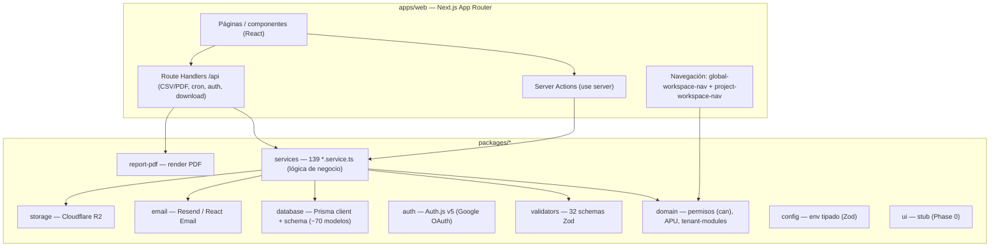
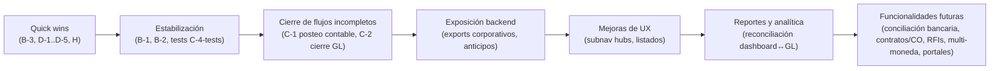

# Relevamiento técnico-funcional — Bloqer v2

> **Tipo de documento:** auditoría técnica-funcional basada en evidencia de repositorio.
> **Estado del producto:** funcional y en producción.
> **Método:** análisis estático del monorepo (`apps/web`, `packages/*`, `packages/database/prisma/schema.prisma`) + cruce con la documentación funcional de `docs/bloqer2.0/`.
> **Regla de prevalencia:** cuando el código y la documentación difieren, para describir el **comportamiento actual** prevalece el **código implementado**.
> **Advertencia de alcance:** este relevamiento se basa en lectura de código, no en pruebas de ejecución. Los ítems marcados `G — REQUIERE VALIDACIÓN MANUAL` no pudieron confirmarse solo con auditoría estática.

---

## 1. Resumen ejecutivo

Bloqer v2 es un **ERP SaaS multitenant para empresas constructoras**, implementado como **monolito modular** en un monorepo pnpm/Turbo. La aplicación web (`apps/web`, Next.js App Router) concentra la UI, los route handlers y las server actions; la lógica de negocio vive en `packages/services` (**139 archivos `*.service.ts`**), el modelo de datos en `packages/database` (**Prisma; ~70 modelos y ~60 enums**), los permisos e invariantes puros en `packages/domain`, y las validaciones de entrada en `packages/validators` (**32 schemas**).

**Estado general observado:** el producto tiene un **núcleo operativo y financiero sólido y realmente utilizable** de punta a punta: proyectos → presupuesto/WBS/APU → cronograma → libro de obra → compras (solicitud→cotización→OC→recepción) → subcontratos → certificaciones → facturación → cuentas por cobrar/pagar → cobranzas/pagos → tesorería → control de costos y reportes. Todo con **aislamiento por tenant**, **RBAC** (`can()`), **gating de módulos por tenant** y **auditoría**.

**Principales brechas detectadas (resumen):**

1. **Contabilidad sin posteo automático.** El plan de cuentas, los asientos manuales y las reglas de mapeo existen, pero los cobros, pagos y movimientos de stock **no generan asientos automáticamente**: solo producen *sugerencias* que crean asientos en `DRAFT`. La contabilidad es hoy un **libro paralelo mayormente manual**.
2. **Módulos documentados sin implementación:** Contratos y Adendas, Órdenes de Cambio (Change Orders), RFIs, Conciliación bancaria e Impuestos/Retenciones existen como **módulo de permiso y/o documento funcional**, pero **sin servicio ni pantalla operativa**.
3. **Multi-moneda parcial:** cada documento guarda `currency` + `fxRate` + `amountArs`, pero **cobranzas, pagos y transferencias internas exigen misma moneda** (sin conversión FX en tesorería, "Phase 3C").
4. **Almacenamiento de documentos en modo `PLACEHOLDER`** cuando Cloudflare R2 no está configurado: se guarda metadata sin archivo real.
5. **Rutas no navegables** y **exports sin botón** (detalle en §14 y §8).
6. **Contradicciones doc↔código en enums de estado** (§11).

**Conclusión ejecutiva:** el sistema está **listo para operar los flujos de obra, compras y finanzas transaccionales**. Las áreas a vigilar antes de apoyarse ciegamente son **contabilidad (integración automática), multi-moneda en tesorería y la configuración real de storage**. Ninguna de estas brechas invalida el uso productivo, pero deben conocerse para no asumir capacidades que hoy son manuales.

---

## 2. Alcance y metodología

### 2.1 Alcance

Se auditó todo el monorepo salvo artefactos generados (`node_modules`, `.next`, `dist`, lockfiles). Se cubrieron: estructura del monorepo, rutas y navegación de `apps/web`, layouts y menús, páginas y componentes, server actions, API/route handlers, servicios de dominio, validaciones, estados y transiciones, permisos/roles, gating de módulos por tenant, feature flags, jobs/crons, reportes/exportaciones, Prisma schema (enums, relaciones, migraciones) y tests. Se cruzó todo contra `docs/bloqer2.0/`.

### 2.2 Método de evidencia (cuatro capas)

Para cada funcionalidad se buscó evidencia en: **(1) Documentación**, **(2) Frontend** (ruta/página/acciones/visibilidad), **(3) Backend** (service/API/validación/transiciones), **(4) Base de datos** (modelo/enum/relación). Una funcionalidad se considera "completa" solo si tiene todas las capas esenciales para su uso real.

### 2.3 Diferenciación de afirmaciones

- **Hecho:** verificable en código (con ruta de archivo).
- **Inferencia:** deducción razonada de la evidencia; se marca como tal.
- **Recomendación:** propuesta de mejora; se agrupan en §18–§25, separadas de los hechos.

### 2.4 Verificaciones ejecutadas

- Enumeración de rutas (`page.tsx`) y route handlers (Glob).
- Extracción de modelos/enums de Prisma (Grep sobre `schema.prisma`).
- Lectura directa de `nav-config.ts`, `schema.prisma`, guía operativa actual, y muestreo de servicios.
- Exploración estructurada de `packages/services`, `packages/domain`, `packages/validators`, navegación, crons, tests, marcadores TODO/placeholder y exports.
- **No se ejecutaron** typecheck/lint/tests ni comandos de base de datos (para respetar la restricción de no operaciones destructivas ni cambios; ver §26 y respuesta final).

---

## 3. Arquitectura técnica observada

**Hechos clave:**

- **Service layer obligatorio:** las mutaciones pasan por `packages/services`; las server actions y route handlers orquestan hacia servicios. (`packages/services/src/**`)
- **Aislamiento tenant** transversal: los servicios comparan `entity.tenantId !== ctx.tenantId → FORBIDDEN`, y alcance `companyId` en finanzas.
- **RBAC:** `can(roles, action, module)` en `packages/domain/src/permissions/matrix.ts` (acciones `VIEW < EDIT < APPROVE`; 10 roles; ~38 módulos).
- **Gating de módulos por tenant:** `getTenantModuleGate` / `TenantModuleSetting`; **ausencia de fila = habilitado** (default-on).
- **Sin feature flags** adicionales en `apps/web` (el gating es RBAC + módulos por tenant).
- **Transacciones:** las mutaciones críticas usan `prisma.$transaction` (~50 servicios).
- **`packages/ui` es un stub** (`export {}`, "Phase 0 stub"); los componentes viven en `apps/web/features/*` y `apps/web/components/*`.

**Stack (evidencia):** Next.js App Router; Prisma + Postgres (Neon, `DATABASE_URL`/`DIRECT_URL`); Auth.js v5 con Google (`packages/auth`); Resend (`packages/email`); Cloudflare R2 (`packages/storage`); Vercel (crons en `apps/web/vercel.json`).

---

## 4. Mapa completo de módulos

> Áreas: **CORP** = corporativo/global; **PROJ** = por proyecto; **PLAT** = plataforma SaaS; **INFRA** = transversal.

| # | Área | Módulo | Backend (servicio) | Frontend (ruta base) | Modelo Prisma |
|---|------|--------|--------------------|----------------------|---------------|
| 1 | INFRA | Autenticación / sesión | `auth`, `membership.service` | `/login` | `User`, `Account`, `Session`, `UserMembership` |
| 2 | PLAT | Plataforma / superadmin | `platform/*` (9) | `/platform/*` | `PlatformAdmin`, `PlatformAuditLog`, `Tenant`, `TenantModuleSetting` |
| 3 | CORP | Tenant / módulos habilitados | `tenant.service`, `tenant-module.service` | `/platform/tenants/[id]/modules` | `Tenant`, `TenantModuleSetting` |
| 4 | CORP | Onboarding (trial) | `onboarding.service` | `/onboarding` | `Tenant`, `Company`, `UserMembership` |
| 5 | CORP | Empresa / configuración | `company.service`, `tenant-settings/*` | `/configuracion` | `Company` |
| 6 | CORP | Usuarios, roles, permisos | `team-management`, `permissions-overview` | `/configuracion/equipo`, `/configuracion/permisos` | `UserMembership`, `TenantInvitation` |
| 7 | CORP | Invitaciones | `tenant-invitations.service` | `/configuracion/equipo/...`, `/invitaciones/aceptar` | `TenantInvitation` |
| 8 | CORP | Directorio (contactos) | `contact.service` | `/directorio` | `Contact`, `ContactRole`, `*Profile` |
| 9 | PROJ | Proyectos | `project/*` (3) | `/proyectos`, `/proyectos/[id]` | `Project` |
| 10 | PROJ | Presupuestos / WBS / APU | `budget/*` (8) | `/proyectos/[id]/presupuestos` | `Budget`, `WbsNode`, `CostItem`, `CostAnalysisLine`, `BudgetSettings` |
| 11 | PROJ | Cronograma (Gantt/Kanban/tabla/calendario) | `schedule/*` (4) | `/proyectos/[id]/cronograma` | `Schedule`, `ScheduleItem`, `ScheduleItemDependency`, `ScheduleItemWbsLink` |
| 12 | PROJ | Libro de obra | `jobsite-log/*` (2) | `/proyectos/[id]/libro-obra` | `JobsiteLog`, `JobsiteLogProgress/Labor/MaterialUsage/Issue` |
| 13 | PROJ | Certificaciones (cliente) | `certification/*` (3) | `/proyectos/[id]/certificaciones` | `Certification`, `CertificationLine` |
| 14 | PROJ | Compras (PR/cotización/OC/recepción) | `procurement/*` (11) | `/proyectos/[id]/solicitudes-compra`, `/ordenes-compra`, `/recepciones` | `PurchaseRequest(+Line)`, `ProcurementQuote(+Line)`, `PurchaseOrder(+Line)`, `PurchaseReceipt(+Line)`, `CompanyProcurementSettings` |
| 15 | CORP/PROJ | Inventario / depósitos / transferencias | `inventory/*` (5) | `/inventario`, `/proyectos/[id]/inventario` | `Product`, `Warehouse`, `StockMovement`, `WarehouseTransfer` |
| 16 | PROJ | Subcontratos | `subcontracts/*` (2) | `/proyectos/[id]/subcontratos` | `Subcontract(+Line)`, `SubcontractCertification(+Line)` |
| 17 | PROJ/CORP | Ventas y cobranzas (AR) | `ar/*` (6), `treasury/collection` | `/proyectos/[id]/facturas`, `/cobranzas`, `/finanzas/cuentas-por-cobrar` | `SalesInvoice(+Line)`, `Receivable`, `Collection` |
| 18 | PROJ/CORP | Facturas proveedor y pagos (AP) | `ap/*` (6) | `/proyectos/[id]/facturas-proveedor`, `/pagos`, `/finanzas/...` | `SupplierInvoice(+Line)`, `Payable`, `Payment` |
| 19 | CORP | Tesorería (cuentas, movimientos, transferencias) | `treasury/*` (8) | `/tesoreria` | `TreasuryAccount`, `AccountMovement`, `InternalTransfer` |
| 20 | CORP | Gastos generales / overhead | `finance/*` overhead (4) | `/finanzas/gastos-generales` | `ProjectOverheadAllocation`, `OverheadPeriodClose`, `OverheadAutoPeriodSnapshot` |
| 21 | CORP | Contabilidad (plan, asientos, reglas) | `accounting/*` (5) | `/contabilidad` | `AccountingAccount`, `JournalEntry(+Line)`, `AccountingMappingRule` |
| 22 | PROJ | Control de costos / rentabilidad | `cost-control`, `reports/*`, `project-finance/*` | `/proyectos/[id]/control-costos`, `/reportes` | (agregación) |
| 23 | CORP | Finanzas corporativas (hub, KPIs, aging) | `finance/finance-hub-*`, `aging` | `/finanzas` | (agregación) |
| 24 | PROJ | Documentos | `documents/document.service` | `/proyectos/[id]/documentos` | `DocumentAttachment` |
| 25 | INFRA | Notificaciones (in-app) | `notifications/*` (5) | `/notificaciones` | `Notification` |
| 26 | INFRA | Emails / alertas operativas | `notification-email`, `operational-alerts*`, `email-delivery-log` | `/notificaciones/alertas`, `/notificaciones/emails` | `EmailDeliveryLog` |
| 27 | CORP | Reportes programados | `scheduled-reports/*` (6) | `/configuracion/reportes` | `ScheduledReport(+Item/+Recipient)` |
| 28 | INFRA | Reportes / exportaciones | `report-exports/*`, `reports/*` | `/api/reports/*.csv`, `.../export` | (agregación) |
| 29 | INFRA | Auditoría | `audit.service`, `audit-read` | `/configuracion/registro`, `/platform/registro` | `AuditLog`, `PlatformAuditLog` |
| — | — | **Contratos/Adendas** | — (no existe) | — | — (solo enum de permiso) |
| — | — | **Órdenes de cambio** | — (no existe) | — | — (solo enum de permiso) |
| — | — | **RFIs** | — (no existe) | — | — (solo enum de permiso) |
| — | — | **Conciliación bancaria** | — (no existe) | — | valor `RECONCILED` no está en el enum de código |
| — | — | **Impuestos / retenciones** | — (no dedicado) | IVA por línea | `taxRate`/`taxAmount` en líneas |

**Total de módulos identificados: 29 implementados** (+ 5 documentados/no implementados listados al pie).

---

## 5. Matriz de cobertura funcional

> Columnas: `Estado` usa la clasificación A–G (ver leyenda al pie). `Prio` es la prioridad de la recomendación asociada (P0–P4). Rutas con `[id]` = proyecto.

| ID | Área | Módulo | Funcionalidad | Objetivo de negocio | Ruta frontend | Evidencia frontend | Evidencia backend | Modelo/enum Prisma | Estado | Limitación detectada | Riesgo | Recomendación | Prio |
|----|------|--------|---------------|---------------------|---------------|--------------------|-------------------|--------------------|--------|----------------------|--------|---------------|------|
| F-01 | INFRA | Auth | Login Google + sesión/membership | Acceso seguro multitenant | `/login` | `(auth)/login/page.tsx` | `packages/auth`, `membership.service` | `User/Session/UserMembership` | A | Solo Google OAuth; sin 2FA | Bajo | Documentar; evaluar 2FA (Q-016) | P3 |
| F-02 | PLAT | Plataforma | Consola superadmin (tenants, módulos, vencimientos, provisión) | Operar el SaaS | `/platform/*` | `(platform)/**` | `platform/*` (9) | `Tenant/TenantModuleSetting/PlatformAuditLog` | A | Billing = metadata placeholder | Medio | Definir billing real | P2 |
| F-03 | CORP | Onboarding | Alta de tenant trial + aceptar invitación | Autoservicio inicial | `/onboarding` | `onboarding/*` | `onboarding.service` | `Tenant/Company/UserMembership` | A | — | Bajo | Mantener | — |
| F-04 | CORP | Config empresa | Datos de empresa/tenant + display | Parametrización | `/configuracion` | `configuracion/page.tsx` | `tenant-settings.service` | `Company` | A | — | Bajo | Mantener | — |
| F-05 | CORP | Usuarios/roles | Miembros, roles, estados | Gobierno de accesos | `/configuracion/equipo` | `configuracion/equipo/**` | `team-management.service` | `UserMembership` | A | Roles fijos (no custom, Q-024) | Medio | Documentar límite | P3 |
| F-06 | CORP | Permisos | Matriz permisos read-only + notas | Transparencia RBAC | `/configuracion/permisos` | `permisos/page.tsx` | `permissions-overview.service` | — | B | Solo lectura; no editable | Bajo | Documentar que es informativa | P3 |
| F-07 | CORP | Invitaciones | Invitar/aceptar/cancelar | Alta de usuarios | `/configuracion/equipo/...` | `equipo/invitation-actions.ts` | `tenant-invitations.service` | `TenantInvitation` | A | — | Bajo | Mantener | — |
| F-08 | CORP | Directorio | Contactos con roles (cliente/proveedor/SC) | Base de terceros | `/directorio` | `directorio/**` | `contact.service` | `Contact/ContactRole/*Profile` | A | — | Bajo | Mantener | — |
| F-09 | PROJ | Proyectos | CRUD + ciclo de vida (activar/pausar/completar/cancelar/reactivar) | Unidad central | `/proyectos`, `/proyectos/[id]` | `proyectos/**`, `actions.ts` | `project.service`, `project-cancellation-impact` | `Project`/`ProjectStatus` | A | — | Bajo | Mantener | — |
| F-10 | PROJ | Presupuesto | CRUD budget + lifecycle | Plan económico versionado | `/proyectos/[id]/presupuestos` | `presupuestos/**` | `budget.service` | `Budget`/`BudgetStatus` | A | 1-APPROVED/proyecto solo en service (sin índice DB) | Medio | Añadir restricción DB | P1 |
| F-11 | PROJ | WBS | Árbol WBS (grupos/ítems), reorder, import | Estructura de cómputo | `.../presupuestos/[budgetId]` | idem | `wbs.service`, `budget-import.service` | `WbsNode`/`WbsNodeType` | A | — | Bajo | Mantener | — |
| F-12 | PROJ | APU | Análisis de precio unitario por ítem | Costeo por partida | `.../presupuestos/[budgetId]` | idem | `cost-analysis.service`, `apu-entry` (domain) | `CostAnalysisLine`/`CostCategory` | A | — | Bajo | Mantener | — |
| F-13 | PROJ | Versionado presupuesto | Adenda = nuevo budget | Trazabilidad contractual | `/proyectos/[id]/presupuestos` | listado múltiples budgets | `budget.service` | `Budget` | B | No hay estado `SUPERSEDED` ni vínculo padre-hijo formal | Medio | Modelar relación de adenda | P2 |
| F-14 | PROJ | Cronograma | Gantt/Kanban/tabla/calendario, deps FS, vínculo WBS | Planificación temporal | `/proyectos/[id]/cronograma` | `features/schedule/**` | `schedule.service`, `schedule-progress-sync` | `Schedule/ScheduleItem/*` | A | Solo dependencias FS; baselines no formalizadas | Medio | Documentar; evaluar baselines | P3 |
| F-15 | PROJ | Avance real (sync) | Libro de obra aprobado → % real cronograma | Avance físico real | `/proyectos/[id]/cronograma` | chips avance | `schedule-progress-sync.service` | `ScheduleItem.progressPct` | A | — | Bajo | Mantener | — |
| F-16 | PROJ | Libro de obra | Parte diario, submit/approve/return, fotos, cuadrillas, clima | Registro de ejecución | `/proyectos/[id]/libro-obra` | `libro-obra/**` | `jobsite-log.service` | `JobsiteLog/*`/`JobsiteLogStatus` | A | — | Bajo | Mantener | — |
| F-17 | PROJ | Consumo de materiales | Aprobar parte → StockMovement OUT | Consumo de stock a obra | `.../libro-obra`, `.../consumos/nuevo` | `consumos/actions.ts` | `stock-movement.service` | `StockMovement`/`CONSUMPTION` | A | Sin listado `/consumos` (solo alta) | Bajo | Añadir listado | P3 |
| F-18 | PROJ | Certificaciones cliente | Emitir/aprobar/rechazar, techos público/privado | Reconocer avance y habilitar factura | `/proyectos/[id]/certificaciones` | `certificaciones/**` | `certification.service` | `Certification/*`/`CertificationStatus` | A | No genera Receivable/factura automática (paso manual) | Bajo | Documentar (por diseño D-026) | — |
| F-19 | PROJ | Solicitudes de compra | PR draft/submit + snapshot costo WBS | Canalizar pedidos de obra | `/proyectos/[id]/solicitudes-compra` | `solicitudes-compra/**` | `purchase-request.service` | `PurchaseRequest/*` | A | — | Bajo | Mantener | — |
| F-20 | PROJ | Cotizaciones | Cargar cotizaciones y comparar | Selección de proveedor | `.../solicitudes-compra/[prId]` | idem | `procurement-quote.service` | `ProcurementQuote/*` | A | Mín. cotizaciones configurable | Bajo | Mantener | — |
| F-21 | PROJ | Selección → OC | Seleccionar cotización genera OC draft | Segregación PR→OC | `.../solicitudes-compra/[prId]` | idem | `purchase-request-to-po.service` | `PurchaseOrder` | A | — | Bajo | Mantener | — |
| F-22 | PROJ | Órdenes de compra | Lifecycle draft→submit→approve→confirm; variance tiers | Compromiso al proveedor | `/proyectos/[id]/ordenes-compra` | `ordenes-compra/**` | `purchase-order-workflow.service` | `PurchaseOrder`/`PurchaseOrderStatus` | A | Auto-approve si no aplica high-level | Medio | Verificar política self-approval | P2 |
| F-23 | PROJ | Recepciones | Confirmar recepción → StockMovement IN + receivedQty | Ingreso físico | `.../ordenes-compra/[poId]/recepciones/nueva` | desde OC | `purchase-receipt.service` | `PurchaseReceipt/*` | B | Listado `/recepciones` **no navegable** | Bajo | Enlazar listado en nav | P3 |
| F-24 | CORP | Productos | Catálogo de productos | Master data materiales | `/inventario/productos` | `inventario/productos/**` | `product.service` | `Product`/`ProductStatus` | A | — | Bajo | Mantener | — |
| F-25 | CORP | Depósitos | CRUD depósitos | Ubicaciones de stock | `/inventario/depositos` | `inventario/depositos/**` | `warehouse.service` | `Warehouse`/`WarehouseType` | A | — | Bajo | Mantener | — |
| F-26 | CORP | Movimientos/consumos | Ledger de stock append-only | Trazabilidad de stock | `/inventario/movimientos` | `movimientos/page.tsx` | `stock-movement.service`, `stock-balance` | `StockMovement`/`StockMovementType` | A | Saldo = suma de movimientos (no campo) | Bajo | Mantener | — |
| F-27 | CORP | Transferencias depósito | Transferencia = 2 StockMovements | Mover stock | `/inventario/transferencias` | `transferencias/**` | `warehouse-transfer.service` | `WarehouseTransfer`/`Status` | A | — | Bajo | Mantener | — |
| F-28 | CORP | Valuación stock | FIFO/promedio (documentado D-007) | Costeo de consumo | — | — | `unitCost/totalCost` en movimiento | `StockMovement.unitCost` | D | Costo capturado de OC; sin política FIFO/promedio configurable | Medio | Definir/implementar valuación | P2 |
| F-29 | PROJ | Subcontratos | Contrato SC, activar/completar/cancelar | Terceros de obra | `/proyectos/[id]/subcontratos` | `subcontratos/**` | `subcontract.service` | `Subcontract/*`/`SubcontractStatus` | A | Líneas inmutables al activar | Bajo | Mantener | — |
| F-30 | PROJ | Cert. de subcontrato | Lifecycle + genera SupplierInvoice DRAFT al aprobar | AP de subcontratos | `.../subcontratos/[id]/certificaciones` | idem | `subcontract-certification.service` | `SubcontractCertification/*` | A | Retenciones/anticipos no modelados aparte | Medio | Evaluar retenciones | P2 |
| F-31 | PROJ/CORP | Facturas de venta | CRUD, emitir desde certificación, anular | Facturación al cliente | `/proyectos/[id]/facturas` | `facturas/**` | `sales-invoice.service` | `SalesInvoice/*`/`SalesInvoiceStatus` | A | Numeración por empresa; sin integración fiscal | Medio | Documentar (fuera de alcance fiscal) | P2 |
| F-32 | PROJ/CORP | Cuentas por cobrar | Receivable derivado, aging | Gestión de cobros | `/proyectos/[id]/cuentas-por-cobrar`, `/finanzas/cuentas-por-cobrar` | `cuentas-por-cobrar/**` | `receivable.service`, `aging` | `Receivable`/`ReceivableStatus` | A | — | Bajo | Mantener | — |
| F-33 | PROJ/CORP | Cobranzas | Cobro → AccountMovement INFLOW + actualiza Receivable | Ingreso de caja | `/proyectos/[id]/cobranzas` | `cobranzas/**` | `collection.service` | `Collection`/`CollectionStatus` | A | Misma moneda (sin FX) | Medio | Documentar límite FX | P2 |
| F-34 | CORP | Venta rápida / anticipo AR | Factura+CC (+cobro opcional) en un paso | Venta directa | `.../facturas/anticipo/nueva` | `ar-advance`, `register-ar-sale` | `register-ar-sale.service`, `register-ar-advance` | `SalesInvoice/Receivable/Collection` | A | — | Bajo | Mantener | — |
| F-35 | PROJ/CORP | Facturas proveedor | CRUD, emitir → Payable, anular | Registro de deuda | `/proyectos/[id]/facturas-proveedor`, `/finanzas/facturas-proveedor` | `facturas-proveedor/**` | `supplier-invoice.service` | `SupplierInvoice/*` | A | Sin 3-way match completo | Medio | Documentar; evaluar match | P2 |
| F-36 | PROJ/CORP | Cuentas por pagar | Payable derivado, aging | Gestión de deuda | `/proyectos/[id]/cuentas-por-pagar`, `/finanzas/cuentas-por-pagar` | `cuentas-por-pagar/**` | `payable.service`, `aging` | `Payable`/`PayableStatus` | A | — | Bajo | Mantener | — |
| F-37 | PROJ/CORP | Pagos | Pago → AccountMovement OUTFLOW + actualiza Payable | Egreso de caja | `/proyectos/[id]/pagos`, `/finanzas/cuentas-por-pagar/[id]/pagar` | `pagos/**` | `payment.service` | `Payment`/`PaymentStatus` | A | Misma moneda; retenciones manuales | Medio | Documentar límite FX/retención | P2 |
| F-38 | CORP | Gasto corporativo rápido | AP + pago opcional en un paso | Gastos sin proyecto | `/finanzas/facturas-proveedor` | `register-ap-expense` | `register-ap-expense.service` | `SupplierInvoice/Payable/Payment` | A | — | Bajo | Mantener | — |
| F-39 | CORP | Tesorería (cuentas) | Cuentas caja/banco + saldo apertura | Base de tesorería | `/tesoreria/cuentas` | `tesoreria/**` | `treasury-account.service` | `TreasuryAccount`/`Type` | A | — | Bajo | Mantener | — |
| F-40 | CORP | Movimientos de caja | Ledger de movimientos + anulación | Trazabilidad de caja | `/tesoreria/cuentas/[id]` | idem | `account-movement.service`, `balance` | `AccountMovement`/`Type` | A | `ADJUSTMENT` reservado, no en UI | Bajo | Mantener | — |
| F-41 | CORP | Transferencias internas | 2 movimientos (OUT/IN) atómicos | Mover fondos propios | `/tesoreria/transferencias` | `transferencias/**` | `internal-transfer.service` | `InternalTransfer`/`Status` | A | Misma moneda (Phase 3C) | Medio | Documentar límite | P2 |
| F-42 | CORP | Ingreso corporativo | Movimiento de caja no ligado a obra | Ingresos generales | `/finanzas/transacciones` | `transacciones/actions.ts` | `register-corporate-treasury-inflow.service` | `AccountMovement` | A | — | Bajo | Mantener | — |
| F-43 | CORP | Conciliación bancaria | Emparejar con extracto | Control bancario | — | — | — (no existe) | valor `RECONCILED` ausente del enum | E | No implementado (Q-007 abierta) | Medio | Roadmap futuro | P2 |
| F-44 | CORP | Gastos generales/overhead | Imputación manual + AUTO_WEIGHT + cierre período | Prorrateo GG a obras | `/finanzas/gastos-generales` | `gastos-generales/**` | `project-overhead`, `overhead-auto-weight`, `overhead-period-freeze` | `ProjectOverheadAllocation`, `OverheadPeriodClose` | A | Complejidad alta; requiere validación | G | Verificar cálculos en producción | P2 |
| F-45 | CORP | Plan de cuentas | CRUD cuentas contables | Estructura contable | `/contabilidad/cuentas` | `contabilidad/cuentas/**` | `accounting-account.service` | `AccountingAccount`/`AccountType` | A | — | Bajo | Mantener | — |
| F-46 | CORP | Asientos manuales | Crear/editar/postear/anular DRAFT | Registro contable | `/contabilidad/asientos` | `asientos/**` | `journal-entry.service` | `JournalEntry/*`/`JournalEntryStatus` | B | No se puede anular `POSTED` (sin reversa) | Alto | Habilitar reversa de asiento | P1 |
| F-47 | CORP | Reglas de mapeo contable | CRUD reglas por evento | Automatizar sugerencias | `/contabilidad/reglas` | `reglas/**` | `accounting-mapping.service` | `AccountingMappingRule`/`AccountingMappingEventType` | B | Solo alimentan sugerencias | Medio | Completar posteo | P1 |
| F-48 | CORP | Integración contable | Cobros/pagos/stock → asiento | Contabilidad automática | `/contabilidad/asientos/nuevo` (source-draft) | `source-draft-actions.ts` | `accounting-suggestions.service` | `JournalEntry` (DRAFT) | D | **No hay posteo automático**; genera solo borradores por acción manual | Alto | Definir estrategia de posteo | P0 |
| F-49 | CORP | Cierre de período (GL) | Bloqueo de período contable | Integridad de cierres | — | — | solo overhead period freeze | `OverheadPeriodClose`; `Period` no modelado | E | Cierre GL general no implementado | Alto | Implementar period lock | P1 |
| F-50 | INFRA | Impuestos/retenciones | IVA por línea; retención manual | Cálculo impositivo | (líneas de factura) | forms de factura | `taxRate/taxAmount` en cálculo | líneas `*Invoice/PO` | D | Sin módulo de impuestos/retenciones dedicado | Medio | Documentar; evaluar módulo | P2 |
| F-51 | PROJ | Control de costos | Capas committed/received/accrued/paid/consumed | Presupuesto vs real | `/proyectos/[id]/control-costos` | `control-costos/**` | `cost-control.service` | (agregación) | A | — | Bajo | Mantener | — |
| F-52 | PROJ | Rentabilidad proyecto | Margen bruto/neto | Resultado de obra | `/proyectos/[id]/reportes/rentabilidad` | `reportes/rentabilidad/**` | `project-profitability.service` | (agregación) | A | Neto según overhead imputado | Medio | Validar con overhead | P2 |
| F-53 | CORP | Finanzas corporativas | Hub KPIs, proyección, actividad | Visión global finanzas | `/finanzas` | `finanzas/**` | `finance-hub-*`, `finance-corporate-kpis` | (agregación) | A | — | Bajo | Mantener | — |
| F-54 | PROJ | Flujo de caja proyecto | Real + proyección | Tesorería por obra | `/proyectos/[id]/flujo-caja` | `flujo-caja/**` | `project-cash-flow.service` | (agregación) | A | — | Bajo | Mantener | — |
| F-55 | PROJ | Documentos | Adjuntos polimórficos | Gestión documental | `/proyectos/[id]/documentos` | `documentos/**` | `document.service` | `DocumentAttachment`/`StorageProvider` | B | `PLACEHOLDER` si R2 no configurado | Medio | Confirmar R2 en producción | G/P1 |
| F-56 | INFRA | Notificaciones in-app | Bandeja, marcar leídas/archivar | Alertas al usuario | `/notificaciones` | `notificaciones/**` | `notification.service` | `Notification/*` | A | Sin item propio en sidebar (acceso por campana) | Bajo | Mantener | — |
| F-57 | INFRA | Alertas operativas (cron) | 5 alertas diarias + dispatch manual | Vigilancia operativa | `/notificaciones/alertas` | `alertas/**` | `operational-alerts*.service` | `Notification` | A | Sin historial de corridas del cron | Bajo | Añadir historial | P3 |
| F-58 | INFRA | Emails | Envío Resend + log de entregas | Comunicación externa | `/notificaciones/emails` | `emails/page.tsx` | `notification-email`, `email-delivery-log` | `EmailDeliveryLog` | A | Skip/placeholder si Resend off | G | Verificar Resend en producción | P2 |
| F-59 | CORP | Reportes programados | CRUD, cron diario, historial, run/retry | Envío automático de reportes | `/configuracion/reportes` | `reportes/**` | `scheduled-reports/*` | `ScheduledReport/*` | A | Texto UI alineado con cron diario | Bajo | Mantener | — |
| F-60 | INFRA | Exportaciones CSV/PDF | 21 exports (aging, tesorería, inventario, obra, presupuesto) | Descargas de datos | `/api/reports/*.csv`, `.../export` | botones en pantallas | `report-export.service`, `csv/xlsx-export` | (agregación) | A | Exports corporativos enlazados | Bajo | Mantener | — |
| F-61 | INFRA | Auditoría | Registro y visor de audit log | Trazabilidad | `/configuracion/registro`, `/platform/registro` | `registro/**` | `audit.service`, `audit-read` | `AuditLog/PlatformAuditLog` | A | — | Bajo | Mantener | — |
| F-62 | — | Contratos y adendas | Marco legal/contractual | Gestión contractual | — | — | — (no existe) | — | E | Documentado, no implementado | Medio | Roadmap | P2 |
| F-63 | — | Órdenes de cambio | Cambios de obra formales | Control de cambios | — | — | — (no existe) | — | E | Documentado (D-005), no implementado | Medio | Roadmap | P2 |
| F-64 | — | RFIs | Consultas técnicas | Trazabilidad de consultas | — | — | — (no existe) | — | E | Documentado, Q-006 abierta | Bajo | Roadmap | P3 |
| F-65 | INFRA | `MAIN_NAV_DEF` (nav-config.ts) | Nav plana alternativa | — | — | Eliminado en Lote 6 | — | — | Resuelto | Código muerto removido; la nav canónica sigue en `global-workspace-nav.ts` | Bajo | Cerrado | — |

**Leyenda de estados:** `A` Funcional en producción · `B` Funcional pero incompleta · `C` Backend/DB sin frontend · `D` Frontend parcial/placeholder · `E` Documentado, no implementado · `F` Legacy/duplicado/sin uso · `G` Requiere validación manual.

---

## 6. Funcionalidades completas (Estado A)

Estas áreas tienen UI utilizable, lógica de backend, persistencia y flujo operativo coherente (evidencia en §5):

- **Corporativo:** onboarding trial, configuración de empresa, usuarios/roles, invitaciones, directorio con roles múltiples, plataforma SaaS (consola superadmin), gating de módulos por tenant, auditoría.
- **Proyecto — planificación:** proyectos y ciclo de vida, presupuesto (lifecycle), WBS, APU, cronograma (Gantt/Kanban/tabla/calendario + dependencias FS + vínculo WBS + sync de avance real).
- **Proyecto — ejecución:** libro de obra (con fotos/cuadrillas/clima/incidentes), consumo de materiales, certificaciones al cliente (con techos público/privado).
- **Compras:** solicitudes de compra, cotizaciones, selección→OC, órdenes de compra (workflow completo), recepciones.
- **Inventario:** productos, depósitos, movimientos (append-only), transferencias entre depósitos.
- **Subcontratos:** contratos y certificaciones de subcontrato (con generación de factura proveedor DRAFT).
- **Finanzas transaccionales:** facturas de venta, cuentas por cobrar, cobranzas, facturas proveedor, cuentas por pagar, pagos, gastos corporativos rápidos, tesorería (cuentas/movimientos/transferencias internas), control de costos, rentabilidad, finanzas corporativas, flujo de caja por proyecto, gastos generales/overhead.
- **Transversal:** notificaciones in-app, alertas operativas (cron), emails + log, reportes programados, exportaciones CSV/PDF, auditoría.

---

## 7. Funcionalidades parciales (Estado B/D)

| Funcionalidad | Estado | Qué falta / limitación (hecho) |
|---------------|--------|--------------------------------|
| **Contabilidad (asientos)** | B | No se puede **anular un asiento `POSTED`** (no hay reversa); corregir exige workaround. `journal-entry.service.ts` |
| **Reglas de mapeo contable** | B | Solo generan *sugerencias*; no postean. `accounting-mapping.service.ts` |
| **Integración contable automática** | D | Cobros/pagos/stock **no generan asientos**; solo borradores manuales vía `accounting-suggestions.service.ts` |
| **Versionado de presupuesto / adendas** | B | No hay estado `SUPERSEDED` ni relación formal padre-hijo entre budgets (`BudgetStatus` sin `SUPERSEDED`) |
| **Valuación de inventario (FIFO/promedio)** | D | Documentada (D-007) pero sin política configurable; el costo se captura de la OC |
| **Impuestos / retenciones** | D | IVA por línea (`taxRate/taxAmount`); sin módulo de retenciones ni impuestos dedicado |
| **Documentos (storage)** | B | Modo `PLACEHOLDER` si R2 no está configurado (guarda metadata sin archivo) |
| **Recepciones (listado)** | B | El listado `/proyectos/[id]/recepciones` existe pero **no es navegable** |
| **Consumos (listado)** | B | Existe alta (`/consumos/nuevo`) pero no listado propio |
| **Permisos (edición)** | B | La pantalla de permisos es **solo lectura** (más notas); no se editan asignaciones desde ahí |
| **Cierre de período GL** | D | Solo existe congelamiento de período de overhead; no hay bloqueo contable general |

---

## 8. Backend implementado sin frontend (Estado C)

Elementos con lógica/endpoint pero sin acceso operativo claro desde la UI:

| Elemento | Evidencia | Interpretación |
|----------|-----------|----------------|
| **Export `/api/reports/finanzas/cxp-corporativo.csv`** | route handler existe; **sin botón** en UI; consumido solo por reportes programados (`TENANT_CORPORATE_PAYABLES`) | Funcionalidad válida expuesta solo vía envío programado; falta botón de descarga directa |
| **Export `/api/reports/finanzas/facturas-proveedor-corporativo.csv`** | idem (`TENANT_CORPORATE_SUPPLIER_INVOICES`) | Igual que arriba |
| **`register-supplier-advance.service` (anticipo proveedor)** | servicio + validador; el validador `ar-advance.ts:17` menciona schema pendiente para anticipo proveedor | Inferencia: anticipo de proveedor con exposición parcial en UI; validar cobertura de pantalla |
| **Ingreso corporativo de tesorería** | `register-corporate-treasury-inflow.service`; se accede desde `/finanzas/transacciones` | Expuesto pero secundario; confirmar visibilidad |

**Inferencia:** no hay grandes bloques de backend completamente ocultos. La cobertura frontend↔backend es alta; las brechas son puntuales (dos exports y algún flujo de anticipo).

---

## 9. Modelos Prisma todavía no expuestos / campos y enums sin flujo visible

| Modelo/Enum/Campo | Evidencia | Interpretación |
|-------------------|-----------|----------------|
| `AccountMovementType.ADJUSTMENT` | comentario "reserved; not exposed in UI Phase 3C" | Preparación futura; ajuste manual de caja no operable |
| `StockMovementType.ADJUSTMENT`, `StockMovementSourceType.ADJUSTMENT/OPENING_BALANCE` | "reserved but not exposed Phase 4C" | Preparación futura para ajustes/saldo inicial de stock |
| `WarehouseType.TEMPORARY/OTHER` | enum | Tipos disponibles; validar uso real en UI |
| `JournalEntrySourceType`, `AccountingMappingEventType` | usados por sugerencias | Infra de contabilidad automática **parcial** (solo sugerencias) |
| `DocumentAttachment.publicUrl` | comentario "Unused/reserved — do not expose" | Reservado; no exponer |
| `StorageProvider.S3` | enum | Solo `R2`/`PLACEHOLDER` en uso; `S3` reservado |
| `DocumentVersion` (doc `STATE_MACHINES`) | **no existe** en `schema.prisma` | Versionado documental no implementado (Q-008 abierta) |
| `StockReservation` (doc D-034) | **no existe** en `schema.prisma` | Reserva de stock no implementada (Q-019 abierta) |
| `Contract/Addendum/ChangeOrder/Rfi/BankReconciliation/Period` | **no existen** como modelos | Documentados en `STATE_MACHINES.md` §28 pero sin tabla en código |
| `OverheadAutoPeriodSnapshot` | modelo existe | Soporta AUTO_WEIGHT; validar exposición de snapshots en UI |

**Conclusión:** varios enums tienen valores reservados para fases futuras (infraestructura válida, no error). Los modelos de `STATE_MACHINES.md` que **no existen en código** son la mayor divergencia doc↔DB (§11).

---

## 10. Frontend sin backend completo (Estado D)

- **Integración contable** (`/contabilidad/asientos/nuevo` con "generar desde fuente"): la UI ofrece generar asientos desde cobro/pago/movimiento/stock, pero el resultado es un **borrador** que requiere revisión y posteo manual; no cierra el ciclo contable automáticamente.
- **Valuación de inventario:** no hay pantalla de configuración de método FIFO/promedio pese a la decisión D-007.
- **Impuestos/retenciones:** los formularios permiten tasas por línea, pero no hay administración de impuestos/retenciones ni reportes fiscales.

---

## 11. Funcionalidades documentadas pero no implementadas (Estado E) y contradicciones doc↔código

### 11.1 Documentado, no implementado

| Área | Documentación | Código | Clasificación |
|------|---------------|--------|---------------|
| Contratos y Adendas | `02-modules/CONTRACTS_AND_ADDENDUMS.md`, D-019 | Sin modelo/servicio/UI | E |
| Órdenes de cambio | `02-modules/CHANGE_ORDERS.md`, D-005 | Sin modelo/servicio/UI (solo mención conceptual) | E |
| RFIs | `02-modules/RFIS.md`, Q-006 | Sin modelo/servicio/UI | E |
| Conciliación bancaria | `02-modules/BANK_RECONCILIATION.md`, D-032, Q-007 | Sin modelo/servicio/UI; enum `RECONCILED` ausente | E |
| Versionado de documentos | `STATE_MACHINES.md` (`DocumentVersion`), Q-008 | Sin modelo | E |
| Reserva de stock | D-034 (`StockReservation`), Q-019 | Sin modelo | E |
| Cierre de período contable | `03-finance/PERIOD_CLOSE_AND_LOCKS.md` (`Period`) | Solo overhead period freeze | E (parcial) |

### 11.2 Contradicciones de estado (doc vs enum real en código)

| Entidad | `STATE_MACHINES.md` §28 (doc) | Enum real (código) | Nota |
|---------|-------------------------------|--------------------|------|
| **Budget** | incluye `SUPERSEDED` | `BudgetStatus` **sin** `SUPERSEDED` | Adenda documentada como versión superada, no soportada por estado |
| **AccountMovement** | `DRAFT, CONFIRMED, RECONCILED, CANCELLED` | `CONFIRMED, CANCELLED` | Sin `DRAFT` ni `RECONCILED` (conciliación no implementada) |
| **StockMovement** | incluye `DRAFT` | `CONFIRMED, CANCELLED` | Movimientos nacen `CONFIRMED` |
| **SubcontractCertification** | `DRAFT, SUBMITTED, APPROVED, REJECTED, CANCELLED` | `DRAFT, ISSUED, APPROVED, REJECTED, CANCELLED` | Usa `ISSUED`, no `SUBMITTED` |
| **PurchaseInvoice/SupplierInvoice** | doc: `DRAFT, ISSUED, APPROVED, PAID, OVERDUE, CANCELLED` | `SupplierInvoiceStatus`: `DRAFT, ISSUED, CANCELLED` | `PAID/OVERDUE` viven en `Payable`, no en la factura |
| **Certification** | `+ payment_status` derivado | idem (sin `INVOICED`, por D-026) | Coherente |

### 11.3 Contradicciones guía operativa ↔ código

| Guía (`GUIA_OPERATIVA_PROYECTO.md`) | Código | Corrección |
|-------------------------------------|--------|------------|
| §10.2 "movimiento **INCOME**" / §10.3 "movimiento **OUTCOME**" | `AccountMovementType` = `INFLOW`/`OUTFLOW` | Usar `INFLOW`/`OUTFLOW` |
| §3.5 estado `RETURNED_FOR_CHANGES` (correcto) vs DOCX "Devuelto (RETURNED)" | `BudgetStatus.RETURNED_FOR_CHANGES` | Unificar etiqueta |
| §4.4 Kanban "PLANNED / IN_PROGRESS / …" | `ScheduleItemStatus` completo: `PLANNED, IN_PROGRESS, BLOCKED, COMPLETED, CANCELLED` | Listar estados reales |
| Menciona `/recepciones` como ruta operativa | listado existe pero **no navegable** | Aclarar acceso desde OC |

---

## 12. Funcionalidades implementadas pero no documentadas (en la guía operativa)

- **Consola de plataforma SaaS** (`/platform/*`): provisión de tenants, toggles de módulos, vencimientos de trials, auditoría de plataforma. No aparece en la guía operativa (es superadmin).
- **Reportes programados por email** (`/configuracion/reportes`): CRUD + cron diario + historial de ejecuciones.
- **Alertas operativas** (`/notificaciones/alertas`) y **historial de emails** (`/notificaciones/emails`).
- **Gastos generales / overhead con AUTO_WEIGHT y cierre de período** (`/finanzas/gastos-generales`): prorrateo por peso de costo directo (D-041/D-043).
- **Venta rápida / anticipos AR** (`register-ar-sale`, `register-ar-advance`).
- **Ingreso corporativo de tesorería** y **facturas/gastos corporativos** sin proyecto (`/finanzas/*`).
- **Finanzas corporativas (hub, KPIs, proyección)**.
- **Gating de módulos por tenant** (no explicado en la guía como capacidad configurable).

---

## 13. Código legacy, duplicado o aparentemente sin uso (Estado F)

| Elemento | Evidencia | Recomendación |
|----------|-----------|---------------|
| `packages/ui` | stub intencional documentado en `packages/ui/README.md` (H-D7) | Mantener hasta migración gradual del design system |
| `cancelInternalTransferFormAction` (`tesoreria/actions.ts`) | Removida en Lote 6 | Cerrado |
| `issuePurchaseOrder` (`purchase-order-workflow.service.ts:313`) | `@deprecated` (usar submit→approve→confirm) | Confirmar sin uso y remover (H) |
| Aliases `@deprecated` auditados en Lote 6 | wrappers sin uso removidos | Mantener revisión gradual de los restantes |
| `DocumentAttachment.publicUrl` | reservado/no usado | No exponer; documentar |

**Nota:** ninguno de estos es un riesgo operativo; son limpieza de deuda técnica.

---

## 14. Rutas no accesibles desde navegación

| Ruta | Situación | Interpretación |
|------|-----------|----------------|
| `/finanzas/pagos-proveedor` (listado) | No está en sidebar/subnav/hub; solo self-links. Los detalles `/[paymentId]` sí se alcanzan desde CxP | **No navegable** desde menú (llega por URL) |
| `/proyectos/[id]/recepciones` (listado) | Sin `<Link>` hacia el listado; solo se accede a `[receiptId]` y `nueva` desde la OC | **No navegable**; el flujo real es desde la OC |
| `/proyectos/[id]/consumos/nuevo` | Solo alta, sin listado `/consumos` | Acceso parcial |
| `/configuracion/compras` | Solo en subnav horizontal de configuración, no en sidebar global | Semi-oculto |
| `/proyectos/[id]/cobranzas`, `/pagos` (listados) | Navegables solo desde facturas/CxC/CxP, no desde sidebar | Flujo contextual (aceptable) |

**Inferencia:** los dos primeros casos (`pagos-proveedor` y `recepciones` listados) son rutas huérfanas reales; conviene enlazarlas o retirarlas. El resto es navegación contextual intencional.

---

## 15. Inconsistencias de permisos o estados

- **Módulos de permiso sin backend:** `CONTRACTS`, `CHANGE_ORDERS`, `RFIS`, `BANK_RECONCILIATION`, `TAXES`, `BILLING`, `TENANT_TRANSFER` figuran en la matriz de permisos/`OVERVIEW_MODULES` pero **no tienen servicio operativo**. Un rol puede tener "permiso" sobre un módulo inexistente (sin efecto práctico). *Riesgo: bajo; confusión de configuración.*
- **`TENANT_TRANSFER`:** solo existe como regla hardcodeada en `can()` (OWNER), sin flujo. *Inferencia.*
- **Asientos `POSTED` sin reversa:** estado terminal sin transición de anulación; corregir un asiento posteado no es posible por UI (§7). *Riesgo: alto para contabilidad.*
- **Estados terminales sin reversión:** varias entidades tienen `CANCELLED` como salida, pero conviene verificar que toda operación confirmada crítica tenga camino de anulación con reversa (cobros/pagos/movimientos sí lo tienen; asiento posteado no).
- **Gating default-on:** un tenant sin fila en `TenantModuleSetting` tiene **todos los módulos habilitados**. *Riesgo: un módulo "deshabilitado" podría seguir accesible si nunca se creó la fila; validar comportamiento esperado.*

---

## 16. Riesgos operativos y de integridad

| # | Riesgo | Evidencia / mecanismo | Severidad | Mitigación observada |
|---|--------|-----------------------|-----------|----------------------|
| R-01 | **Contabilidad divergente** de las transacciones | posteo manual; reportes se basan en transacciones, no en GL | Alta | Sugerencias automáticas (parcial) |
| R-02 | **Asiento `POSTED` no reversible** | `journal-entry.service` | Alta | Ninguna (workaround manual) |
| R-03 | **Aislamiento tenant** | comparación `tenantId` en servicios | Mitigado | Guard transversal (verificar cobertura 100%) |
| R-04 | **Autorización en backend** | `can()` en servicios + gating | Mitigado | Verificar que toda action pase por service |
| R-05 | **Multi-moneda en tesorería** | cobros/pagos/transfer exigen misma moneda | Media | Documentos guardan fxRate; falta FX en caja |
| R-06 | **Doble conteo OC/factura** | capas separadas + `expectedCostExposure = max(...)` | Mitigado | Diseño anti doble conteo (D-021) |
| R-07 | **3-way match incompleto** (PR/OC/recepción/factura) | factura enlaza PO opcional; valida consistencia, no match total | Media | Validación parcial en service |
| R-08 | **Storage `PLACEHOLDER`** | `document.service`; si R2 no configurado, no hay archivo | Media | Banner de advertencia en UI |
| R-09 | **Cierre de período GL ausente** | solo overhead freeze | Media | — |
| R-10 | **Gating default-on** | sin fila = habilitado | Baja/Media | Onboarding inserta filas explícitas |
| R-11 | **Idempotencia de crons** | dedupe 7 días (alertas); `runLockUntil`/`idempotencyKey` (reportes/emails) | Mitigado | Mecanismos presentes |
| R-12 | **Eliminaciones físicas** | patrón soft-delete/cancelación; documentos con `DELETED` | Mitigado | No se borran movimientos |
| R-13 | **Datos huérfanos** | FKs y `onDelete: SetNull` en AP/proyecto | Bajo | Revisar cascadas |
| R-14 | **Dashboard vs transaccional** | KPIs se calculan de servicios; contabilidad aparte | Media | Reconciliar fuentes |

---

## 17. Problemas de UX y navegación

- **Notificaciones sin item en sidebar:** solo se accede por la campana del header y el dashboard.
- **Rutas huérfanas** (`/finanzas/pagos-proveedor`, `/proyectos/[id]/recepciones`).
- **Hubs sin subnav lateral** (Inventario, Tesorería→reportes, Contabilidad): se navega por tarjetas/botones, lo que puede desorientar.
- **Compras (settings) escondido** en subnav de configuración.
- **Texto incorrecto:** UI de reportes programados dice "cron horario" pero corre diario.
- **Dos "guías operativas"** (Markdown vs DOCX generado) con divergencias de estados.
- **Consumos solo como alta** (sin listado).

---

## 18–25. Recomendaciones

> Cada recomendación indica: problema, usuario beneficiado, dependencias, complejidad (baja/media/alta), riesgo y prioridad. No se proponen funcionalidades solo por ser "habituales en otros ERP".

### A. Mantener como está

- Núcleo de proyectos, presupuesto/WBS/APU, cronograma, libro de obra, compras, subcontratos, certificaciones, AR/AP, tesorería, control de costos, reportes y auditoría. *Justificación: flujo end-to-end funcional (§6).* 

### B. Corregir inmediatamente

| Rec | Problema | Beneficiado | Dependencias | Complejidad | Riesgo | Prio |
|-----|----------|-------------|--------------|-------------|--------|------|
| B-1 | Asiento `POSTED` no reversible (F-46) | Contabilidad | `journal-entry.service` | Media | Alto si no se corrige | P1 |
| B-2 | Restricción DB "1 budget APPROVED/proyecto" (F-10) | PM/Finanzas | migración + índice | Baja | Medio | P1 |
| B-3 | Corregir guía: `INFLOW/OUTFLOW`, estados Kanban, `/recepciones` (§11.3) | Todos | — (doc) | Baja | Bajo | P1 |

### C. Completar

| Rec | Problema | Beneficiado | Dependencias | Complejidad | Riesgo | Prio |
|-----|----------|-------------|--------------|-------------|--------|------|
| C-1 | **Posteo contable automático** desde cobros/pagos/facturas/stock (F-48) | Contabilidad/Dirección | reglas de mapeo + transacciones | Alta | Alto | P0 |
| C-2 | Cierre de período GL (F-49) | Finanzas/Contabilidad | modelo `Period` | Media | Alto | P1 |
| C-3 | Valuación de inventario FIFO/promedio configurable (F-28) | Compras/Finanzas | política por empresa | Media | Medio | P2 |
| C-4 | Vínculo formal de adenda (padre-hijo / `SUPERSEDED`) (F-13) | PM/Legal | migración Budget | Media | Medio | P2 |
| C-5 | Multi-moneda en tesorería (FX en cobros/pagos/transfer) (R-05) | Finanzas | modelo FX en movimiento | Alta | Medio | P2 |

### D. Mejorar UX

| Rec | Problema | Complejidad | Prio |
|-----|----------|-------------|------|
| D-1 | Enlazar `/recepciones` y `/finanzas/pagos-proveedor` en navegación (§14) | Baja | P3 |
| D-2 | Item "Notificaciones" en sidebar (§17) | Baja | P3 |
| D-3 | Listado de consumos por proyecto (F-17) | Baja | P3 |
| D-4 | Subnav lateral para hubs (Inventario/Tesorería/Contabilidad) | Media | P3 |
| D-5 | Corregir texto "cron horario"→"diario" (F-59) | Baja | P3 |

### E. Documentar

- Que **contabilidad es manual** hoy (no automática) — crítico para expectativas.
- Límite **multi-moneda** en tesorería.
- Requisito de **R2 configurado** para storage real.
- Módulos de permiso **sin backend** (no confundir con funcionalidad).

### F. Simplificar

- Unificar la nav (`nav-config.ts` legacy vs `global-workspace-nav.ts`).
- Unificar terminología de estados entre guía MD, DOCX y enums.

### G. Ocultar temporalmente

- Módulos de permiso sin implementación (`CONTRACTS`, `CHANGE_ORDERS`, `RFIS`, `BANK_RECONCILIATION`, `TAXES`) hasta tener backend, para no sugerir capacidades inexistentes.
- Exports corporativos sin botón: exponerlos o mantenerlos solo vía reportes programados.

### H. Eliminar o archivar

- `apps/web/lib/nav-config.ts` no usado, `cancelInternalTransferFormAction`, `packages/ui` stub, `issuePurchaseOrder` deprecado, `publicUrl` reservado.

### I. Incorporar como nueva funcionalidad (solo con justificación)

| Rec | Problema que resuelve | Beneficiado | Complejidad | Prio |
|-----|-----------------------|-------------|-------------|------|
| I-1 | **Conciliación bancaria** (R-14, R-05): alinear caja con extractos | Finanzas | Alta | P2 |
| I-2 | **Contratos/Adendas y Change Orders** como entidad (D-005/D-019) | PM/Legal | Alta | P2 |
| I-3 | **Retenciones/impuestos** con acumulados en certificación pública (Q-023) | Finanzas | Alta | P2 |
| I-4 | **Tests de servicios sin cobertura** (procurement, certificaciones, jobsite, accounting) | Ingeniería | Media | P2 |

---

## 25.b Prioridades recomendadas (síntesis)

- **P0:** C-1 (posteo contable automático) — sin esto, la contabilidad es un libro paralelo manual y puede divergir de los datos transaccionales.
- **P1:** B-1 (reversa de asiento), B-2 (índice budget), B-3 (correcciones de guía), C-2 (cierre GL).
- **P2:** C-3/C-4/C-5, conciliación, contratos/CO, retenciones, tests.
- **P3:** mejoras de UX/navegación y limpieza de legacy.
- **P4:** RFIs, portales externos (cliente/proveedor/subcontratista), valuación avanzada.

---

## 26. Roadmap sugerido (por impacto y dependencia, sin fechas)

**Fases y dependencias:**

1. **Quick wins:** correcciones de documentación y navegación, limpieza de código muerto. *Sin dependencias.*
2. **Estabilización:** restricción DB de budget, reversa de asientos, ampliación de tests. *Depende de definición de reglas contables.*
3. **Cierre de flujos incompletos:** posteo contable automático (P0) y cierre de período GL. *Depende de reglas de mapeo y modelo `Period`.*
4. **Exposición de backend:** botones para exports corporativos; revisar anticipos.
5. **UX:** subnav de hubs, listados de consumos/recepciones.
6. **Reportes/analítica:** reconciliación entre dashboard y contabilidad.
7. **Futuro:** conciliación bancaria, contratos/adendas/change orders, RFIs, multi-moneda en tesorería, portales externos.

---

## 27. Evaluación por módulo (1–5, justificada)

> Escala 1 (inexistente/crítico) a 5 (maduro). Dimensiones: **CF** cobertura funcional, **IP** integridad del proceso, **UX**, **TR** trazabilidad, **RP** reportes, **CFG** configurabilidad, **PP** preparación para producción.

| Módulo | CF | IP | UX | TR | RP | CFG | PP | Justificación breve |
|--------|----|----|----|----|----|-----|----|----------------------|
| Proyectos | 5 | 5 | 4 | 5 | 4 | 4 | 5 | Ciclo de vida completo, auditado, cancelación no destructiva |
| Presupuesto/WBS/APU | 5 | 4 | 4 | 4 | 4 | 4 | 4 | Falta índice DB y vínculo de adenda formal |
| Cronograma | 4 | 4 | 4 | 4 | 3 | 3 | 4 | Solo FS; baselines no formalizadas; sync real OK |
| Libro de obra | 5 | 5 | 4 | 5 | 3 | 4 | 5 | Completo, con efectos a stock y cronograma |
| Certificaciones | 5 | 5 | 4 | 5 | 4 | 4 | 5 | Techos público/privado, sin estado INVOICED (por diseño) |
| Compras | 5 | 4 | 4 | 4 | 4 | 5 | 4 | 3-way match parcial; política configurable rica |
| Inventario | 4 | 4 | 3 | 5 | 4 | 3 | 4 | Ledger sólido; valuación FIFO/promedio pendiente |
| Subcontratos | 5 | 4 | 4 | 4 | 4 | 3 | 4 | Sin retenciones/anticipos dedicados |
| AR (ventas/cobranzas) | 5 | 4 | 4 | 4 | 4 | 3 | 4 | Multi-moneda limitada en cobro |
| AP (facturas/pagos) | 5 | 4 | 4 | 4 | 4 | 3 | 4 | Multi-moneda limitada; retención manual |
| Tesorería | 4 | 4 | 3 | 5 | 4 | 3 | 4 | Sin FX ni conciliación; ledger consistente |
| Gastos generales/overhead | 4 | 4 | 3 | 4 | 3 | 4 | 3 | Complejo; requiere validación en producción (G) |
| Contabilidad | 3 | 2 | 3 | 3 | 2 | 4 | 2 | Sin posteo automático ni reversa de POSTED ni cierre GL |
| Control de costos/rentabilidad | 5 | 4 | 4 | 4 | 5 | 3 | 4 | Capas anti doble conteo; depende de datos completos |
| Reportes/exports | 4 | 4 | 4 | 4 | 4 | 3 | 4 | 21 exports; 2 sin botón |
| Documentos | 3 | 3 | 3 | 4 | 2 | 3 | 3 | Storage PLACEHOLDER si R2 off; sin versionado |
| Notificaciones/alertas/emails | 4 | 4 | 3 | 4 | 3 | 3 | 4 | Cron diario; sin historial de alertas |
| Reportes programados | 4 | 4 | 4 | 4 | 4 | 4 | 4 | Completo con historial; texto UI a corregir |
| Usuarios/roles/permisos | 4 | 4 | 4 | 4 | 3 | 3 | 4 | Roles fijos; matriz solo lectura |
| Plataforma SaaS | 4 | 4 | 4 | 4 | 3 | 4 | 3 | Billing placeholder |
| Auditoría | 4 | 4 | 4 | 5 | 3 | 3 | 4 | Visor tenant y plataforma |

---

## 28. Anexos de evidencia

### 28.1 Rutas principales (frontend)

- Empresa: `/dashboard`, `/proyectos`, `/directorio`, `/inventario`, `/tesoreria`, `/contabilidad`, `/finanzas`, `/configuracion`, `/notificaciones`.
- Proyecto: `/proyectos/[id]` + `presupuestos`, `cronograma`, `control-costos`, `reportes`, `libro-obra`, `certificaciones`, `inventario`, `documentos`, `finanzas`, `flujo-caja`, `solicitudes-compra`, `ordenes-compra`, `recepciones`, `subcontratos`, `cuentas-por-cobrar/pagar`, `facturas`, `facturas-proveedor`, `cobranzas`, `pagos`.
- Plataforma: `/platform`, `/platform/tenants[...]`, `/platform/vencimientos`, `/platform/registro`.

### 28.2 Route handlers / API

- Auth: `/api/auth/[...nextauth]`.
- Descargas/documentos: `/api/documents/[documentId]/download`, `/api/projects/[id]/shell`.
- Crons: `/api/cron/operational-alerts` (12:00 UTC), `/api/cron/scheduled-reports` (23:00 UTC) — `apps/web/vercel.json`.
- Exports (21): `/api/reports/finanzas/{ap-aging,ar-aging,cxp-corporativo,facturas-proveedor-corporativo}.csv`; `/api/reports/tesoreria/{flujo-caja,movimientos,posicion-caja}.csv`; `/api/reports/inventario/{movimientos,stock}.csv`; `/api/reports/proyectos/[projectId]/{certificaciones,compras-proveedores,control-costos,flujo-caja,ingresos-gastos,materiales,presupuesto-vs-real,rentabilidad,subcontratos}.csv`; `.../presupuestos/[budgetId]/export`; `.../libro-obra/[logId]/export`; `/api/configuracion/registro.csv`.

### 28.3 Prisma (evidencia)

- Schema: `packages/database/prisma/schema.prisma` (~70 modelos, ~60 enums).
- Migraciones (17): `20260513030106_init` … `20260615140000_write_off_obligation_balance_dust` (evolución: init → finanzas corporativas/permisos → cronograma/overhead → reportes programados → procurement → reconciliación financiera).

### 28.4 Tests (35)

- Concentrados en `packages/services` (33; budget, finance/obligaciones, AR/AP cancel guards, treasury, schedule, project lifecycle) y `packages/report-pdf` (2).
- **Sin tests:** `apps/web`, `packages/{database,domain,validators,config,auth,email,storage,ui}`; y servicios de procurement, certificaciones, jobsite-log, documents, notifications, accounting, inventory.

### 28.5 Variables de entorno (solo nombres)

`NODE_ENV`, `APP_ENV`, `DATABASE_URL`, `DIRECT_URL`, `AUTH_SECRET`, `AUTH_URL`, `AUTH_GOOGLE_ID`, `AUTH_GOOGLE_SECRET`, `NEXT_PUBLIC_APP_URL`, `APP_URL`, `RESEND_API_KEY`, `RESEND_FROM_EMAIL`, `R2_ACCOUNT_ID`, `R2_ACCESS_KEY_ID`, `R2_SECRET_ACCESS_KEY`, `R2_BUCKET_NAME`, `R2_PUBLIC_URL`, `CRON_SECRET`, `PLATFORM_SUPERADMIN_EMAILS`, `SEED_USER_EMAIL`.

---

*Documento vivo. Basado en el estado del repositorio a la fecha del relevamiento. Actualizar cuando cambien servicios, rutas o el Prisma schema.*
