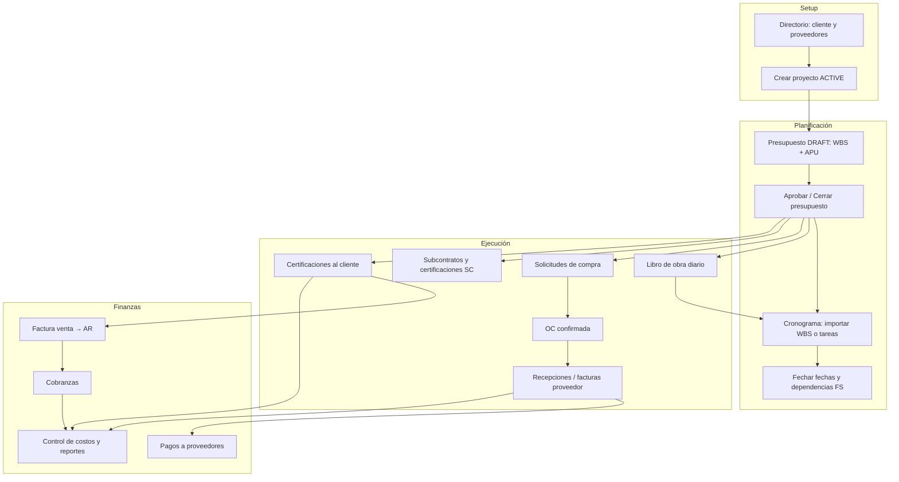

# Guía operativa — Ciclo completo de un proyecto en Bloqer v2

> **SUPERSEDED.** Esta versión corta quedó **reemplazada** por la guía canónica completa:  
> [`../GUIA_OPERATIVA_BLOQER_V2_REVISADA.md`](../GUIA_OPERATIVA_BLOQER_V2_REVISADA.md)  
> Entregable DOCX: `guides/Guía_Operativa_Bloqer_v2.docx` (regenerar con `node build_guide.js`).  
> **No actualizar este archivo**; se conserva solo como archivo histórico.

---

> **Audiencia (histórico):** PM, compras, finanzas, capataz, administración.  
> **Alcance:** flujo end-to-end desde alta de obra hasta control de costos, cobranzas y pagos.  
> **Base:** spec funcional `docs/bloqer2.0/` + rutas implementadas en `apps/web` (2026-06).

---

## 0. Antes de empezar

### Prerrequisitos de la empresa (tenant)

| Paso | Dónde | Para qué |
|------|--------|----------|
| Usuarios y roles | Configuración → Equipo / Permisos | PM, compras, finanzas, capataz con permisos VIEW/EDIT/APPROVE |
| Directorio | `/directorio` | Contactos con rol **CLIENT** (mandante), **SUPPLIER** (proveedores), **SUBCONTRACTOR** |
| Cuentas de tesorería | `/tesoreria/cuentas` | Caja/banco donde impactan cobranzas y pagos |
| Módulos habilitados | Configuración tenant | Presupuesto, cronograma, compras, AR/AP, libro de obra, etc. |

### Conceptos que no hay que mezclar

| Concepto | Qué es |
|----------|--------|
| **Proyecto / Obra** | Unidad central; casi todo cuelga de acá |
| **Presupuesto (Budget)** | Plan económico versionado; estados `DRAFT` → `IN_REVIEW` → `APPROVED` → `CLOSED` |
| **WBS + APU** | Estructura de cómputo + análisis de precio unitario (MAT/LAB/EQP/SUB/OTHER) |
| **Cronograma** | Plan **temporal** (cuándo); avance real ≠ certificado ≠ plan tiempo |
| **Comprometido / Devengado / Pagado** | Tres capas de costo (ver §8); no sumar mal OC + factura |
| **Certificación** | Documento al **cliente** por avance; habilita facturación y AR |

---

## 1. Flujo maestro (orden recomendado)



### Regla de oro del orden

1. **Sin presupuesto aprobado** no tiene sentido certificar al cliente ni usar baseline de control de costos.
2. **Sin WBS hoja con APU** no podés imputar compras por ítem ni certificar por línea.
3. **Cronograma** puede armarse en paralelo al presupuesto, pero conviene **importar desde presupuesto aprobado** para alinear nombres y vínculos WBS.
4. **Compras** (comprometido) recién impactan fuerte al **confirmar OC** al proveedor.
5. **Libro de obra aprobado** actualiza avance **real** del cronograma (no la certificación).

---

## 2. Módulo: Directorio y proyecto

### 2.1 Directorio (`/directorio`)

- Alta de contactos unificados.
- Asignar rol **CLIENT** al mandante antes de crear el proyecto.
- Proveedores: rol **SUPPLIER** (compras y AP).
- Subcontratistas: rol **SUBCONTRACTOR**.

### 2.2 Crear proyecto (`/proyectos/nuevo`)

| Campo / acción | Notas |
|----------------|-------|
| Código, nombre, cliente | Cliente debe existir en directorio |
| Tipo obra | **PUBLIC** = techo estricto 100% certificación; **PRIVATE** = permite exceder con nota |
| Estado | `DRAFT` → **Activar** → `ACTIVE` |
| Ubicación, fechas contractuales | Metadata; no reemplazan cronograma |

**Ruta:** `/proyectos/[id]` → **Resumen** (dashboard del proyecto).

El menú lateral del proyecto está agrupado en: **Resumen · Planificación · Operación · Finanzas del proyecto · Administración** (según permisos y módulos del tenant).

---

## 3. Módulo: Presupuesto, WBS y APU

**Ruta:** `/proyectos/[id]/presupuestos`

### 3.1 Crear presupuesto

1. **Nuevo presupuesto** → nombre, moneda, vínculo contrato (opcional).
2. Estado inicial: `DRAFT`.

### 3.2 Cargar WBS (estructura)

Opciones típicas:

| Método | Cuándo usarlo |
|--------|----------------|
| **Importar Excel/CSV** | Obra ya computada en planilla (columna A = numeración, B = nombre) |
| **Alta manual** | Capítulos (`GROUP`) e ítems hoja (`ITEM`) |
| **Multi-rubro** | Prefijos ARQ, EST, etc. si el Excel los trae |

**Reglas de estructura:**

- Solo los **ítems hoja** (sin hijos) llevan **APU** / `CostItem`.
- Capítulos intermedios agregan totales; no se certifican directamente.
- Código único por presupuesto.

### 3.3 Completar APU (análisis de precio unitario)

Por cada ítem hoja:

| Componente | Categoría | Ejemplo |
|------------|-----------|---------|
| Materiales | MAT | cemento, hierro |
| Mano de obra | LAB | oficial, peón |
| Equipos | EQP | grúa, hormigonera |
| Subcontratos | SUB | partida subcontratada |
| Otros | OTHER | fletes, gastos varios |

Completar **cantidad**, **unidad** y **precio** por línea. El APU se guarda **por unidad** del ítem (p. ej. por m²); el total de partida = suma unitaria × cantidad del ítem ([D-047]).

Al agregar una línea podés elegir **Por unidad** o **Total partida**: si tenés un importe o consumo del total de obra, usá Total partida y Bloqer lo prorratea a unitario.

### 3.4 Parámetros de venta

- **BudgetSettings:** gastos generales %, utilidad %, impuestos según política.
- Precio de venta del ítem = función de costo + parámetros ([`SALE_PRICE_FORMULAS.md`](../04-formulas/SALE_PRICE_FORMULAS.md)).

### 3.5 Ciclo de aprobación

| Estado | Qué podés hacer |
|--------|-----------------|
| `DRAFT` | Editar WBS, APU, precios |
| `IN_REVIEW` | Solo revisión; economía bloqueada |
| `RETURNED_FOR_CHANGES` | Correcciones y reenvío |
| `APPROVED` | Economía congelada; metadata editable |
| `CLOSED` | Base contractual; cambios vendidos vía **adenda** (nuevo budget hijo) |

**Workflow:** Enviar a revisión → Aprobar → (opcional) Cerrar.

> **Hito clave:** con `APPROVED` o `CLOSED` habilitás certificaciones y baseline de control de costos.

### 3.6 Adendas y órdenes de cambio

- **Change Order:** control operativo del cambio en obra.
- **Adenda presupuestaria:** cambio **contractual/económico** sobre base cerrada; nuevo budget complementario ([D-005]).

---

## 4. Módulo: Cronograma

**Ruta:** `/proyectos/[id]/cronograma`

### 4.1 Base del cronograma

- Un **Schedule** activo por proyecto.
- **Presupuesto base:** elegir el budget aprobado como referencia (`baselineBudgetId`).

### 4.2 Importar desde presupuesto

1. Botón **Importar desde presupuesto**.
2. Por defecto: **solo estructura, sin fechas** (decisión D-046).
3. Opcional: checkbox **fechas placeholder** (secuencia artificial por hermanos) solo para borrador visual.

### 4.3 Tipos de ítem

| Tipo | Uso |
|------|-----|
| `TASK` | Tarea con duración |
| `MILESTONE` | Hito puntual (◆ en Gantt) |

**Contenedores** (tareas con hijos): fechas **derivadas** automáticamente (min inicio / max fin de hojas). No se editan a mano.

### 4.4 Vistas

| Vista | URL | Uso |
|-------|-----|-----|
| Gantt | `?view=gantt` | Barras, dependencias, línea **Hoy**, botón **Ir a hoy** |
| Calendario | `?view=calendar` | Hitos por fecha |
| Kanban | `?view=kanban` | Por estado PLANNED / IN_PROGRESS / … |
| Tabla | `?view=table` | Edición masiva de fechas |

### 4.5 Setear fechas

1. Abrí el **detalle de la tarea** (click en fila o barra).
2. Completá **inicio** y **fin** (solo **hojas**; contenedores son lectura).
3. En Gantt: arrastrar barra (si tenés permiso EDIT).

**Recalcular contenedores:** toolbar → persiste rollup en DB si quedó desfasado.

### 4.6 Dependencias Finish-to-Start (FS)

1. En el diálogo de tarea → sección **Predecesoras**.
2. Agregar tarea predecesora (tipo FS).
3. Al guardar fechas que violen FS → **advertencias** (no bloquean en Fase 1); corregí o aceptá el riesgo.

### 4.7 Vínculo WBS ↔ cronograma

- Cada tarea puede enlazar uno o más nodos WBS; uno marcado **primario**.
- El vínculo primario permite:
  - KPI de avance/certificado en sidebar del Gantt
  - Sync de avance desde libro de obra

### 4.8 Cuatro dimensiones de avance (no confundir)

| Chip | Fuente | Quién lo mueve |
|------|--------|----------------|
| **Real** | `ScheduleItem.progressPct` | Libro de obra aprobado; manual excepcional PM |
| **Plan (t)** | Fechas vs hoy | Automático |
| **Cant.** | Cantidades físicas / presupuesto | Libro de obra |
| **Cert.** | Certificaciones emitidas | Módulo certificaciones |

---

## 5. Módulo: Libro de obra

**Ruta:** `/proyectos/[id]/libro-obra`

### 5.1 Flujo diario

1. **Nuevo parte** → fecha (no futura), clima, cuadrilla, tareas.
2. Registrar avance por **WBS** (`physicalPct` o cantidades).
3. Adjuntar fotos / observaciones.
4. **Enviar** → `SUBMITTED`.
5. PM **Aprueba** → `APPROVED`.

### 5.2 Efectos al aprobar

- Parte **inmutable** (salvo anulación con motivo).
- **Sync cronograma:** actualiza `% Real` en tareas con WBS primario enlazado ([D-045]).
- Materiales con producto + depósito pueden generar **consumo de inventario**.

### 5.3 Navegación cruzada

- Libro → chip **En cronograma** abre cronograma con `?itemId=`.
- Cronograma → **Ver partes en libro** filtra por `wbsNodeId`.

---

## 6. Módulo: Compras (solicitud → OC → recepción → factura)

> **WBS obligatorio (D-050):** toda línea de solicitud u OC imputa a un ítem WBS. Gastos generales/indirectos → **partida de indirectos**. Al elegir la partida se ve el **costo referencial** y el **saldo de partida** (presupuestado − comprometido) como alerta, sin bloquear.

### 6.1 Solicitudes de compra

**Ruta:** `/proyectos/[id]/solicitudes-compra`

| Paso | Actor | Estado |
|------|-------|--------|
| Crear borrador | PM / capataz | `DRAFT` |
| Enviar | PM | `SUBMITTED` → snapshot costo y cantidad presupuestaria por WBS |
| Cotizaciones | Compras | ≥ N cotizaciones según política tenant; cada una con **precio + plazo (lead time)** |
| Seleccionar cotización | Compras | `QUOTE_SELECTED` → genera OC borrador |
| Completar | — | `COMPLETED` |

Notificaciones (in-app + email) al enviar; **recordatorio SLA** si la solicitud queda sin cotizar.

### 6.2 Órdenes de compra

**Ruta:** `/proyectos/[id]/ordenes-compra`

```
DRAFT → SUBMITTED → APPROVED → CONFIRMED → PARTIALLY_RECEIVED / RECEIVED
         (SUBMITTED → DRAFT: devolución con motivo)
```

| Hito | Impacto |
|------|---------|
| **SUBMITTED → APPROVED / devolución** | Control de flujo; sin impacto económico |
| **APPROVED** | Aprobación interna (segregación: quien solicita no aprueba, salvo autoaprobación habilitada y bajo umbral) |
| **CONFIRMED** | Compromiso al proveedor → **`committed_amount`** en control de costos |
| Recepción | Stock + avance físico de compra |
| Factura proveedor | **`accrued_amount`** (devengado) + AP |

- **Imputación:** cada línea a un **WBS** ítem hoja del presupuesto vigente (obligatorio).
- **Devolución para cambios:** el aprobador puede devolver una OC `SUBMITTED` a `DRAFT` con **motivo**; se registra quién y por qué.
- **Desvío de precio:** alerta suave, **justificación** requerida sobre umbral y **aprobación de administración** para desvíos altos.
- Flujo formal **Enviar → Aprobar → Confirmar** (se retiró el atajo “emitir y confirmar rápido”).
- Notificaciones (in-app + email): pendiente de aprobación, aprobada, devuelta, confirmada; **recordatorio SLA** para OC demoradas.

### 6.3 OC directa / Factura directa (sin solicitud)

- **OC directa:** permitida si la política de la empresa la habilita. Sobre el umbral configurado exige **motivo de emergencia** y solo la autoriza administración (`OWNER`/`ADMIN`).
- **Factura directa (sin OC):** permitida según política y umbral ([BR-PUR-008]). Impacta al **registrar factura**, no antes.

### 6.4 Recepciones

**Ruta:** desde OC → **Nueva recepción** o `/proyectos/[id]/recepciones`

- Matching cantidades OC vs recibido.
- Entrada a inventario si aplica.

---

## 7. Módulo: Subcontratos

**Ruta:** `/proyectos/[id]/subcontratos`

1. Alta contrato con subcontratista (directorio).
2. Imputación a WBS categoría **SUB**.
3. Certificaciones de subcontrato: `DRAFT` → `SUBMITTED` → `APPROVED`.
4. **APPROVED** genera **Payable** (cuenta por pagar).
5. Pago desde AP / tesorería.

Reporte: `/proyectos/[id]/reportes/subcontratos`.

---

## 8. Módulo: Control de costos y reportes de planificación

**Ruta:** `/proyectos/[id]/control-costos` (**EDT y costos** — título: Estructura de Desglose de Trabajo y Costos; código/modelo: WBS)

### 8.1 Tres capas de costo (canónico)

| Capa | Pregunta | Fuente principal |
|------|----------|------------------|
| **Comprometido** | ¿Qué firmamos? | OC `CONFIRMED`, subcontrato `ACTIVE` |
| **Devengado** | ¿Qué debemos / reconocimos? | Facturas compra, cert. SC aprobadas |
| **Pagado** | ¿Qué salió de caja? | Pagos confirmados |

**Exposición esperada** = devengado + comprometido abierto (no OC + factura duplicados).

### 8.2 Por ítem WBS ves

- Presupuesto baseline (costo / venta)
- Comprometido, devengado, pagado
- Avance operativo (cantidad)
- Certificado acumulado
- Flags: sobre presupuesto, desvío

**Drill-down:** `/proyectos/[id]/control-costos/[wbsNodeId]`

### 8.3 Reportes del proyecto

**Ruta:** `/proyectos/[id]/reportes`

| Reporte | Ruta típica | Contenido |
|---------|-------------|-----------|
| Presupuesto vs real | control-costos | R-001 |
| Compras y proveedores | `reportes/compras-proveedores` | R-AP-01 |
| Materiales | `reportes/materiales` | Compras MAT |
| Subcontratos | `reportes/subcontratos` | R-SUB-* |
| Certificaciones / ingresos | `reportes/ingresos-gastos` | Serie certificado/facturado/cobrado |
| Rentabilidad | `reportes/rentabilidad` | Margen proyecto |
| Programados | `reportes/programados` | Exportaciones automáticas |

---

## 9. Módulo: Certificaciones (cliente)

**Ruta:** `/proyectos/[id]/certificaciones`

### 9.1 Precondición

- Presupuesto `APPROVED` o `CLOSED`.

### 9.2 Emitir certificación

1. **Nueva certificación** → período (desde / hasta).
2. Por ítem: **Δ% físico** y **$ económico** del período.
3. Validación de techos:
   - Obra **pública:** bloquea si supera 100% acumulado.
   - Obra **privada:** permite con **nota obligatoria**.
4. **Emitir** → `ISSUED` (inmutable).

### 9.3 Aprobación cliente y facturación

- Marcar `APPROVED` / `REJECTED` según respuesta mandante.
- **Factura venta** desde certificación → `/proyectos/[id]/facturas`.
- Genera **Receivable** (AR); `payment_status` de certificación se **recalcula** desde cobranzas (no hay estado `INVOICED` en la certificación).

---

## 10. Módulo: Finanzas del proyecto

### 10.1 Tablero y flujo de caja

| Pantalla | Ruta |
|----------|------|
| Tablero finanzas | `/proyectos/[id]/finanzas` |
| Flujo de caja proyecto | `/proyectos/[id]/flujo-caja` |

### 10.2 Cuentas por cobrar (ingresos)

**Ruta (obra):** `/proyectos/[id]/cuentas-por-cobrar`

1. Factura emitida (`/facturas`) crea **Receivable**.
2. **Cobranza** (`/cobranzas`): cuenta destino, montos, FX manual si aplica.
3. Confirmar → movimiento **INFLOW** en tesorería + saldo AR.

**Ruta (empresa, sin obra — D-051):** `/finanzas/cuentas-por-cobrar`

1. Registrar **Factura / cuenta por cobrar** desde `/finanzas/transacciones` (tab Ingreso / cobro).
2. Cobrar desde el detalle `/finanzas/cuentas-por-cobrar/[id]/cobrar`.
3. Para dinero a caja **sin** CxC, usar modo **Solo caja** en el mismo diálogo (`TREASURY_INFLOW`).

### 10.3 Cuentas por pagar (egresos)

**Ruta:** `/proyectos/[id]/cuentas-por-pagar`

1. Factura proveedor (`/facturas-proveedor`) crea **Payable**.
2. Finanzas aprueba para pago según política.
3. **Pago** (`/pagos` en la obra o consulta global en `/finanzas/transacciones` con origen `PAYMENT`):
   - Seleccionar payable(s)
   - Cuenta origen, retenciones manuales si corresponde
4. Confirmar → movimiento **OUTFLOW** + payable `PAID` / `PARTIAL`.

### 10.4 Finanzas corporativas (fuera del proyecto)

| Área | Ruta |
|------|------|
| Finanzas hub | `/finanzas` |
| Transacciones (AP / AR / caja) | `/finanzas/transacciones` |
| Cuentas por cobrar (obra + Empresa) | `/finanzas/cuentas-por-cobrar` |
| Cuentas por pagar | `/finanzas/cuentas-por-pagar` |
| Tesorería | `/tesoreria` |
| Tesorería (resumen) | `/tesoreria` |
| Flujo de caja global | `/tesoreria/flujo-caja` |
| Gastos generales | `/finanzas/gastos-generales` |
| Contabilidad | `/contabilidad` |

---

## 11. Módulo: Inventario (obra)

**Ruta:** `/proyectos/[id]/inventario`

- Stock asignado al proyecto.
- **Consumos** (`/consumos/nuevo`): salida de materiales imputables a WBS.
- Recepciones de OC alimentan depósito.
- Libro de obra puede disparar consumos al aprobar.

Global: `/inventario` (productos, depósitos, movimientos, transferencias).

---

## 12. Módulo: Documentos

**Ruta:** `/proyectos/[id]/documentos`

- Contratos, planos, actas, adjuntos de certificaciones/partes.
- Storage R2 + metadata auditada.

---

## 13. Cronograma vs ejecución vs cobro (resumen visual)

```
PLAN ECONÓMICO          PLAN TEMPORAL           EJECUCIÓN OBRA           COBRO CLIENTE
(Presupuesto)           (Cronograma)            (Libro + compras)        (Certificación)
     │                       │                        │                        │
     ▼                       ▼                        ▼                        ▼
  WBS + APU              Fechas + FS            Parte aprobado           Cert ISSUED
  APPROVED               Plan (t) %             Real % cronograma        Factura → AR
  Baseline costo         Contenedores rollup    Cant. física             Cobranza → caja
```

---

## 14. Errores frecuentes (orden incorrecto)

| Error | Consecuencia | Orden correcto |
|-------|--------------|----------------|
| Certificar sin presupuesto aprobado | Bloqueo o datos inválidos | Aprobar budget primero |
| OC confirmada sin WBS | Control de costos sin imputación | Líneas con nodo WBS |
| Confundir avance Gantt con certificado | Reportes incoherentes | Libro → Real; cert → Cert. |
| Sumar OC + factura como costo total | Doble conteo | Usar exposición esperada |
| Editar fechas de contenedor | Rechazado / se pisa | Editar hojas; rollup automático |
| Pagar sin factura/devengado | Caja sin AP coherente | Factura → AP → pago |

---

## 15. Checklist por rol

### PM / Jefe de obra

- [ ] Proyecto ACTIVE
- [ ] Presupuesto APPROVED/CLOSED
- [ ] Cronograma importado + fechas hoja + dependencias
- [ ] WBS primario en tareas críticas
- [ ] Libro de obra al día
- [ ] Certificaciones periódicas
- [ ] Revisar control de costos semanal

### Compras

- [ ] Solicitudes cotizadas
- [ ] OC aprobada y **confirmada** al proveedor
- [ ] Recepciones registradas
- [ ] Facturas matcheadas a OC

### Finanzas

- [ ] Facturas venta desde certificaciones
- [ ] Cobranzas aplicadas
- [ ] AP aprobados para pago
- [ ] Pagos conciliados con tesorería
- [ ] Reportes flujo de caja y aging

---

## 16. Referencias

- Workflows: [`05-workflows/`](../05-workflows/)
- Fórmulas costo: [`COST_FORMULAS.md`](../04-formulas/COST_FORMULAS.md)
- Cronograma: [`PROJECT_SCHEDULING.md`](../02-modules/PROJECT_SCHEDULING.md)
- Compras: [`PURCHASE_REQUESTS.md`](../02-modules/PURCHASE_REQUESTS.md), [`PROCUREMENT.md`](../02-modules/PROCUREMENT.md)
- Avance libro ↔ cronograma: [`PROGRESS_AND_SCHEDULE_PROCEDURE.md`](../05-workflows/PROGRESS_AND_SCHEDULE_PROCEDURE.md)

---

*Documento vivo — actualizar cuando cambien decisiones en `DECISION_LOG.md` o rutas de la app.*
